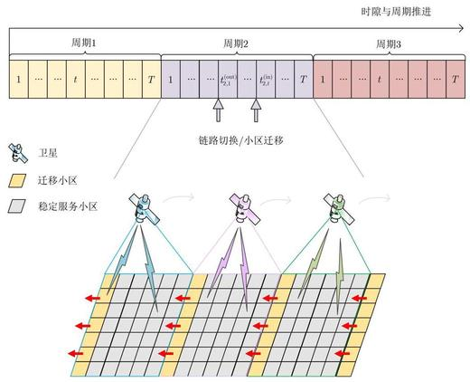
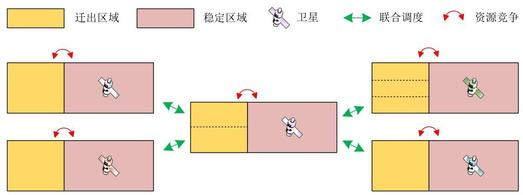
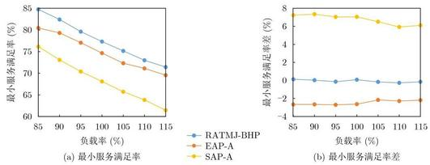
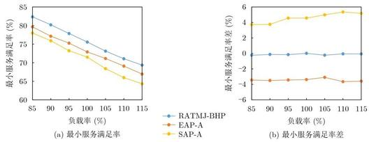
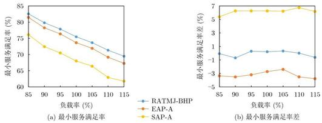

=+=+=+=+=+=+=+=+=
# 低轨卫星通信系统跳波束图案设计算法

石会鹏 \( {}^{\left( 1\right) \left( 2\right) } \) 郭 \( {\mathrm{T}}^{\left( 3\right) } \) 牟瑞硕 \( {}^{\left( 4\right) } \) 李方圆*②

\( {}^{\text{①}} \) (北京科技大学 北京 100083)

\( {}^{\text{②}} \) (国家无线电监测中心检测中心 北京 100041)

\( {}^{\text{③}} \) (钱学森空间技术实验室 北京 100029)

\( {}^{\text{④}} \) (北京邮电大学 北京 100876)

摘 要: 低轨卫星资源调度是长时间的连续资源分配过程, 这一过程中低轨卫星保持高速移动, 跳波束图案的设计需要考虑星地链路的切换。针对这种切换, 即卫星覆盖区域间的服务目标迁移, 所导致的多星资源联合调度需求, 该文提出一种资源自适应权衡分配的多星联合跳波束图案设计算法。该算法通过设计星间联合调度框架和多星联合调度权重,将多星资源联合分配问题转化为星座内单星资源调度问题,轻量化设计跳波束图案。经过与多种权重设计方法的对比验证, 仿真结果表明, 所提算法的轻量化设计思路合理, 并且可以有效地保障受迁移影响区域内小区的服务质量,可为低轨卫星系统长时资源调度设计提供参考。

关键词: 低轨卫星通信系统; 跳波束; 资源分配策略

中图分类号: TN927.2 文献标识码: A 文章编号:1009-5896(2025)03-0612-11

DOI: 10.11999/JEIT240596

## 1 引言

低地球轨道(Low Earth Orbit, LEO)卫星通信系统被视为第六代移动通信系统的重要组成部分 \( {}^{\lbrack 1\rbrack } \) 。 近年来, 为降低 “巨型化” 发展的低轨星座建设成本, LEO卫星的设计呈小型化趋势, 星上资源非常有限 \( {}^{\left\lbrack  2\right\rbrack  } \) 。与此同时,在地理和时间维度差异化分布的地面业务需求激增, 传统的多波束技术资源分配僵化,无法满足差异化业务需求。而跳波束技术以时分复用的方式调度多个波束, 能够灵活分配时间、空间、功率和带宽资源, 是LEO卫星通信系统提升资源利用率、实现按需服务的一项关键技术 \( {}^{\lbrack 3\rbrack } \) 。 国内外众多研究机构对跳波束技术进行了深入研究和实验验证。1988年,美国国家航空航天局为寻求解决通信干扰问题率先提出了跳波束技术, 开启了跳波束技术研究的先河 \( {}^{\left\lbrack  4\right\rbrack  } \) 。1998年, Globalstar开始部署用于卫星电话和低速数据通信的商业LEO 卫星通信系统, 可调度多达48个跳波束。2019年, 中国发射的实践二十号卫星成功验证了跳波束技术在地球静止轨道(Geostationary Orbit, GEO)卫星上的应用。2021年7月30日,欧空局和英国航天局参与核心技术研发的可重复编程量子卫星成功发射入轨, 对跳波束技术的发展有着重大创新意义。 2023年5月, OneWeb和欧空局联合设计的LEO 跳波束卫星Joeysat发射入轨,旨在验证跳波束等关键技术以支撑OneWeb下一代LEO卫星星座的建设。

跳波束图案设计是提升卫星资源利用率、实现按需服务的关键。文献[5]基于业务需求利用遗传算法设计了跳波束图案, 相较于传统多波束技术获得了性能提升。但性能提升的同时, 跳波束灵活的资源调度方式也令分配策略的设计更加复杂。文献[6] 指出, 不考虑共信道干扰(Co-Channel Interference, CCI)的跳波束资源分配问题可视为凸优化问题, 反之则往往会转换为NP-hard问题。为此, 文献[7] 提出了一种灵活资源分配算法, 以同频复用距离为约束条件, 优先服务需求最大的目标, 提升了按需资源分配能力的同时, 消除了CCI的影响。文献[8] 面向LEO卫星与GEO卫星地球站共存的场景, 以空间隔离保护GEO地球站免受干扰。随后, 以最大化最小服务满足率为优化目标提出了一种按需资源分配算法, 提升了用户服务质量。虽然文献[8]的算法降低了系统间干扰并实现了按需服务, 但并未考虑小区的时延需求。文献[9]关注由两颗LEO卫星组成的双星系统, 赋予系统吞吐量和时延不同的权重, 降低了系统平均时延, 但是没有关注时延对小区服务满足率的影响。

此外, 上述文献均未考虑LEO卫星的移动性, 并在假定时间切片内卫星覆盖区域稳定的条件下开展跳波束图案设计研究。为此, 文献[10]开展了长时资源分配研究, 保障了卫星覆盖区域移动情况下系统的吞吐量。但该文献为即将脱离覆盖区域的小区赋予远高于稳定小区且固定不变的权重, 限制了资源分配的灵活性。本文开展以下工作:

---

收稿日期:2024-07-15；改回日期:2025-02-24；网络出版:2025-03-04 *通信作者: 李方圆 lifangyuan@srtc.org.cn

基金项目:国家重点研发计划(2020YFB1807900)

Foundation Item: The National Key Research and Development Program of China (2020YFB1807900)

---

(1)针对某一时间切片下稳定覆盖场景的局限性, 提出了动态星地交互场景的系统模型, 描述了可能存在于跳波束周期内的小区迁移情况。

(2)在上述模型的基础上,同时考虑差异化业务分布、干扰和时延等性能影响因素,构建了能够表述多星联合调度需求的优化模型。

(3)提出一种资源自适应权衡分配的多星联合跳波束图案设计算法(Multi-satellite Joint BH Pattern based on Resource Adaptive Tradeoff allocation, RATMJ-BHP)求解优化模型。首先, 以干扰规避增益代替传统的同频复用距离, 实现了星载相控阵天线下的干扰减缓。随后, 为解决文献[10]中权重设计对资源分配灵活性的限制, 并满足多星联合调度需求, 设计了一种星间联合调度框架和联合调度权重设计方法, 实现资源的权衡分配和小区性能的保障。

## 2 系统模型与问题模型
=+=+=+=+=+=+=+=+=
### 2.1 系统模型

LEO卫星在通信过程中保持高速移动, 其覆盖区域边缘的部分小区在跳波束周期内自一颗卫星迁移至其他卫星。同时, 由于前向链路是低轨卫星跳波束系统业务流的主要方向 \( {}^{\left\lbrack  {11}\right\rbrack  } \) ,本文构建系统模型如图1所示。低轨卫星跳波束系统运行在由无限个毫秒级的单位时隙组成的时间轴上, 并在几十至几百毫秒的规则时间窗口内周期性地设计跳波束图案 \( {}^{\lbrack {12}\rbrack } \) 。 地面小区均匀部署在地球表面, 基于最短通信距离策略与卫星建立通信链路。受限于跳波束周期的长度, 1 个周期内的卫星位置移动通常不足以令链路发生切换。但随着时间的推进, 卫星累积的位置移动达到链路切换阈值, 小区在卫星的覆盖区域间迁移, 将该场景称为动态星地交互场景, 如图1中所示的第2个周期。

跳波束周期共包含 \( T \) 个跳波束时隙,在每个时隙下卫星最多可同时调度 \( K \) 个波束为地面小区提供服务,各波束平均分配星上功率。令 \( {\mathcal{N}}_{s} = \) \( \left\{  {{n}_{s} \mid  {n}_{s} = 1,2,\cdots ,{N}_{s}}\right\} \) 表示卫星 \( s \) 的小区集合,其中 \( {n}_{s} \) 为卫星 \( s \) 的第 \( n \) 个小区。卫星 \( s \) 的跳波束图案可以表示为 \( {\mathbf{X}}_{s} = \left\{  {{\mathbf{x}}_{s}^{\left( 1\right) },{\mathbf{x}}_{s}^{\left( 2\right) },\cdots ,{\mathbf{x}}_{s}^{\left( t\right) },\cdots ,{\mathbf{x}}_{s}^{\left( T\right) }}\right\} \) 。其中 \( {\mathbf{x}}_{s}^{\left( t\right) } \) 表示卫星 \( s \) 在时隙 \( t \) 的跳波束图案,可表示为 \( {\mathbf{x}}_{s}^{\left( t\right) } = \left\{  {{x}_{{1}_{s}}^{\left( t\right) },{x}_{{2}_{s}}^{\left( t\right) },\cdots ,{x}_{{k}_{s}}^{\left( t\right) },\cdots ,{x}_{{K}_{s}}^{\left( t\right) }}\right\}  ,{x}_{{k}_{s}}^{\left( t\right) } \in  {\mathcal{N}}_{s} \) 。式中, \( {k}_{s} \) 表示卫星 \( s \) 的第 \( k \) 个波束, \( {x}_{{k}_{s}}^{\left( t\right) } \) 为在时隙 \( t \) 得到波束 \( {k}_{s} \) 服务的小区。定义服务标志符 \( {\delta }_{{x}_{{k}_{n}}^{\left( t\right) } = {n}_{s}} \in  \{ 0,1\} \) , 当 \( {x}_{{k}_{s}}^{\left( t\right) } = {n}_{s} \) 时置 1,表示小区 \( {n}_{s} \) 在时隙 \( t \) 得到波束 \( {k}_{s} \) 的服务,反之则置 0 。基于上述分析,波束 \( {k}_{s} \) 与小区 \( {n}_{s} \) 在时隙 \( t \) 的服务关系已经确立,为方便表示,在无特殊说明的情况下,符号 \( {k}_{s} \) 与符号 \( {n}_{s} \) 可相互表示。

图 1 低轨卫星跳波束系统模型

小区 \( {n}_{s} \) 在时隙 \( t \) 的业务包到达率表示为 \( {D}_{{n}_{s}}^{\left( t\right) } \) , \( {D}_{{n}_{s}}^{\left( t\right) } \) 服从参数为 \( {\lambda }_{{n}_{s}}^{\left( t\right) } \) 的泊松过程,即卫星覆盖区域内的地面业务在时间和空间维度是不均匀分布的。 小区 \( {n}_{s} \) 在跳波束周期内的总业务包到达率 \( {D}_{{n}_{s}} \) 可以表示为

\[
{D}_{{n}_{s}} = \mathop{\sum }\limits_{{t = 1}}^{T}{D}_{{n}_{s}}^{\left( t\right) } \tag{1}
\]

不失一般性, 令每个业务包具有相同的大小 \( {D}_{\text{unit }} \) ,令 \( {M}_{{n}_{s}}^{\left( t\right) } \) 表示小区 \( {n}_{s} \) 在时隙 \( t \) 的业务包数量。小区的业务包排队时延定义为其到达队列的时隙与得到波束服务时隙的差。小区 \( {n}_{s} \) 的第 \( m \) 个业务包在时隙 \( t \) 的时延为 \( {L}_{{n}_{s}}^{m, t} \) ,并令 \( {L}_{{n}_{s}}^{\left( t\right) } = \left\{  {{L}_{{n}_{s}}^{1, t},{L}_{{n}_{s}}^{2, t},\cdots ,{L}_{{n}_{s}}^{m, t},\cdots }\right. \) , \( \left. {L}_{{n}_{s}}^{{M}_{{n}_{s}}^{\left( t\right) }, t}\right\} \) 表示该小区所有业务包的时延集合。当业务包的时延大于时延门限 \( {T}_{\mathrm{{th}}} \) 时将会被丢弃而无法继续得到服务,令 \( {Q}_{{n}_{s}}^{\left( t\right) } \) 表示小区 \( {n}_{s} \) 在时隙 \( t \) 丢弃的业务包数量。

假设 \( {\delta }_{{x}_{k - 1}^{\left( t\right) } = {n}_{s}} = 1 \) ,且波束间采用全频率复用, 星内和星间波束间干扰不可忽略。由于地面小区与卫星间的信道模型会直接影响波束容量, 建立卫星 \( s \) 波束 \( {k}_{s} \) 至小区 \( {n}_{s} \) 的信道模型 \( {h}_{{n}_{s},{k}_{s}} \) ,由于 \( {\delta }_{{x}_{k}^{\left( t\right) } = {n}_{s}} = 1,{h}_{{n}_{s},{k}_{s}} \) 也可表示为 \( {h}_{{k}_{s},{k}_{s}} \) 。考虑自由空间传输损耗、雨衰 \( {}^{\lbrack {13}\rbrack } \) 和 \( \mathrm{{LEO}} \) 卫星移动产生的多普勒频移 \( {}^{\left\lbrack  {14}\right\rbrack  } \) 等信道影响因素,则 \( {h}_{{k}_{s},{k}_{s}} \) 可表示为

\[
{h}_{{k}_{s},{k}_{s}} = \sqrt{{G}_{{k}_{s},{k}_{s}}^{\left( \mathrm{{tx}}\right) } \cdot  {G}_{{k}_{s},{k}_{s}}^{\left( \mathrm{{rx}}\right) } \cdot  \left\lbrack  {{\left( \frac{{\lambda }_{{k}_{s}, s}^{\left( \mathrm{d}\right) }}{\left( 4\pi {d}_{{k}_{s}, s}\right) }\right) }^{2} + {\mathrm{{PL}}}_{{k}_{s}, s}^{\left( \mathrm{{rain}}\right) }}\right\rbrack  }
\]

(2)

其中, \( {G}_{{k}_{s},{k}_{s}}^{\left( \mathrm{{tx}}\right) } \) 为波束 \( {k}_{s} \) 工作时在小区 \( {n}_{s} \) 方向的发射增益, \( {G}_{{k}_{s},{k}_{s}}^{\left( \mathrm{{rx}}\right) } \) 为小区 \( {n}_{s} \) 在卫星 \( s \) 方向的接收增益。 \( {d}_{{k}_{s}, s} \) 为卫星 \( s \) 至小区 \( {n}_{s} \) 的距离。 \( {\lambda }_{{k}_{s}, s}^{\left( \mathrm{d}\right) } \) 为卫星 \( s \) 相对小区 \( {n}_{s} \) 多普勒频移后的载波波长,表示为 \( {\lambda }_{{k}_{s}, s}^{\left( \mathrm{d}\right) } = \) \( \mathrm{c}/\left( {f + {f}_{{k}_{s}, s}^{\left( \mathrm{d}\right) }}\right) ,\mathrm{c} \) 为光速, \( f \) 为信号频率。 \( {f}_{{k}_{s}, s}^{\left( \mathrm{d}\right) } \) 为卫星 \( s \) 相对小区 \( {n}_{s} \) 的多普勒频移,可以表示为

\[
{f}_{{k}_{s}, s}^{\left( \mathrm{d}\right) } = \frac{{v}_{s} \cdot  \cos \left( {\theta }_{{k}_{s}, s}\right) }{\mathrm{c}} \cdot  f \tag{3}
\]

其中, \( {v}_{s} \) 为卫星 \( s \) 的移动速度, \( {\theta }_{{k}_{s}, s} \) 为卫星 \( s \) 移动方向与小区 \( {n}_{s} \) 信号接收方向的夹角。 \( {\mathrm{{PL}}}_{{k}_{s}, s}^{\left( \operatorname{rain}\right) } \) 为参考 ITU-R P.618-14建议书的雨衰 \( {}^{\left\lbrack  {13}\right\rbrack  } \) 。则小区 \( {n}_{s} \) 在时隙 \( t \) 的信干噪比(Signal to Interference Plus Noise Ratio, SINR)可以表示为

\[
{\gamma }_{{n}_{s}}^{\left( t\right) } = \frac{{P}_{s} \cdot  {\left| {h}_{{k}_{s},{k}_{s}}\right| }^{2}}{\partial  + \mathop{\sum }\limits_{{{k}_{s}^{\prime } = 1,{k}_{s}^{\prime } \neq  {k}_{s}}}^{K}{I}_{{k}_{s},{k}_{s}^{\prime }}^{s, s} + \mathop{\sum }\limits_{{{s}^{\prime } = 1,{s}^{\prime } \neq  s}}^{S}\mathop{\sum }\limits_{{k}_{{s}^{\prime }}}^{K}{I}_{{k}_{s},{k}_{{s}^{\prime }}}^{s,{k}_{{s}^{\prime }}}}
\]

(4)

式中, \( {P}_{s} \) 为卫星 \( s \) 各波束发射功率。 \( \partial  = \left( {\mathrm{{NF}} - 1}\right) \) \( \cdot  {290} \cdot  B \cdot  \mathrm{k} \) 为接收机的噪声功率,其中 \( \mathrm{{NF}}, B \) 和 \( \mathrm{k} \) 分别表示接收机噪声系数、载波带宽和玻尔兹曼常数。 \( {I}_{{k}_{s},{k}_{s}^{\prime }}^{s, s} \) 表示卫星 \( s \) 波束 \( {k}_{s}^{\prime } \) 对卫星 \( s \) 波束 \( {k}_{s} \) 的干扰,是同卫星波束间的共信道干扰; \( {I}_{{k}_{s},{k}_{s}^{\prime }}^{s,{s}^{\prime }} \) 为卫星 \( {s}^{\prime } \) 的波束 \( {k}_{{s}^{\prime }} \) 对卫星 \( s \) 波束 \( {k}_{s} \) 的干扰,为星间波束干扰。两种干扰的计算形式相同, \( {I}_{{k}_{s},{k}_{s}^{\prime }}^{s,{s}^{\prime }} \) 计算为

\[
{I}_{{k}_{s},{k}_{s}^{\prime }}^{s,{s}^{\prime }} = {P}_{{s}^{\prime }} \cdot  {\left| {h}_{{k}_{s},{k}_{s}^{\prime }}\right| }^{2} \tag{5}
\]

小区 \( {n}_{s} \) 在时隙 \( t \) 得到系统分配的容量为

\[
{R}_{{n}_{s}}^{\left( t\right) } = \mathop{\sum }\limits_{{{k}_{s} = {1}_{s}}}^{{K}_{s}}{\delta }_{{x}_{{k}_{s}}^{\left( t\right) } = {n}_{s}} \cdot  B \cdot  {\log }_{2}\left( {1 + {\gamma }_{{n}_{s}}^{\left( t\right) }}\right)  \tag{6}
\]

则在完整的跳波束调度周期内系统总分配容量 \( {R}_{{n}_{s}} = \mathop{\sum }\limits_{{t = 1}}^{T}{R}_{{n}_{s}}^{\left( t\right) } \) 。该小区在时隙 \( t \) 获得的有效容量, 即其实际用于获取业务包数据的容量 \( {C}_{{n}_{s}}^{\left( t\right) } = \min \left\{  {R}_{{n}_{s}}^{\left( t\right) }\right. \) , \( \left. {D}_{{n}_{s}}^{\left( t\right) }\right\} \) 。在完整的跳波束周期获得的总有效容量 \( {C}_{{n}_{s}} = \mathop{\sum }\limits_{{t = 1}}^{T}{C}_{{n}_{s}}^{\left( t\right) } \) 。

对于每颗卫星, 灰色小区为其周期内的稳定服务小区, 黄色小区为迁出小区。以图1中的粉色卫星 \( s \) 为例,其覆盖区域在周期内的若干时隙分批次接收相关卫星的小区,称这些小区为卫星 \( s \) 的迁入小区; 也分批次向其他卫星输出小区, 称这些小区为卫星 \( s \) 的迁出小区。假设卫星 \( s \) 的接收次数为 \( {\kappa }_{s}^{\left( \mathrm{{in}}\right) },{\iota }_{s}^{\left( \mathrm{{in}}\right) } = \left\{  {{\iota }_{s,\kappa }^{\left( \mathrm{{in}}\right) } \mid  \kappa  = 1,2,\cdots ,{\kappa }_{s}^{\left( \mathrm{{in}}\right) }}\right\} \) 则表示迁入时隙集合, \( {\mathcal{N}}_{s}^{\mathrm{{in}},{\iota }_{s,\kappa }^{\left( \mathrm{{in}}\right) }} \) 为每次迁入小区的集合,数量为 \( {N}_{s}^{\mathrm{{in}},{\iota }_{s,\kappa }^{\left( \mathrm{{in}}\right) }} \) ,周期内迁入小区集合为 \( {\mathcal{N}}_{s}^{\left( \mathrm{{in}}\right) } \) ,数量为 \( {N}_{s}^{\left( \mathrm{{in}}\right) } = \) \( \mathop{\sum }\limits_{{\kappa  = 1}}^{{\kappa }_{s}^{\left( \mathrm{{in}}\right) }}{N}_{s}^{\mathrm{{in}},{\iota }_{s,\kappa }^{\left( \mathrm{{in}}\right) }} \) ; 迁出小区次数为 \( {\kappa }_{s}^{\left( \mathrm{{out}}\right) } \) ,则迁出时隙集合 \( {\iota }_{s}^{\left( \text{out }\right) } = \left\{  {{\iota }_{s,\kappa }^{\left( \text{out }\right) } \mid  \kappa  = 1,2,\cdots ,{\kappa }_{s}^{\left( \text{out }\right) }}\right\} \) ,每次的迁出小区集合为 \( {\mathcal{N}}_{s}^{\text{out},{\iota }_{s,\kappa }^{\text{(out) }}} \) ,数量为 \( {N}_{s}^{\text{out},{\iota }_{s,\kappa }^{\text{(out) }}} \) ,周期内迁出小区集合为 \( {\mathcal{N}}_{s}^{\left( \mathrm{{out}}\right) } \) ,其数量可以表示为 \( {N}_{s}^{\left( \text{out }\right) } = \mathop{\sum }\limits_{{\kappa  = 1}}^{{\kappa }_{s}^{\left( \text{out }\right) }}{N}_{s}^{\text{out },{\iota }_{s,\kappa }^{\left( \text{out }\right) }} \) 。则在时隙 \( t \) ,卫星 \( s \) 覆盖区域内服务小区集合可以表示为 \( {\mathcal{N}}_{s}^{\left( t\right) } = \left\{  {{n}_{s} \mid  }\right. \) \( \left. {{n}_{s} = 1,2,\cdots ,{N}_{s}^{\left( t\right) }}\right\} \) ,其中 \( {N}_{s}^{\left( t\right) } \) 为卫星 \( s \) 在时隙 \( t \) 覆盖区域内的小区数量, 当小区迁入或迁出的事件发生时 \( {\mathcal{N}}_{s}^{\left( t\right) } \) 与 \( {N}_{s}^{\left( t\right) } \) 随之更新。例如,当时隙 \( t = {\iota }_{s,\kappa }^{\left( \mathrm{{in}}\right) } \) , \( \kappa  \in  \left( {1,{\kappa }_{s}^{\left( \mathrm{{in}}\right) }}\right) \) ,即卫星 \( s \) 的覆盖区域存在小区的迁入时,其服务小区集合应更新为 \( {\mathcal{N}}_{s}^{\left( t\right) } = {\mathcal{N}}_{s}^{\left( t\right) } + {\mathcal{N}}_{s}^{\text{in },{\iota }_{s,\kappa }^{\left( \mathrm{{in}}\right) }} \) , 服务小区的数量为 \( {N}_{s}^{\left( t\right) } = {N}_{s}^{\left( t\right) } + {N}_{s}^{\mathrm{{in}},{\iota }_{s,\kappa }^{\left( \mathrm{{in}}\right) }} \) ; 而时隙 \( t = {\iota }_{s,\kappa }^{\left( \text{out }\right) },\kappa  \in  \left( {1,{\kappa }_{s}^{\left( \text{out }\right) }}\right) \) ,即卫星 \( s \) 的覆盖区域存在小区的迁出时,其服务小区集合应更新为 \( {\mathcal{N}}_{s}^{\left( t\right) } = \) \( {\mathcal{N}}_{s}^{\left( t\right) } - {\mathcal{N}}_{s}^{\text{out },{\iota }_{s,\kappa }^{\text{(out) }}} \) ,服务小区数量 \( {N}_{s}^{\left( t\right) } = {N}_{s}^{\left( t\right) } - \) \( {N}_{s}^{\text{out},{\iota }_{s,\kappa }^{\text{(out) }}} \) 。为方便表述,对于每个迁移小区,称接收卫星为其迁入卫星, 源卫星为迁出卫星; 对于每个存在覆盖区域变化的卫星, 称接收小区为其迁入小区, 称链路中断的小区为其迁出小区。
=+=+=+=+=+=+=+=+=
### 2.2 问题模型

低轨卫星跳波束系统应保障所有小区的服务质量, 而小区及其容量与时延需求在相关卫星间的迁移会令卫星服务环境发生变化,从而造成相关卫星覆盖区域小区的性能波动。对于迁入卫星来说, 迁移小区的容量和时延需求会直接影响其资源分配; 对于迁出卫星, 如何在迁移事件发生前在覆盖区域内分配资源, 保障相关卫星服务小区的服务满足率尤为重要。因此, 本文系统模型存在多星联合调度的需求。本文将优化目标设置为最大化优化区域内最小服务满足率。其中, 优化区域设置为卫星迁入小区与稳定小区的集合,则卫星 \( s \) 的优化区域 \( {\mathcal{N}}_{s}^{\text{(opt) }} \) 为

\[
{\mathcal{N}}_{s}^{\left( \mathrm{{opt}}\right) } = {\mathcal{N}}_{s}^{\left( 1\right) } - {\mathcal{N}}_{s}^{\left( \text{loss }\right) } + {\mathcal{N}}_{s}^{\left( \mathrm{{in}}\right) } \tag{7}
\]

该优化区域即跳波束周期结束时的覆盖区域。 基于动态变化的覆盖区域, 这种设置不仅要求迁移事件发生前, 每颗卫星在保证稳定小区服务质量的同时, 为迁出小区提供合理的资源分配; 还要求卫星在接收迁入小区后为其提供接续服务, 可以有效地表征多星业务资源联合分配的需求。假设有 \( S \) 颗存在小区迁移关系的卫星,并令其集合 \( \mathcal{S} = \{ s \mid \) \( s = 1,2,\cdots , S\} \) 。令 \( {\Lambda }_{s} = \left\{  {{\alpha }_{{n}_{s}} \mid  {n}_{s} \in  {\mathcal{N}}_{s}^{\left( \mathrm{{opt}}\right) }}\right\} \) 表示卫星 \( s \) 优化区域内小区服务满足率的集合。将 \( \mathcal{S} \) 中卫星的跳波束图案作为优化问题数学模型的变量, 则优化问题如式(8)

\[
\mathrm{P} : \mathop{\max }\limits_{{{\mathbf{X}}_{1},{\mathbf{X}}_{2},\cdots ,{\mathbf{X}}_{s}}}\mathop{\min }\limits_{{{n}_{s} \in  {\mathcal{N}}_{s}^{\left( \mathrm{{opt}}\right) }, s \in  \mathbf{S}}}{\mathbf{\Lambda }}_{s}
\]

\[
\text{ s.t. }{\mathrm{C}}_{1} : \mathop{\sum }\limits_{{{n}_{s} \in  {\mathcal{N}}_{s}^{\left( t\right) }}}{\delta }_{{x}_{{k}_{s}}^{\left( t\right) } = {n}_{s}} = 1,\forall k \in  \left( {1, K}\right) , t \in  \left( {1, T}\right) ,
\]

\[
s \in  \mathcal{S}
\]

\[
{\mathrm{C}}_{2} : \mathop{\sum }\limits_{{{k}_{s} = 1}}^{{K}_{s}}\mathop{\sum }\limits_{{{n}_{s} \in  {\mathcal{N}}_{s}^{\left( t\right) }}}{\delta }_{{x}_{{k}_{s}}^{\left( t\right) } = {n}_{s}} \leq  K,\forall t \in  \left( {1, T}\right) , s \in  \mathcal{S}
\]

\[
{\mathrm{C}}_{3} : \max \left\{  {{G}_{{k}_{s},{k}_{{s}^{\prime }}}^{\left( \mathrm{{tx}}\right) },{G}_{{k}_{{s}^{\prime }},{k}_{s}}^{\left( \mathrm{{tx}}\right) }}\right\}   \leq  {G}_{\mathrm{{th}}},\forall k \in  \left( {1, K}\right)
\]

\[
{\mathrm{C}}_{4} : {\delta }_{{x}_{{k}_{s}}^{\left( t\right) } = {n}_{s}} = 1,{\delta }_{{x}_{{k}_{{s}^{\prime }}}^{\left( t\right) } = {n}_{s}} = 1,\forall \left\{  {s,{s}^{\prime }}\right\}   \in  \mathcal{S} \tag{8}
\]

式中,优化目标 \( \mathrm{P} \) 表示通过设计 \( \mathcal{S} \) 中卫星的跳波束图案 \( {\mathbf{X}}_{1},{\mathbf{X}}_{2},\cdots ,{\mathbf{X}}_{s} \) ,最大化卫星优化区域 \( {\mathcal{N}}_{s}^{\left( \mathrm{{opt}}\right) } \) 内小区的最小服务满足率。约束条件 \( {\mathrm{C}}_{1} \) 将波束调度范围限制在卫星各时隙的覆盖小区, 服务标识符求和为 1 则表示每个波束服务的小区个数为 1 ,即每个小区同时只能被一个波束服务; 约束条件 \( {\mathrm{C}}_{2} \) 则在 \( {\mathrm{C}}_{1} \) 的基础上对波束求和, 不等式表示每颗卫星同时只能调度至多 \( K \) 个波束; 约束条件 \( {\mathrm{C}}_{3} \) 表示同时工作的两波束之间相互干扰增益需要满足干扰规避增益门限 \( {G}_{\mathrm{{th}}} \) ,避免波束容量的恶化。

式(8)描述的优化问题是NP-hard的,且同时涉及覆盖区域动态变化、星间联合资源分配。为此, 本文提出RATMJ-BHP算法, 基于星间联合调度框架和联合调度权重设计跳波束图案, 保障受迁移影响区域内小区的服务质量。

## 3 RATMJ-BHP算法

文献[7]通过设置小区间的同频复用距离作为约束条件规避了跳波束系统内CCI的影响, 该文献证明了当同时被服务的小区间距离大于同频复用距离时, 干扰信号对波束容量造成的影响可以忽略不计。但是, 相控阵天线的辐射特性随波束赋形方向动态变化 \( {}^{\left\lbrack  {15}\right\rbrack  } \) ,且低轨卫星跳波束系统的波束间干扰同时包含来自星内波束和相邻卫星波束的干扰, 这使得系统难以确定一个固定的空间隔离距离实现干扰规避。此时,可以确定一个干扰增益门限 \( {G}_{\mathrm{{th}}} \) 以限制两个小区不能同时得到服务, 从而实现跳波束场景的干扰规避。本文将干扰增益门限 \( {G}_{\text{th }} \) 作为优化模型的一个限制条件,并将 \( {G}_{\mathrm{{th}}} \) 作为算法的一个输入参数以支撑跳波束图案的设计。受文献[7]同频复用距离计算方法的启发, 调整干扰增益直至使干扰信号对通信链路的SINR的影响可以被忽略, 即干扰信号功率远小于噪声功率时的值为 \( {G}_{\mathrm{{th}}} \) 的取值。
=+=+=+=+=+=+=+=+=
### 3.1 星间联合调度框架

由于卫星覆盖区域不断变化, 优化区域囊括了多颗卫星的服务小区, 因此需建立星间联合调度框架。星间联合调度框架的设计应从两方面出发:

(1)基于目标卫星的迁出区域,面向迁入卫星的联合调度子框架。

(2)基于目标卫星的稳定区域,面向迁出卫星的联合调度子框架。

首先, 基于小区迁入迁出的卫星和时隙等信息划分卫星当前覆盖区域为若干子区域。概括地, 卫星 \( s \) 在时隙 \( t \) 的覆盖区域可以划分为两类主体部分: 迁出区域 \( {\sigma }_{s, t}^{\left( \mathrm{{swi}}\right) } \) 和稳定区域 \( {\sigma }_{s, t}^{\left( \text{stable }\right) } \) 。具体地,若卫星 \( s \) 在周期内向多颗卫星迁出小区,假设 \( {\mathcal{S}}_{s}^{\left( \mathrm{{out}}\right) } \) 为卫星 \( s \) 迁出小区的目标卫星集合,则迁出区域可以进一步地划分如式(9), 稳定区域可以表示为式(10)

\[
{\sigma }_{s, t}^{\left( \mathrm{{swi}}\right) } = \left\{  {{\sigma }_{s, t}^{\mathrm{{swi}},1},{\sigma }_{s, t}^{\mathrm{{swi}},2},\cdots ,{\sigma }_{s, t}^{\mathrm{{swi}},{s}^{\prime }}}\right\}  ,{s}^{\prime } \in  {\mathcal{S}}_{s}^{\left( \text{out }\right) } \tag{9}
\]

\[
{\sigma }_{s, t}^{\left( \text{stable }\right) } = {\mathcal{N}}_{s}^{\left( t\right) } - {\sigma }_{s, t}^{\left( \text{swi }\right) } \tag{10}
\]

式中, \( {\sigma }_{s, t}^{\mathrm{{swi}},{s}^{\prime }} \) 为卫星 \( s \) 在时隙 \( t \) 向卫星 \( {s}^{\prime } \) 迁出的小区组成的区域。

随后, 将卫星间相关的片区设置为联合调度区。如图2所示, 粉色为各卫星稳定区域, 黄色为迁出区域, 绿色箭头表示卫星间的联合调度区, 红色箭头则代表卫星实际覆盖区内存在资源竞争关系的迁出区域和稳定区域。可以看到, 每颗卫星的迁出小区目标卫星可能不同。其中, 中央粉色卫星的迁出区域被分为两部分, 并分别与两颗卫星的稳定区域组成迁出联合调度区；而其稳定区域则与右侧两颗卫星的部分迁出区域组成迁入联合调度区。

假设 \( {\mathcal{S}}_{s}^{\left( \mathrm{{in}}\right) } \) 为卫星 \( s \) 迁入小区的源卫星集合,其迁出联合调度区 \( {\sigma }_{s, t}^{\left( \mathrm{{out}}\right) } \) 和迁入联合调度区 \( {\sigma }_{s, t}^{\left( \mathrm{{in}}\right) } \) 分别为

\[
{\sigma }_{s, t}^{\left( \text{out }\right) } = \left\{  {{\sigma }_{s, t}^{\text{swi },1} + {\sigma }_{1, t}^{\left( \text{swi }\right) },\cdots ,{\sigma }_{s, t}^{\text{swi,}{s}^{\prime }} + {\sigma }_{{s}^{\prime }, t}^{\left( \text{stable }\right) }}\right\}  ,
\]

\[
{s}^{\prime } \in  {\mathcal{S}}_{s}^{\text{(out) }} \tag{11}
\]

\[
{\sigma }_{s, t}^{\left( \mathrm{{in}}\right) } = {\sigma }_{s, t}^{\left( \text{stable }\right) } + {\sigma }_{1, t}^{\mathrm{{swi}}, s} + {\sigma }_{2, t}^{\mathrm{{swi}}, s} + \cdots  + {\sigma }_{{s}^{\prime }, t}^{\mathrm{{swi}}, s},{s}^{\prime } \in  {\mathcal{S}}_{s}^{\left( \mathrm{{in}}\right) }
\]

(12)

每颗卫星的资源调度仅限于当前覆盖区内。对于卫星 \( s \) 的 \( {\sigma }_{s, t}^{\left( \text{out }\right) },{\sigma }_{s, t}^{\text{swi },{s}^{\prime }} \) 迁入卫星 \( {s}^{\prime } \) 的稳定区域 \( {\sigma }_{{s}^{\prime }, t}^{\left( \text{stable}\right) } \) 资源调度不受卫星 \( s \) 的控制; 对于 \( {\sigma }_{s, t}^{\left( \mathrm{{in}}\right) },{\sigma }_{{s}^{\prime }, t}^{\mathrm{{swi}}, s} \) 在迁入前的资源调度不受卫星 \( s \) 的控制。因此,为了实现多星资源的联合调度, 需在上述联合调度区的基础上设计联合调度权重因子, 并将其整合至实际覆盖区中, 从而将多星资源联合跳波束图案设计问题转换为每颗卫星在当前时隙的跳波束图案设计问题。
=+=+=+=+=+=+=+=+=
### 3.2 多星联合调度权重

在每个跳波束时隙, 地面小区的业务状态均会因上一时隙的跳波束资源分配和当前时隙的业务包到达动态变化。根据对排队时延的描述, 业务包的服务可以具有一定延时性, 当前小区服务满足率较低并不能代表其需要立即得到服务。为实现按需分配, 根据每个小区的丢包情况与剩余业务需求设计跳波束图案。

令小区 \( {n}_{s} \) 未立即得到波束服务而可能造成的丢包量为 \( {Q}^{\prime }{}_{{n}_{s}}^{\left( t\right) } \) ,则小区 \( {n}_{s} \) 在时隙 \( t \) 可能丢失的时延为 \( {T}_{\mathrm{{th}}} \) 的业务包数量为 \( {Q}^{\prime }{}_{{n}_{s}}^{t,{T}_{\mathrm{{th}}}} \)

\[
{Q}_{{n}_{s}}^{\prime }{}_{{n}_{s}}^{t,{T}_{\mathrm{{th}}}} = A\left( {{L}_{{n}_{s}}^{\left( t\right) } = {T}_{\mathrm{{th}}}}\right)  \tag{13}
\]

进一步地,当小区队列中时延大于等于 \( {T}_{\mathrm{{th}}} - {\tau }_{q} \) 的业务包数量满足式(14)时,部分时延为 \( {T}_{\mathrm{{th}}} - {\tau }_{q} \) 的业务包将被丢弃。

\[
\mathop{\sum }\limits_{{l = {T}_{\mathrm{{th}}} - {\tau }_{q}}}^{{T}_{\mathrm{{th}}}}A\left( {{L}_{{n}_{s}}^{\left( t\right) } = l}\right)  > {\tau }_{q} \cdot  {R}_{\text{unit }}^{\left( {n}_{s}\right) } + \mathop{\sum }\limits_{{{T}_{\mathrm{{th}}} - {\tau }_{q} + 1}}^{{T}_{\mathrm{{th}}}}{Q}_{{n}_{s}}^{\prime t, l} \tag{14}
\]

以此类推,时延为 \( {T}_{\mathrm{{th}}} - {\tau }_{q} \) 业务包丢失数量为

\[
{Q}^{\prime }{}_{{n}_{s}}^{t,{T}_{\mathrm{{th}}} - {\tau }_{q}} = \mathop{\sum }\limits_{{l = {T}_{\mathrm{{th}}} - {\tau }_{q}}}^{{T}_{\mathrm{{th}}}}A\left( {{L}_{{n}_{s}}^{\left( t\right) } = l}\right)  - {\tau }_{q} \cdot  {R}_{\mathrm{{unit}}}^{\left( {n}_{s}\right) }
\]

\[
+ \mathop{\sum }\limits_{{{T}_{\mathrm{{th}}} - {\tau }_{q} + 1}}^{{T}_{\mathrm{{th}}}}{Q}^{\prime t, l} \tag{15}
\]

式中 \( {\tau }_{q} \) 表示 \( {T}_{\mathrm{{th}}} \) 与令式 (14) 成立的最小时延的差。 \( {R}_{\text{unit }}^{\left( {n}_{s}\right) } \) 表示小区 \( {n}_{s} \) 可以获得的单波束容量,计算公式为

\[
{R}_{\text{unit }}^{\left( {n}_{s}\right) } = B \cdot  \frac{{\log }_{2}\left( {1 + \frac{{P}_{s} \cdot  {G}_{{k}_{s},{k}_{s}}^{\left( \mathrm{{tx}}\right) } \cdot  {G}_{{k}_{s},{k}_{s}}^{\left( \mathrm{{rx}}\right) } \cdot  P{L}_{{n}_{s}, s}}{\partial }}\right) }{{D}_{\text{unit }}}
\]

(16)

基于上式,小区 \( {n}_{s} \) 在时隙 \( t \) 可能的总丢包数量如式(17),可能的业务包损失率如式(18)

\[
{Q}^{\prime }{}_{{n}_{s}}^{\left( t\right) } = \mathop{\sum }\limits_{{l = {T}_{\mathrm{{th}}} - {\tau }_{q}}}^{{T}_{\mathrm{{th}}}}{Q}^{\prime }{}_{{n}_{s}}^{t, l} \tag{17}
\]

\[
{\beta }^{\prime }{}_{{n}_{s}}^{\left( t\right) } = \frac{\mathop{\sum }\limits_{{{t}^{\prime } = 1}}^{{t - 1}}{Q}_{{n}_{s}}^{\left( {t}^{\prime }\right) } + {Q}^{\prime }{}_{{n}_{s}}^{\left( t\right) }}{{D}_{{n}_{s}}} \tag{18}
\]

图 2 星间联合调度区

其中, \( {Q}_{{n}_{s}}^{\left( {t}^{\prime }\right) } \) 为实际的丢包数量,在每个时隙资源分配完成后直接统计,则实际的业务包损失率 \( {\beta }_{{n}_{s}}^{\left( t\right) } \) 为

\[
{\beta }_{{n}_{s}}^{\left( t\right) } = \frac{\mathop{\sum }\limits_{{{t}^{\prime } = 1}}^{t}{Q}_{{n}_{s}}^{\left( {t}^{\prime }\right) }}{{D}_{{n}_{s}}} \tag{19}
\]

由于星间、小区间的服务情况不同,丢包率与剩余业务请求量纲存在差异, 以上述指标直接量化权重因子不具有实际意义。而Min-Max归一化, 即线性函数归一化, 可以在不改变原始数据分布的情况下将原始数据映射到 \( {\left\lbrack  0,1\right\rbrack  }^{\left\lbrack  {16}\right\rbrack  } \) ,考虑利用该方法预处理联合权重的特征指标。此时,卫星 \( s \) 的 \( {\sigma }_{s, t}^{\text{(stable) }} \) 区域为主要服务区域, 需保障其服务质量, 则预处理区域为 \( {\sigma }_{s, t}^{\text{(stable) }} \) ,小区 \( {n}_{s} \) 在时隙 \( t \) 的业务损失率权重因子 \( {\bar{\beta }}_{{n}_{s}}^{\left( t\right) } \) 如式(20)。区域 \( {\sigma }_{s, t}^{\left( \mathrm{{swi}}\right) } \) 的小区 \( {n}_{s} \) 在时隙 \( t \) 的丢包权重因子 \( {\bar{\beta }}_{{n}_{s}}^{\left( t\right) } \) 如式(21),该区域为迁出区域, 直接影响接收卫星的服务环境, 在迁出联合调度区 \( {\sigma }_{s, t}^{\left( \mathrm{{out}}\right) } \) 预处理指标。

\[
{\bar{\beta }}_{{n}_{s}}^{\left( t\right) } = \frac{{\beta }^{\prime }{}_{{n}_{s}}^{\left( t\right) } - \mathop{\min }\limits_{{{n}_{s} \in  {\sigma }_{s, t}^{\left( \text{stable }\right) }}}{\beta }^{\prime }{}_{{n}_{s}}^{\left( t\right) }}{\mathop{\max }\limits_{{{n}_{s} \in  {\sigma }_{s, t}^{\left( \text{stable }\right) }}}{\beta }^{\prime }{}_{{n}_{s}}^{\left( t\right) } - \mathop{\min }\limits_{{{n}_{s} \in  {\sigma }_{s, t}^{\left( \text{stable }\right) }}}{\beta }^{\prime }{}_{{n}_{s}}^{\left( t\right) }} \tag{20}
\]

\[
{\bar{\beta }}_{{n}_{s}}^{\left( t\right) } = \frac{{\beta }^{\prime }{}_{{n}_{s}}^{\left( t\right) } - \mathop{\min }\limits_{{{n}_{s} \in  {\sigma }_{s, t}^{\left( \text{out }\right) }}}{\beta }^{\prime }{}_{{n}_{s}}^{\left( t\right) }}{\mathop{\max }\limits_{{{n}_{s} \in  {\sigma }_{s, t}^{\left( \text{out }\right) }}}{\beta }^{\prime }{}_{{n}_{s}}^{\left( t\right) } - \mathop{\min }\limits_{{{n}_{s} \in  {\sigma }_{s, t}^{\left( \text{out }\right) }}}{\beta }^{\prime }{}_{{n}_{s}}^{\left( t\right) }} \tag{21}
\]

卫星 \( s \) 的小区 \( {n}_{s} \) 在时隙 \( t \) 的剩余业务量 \( {D}^{\prime }{}_{{n}_{s}}^{\left( t\right) } \) 是其经过 \( \left\lbrack  {1, t - 1}\right\rbrack \) 时隙的资源分配后总业务需求量与各时隙业务包丢失量 \( {Q}_{{n}_{s}}^{\left( t\right) } \) 、有效容量的差 \( {C}_{{n}_{s}}^{\left( t\right) } \)

\[
{D}^{\prime }{}_{{n}_{s}}^{\left( t\right) } = {D}_{{n}_{s}} - \mathop{\sum }\limits_{{{t}^{\prime } = 1}}^{{t - 1}}\left( {{Q}_{{n}_{s}}^{\left( {t}^{\prime }\right) } + {C}_{{n}_{s}}^{\left( {t}^{\prime }\right) }}\right)  \tag{22}
\]

卫星需提供更多的资源保障高请求的小区, 则 \( {\sigma }_{s, t}^{\text{(stable) }} \) 的小区相对迁入小区的剩余业务量越小,受影响程度越大。因此, 需为剩余业务量更小的小区提供更高的服务权重,降低业务包损失率,增强其服务质量的抗波动性, 则在迁入联合调度区下预处理,稳定区域剩余业务量权重因子 \( {\bar{D}}_{{n}_{s}}^{\left( t\right) } \) 为

\[
{\bar{D}}_{{n}_{s}}^{\left( t\right) } = 1 - \frac{{D}_{{n}_{s}}^{\prime \left( t\right) } - \mathop{\min }\limits_{{{n}_{s} \in  {\sigma }_{s, t}^{\left( \mathrm{{in}}\right) }}}{D}_{{n}_{s}}^{\prime \left( t\right) }}{\mathop{\max }\limits_{{{n}_{s} \in  {\sigma }_{s, t}^{\left( \mathrm{{in}}\right) }}}{D}_{{n}_{s}}^{\prime \left( t\right) } - \mathop{\min }\limits_{{{n}_{s} \in  {\sigma }_{s, t}^{\left( \mathrm{{in}}\right) }}}{D}^{\prime }{}_{{n}_{s}}^{\left( t\right) }} \tag{23}
\]

对于 \( {\sigma }_{s, t}^{\left( \mathrm{{swi}}\right) } \) 的小区来说,其相对迁入卫星小区的剩余业务量越大, 越会分流其星上资源。因此, 迁移之前, 迁出卫星应为其赋予更高的服务权重, 预处理区域为迁出联合调度区。则卫星 \( s \) 的迁出区域内小区 \( {n}_{s} \) 在时隙 \( t \) 的剩余业务量权重因子为

\[
{\bar{D}}_{{n}_{s}}^{\left( t\right) } = \frac{{D}_{\;{n}_{s}}^{{}^{\prime }\left( t\right) } - \mathop{\min }\limits_{{{n}_{s} \in  {\sigma }_{s, t}^{\left( \mathrm{{out}}\right) }}}{D}_{\;{n}_{s}}^{{}^{\prime }\left( t\right) }}{\mathop{\max }\limits_{{{n}_{s} \in  {\sigma }_{s, t}^{\left( \mathrm{{out}}\right) }}}{D}_{\;{n}_{s}}^{{}^{\prime }\left( t\right) } - \mathop{\min }\limits_{{{n}_{s} \in  {\sigma }_{s, t}^{\left( \mathrm{{out}}\right) }}}{D}_{\;{n}_{s}}^{{}^{\prime }\left( t\right) }} \tag{24}
\]

两种权重因子越大, 资源需求的紧迫性越大, 为实现多星资源分配提供了重要的数学支撑。然而, 上述两类因子分别从不同方面刻画服务紧迫程度, 均无法独立指导算法设计。为此, 制定以下策略:

(1)业务损失率权重因子 \( {\bar{\beta }}_{{n}_{s}}^{\left( t\right) } \) 越大,代表其时隙 \( t \) 下服务质量低于联合调度区域的其他小区,应赋予较高的优先级以避免服务满足率的进一步下降。

(2)因业务包在时间维度不均匀到达,卫星无法为当前时隙后到达的业务包提供服务, 若当前队列中业务包数量较少会造成系统资源的浪费。令小区 \( {n}_{s} \) 在时隙 \( t \) 待服务业务包数量为

\[
{D}_{\text{now },{n}_{s}}^{\left( t\right) } = {\zeta }_{{n}_{s}}^{\left( t\right) } + {D}_{{n}_{s}}^{\left( t\right) } \tag{25}
\]

式中, \( {\zeta }_{{n}_{s}}^{\left( t\right) } \) 表示小区已到达但尚未得到服务的业务包数量,在每个时隙前直接统计; \( {D}_{{n}_{s}}^{\left( t\right) } \) 则表示时隙 \( t \) 小区 \( {n}_{s} \) 业务包到达量。将避免星上资源浪费设置为跳波束图案设计的前提,当 \( {D}_{\text{now },{n}_{s}}^{\left( t\right) } \) 小于系统提供的单波束容量,即不满足 \( {D}_{\text{now },{n}_{s}}^{\left( t\right) } > {R}_{\text{unit }}^{\left( {n}_{s}\right) } \) 时,权重因子 \( {\bar{D}}_{{n}_{s}}^{\left( t\right) } \) 不具有量化作用。此时,小区在时隙 \( t \) 的联合调度权重为

\[
{\varpi }_{{n}_{s}}^{\left( t\right) } = {\bar{\beta }}_{{n}_{s}}^{\left( t\right) } \tag{26}
\]

( 3 )在满足( 2 )的条件下,牺牲部分业务损失率相对较小的小区性能, 转而在迁移前将资源倾斜至剩余业务需求量较高的小区, 降低其迁移前的业务损失率。则联合调度权重 \( {\varpi }_{{n}_{s}}^{\left( t\right) } \) 为

\[
{\varpi }_{{n}_{s}}^{\left( t\right) } = \max \left\{  {{\bar{\beta }}_{{n}_{s}}^{\left( t\right) },{\bar{D}}_{{n}_{s}}^{\left( t\right) }}\right\}   \tag{27}
\]

(4) 在时隙 \( t \) 对于 \( \forall {n}_{s} \in  {\mathcal{N}}_{s}^{\left( t\right) } \) ,若 \( {\bar{\beta }}_{{n}_{s}}^{\left( t\right) } \) 为零,且 \( {\bar{D}}_{{n}_{s}}^{\left( t\right) } \) 不具备量化作用,根据 \( {\varpi }_{{n}_{s}, t} \) 无法支撑跳波束图案的设计。基于降低资源浪费的原则,根据 \( {D}_{\text{now },{n}_{s}}^{\left( t\right) } \) 自高而低的分配波束。

综上所述, RATMJ-BHP算法如算法 1 。

## 4 仿真结果及性能分析

本文星载天线参考ITU-R M.2101建议书的相控阵天线模型 \( {}^{\lbrack {15}\rbrack } \) 。轨道信息参照国际电信联盟第3001 期SRS数据库中的GW-A59星座 \( {}^{\left\lbrack  {17}\right\rbrack  } \) ,并选取其中具有小区迁移关系的 3 颗卫星展开研究。业务包的到达率服从参数 \( \lambda  = \left\lbrack  {0,{30}}\right\rbrack \) 的泊松过程。跳波束时隙长度基于文献[18]对时隙长度与帧效率之间关系的研究结果设置为 \( {30}\mathrm{\;{ms}} \) 。其他仿真参数在表 1 中给出, 天线参数在表2中给出。

## 算法 1 RATMJ-BHP算法

---

输入: \( {G}_{\text{th }} \)

初始化: \( \forall s \in  \mathcal{S},{\mathbf{X}}_{s} = \varnothing ,\forall k \in  \left( {1, K}\right) ,{\mathcal{N}}_{\text{sort }}^{\left( k\right) } = \varnothing \)

3 For \( t = 1,2,\cdots , T \)

	If \( \forall s \in  \mathcal{S},\exists {t}^{\prime } \in  {\iota }_{s}^{\left( \mathrm{{in}}\right) } \) , s.t. \( {t}^{\prime } =  = t \) or \( \exists {t}^{\prime \prime } \in  {\iota }_{s}^{\left( \text{out }\right) } \) ,

		s.t. \( {t}^{\prime \prime } =  = t \)

			\( {\mathcal{N}}_{s}^{\left( t\right) } = {\mathcal{N}}_{s}^{\left( t\right) } + {\mathcal{N}}_{s}^{\left( {t}^{\prime }\right) } - {\mathcal{N}}_{s}^{\left( {t}^{\prime \prime }\right) },{\mathcal{N}}_{\text{set }}^{\left( s\right) } = {\mathcal{N}}_{s}^{\left( t\right) } \)

			根据式(11)和式(12)更新 \( {\sigma }_{s, t}^{\text{(out) }},{\sigma }_{s, t}^{\text{(in) }} \)

		End If

	\( \forall {n}_{s} \in  {\mathcal{N}}_{s}^{\left( t\right) } \) ,根据式(20)和式(21)计算 \( {\bar{\beta }}_{{n}_{s}}^{\left( t\right) } \) ,式(23)和

	式(24)计算 \( {\bar{D}}_{{n}_{s}}^{\left( t\right) } \)

	For \( k = 1,2,\cdots , K \)

			For \( s = 1,2,\cdots , S \)

				If \( {D}_{\text{now },{n}_{s}}^{\left( t\right) } > {R}_{\text{unit }}^{\left( {n}_{s}\right) } \)

					依据策略(3)和(4)计算 \( {\varpi }_{{n}_{s}}^{\left( t\right) } \) ,选择候选服务小区 \( {n}_{s}^{\prime } \)

					\( {n}_{s}^{\prime } \leftarrow  {\mathcal{N}}_{\text{set }}^{\left( s\right) };{\mathcal{N}}_{\text{sort }}^{\left( k\right) } \leftarrow  {n}_{s}^{\prime } \)

				Else

					依据策略 (1) 和 (2) 计算 \( {\varpi }_{{n}_{s}}^{\left( t\right) } \) ,并选择候选服务小区 \( {n}_{s}^{\prime } \)

					\( {n}_{s}^{\prime } \leftarrow  {\mathcal{N}}_{\text{set }}^{\left( s\right) };{\mathcal{N}}_{\text{sort }}^{\left( k\right) } \leftarrow  {n}_{s}^{\prime } \)

				End If

			End For

			依据 4 种策略对 \( {\mathcal{N}}_{\text{sort }}^{\left( k\right) } \) 中的小区排序

			While \( {\mathcal{N}}_{\text{sort }}^{\left( k\right) } \neq  \varnothing \)

				选择 \( {\mathcal{N}}_{\text{sort }}^{\left( k\right) } \) 中的第一个小区 \( {n}_{s}^{\prime } \) 。

				If \( \exists {n}_{{s}_{1}},\max \left\{  {{G}_{{k}_{s}^{\prime },{k}_{{s}_{1}}}^{\left( \mathrm{{tx}}\right) },{G}_{{k}_{{s}_{1}},{k}_{s}^{\prime }}^{\left( \mathrm{{tx}}\right) }}\right\}   \geq  {G}_{\mathrm{{th}}} \) ,

				\( {s}_{1} \in  \mathcal{S},{n}_{{s}_{1}} \in  {\mathbf{X}}_{{s}_{1}},{k}_{s} \neq  {k}_{{s}_{1}} \)

					\( {n}_{s}^{\prime } \leftarrow  {\mathcal{N}}_{\text{sort }}^{\left( k\right) } \)

					对于卫星 \( s \) ,转至步骤 11 ,

				Else

					\( {x}_{{k}_{s}^{\prime }}^{\left( t\right) } = {n}_{s}^{\prime } \)

					\( {n}_{s}^{\prime } \leftarrow  {\mathcal{N}}_{\text{sort }}^{\left( k\right) } \)

				End If

			End While

		End For

	End For

	输出跳波束图案 \( {\mathbf{X}}_{1},{\mathbf{X}}_{2},\cdots ,{\mathbf{X}}_{s}, s \in  \mathcal{S} \)

---

本文采用两种不同的基线方案作为对比。第1种基线借鉴文献 \( \left\lbrack  {10}\right\rbrack \) 的思想,卫星赋予迁出小区更高的服务优先级, 以确保其需求得到满足, 即为迁出区域优先算法(Emigrated Area Priority Algorithm, EAP-A); 为了完整地对比分析所提算法性能, 第 2 种基线相反, 卫星倾向于为稳定区域分配更多的资源, 即稳定区域优先算法(Stable Area Priority Algorithm, SAP-A)。为了避免出现卫星过度或完全不分配资源至迁出小区的极端情况, 基线 1 参考文献[10]设定迁出小区的资源权重系数为 5 , 基线 2 则设置为 0.5 。

表 1 仿真参数

<table><tr><td>参数</td><td>值</td></tr><tr><td>卫星数目</td><td>3</td></tr><tr><td>高度(km)</td><td>508</td></tr><tr><td>卫星初始经度(°)</td><td>\( \left\lbrack  {-{3.81},{0.65},{5.55}}\right\rbrack \)</td></tr><tr><td>卫星初始纬度(°)</td><td>\( \left\lbrack  {{26.45},{31.01},{35.39}}\right\rbrack \)</td></tr><tr><td>初始小区数目</td><td>\( \left\lbrack  {{38},{37},{40}}\right\rbrack \)</td></tr><tr><td>卫星迁出、迁入小区数目</td><td>\( \left\lbrack  {3,4,4,4,4,3}\right\rbrack \)</td></tr><tr><td>载波频率(MHz)</td><td>1990</td></tr><tr><td>带宽(MHz)</td><td>40</td></tr><tr><td>星上总功率(dBW)</td><td>14</td></tr><tr><td>接收机天线模型</td><td>全向天线</td></tr><tr><td>极化方式</td><td>圆极化</td></tr><tr><td>业务包大小(MHz)</td><td>2</td></tr><tr><td>波束数目</td><td>8</td></tr><tr><td>跳波束时隙长度(ms)</td><td>30</td></tr><tr><td>跳波束周期长度(时隙)</td><td>35</td></tr><tr><td>时延门限(时隙)</td><td>5</td></tr><tr><td>干扰增益门限(dBi)</td><td>10</td></tr></table>

表 2 相控阵天线参数

<table><tr><td>参数</td><td>参数值</td></tr><tr><td>最大阵元增益(dBi)</td><td>5</td></tr><tr><td>阵元水平方向3 dB波束宽度(°)</td><td>65</td></tr><tr><td>阵元垂直方向 \( 3\mathrm{\;{dB}} \) 波束宽度 \( \left( {}^{ \circ  }\right) \)</td><td>65</td></tr><tr><td>前后比(dB)</td><td>30</td></tr><tr><td>阵元水平方向间隔</td><td>0.5</td></tr><tr><td>阵元垂直方向间隔</td><td>0.5</td></tr><tr><td>水平方向阵元数目</td><td>32</td></tr><tr><td>垂直方向阵元数目</td><td>32</td></tr></table>

基于当前系统模型, 卫星的优化区域可以分为稳定和迁入区域两部分, 因而联合评估卫星间存在小区迁移关系的区域以及卫星内部不同区域的仿真结果, 对于分析算法性能是非常必要的。为此, 本节从优化区域最小服务满足率、稳定与迁入区域间的最小服务满足率之差两个指标出发, 并通过1000 次蒙特卡罗统计相关数据, 以表征两部分区域在联合调度下的服务质量,综合评判算法性能。

在动态星地交互场景下,每颗卫星的资源分配会直接影响与其存在迁移关系卫星的跳波束图案, 因而确定一种能够满足多星联合调度需求的跳波束图案较为复杂。为验证所提算法性能, 统计各时隙输出1颗、2颗和3颗卫星所需的迭代次数结果如表3。

由表 3 可见, 随着卫星数目增加, 算法迭代次数呈上升趋势, 但复杂度仍远低于枚举法, 能够实现跳波束图案的轻量化设计。

图3为中心卫星优化区域内最小服务满足率、 稳定和迁入区域最小服务满足率的差值, 其中, 自变量为负载率 \( \eta \) ,参考文献[19]设置为正常负载、饱和及过载3种情况,即负载率自 \( {85}\% \) 起,以 \( 5\% \) 为间隔递增至115%。仿真结果表明,所提算法的性能优于其他两种算法。具体地, 所有负载下, 所提算法最小服务满足率均大于71.43%,具有较好的鲁棒性。同时, 两个区域的最小服务满足率差值接近于 0 , 可以同时保证迁移和稳定小区的服务质量, 满足星间资源联合调度需求。而SAP-A在不同的负载情况下,迁入和稳定区域不同负载下的最小服务满足率分别为 \( {61.44}\% \) 和 \( {67.54}\% \) ,均低于所提算法。 这是因为对每颗卫星而言, 该算法在小区迁出前优先为卫星的稳定区域分配资源, 导致迁出小区阶段服务性能较差, 接收卫星需为这些小区倾斜资源以避免性能持续恶化,从而造成稳定区域资源分流, 服务满足率下降。EAP-A则为迁出小区提供较高的权重,而迁移小区数量占比较低,对稳定区域的影响相对SAP-A对迁出小区的服务满足率影响更小。但是, 根据图 3 , 资源的集中倾斜仍不可避免地造成了稳定区域的性能下降, 在不同负载下, 其最小服务满足率相对迁入区域至少低 \( 2\% \) ,整体性能劣于RATMJ-BHP算法。所提算法基于星间联合调度框架和权重, 将多颗卫星的资源分配联系起来, 根据相关卫星的整体服务水平, 为迁出与稳定区域权衡分配系统资源, 能够实现受迁移影响区域小区服务质量的保障。

表 3 迭代次数

<table><tr><td>卫星数目</td><td>1</td><td>2</td><td>3</td></tr><tr><td>平均迭代次数</td><td>28.1</td><td>32.29</td><td>36.95</td></tr><tr><td>最大迭代次数</td><td>31.58</td><td>35.71</td><td>39.05</td></tr><tr><td>枚举法</td><td>\( {\mathrm{C}}_{38}^{8} \)</td><td>\( {\mathrm{C}}_{38}^{8} \cdot  {\mathrm{C}}_{37}^{8} \)</td><td>\( {\mathrm{C}}_{38}^{8} \cdot  {\mathrm{C}}_{37}^{8} \cdot  {\mathrm{C}}_{40}^{8} \)</td></tr></table>

图 4 和图 5 分别为迁入和迁出卫星的仿真结果, 与中心卫星的仿真结果具有相同的趋势, 且所提算法的两区域差值保持在零线附近, 能保障两颗卫星受迁移影响区域小区的服务满足率, 满足动态星地交互场景下的联合调度需求。这也验证了本算法将复杂的多星联合调度简化为在每颗卫星上依据联合调度权重设计跳波束图案的思想是合理有效的。

综上所述, RATMJ-BHP算法在动态交互场景下展现了出色的性能。一方面, 它可以满足星间资源的联合调度需求, 保证受迁移影响区域内小区的服务满足率, 并具有在不同负载下的鲁棒性; 另一方面,算法所设计的星间联合调度框架适用于所有存在小区迁移的卫星, 具有应用在低轨星座中的普适性。

## 5 结论

本文面向LEO卫星系统动态星地交互场景开展了跳波束图案设计算法研究, 针对该场景下的多星资源联合调度需求, 综合考虑共信道干扰、差异化分布的业务需求和时延等性能影响因素, 本文设计了一种资源自适应权衡分配的多星联合跳波束图案设计算法。算法通过设计星间联合调度框架建模小区迁移对卫星资源调度造成的影响, 将多星资源联合调度问题转化为星座内单星资源调度问题。在该框架内, 进一步提出了一种多星联合调度权重设计方法, 基于小区的容量需求与时延需求表征联合调度区域内小区的服务紧迫度, 并在此基础上设计多星联合调度策略, 实现跳波束图案的轻量化设计。 仿真结果表明, 本文所提算法可以有效保障存在小区迁移的卫星覆盖区域的服务质量, 且轻量化设计思路在低轨星座中具有普适性。本文工作补充了长时资源调度中的链路切换场景跳波束图案设计方法, 给出了一种保证系统在长时动态运动过程中持续为地面小区提供高质量服务的思路。但是, 低轨卫星跳波束系统资源调度策略仍存在许多可深入探讨的问题。例如, 在长时系统运行过程中, 跳波束周期之间资源调度的相关性及对长时系统的性能影响仍有待研究。此外, 本文提出的算法针对低轨卫星系统前向链路的资源调度问题, 后续仍需面向上行场景开展研究。 参考文献

图 3 中心卫星不同负载率下的仿真结果

图 4 迁入卫星不同负载率下的仿真结果

图 5 迁出卫星不同负载率下的仿真结果

[1] FARREA K A, BAIG Z, DOSS R, et al. Low earth orbit (LEO) satellites role in shaping \( 6\mathrm{G} \) networks amidst emerging threats[C]. 2023 IEEE Future Networks World Forum, Baltimore, USA, 2023: 1-8. doi: 10.1109/ FNWF58287.2023.10520636.

[2] MENG Entong, YU Jihong, JIN Song, et al. Resource allocation for MC-DS-CDMA in beam-hopping LEO satellite networks[J]. IEEE Transactions on Aerospace and Electronic Systems, 2024, 60(3): 3611-3624. doi: 10.1109/ TAES.2024.3367796.

[3] YANG Haowen, YANG Dewei, LI Yuanjun, et al. Cluster-Based beam hopping for energy efficiency maximization in flexible multibeam satellite systems[J]. IEEE Communications Letters, 2023, 27(12): 3300-3304. doi: 10. 1109/LCOMM.2023.3314671.

[4] NADERI F and CAMPANELLA S. NASA's Advanced Communications Technology Satellite (ACTS)-An overview of the satellite, the network, and the underlying technologies[C]. The 12th International Communication Satellite Systems Conference, Arlington, USA, 1988: 797. doi: 10.2514/6.1988-797.

[5] ANGELETTI P, FERNANDEZ PRIM D, and RINALDO R. Beam hopping in multi-beam broadband satellite systems: System performance and payload architecture analysis[C]. The 24th AIAA International Communications Satellite Systems Conference, San Diego, USA, 2006: 5376. doi: 10.2514/6.2006-5376.

[6] 唐璟宇,李广侠,边东明,等. 卫星跳波束资源分配综述[J]. 移动通信, 2019, 43(5): 21-26. doi: 10.3969/j.issn.1006-1010. 2019.05.004.

TANG Jingyu, LI Guangxia, BIAN Dongming, et al. Review on resource allocation for beam-hopping satellite[J]. Mobile Communications, 2019, 43(5): 21-26. doi: 10.3969/j. issn.1006-1010.2019.05.004.

[7] WANG Yaxin, BIAN Dongming, HU Jing, et al. A flexible resource allocation algorithm in full bandwidth beam hopping satellite systems[C]. 2019 IEEE 3rd Advanced Information Management, Communicates, Electronic and Automation Control Conference, Chongqing, China, 2019: 920-927. doi: 10.1109/IMCEC46724.2019.8984132.

[8] LIN Zhiyuan, NI Zuyao, KUANG Linling, et al. NGSO satellites beam hopping strategy based on load balancing and interference avoidance for coexistence with GSO systems[J]. IEEE Communications Letters, 2023, 27(1): 278-282. doi: 10.1109/LCOMM.2022.3213912.

[9] LI Weibiao, ZENG Ming, WANG Xinyao, et al. Dynamic beam hopping of double LEO multi-beam satellite based on determinant point process[C]. 2022 14th International Conference on Wireless Communications and Signal Processing, Nanjing, China, 2022: 713-718. doi: 10.1109/ WCSP55476.2022.10039244.

[10] 刘子祎, 张校宁, 费泽松. 面向低轨卫星的长时多星跳波束功率分配技术[J]. 天地一体化信息网络, 2023, 4(4): 38-48. doi: 10.11959/j.issn.2096-8930.2023041.

LIU Ziyi, ZHANG Xiaoning, and FEI Zesong. Power allocation technology of long time multi-star hopping beam for LEO satellite[J]. Space-Integrated-Ground Information Networks, 2023, 4(4): 38-48. doi: 10.11959/j.issn.2096-8930. 2023041.

[11] GINESI A, RE E, and ARAPOGLOU P D. Joint beam hopping and precoding in HTS systems[C]. The 9th International Conference on Wireless and Satellite Systems, Oxford, UK, 2018: 43-51. doi: 10.1007/978-3-319-76571- 6 5 .

[12] TANG Jingyu, BIAN Dongming, LI Guangxia, et al. Optimization method of dynamic beam position for LEO beam-hopping satellite communication systems[J]. IEEE Access, 2021, 9: 57578-57588. doi: 10.1109/ACCESS.2021. 3072104.

[13] ITU. ITU-R M. 618-14 Propagation data and prediction methods required for the design of Earth-space telecommunication systems[S]. Geneva: ITU, 2023.

[14] 卢月. 基于跳波束干扰规避的LEO卫星多域资源联合优化[D]. [硕士论文], 哈尔滨工业大学, 2023.

LU Yue. Joint optimization of LEO satellites multi-domain resources based on beam hopping interference avoidance[D]. [Master dissertation], Harbin Institute of Technology, 2023.

[15] ITU. ITU-R M. 2101-0 Modelling and simulation of IMT networks and systems for use in sharing and compatibility studies: Recommendation[S]. Geneva: ITU, 2017.

[16] PANDA S K and JANA P K. Efficient task scheduling algorithms for heterogeneous multi-cloud environment[J]. The Journal of Supercomputing, 2015, 71(4): 1505-1533. doi: 10.1007/s11227-014-1376-6.

[17] Space radiocommunications stations database (the 3001st edition)[DB/CD]. Geneva: ITU, 2024.

[18] 蔡辉. 基于卫星跳波束技术的资源分配方法研究[D]. [硕士论文], 中国航天科技集团公司第五研究院西安分院, 2023.

CAI Hui. Research on resource allocation method based on satellite beam hopping technology[D]. [Master dissertation], China Academy of Space Technology, 2023.

[19] 丁祥, 续欣, 张森柏, 等. 业务自适应的卫星跳波束系统资源分配方法[J]. 陆军工程大学学报, 2022, 1(3): 29-35. doi: 10. 12018/j.issn.2097-0730.20210121001.

DING Xiang, XU Xin, ZHANG Senbai, et al. Service-adaptive resource allocation method for satellite beam-hopping systems[J]. Journal of Army Engineering University of PLA, 2022, 1(3): 29-35. doi: 10.12018/j.issn.2097-0730. 20210121001.

石会鹏:男,高级工程师,研究方向为卫星无线电频率资源技术管理.

郭 丁: 男, 高级工程师, 研究方向为卫星工程星地一体化攻关.

牟瑞硕:男,硕士生,研究方向为低轨卫星通信.

钟 奇: 男, 高级工程师, 研究方向为无线电监测技术.

李方圆: 女, 高级工程师, 研究方向为无线电技术管理与无线电设备检测技术.

责任编辑:马秀强

# The Beam Hopping Pattern Design Algorithm of Low Earth Orbit Satellite Communication System

SHI Huipeng \( {}^{\left( 2\right) \left( 2\right) } \) GUO Ding \( {}^{\left( 3\right) } \) MU Ruishuo \( {}^{\left( 4\right) } \) ZHONG \( {\mathrm{{Qi}}}^{\left( 2\right) } \) LI Fangyuan \( {}^{\left( 2\right) } \)

\( {}^{\text{①}} \) (University of Science and Technology Beijing, Beijing 100083, China) \( {}^{\text{②}} \) (The State Radio_monitoring_center Testing Center, Beijing 100041, China) \( {}^{\text{③}} \) (Qian Xuesen Space Technology Laboratory, Beijing 100029, China) \( {}^{\text{④}} \) (Beijing University of Posts and Telecommunications, Beijing 100876, China)

Abstract:

Objective The resource scheduling in Low Earth Orbit (LEO) satellite communication systems using Beam Hopping (BH) technology is a continuous, long-term allocation process. Unlike geostationary earth orbit (GEO) satellites, LEO satellites exhibit high-speed mobility relative to the ground during communication. The design of BH patterns typically occurs within regular time windows, ranging from tens to hundreds of milliseconds, leading to the switching of satellite-to-cell interaction links during certain BH periods. This switching implies that cells migrate between satellite coverage areas, each with varying capacity and delay requirements, which inevitably affects the performance of the receiving satellite. Additionally, the requirements of migrating cells during the switching time slot are directly related to the resource tilt provided by the source satellite before the switch. Therefore, there is a strong correlation between the BH pattern design strategies for different satellites, requiring multi-satellite joint resource scheduling to maintain service quality of cells in regions affected by migration.

Methods In order to characterize the demands of joint scheduling for multiple satellites and maximize the minimum traffic satisfaction rate, an optimization problem is proposed for dynamic scenarios involving satellite-to-cell interaction link switching. This optimization problem simultaneously considers co-channel interference, traffic demands with differentiated temporal and spatial distributions, and traffic delay-all factors that affect the service quality of BH systems. To solve this NP-hard problem, a design algorithm of Multi-Satellite Joint BH Pattern based on Resource Adaptive Tradeoff Allocation (RATMJ-BHP) is proposed. First, an inter-satellite joint scheduling framework is proposed to model the complex impact of cell migration on satellite resource scheduling, transforming the multi-satellite scheduling problem into a single-satellite BH pattern design problem. Then, within this framework, a weight design method for multi-satellite joint scheduling is proposed, which quantifies the intensity of service urgency based on the capacity and delay requirements of cells. Finally, this joint scheduling weight is used to design the BH pattern.

Results and Discussions Based on the optimization problem modeled in this paper, the satellite optimization region is divided into two areas: the stable region and the immigration region. A comprehensive evaluation, considering both regions within individual satellites and across adjacent satellites, is essential for analyzing the performance of the proposed algorithm. Thus, this paper examines the simulation results from two perspectives: the minimum traffic satisfaction rate and the variation in the minimum traffic satisfaction rate across different regions. Additionally, convergence speed is a key indicator of the algorithm's performance; therefore, the number of iterations required to produce results for each time slot is counted. The key contributions of this research are as follows: Firstly, the average and maximum convergence times of the proposed algorithm are significantly lower than those of the enumeration method, demonstrating its efficiency in terms of time complexity (Table 3). Specifically, with three satellites, the maximum complexity value of the proposed algorithm is 39.05, compared to that for the enumeration method. Secondly, the proposed algorithm outperforms the comparison algorithms in terms of minimum traffic satisfaction rates under different load rates, with a minimum value above \( {69.34}\% \) across various satellites (Fig. 3a) (Fig. 4a) (Fig. 5a). These results show that the RATMJ-BHP algorithm effectively ensures high traffic satisfaction rates for cells in affected regions, demonstrating robustness across different traffic demand rates. Thirdly, the proposed algorithm exhibits a smaller disparity in minimum traffic satisfaction rates across regions, with values remaining close to zero, unlike other algorithms. This indicates its ability to maintain high traffic satisfaction rates for most cells in service areas (Fig. 3b) (Fig. 4b) (Fig. 5b). Finally, simulation results from both perspectives demonstrate consistent performance across different satellites and varying traffic demand rates, highlighting the general applicability of the proposed algorithm in LEO satellite BH systems.

Conclusions This paper addresses the design of BH patterns for dynamic scenarios involving satellite-to-cell interaction link switching. To meet the demands of multi-satellite joint resource scheduling in such scenarios, while considering performance factors such as co-channel interference, traffic demands, and traffic delay, the RATMJ-BHP algorithm is proposed. Simulation results show that the proposed algorithm effectively ensures the service quality of cells in migration-affected areas, and its lightweight design demonstrates broad applicability within LEO constellations. This paper contributes to the design strategy of BH patterns in dynamic scenarios during long-term resource scheduling processes, offering a solution to maintain continuous high-quality service to cells throughout prolonged satellite motion. It provides a reference for the design of long-term beam scheduling strategies in LEO satellite BH systems. However, several challenges remain in resource scheduling strategies for LEO satellite BH systems. For instance, the relationship between resource scheduling across BH periods and its impact on long-term system performance has yet to be fully explored. Additionally, while the proposed algorithm focuses on resource scheduling for the forward link of LEO satellite systems, further research is needed for uplink scenarios.

Key words: Low Earth Orbit (LEO) satellite communication system; Beam hopping; Resource scheduling strategy
