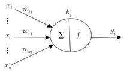
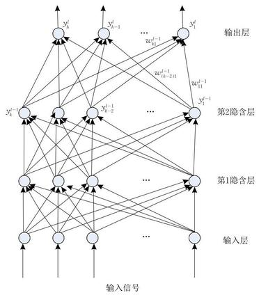
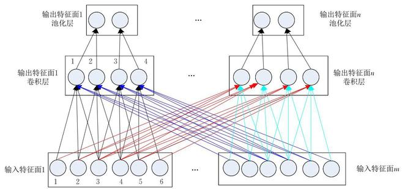
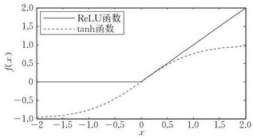
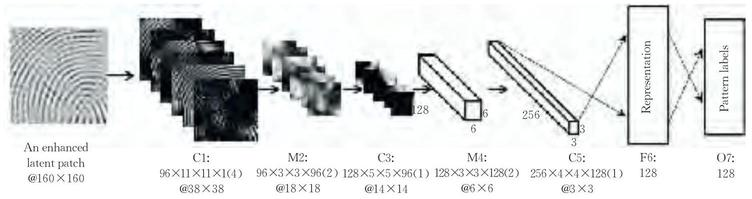
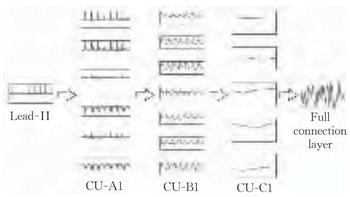
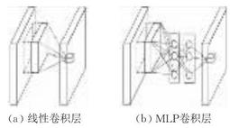
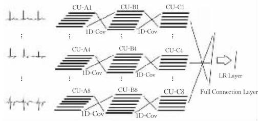
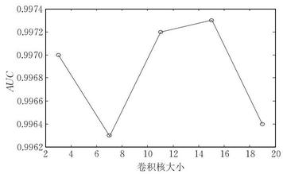
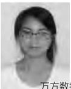

=+=+=+=+=+=+=+=+=
# 卷积神经网络研究综述

周飞燕 \( {}^{1),2)} \) 金林鹏 \( {}^{1),2)} \) 董 军 \( {}^{1)} \)

\( {}^{1)} \) (中国科学院苏州纳米技术与纳米仿生研究所 江苏 苏州 215123)

2)(中国科学院大学 北京 100049)

摘 要 作为一个十余年来快速发展的崭新领域, 深度学习受到了越来越多研究者的关注, 它在特征提取和建模上都有着相较于浅层模型显然的优势. 深度学习善于从原始输入数据中挖掘越来越抽象的特征表示, 而这些表示具有良好的泛化能力. 它克服了过去人工智能中被认为难以解决的一些问题. 且随着训练数据集数量的显著增长以及芯片处理能力的剧增,它在目标检测和计算机视觉、自然语言处理、语音识别和语义分析等领域成效卓然,因此也促进了人工智能的发展. 深度学习是包含多级非线性变换的层级机器学习方法, 深层神经网络是目前的主要形式, 其神经元间的连接模式受启发于动物视觉皮层组织, 而卷积神经网络则是其中一种经典而广泛应用的结构. 卷积神经网络的局部连接、权值共享及池化操作等特性使之可以有效地降低网络的复杂度,减少训练参数的数目, 使模型对平移、扭曲、缩放具有一定程度的不变性,并具有强鲁棒性和容错能力,且也易于训练和优化. 基于这些优越的特性, 它在各种信号和信息处理任务中的性能优于标准的全连接神经网络. 该文首先概述了卷积神经网络的发展历史,然后分别描述了神经元模型、多层感知器的结构. 接着,详细分析了卷积神经网络的结构,包括卷积层、 池化层、全连接层,它们发挥着不同的作用. 然后,讨论了网中网模型、空间变换网络等改进的卷积神经网络. 同时, 还分别介绍了卷积神经网络的监督学习、无监督学习训练方法以及一些常用的开源工具. 此外, 该文以图像分类、 人脸识别、音频检索、心电图分类及目标检测等为例,对卷积神经网络的应用作了归纳. 卷积神经网络与递归神经网络的集成是一个途径. 为了给读者以尽可能多的借鉴, 该文还设计并试验了不同参数及不同深度的卷积神经网络来分析各参数间的相互关系及不同参数设置对结果的影响. 最后,给出了卷积神经网络及其应用中待解决的若干问题.

关键词 卷积神经网络；深度学习；网络结构；训练方法；领域数据

中图法分类号 TP18

# Review of Convolutional Neural Network

ZHOU Fei-Yan \( {}^{1),2)} \) JIN Lin-Peng \( {}^{1),2)} \) DONG Jun \( {}^{1)} \)

\( {}^{1)} \) (Suzhou Institute of Nano-Tech and Nano-Bionics, Chinese Academy of Sciences, Suzhou, Jiangsu 215123) 2) (University of Chinese Academy of Sciences, Beijing 100049)

Abstract As a new and rapidly growing field for more than ten years, deep learning has gained more and more attention from different researchers. Compared with shallow architectures, it has great advantages in both feature extracting and model fitting. And it is very good at discovering increasingly abstract feature representations whose generalization ability is strong from the raw input data. It also has successfully solved some problems which were considered difficult to solve in artificial intelligence in the past. Furthermore, with the outstandingly increased size of data used for training and the drastic increases in chip processing capabilities, it has resulted in significant progress and been used in a broad area of applications such as object detection, computer vision, natural language processing, speech recognition and semantic parsing and so on, thus also promoting the advancement of artificial intelligence. Deep learning which consists of multiple levels of non-linear transformations is a hierarchical machine learning method. And deep neural network is the main form of the present deep learning method in which the connectivity pattern between its neurons is inspired by the organization of the animal visual cortex. Convolutional neural network that has been widely used is a classic kind of deep neural network. There are several characteristics such as local connections, shared weights, pooling etc. These features can reduce the complexity of the network and the number of training parameters, and they also can make the model creating some degree of invariance to shift, distortion and scale and having strong robustness and fault tolerance. So it is easy to train and optimize its network structure. Based on these predominant characteristics, it has been shown to outperform the standard fully connected neural networks in a variety of signal and information processing tasks. In this paper, first of all, the historical development of convolutional neural network is summarized. After that, the structures of a neuron model and multilayer perception are shown. Later on, a detailed analysis of the convolutional neural network architecture which is comprised of a number of convolutional layers and pooling layers followed by fully connected layers is given. Different kinds of layers in convolutional neural network architecture play different roles. Then, a few improved algorithms such as Network in Network and spatial transformer networks of convolutional neural network are described. Meanwhile, the supervised learning and unsupervised learning method of convolutional neural network and some widely used open source tools are introduced, respectively. In addition, the application of convolutional neural network on image classification, face recognition, audio retrieve, electrocardiogram classification, object detection, and so on is analyzed. Integrating of convolutional neural network and recurrent neural network to train inputted data could be an alternative machine learning approach. Finally, different convolution neural network structures with different parameters and different depths are tested. Through a series of experiments, the relations between these parameters in these models and the influence of different parameter settings are preliminary grasped. Some advantages and remained issues of convolutional neural network and its applications are concluded.

---

收稿日期:2016-07-27；在线出版日期:2017-01-18. 周飞燕,女,1986 年生,博士研究生,主要研究方向为计算机辅助心血管疾病诊断. E-mail: zhfyyl15@126.com. 金林鹏,男,1984 年生,博士,主要研究方向为机器学习. 董 军 (通信作者),男,1964 年生,博士,研究员,博士生导师,老安排究领域为人工智能及其在健康监护、传统文化中的应用. E-mail: jdong2010@sinano.ac.cn.

---

Keywords convolutional neural network; deep learning; network structure; training method; domain data

## 1 引 言

人工神经元网络 (Artificial Neural Network, ANN)是对生物神经网络的一种模拟和近似, 是由大量神经元通过相互连接而构成的自适应非线性动态网络系统. 1943 年, 心理学家 McCulloch 和数理逻辑学家 Pitts 提出了神经元的第 1 个数学模型—— MP 模型 \( {}^{\left\lbrack  1\right\rbrack  } \) . MP 模型具有开创意义,为后来的研究工作提供了依据. 到了 20 世纪 50 年代末至 60 年代初, Rosenblatt 在 MP 模型的基础之上增加了学习功能, 提出了单层感知器模型, 第一次把神经网络的研究付诸实践 \( {}^{\left\lbrack  {2,3}\right\rbrack  \rbrack } \) . 但是单层感知器网络模型不能够处理线在方数据分问题. 直至 1986 年, Rumelhart 等人 \( {}^{\left\lbrack  4\right\rbrack  } \) 提出了一种按误差逆传播算法训练的多层前馈网络一反向传播网络(Back Propagation Network, BP 网络),解决了原来一些单层感知器所不能解决的问题. 由于在 20 世纪 90 年代, 各种浅层机器学习模型相继被提出,较经典的如支持向量机 \( {}^{\left\lbrack  5\right\rbrack  } \) ,而且当增加神经网络的层数时传统的 \( \mathrm{{BP}} \) 网络会遇到局部最优、过拟合及梯度扩散等问题,这些使得深度模型的研究被搁置.

2006 年, Hinton 等人 \( {}^{\left\lbrack  6\right\rbrack  } \) 在《Science》上发文,其主要观点有:(1)多隐层的人工神经网络具有优异的特征学习能力；(2)可通过 “逐层预训练”(layer-wise pre-training) 来有效克服深层神经网络在训练上的困难, 从此引出了深度学习 (Deep Learning) 的研究,同时也掀起了人工神经网络的又一热潮 \( {}^{\left\lbrack  7\right\rbrack  } \) . 在深度学习的逐层预训练算法中首先将无监督学习应用于网络每一层的预训练,每次只无监督训练一层, 并将该层的训练结果作为其下一层的输入, 然后再用有监督学习(BP)算法 \( ) \) 微调预训练好的网络 \( {}^{\left\lbrack  8 - {10}\right\rbrack  } \) . 这种深度学习预训练方法在手写体数字识别或者行人检测中,特别是当标注样本数量有限时能使识别效果或者检测效果得到显著提升 \( {}^{\left\lbrack  {11}\right\rbrack  } \) . Bengio \( {}^{\left\lbrack  {12}\right\rbrack  } \) 系统地介绍了深度学习所包含的网络结构和学习方法. 目前, 常用的深度学习模型有深度置信网络 (Deep Belief Network, DBN) \( {}^{\left\lbrack  {13} - {16}\right\rbrack  } \) 、层叠自动去噪编码机 (Stacked Deoising Autoencoders, SDA) \( {}^{\left\lbrack  {17},{18}\right\rbrack  } \) 、卷积神经网络 (Convolutional Neural Network, CNN) \( {}^{\left\lbrack  {19},{20}\right\rbrack  } \) 等. 2016 年 1 月 28 日,英国《Nature》杂志以封面文章形式报道:谷歌旗下人工智能公司深灵(DeepMind) 开发的 AlphaGo 以 \( 5 : 0 \) 战胜了卫冕欧洲冠军—— 本以为大概 10 年后人工智能才能做到 \( {}^{\left\lbrack  {21}\right\rbrack  } \) . AlphaGo 主要采用价值网络 (value networks) 来评估棋盘的位置, 用策略网络 (policy networks) 来选择下棋步法, 这两种网络都是深层神经网络模型, AlphaGo 所取得的成果是深度学习带来的人工智能的又一次突破, 这也说明了深度学习具有强大的潜力.

事实上, 早在 2006 年以前就已有人提出一种学习效率很高的深度学习模型——CNN. 在 20 世纪 80 年代和 90 年代,一些研究者发表了 CNN 的相关研究工作,且在几个模式识别领域尤其是手写数字识别中取得了良好的识别效果 \( {}^{\left\lbrack  {22},{23}\right\rbrack  } \) . 然而此时的 CNN 只适合做小图片的识别, 对于大规模数据, 识别效果不佳 \( {}^{\lbrack 7\rbrack } \) . 直至 2012 年, Krizhevsky 等人 \( {}^{\left\lbrack  {24}\right\rbrack  } \) 使用扩展了深度的 CNN 在 ImageNet 大规模视觉识别挑战竞赛 (ImageNet Large Scale Visual Recognition Challenge, LSVRC) 中取得了当时最佳的分类效果, 使得 CNN 越来越受研究者们的重视.

## 2 CNN 概述
=+=+=+=+=+=+=+=+=
### 2.1 神经元

神经元是人工神经网络的基本处理单元,一般是多输入单输出的单元,其结构模型如图 1 所示. 其中: \( {x}_{i} \) 表示输入信号; \( n \) 个输入信号同时输入神经元 \( j.{w}_{ij} \) 表示输入信号 \( {x}_{i} \) 与神经元 \( j \) 连接的权重值, \( {b}_{j} \) 表示神经元的内部状态即偏置值, \( {y}_{j} \) 为神经元的输出. 输入与输出之间的对应关系可用下式表示:

\[
{y}_{j} = f\left( {{b}_{j} + \mathop{\sum }\limits_{{i = 1}}^{n}\left( {{x}_{i} \times  {w}_{ij}}\right) }\right)  \tag{1}
\]

万方数据图 1 神经元模型

\( f\left( \cdot \right) \) 为激励函数,其可以有很多种选择,可以是线性纠正函数 (Rectified Linear Unit, ReLU) \( {}^{\left\lbrack  {25}\right\rbrack  } \) , sigmoid 函数、 \( \tanh \left( x\right) \) 函数、径向基函数等 \( {}^{\left\lbrack  {26}\right\rbrack  } \) .
=+=+=+=+=+=+=+=+=
### 2.2 多层感知器

多层感知器 (Multilayer Perceptron, MLP) 是由输入层、隐含层(一层或者多层)及输出层构成的神经网络模型,它可以解决单层感知器不能解决的线性不可分问题. 图 2 是含有 2 个隐含层的多层感知器网络拓扑结构图.

图 2 多层感知器结构图

输入层神经元接收输入信号, 隐含层和输出层的每一个神经元与之相邻层的所有神经元连接,即全连接,同一层的神经元间不相连. 图 2 中,有箭头的线段表示神经元间的连接和信号传输的方向,且每个连接都有一个连接权值. 隐含层和输出层中每一个神经元的输入为前一层所有神经元输出值的加权和. 假设 \( {x}_{m}^{l} \) 是 MLP 中第 \( l \) 层第 \( m \) 个神经元的输入值, \( {y}_{m}^{l} \) 和 \( {b}_{m}^{l} \) 分别为该神经元输出值和偏置值, \( {w}_{im}^{l - 1} \) 为该神经元与第 \( l - 1 \) 层第 \( i \) 个神经元的连接权值, 则有:

\[
{x}_{m}^{l} = {b}_{m}^{l} + \mathop{\sum }\limits_{{i = 1}}^{k}{w}_{im}^{l - 1} \times  {y}_{i}^{l - 1} \tag{2}
\]

\[
{y}_{m}^{l} = f\left( {x}_{m}^{l}\right)  \tag{3}
\]

当多层感知器用于分类时, 其输入神经元个数为输入信号的维数, 输出神经元个数为类别数, 隐含层个数及隐层神经元个数视具体情况而定. 但在实际应用中, 由于受到参数学习效率影响, 一般使用不超过 3 层的浅层模型. BP 算法可分为两个阶段:前向传播和后向传播,其后向传播始于 MLP 的输出层. 以图 2 为例, 则损失函数为 \( {}^{\left\lbrack  {27}\right\rbrack  } \)

\[
E = E\left( {{y}_{1}^{l},\cdots ,{y}_{h}^{l}}\right)  = \mathop{\sum }\limits_{j}^{h}{\left( {y}_{j}^{l} - {t}_{j}\right) }^{2} \tag{4}
\]

其中第 \( l \) 层为输出层, \( {t}_{j} \) 为输出层第 \( j \) 个神经元的期望输出, 对损失函数求一阶偏导, 则网络权值更新公式为

\[
{w}_{im}^{l - 1} = {w}_{im}^{l - 1} - \eta  \times  \frac{\partial E}{\partial {w}_{im}^{l - 1}} \tag{5}
\]

其中, \( \eta \) 为学习率.
=+=+=+=+=+=+=+=+=
### 2.3 CNN

1962 年,生物学家 Hubel 和 Wiesel \( {}^{\left\lbrack  {28}\right\rbrack  } \) 通过对猫脑视觉皮层的研究,发现在视觉皮层中存在一系列复杂构造的细胞, 这些细胞对视觉输入空间的局部区域很敏感, 它们被称为 “感受野”. 感受野以某种方式覆盖整个视觉域, 它在输入空间中起局部作用, 因而能够更好地挖掘出存在于自然图像中强烈的局部空间相关性. 文献 [28] 将这些被称为感受野的细胞分为简单细胞和复杂细胞两种类型. 根据 Hubel-Wiesel 的层级模型, 在视觉皮层中的神经网络有一个层级结构: 外侧膝状体→简单细胞→复杂细胞→ 低阶超复杂细胞 \( \rightarrow \) 高阶超复杂细胞 \( {}^{\left\lbrack  {29}\right\rbrack  } \) . 低阶超复杂细胞与高阶超复杂细胞之间的神经网络结构类似于简单细胞和复杂细胞间的神经网络结构. 在该层级结构中, 处于较高阶段的细胞通常会有这样一个倾向:选择性地响应刺激模式更复杂的特征；同时还具有一个更大的感受野,对刺激模式位置的变化更加不敏感 \( {}^{\left\lbrack  {29}\right\rbrack  } \) . 1980 年, Fukushima 根据 Huble和 Wiesel 的层级模型提出了结构与之类似的神经认知机 (Neocognitron) \( {}^{\left\lbrack  {29}\right\rbrack  } \) . 神经认知机采用简单细胞层 (S-layer, \( \mathrm{S} \) 层) 和复杂细胞层 (C-layer, \( \mathrm{C} \) 层) 交替组成,其中 \( \mathrm{S} \) 层与 Huble-Wiesel 层级模型中的简单细胞层或者低阶超复杂细胞层相对应, \( \mathrm{C} \) 层对应于复杂细胞层或者高阶超复杂细胞层. S 层能够最大程度地响应感受野内的特定边缘刺激, 提取其输入层的局部特征,可以用来自确切位置的刺激具有局部不敏感性. 尽管在神经认知机中没有像 BP 算法那样的全局监督学习过程可利用, 但它仍可认为是 CNN 的第一个工程实现网络, 卷积和池化 (也称作下采样)分别受启发于 Hubel-Wiesel 概念的简单细胞和复杂细胞,它能够准确识别具有位移和轻微形变的输入模式 \( {}^{\left\lbrack  {29},{30}\right\rbrack  } \) . 随后, LeCun 等人基于 Fukushima 的研究工作使用 BP 算法设计并训练了 CNN(该模型称为 LeNet-5), LeNet-5 是经典的 CNN 结构, 后续有许多工作基于此进行改进, 它在一些模式识别领域中取得了良好的分类效果 \( {}^{\left\lbrack  {19}\right\rbrack  } \) .

CNN 的基本结构由输入层、卷积层 (convolutional layer)、池化层(pooling layer,也称为取样层)、全连接层及输出层构成. 卷积层和池化层一般会取若干个,采用卷积层和池化层交替设置,即一个卷积层连接一个池化层, 池化层后再连接一个卷积层, 依此类推. 由于卷积层中输出特征面的每个神经元与其输入进行局部连接, 并通过对应的连接权值与局部输入进行加权求和再加上偏置值, 得到该神经元输入值,该过程等同于卷积过程, \( \mathrm{{CNN}} \) 也由此而得名 \( {}^{\left\lbrack  {19}\right\rbrack  } \) .

#### 2.3.1 卷积层

卷积层由多个特征面 (Feature Map) 组成, 每个特征面由多个神经元组成, 它的每一个神经元通过卷积核与上一层特征面的局部区域相连. 卷积核是一个权值矩阵 (如对于二维图像而言可为 \( 3 \times  3 \) 或 \( 5 \times  5 \) 矩阵 \( {)}^{\left\lbrack  {19},{31}\right\rbrack  } \) . CNN 的卷积层通过卷积操作提取输入的不同特征, 第 1 层卷积层提取低级特征如边缘、线条、角落,更高层的卷积层提取更高级的特征 \( {}^{\text{① .}} \) 为了能够更好地理解 \( \mathrm{{CNN}} \) ,下面以一维 \( \mathrm{{CNN}}(1\mathrm{D} \) CNN) 为例, 二维和三维 CNN 可依此进行拓展. 图 3 所示为一维 CNN 的卷积层和池化层结构示意图,最顶层为池化层,中间层为卷积层,最底层为卷积层的输入层.

由图 3 可看出卷积层的神经元被组织到各个特征面中, 每个神经元通过一组权值被连接到上一层特征面的局部区域, 即卷积层中的神经元与其输入层中的特征面进行局部连接 \( {}^{\left\lbrack  {11}\right\rbrack  } \) . 然后将该局部加权和传递给一个非线性函数如 \( \mathrm{{ReLU}} \) 函数即可获得卷积层中每个神经元的输出值. 在同一个输入特征面和同一个输出特征面中, CNN 的权值共享, 如图 3 所示, 权值共享发生在同一种颜色当中, 不同颜色权值不共享. 通过权值共享可以减小模型复杂度, 使得网络更易于训练. 以图 3 中卷积层的输出特征面 1 和其输入层的输入特征面 1 为例, \( {w}_{1\left( 1\right) 1\left( 1\right) } = \) \( {w}_{1\left( 2\right) 1\left( 2\right) } = {w}_{1\left( 3\right) 1\left( 3\right) } = {w}_{1\left( 4\right) 1\left( 4\right) } \) ,而 \( {w}_{1\left( 1\right) 1\left( 1\right) } \neq  {w}_{1\left( 2\right) 1\left( 1\right) } \neq \) \( {w}_{1\left( 3\right) 1\left( 1\right) } \) ,其中 \( {w}_{m\left( i\right) n\left( j\right) } \) 表示输入特征面 \( m \) 第 \( i \) 个神经元与输出特征面 \( n \) 第 \( j \) 个神经元的连接权值. 此外卷积核的滑动步长即卷积核每一次平移的距离也是卷积层中一个重要的参数. 在图 3 中, 设置卷积核在上一层的滑动步长为 1,卷积核大小为 \( 1 \times  3 \) . CNN 中每一个卷积层的每个输出特征面的大小 (即神经元的个数) \( {oMapN} \) 满足如下关系 \( {}^{\left\lbrack  {32}\right\rbrack  } \)

\[
{oMapN} = \left( {\frac{\left( iMapN - CWindow\right) }{CInterval} + 1}\right)  \tag{6}
\]

---

① Hijazi S, Kumar R, Rowen C, et al. Using convolutional neural networks for image recognition. http://ip.cadence.com/uploads/901/cnn_wp-pdf, 2016, 9, 22

---

图 3 卷积层与池化层结构示意图

其中: \( i{MapN} \) 表示每一个输入特征面的大小; CWindow 为卷积核的大小; CInterval 表示卷积核在其上一层的滑动步长. 通常情况下, 要保证式 (6) 能够整除, 否则需对 CNN 网络结构作额外处理. 每个卷积层可训练参数数目 CParams 满足式(7) \( {}^{\left\lbrack  {32}\right\rbrack  } \)

\[
\text{CParams} = \left( {i\text{Map} \times  \text{CWindow} + 1}\right)  \times  \text{oMap}
\]

(7)

其中: \( {oMap} \) 为每个卷积层输出特征面的个数; \( {iMap} \) 为输入特征面个数. 1 表示偏置,在同一个输出特征面中偏置也共享. 假设卷积层中输出特征面 \( n \) 第 \( k \) 个神经元的输出值为 \( {x}_{nk}^{\text{out }} \) ,而 \( {x}_{mh}^{\text{in }} \) 表示其输入特征面 \( m \) 第 \( h \) 个神经元的输出值,以图 3 为例, 则 \( {}^{\left\lbrack  {32}\right\rbrack  } \)

\[
{x}_{nk}^{\text{out }} = {f}_{\text{cov }}\left( {{x}_{1h}^{\text{in }} \times  {w}_{1\left( h\right) n\left( k\right) } + {x}_{1\left( {h + 1}\right) }^{\text{in }} \times  {w}_{1\left( {h + 1}\right) n\left( k\right) } + }\right.
\]

\[
{x}_{1\left( {h + 2}\right) }^{\text{in }} \times  {w}_{1\left( {h + 2}\right) n\left( k\right) } + \cdots  + {b}_{n}) \tag{8}
\]

式 (8) 中, \( {b}_{n} \) 为输出特征面 \( n \) 的偏置值. \( {f}_{\text{cov }}\left( \cdot \right) \) 为非线性激励函数. 在传统的 CNN 中, 激励函数一般使用饱和不可分类物据函数 (saturating nonlinearity) 如 sigmoid 函数、tanh 函数等. 相比较于饱和非线性函数, 不饱和非线性函数 (non-saturating nonlinearity) 能够解决梯度爆炸/梯度消失问题,同时也能够加快收敛速度 \( {}^{\left\lbrack  {33}\right\rbrack  } \) . Jarrett 等人 \( {}^{\left\lbrack  {34}\right\rbrack  } \) 探讨了卷积网络中不同的纠正非线性函数 (rectified nonlinearity, 包括 \( \max \left( {0, x}\right) \) 非线性函数),通过实验发现它们能够显著提升卷积网络的性能, Nair 等人 \( {}^{\left\lbrack  {25}\right\rbrack  } \) 也验证了这一结论. 因此在目前的 CNN 结构中常用不饱和非线性函数作为卷积层的激励函数如 \( \mathrm{{ReLU}} \) 函数. \( \mathrm{{ReLU}} \) 函数的计算公式如下所示 \( {}^{\left\lbrack  {24},{25}\right\rbrack  } \)

\[
{f}_{\text{cov }}\left( x\right)  = \max \left( {0, x}\right)  \tag{9}
\]

图 4 中实线为 \( \mathrm{{ReLU}} \) 曲线,虚线为 \( \tanh \) 曲线. 对于 ReLU 而言, 如果输入大于 0 , 则输出与输入相等, 否则输出为 0 . 从图 4 可以看出, 使用 ReLU 函数, 输出不会随着输入的逐渐增加而趋于饱和. Chen 在其报告中分析了影响 CNN 性能的 3 个因素:层数、特征面的数目及网络组织 \( {}^{\text{①}} \) . 该报告使用 9 种结构的 CNN 进行中文手写体识别实验, 通过统计测试结果得到具有较小卷积核的 CNN 结构的一些结论:(1)增加网络的深度能够提升准确率； (2)增加特征面的数目也可以提升准确率；(3)增加一个卷积层比增加一个全连接层更能获得一个更高的准确率. Bengio 等人 \( {}^{\left\lbrack  {35}\right\rbrack  } \) 指出深度网络结构具有两个优点: (1) 可以促进特征的重复利用; (2) 能够获取高层表达中更抽象的特征,由于更抽象的概念可根据抽象性更弱的概念来构造, 因此深度结构能够获取更抽象的表达, 例如在 CNN 中通过池化操作来建立这种抽象,更抽象的概念通常对输入的大部分局部变化具有不变性. He 等人 \( {}^{\left\lbrack  {36}\right\rbrack  } \) 探讨了在限定计算复杂度和时间上如何平衡 CNN 网络结构中深度、特征面数目、卷积核大小等因素的问题. 该文献首先研究了深度 (Depth) 与卷积核大小间的关系, 采用较小的卷积核替代较大的卷积核,同时增加网络深度来增加复杂度, 通过实验结果表明网络深度比卷积核大小更重要；当时间复杂度大致相同时,具有更小卷积核且深度更深的 CNN 结构比具有更大卷积核同时深度更浅的 CNN 结构能够获得更好的实验结果. 其次, 该文献也研究了网络深度和特征面数目间的关系, CNN 网络结构设置为:在增加网络深度时适当减少特征面的数目,同时卷积核的大小保持不变,实验结果表明,深度越深,网络的性能越好; 然而随着深度的增加, 网络性能也逐渐达到饱和. 此外, 该文献还通过固定网络深度研究了特征面数目和卷积核大小间的关系, 通过实验对比, 发现特征面数目和卷积核大小的优先级差不多,其发挥的作用均没有网络深度大.

---

① Xu Chen. Convolution neural networks for Chinese handwriting recognition. http://cs231n.stanford.edu/reports2016/ 428_Report.pdf, 2016, 9, 22

---

图 4 ReLU 与 tanh 函数曲线图

在 CNN 结构中, 深度越深、特征面数目越多, 则网络能够表示的特征空间也就越大、网络学习能力也越强,然而也会使网络的计算更复杂,极易出现过拟合的现象. 因而, 在实际应用中应适当选取网络深度、特征面数目、卷积核的大小及卷积时滑动的步长, 以使在训练能够获得一个好的模型的同时还能减少训练时间.

#### 2.3.2 池化层

池化层紧跟在卷积层之后,同样由多个特征面组成, 它的每一个特征面唯一对应于其上一层的一个特征面,不会改变特征面的个数. 如图 3,卷积层是池化层的输入层, 卷积层的一个特征面与池化层中的一个特征面唯一对应, 且池化层的神经元也与其输入层的局部接受域相连, 不同神经元局部接受域不重叠,石花花层旨在通过降低特征面的分辨率来获得具有空间不变性的特征 \( {}^{\left\lbrack  {37}\right\rbrack  } \) . 池化层起到二次提取特征的作用, 它的每个神经元对局部接受域进行池化操作. 常用的池化方法有最大池化即取局部接受域中值最大的点、均值池化即对局部接受域中的所有值求均值、随机池化 \( {}^{\left\lbrack  {38},{39}\right\rbrack  } \) . Boureau 等人 \( {}^{\left\lbrack  {40}\right\rbrack  } \) 给出了关于最大池化和均值池化详细的理论分析, 通过分析得出以下一些预测: (1) 最大池化特别适用于分离非常稀疏的特征; (2) 使用局部区域内所有的采样点去执行池化操作也许不是最优的,例如均值池化就利用了局部接受域内的所有采样点. Boureau 等 \( {\mathrm{人}}^{\left\lbrack  {41}\right\rbrack  } \) 比较了最大池化和均值池化两种方法,通过实验发现: 当分类层采用线性分类器如线性 SVM 时, 最大池化方法比均值池化能够获得一个更好的分类性能. 随机池化方法是对局部接受域采样点按照其值大小赋予概率值, 再根据概率值大小随机选择, 该池化方法确保了特征面中不是最大激励的神经元也能够被利用到 \( {}^{\left\lbrack  {37}\right\rbrack  } \) . 随机池化具有最大池化的优点, 同时由于随机性它能够避免过拟合. 此外, 还有混合池化、空间金字塔池化、频谱池化等池化方法 \( {}^{\left\lbrack  {37}\right\rbrack  } \) . 在通常所采用的池化方法中, 池化层的同一个特征面不同神经元与上一层的局部接受域不重叠,然而也可以采用重叠池化的方法. 所谓重叠池化方法就是相邻的池化窗口间有重叠区域. Krizhevsky 等人 \( {}^{\left\lbrack  {24}\right\rbrack  } \) 采用重叠池化框架使 top-1 和 top-5 的错误率分别降低了 0.4% 和 0.3%, 与无重叠池化框架相比, 其泛化能力更强,更不易产生过拟合. 设池化层中第 \( n \) 个输出特征面第 \( l \) 个神经元的输出值为 \( {t}_{nl}^{\text{out }} \) ,同样以图 3 为例,则有 \( {}^{\left\lbrack  {32}\right\rbrack  } \) :

\[
{t}_{nl}^{\text{out }} = {f}_{\text{sub }}\left( {{t}_{nq}^{\text{in }},{t}_{n\left( {q + 1}\right) }^{\text{in }}}\right)  \tag{10}
\]

其中: \( {t}_{nq}^{\mathrm{{in}}} \) 表示池化层的第 \( n \) 个输入特征面第 \( q \) 个神经元的输出值; \( {f}_{\text{sub }}\left( \cdot \right) \) 可为取最大值函数、取均值函数等.

池化层在上一层滑动的窗口也称为池化核. 事实上, CNN 中的卷积核与池化核相当于 Hubel-Wiesel 模型 \( {}^{\left\lbrack  {28}\right\rbrack  } \) 中感受野在工程上的实现,卷积层用来模拟 Hubel-Wiesel 理论的简单细胞, 池化层模拟该理论的复杂细胞. CNN 中每个池化层的每一个输出特征面的大小 (神经元个数) DoMap \( N \) 为 \( {}^{\left\lbrack  {32}\right\rbrack  } \)

\[
\text{ DoMapN } = \left( \frac{o\operatorname{MapN}}{\text{ DWindow }}\right)  \tag{11}
\]

其中,池化核的大小为 \( {DW} \) indow,在图 3 中 \( {DW} \) indow \( = \) 2. 池化层通过减少卷积层间的连接数量,即通过池化操作使神经元数量减少,降低了网络模型的计算量.

#### 2.3.3 全连接层

在 CNN 结构中, 经多个卷积层和池化层后, 连接着 1 个或 1 个以上的全连接层. 与 MLP 类似, 全连接层中的每个神经元与其前一层的所有神经元进行全连接. 全连接层可以整合卷积层或者池化层中具有类别区分性的局部信息 \( {}^{\left\lbrack  {42}\right\rbrack  } \) . 为了提升 CNN 网络性能, 全连接层每个神经元的激励函数一般采用 ReLU 函数 \( {}^{\left\lbrack  {43}\right\rbrack  } \) . 最后一层全连接层的输出值被传递给一个输出层, 可以采用 softmax 逻辑回归 (softmax regression) 进行分类, 该层也可称为 softmax 层 (softmax layer). 对于一个具体的分类任务, 选择一个合适的损失函数是十分重要的, \( \mathrm{{Gu}} \) 等人 \( {}^{\left\lbrack  {37}\right\rbrack  } \) 介绍了 CNN 几种常用的损失函数并分析了它们各自的特点. 通常, CNN 的全连接层与 MLP 结构一样, \( \mathrm{{CNN}} \) 的训练算法也多采用 \( \mathrm{{BP}} \) 算法.

当一个大的前馈神经网络训练一个小的数据集时, 由于它的高容量, 它在留存测试数据 (held-out test data,也可称为校验集) 上通常表现不佳 \( {}^{\left\lbrack  {30}\right\rbrack  } \) . 为了避免训练过拟合, 常在全连接层中采用正则化方法一 丢失数据 (dropout) 技术,即使隐层神经元的输出值以 0.5 的概率变为 0 ,通过该技术部分隐层节点失效,这些节点不参加 CNN 的前向传播过程, 也不会参加后向传播过程 \( {}^{\left\lbrack  {24},{30}\right\rbrack  } \) . 对于每次输入到网络中的样本, 由于 dropout 技术的随机性, 它对应的网络结构不相同, 但是所有的这些结构共享权值 \( {}^{\left\lbrack  {24}\right\rbrack  } \) . 由于一个神经元不能依赖于其它特定神经元而存在, 所以这种技术降低了神经元间相互适应的复杂性,使神经元学习能够得到更鲁棒的特征 \( {}^{\left\lbrack  {24}\right\rbrack  } \) . 目前, 关于 CNN 的研究大都采用 ReLU + dropout 技术,并取得了很好的分类性能 \( {}^{\left\lbrack  {24},{44},{45}\right\rbrack  } \) .

#### 2.3.4 特征面

特征面数目作为 CNN 的一个重要参数, 它通常是根据实际应用进行设置的, 如果特征面个数过少,可能会使一些有利于网络学习的特征被忽略掉, 从而不利于网络的学习; 但是如果特征面个数过多, 可训练参数个数及网络训练时间也会增加,这同样不利于学习网络模型. Chuo 等人 \( {}^{\left\lbrack  {46}\right\rbrack  } \) 提出了一种理论方法用于确定最佳的特征面数目,然而该方法仅对极小的接受域有效, 它不能够推广到任意大小的接受域. 该文献通过实验发现: 与每层特征面数目均相同的 CNN 结构相比, 金字塔架构 (该网络结构的特征面数目按倍数增加)更能有效利用计算资源. 目前, 对于 CNN 网络特征面数目的设定通常采用的是人工设置方法, 然后进行实验并观察所得训练模型的分类性能, 最终根据网络训练时间和分类性能来选取特征面数目.

#### 2.3.5 CNN 结构的进一步说明

CNN 的实现过程实际上已经包含了特征提取过程, 以图 5、图 6 为例直观地显示 CNN 提取的特征. Cao 等人 \( {}^{\left\lbrack  {47}\right\rbrack  } \) 采用 CNN 进行指纹方向场评估, 图 5 为其模型结构. 图 5 共有 3 个卷积层 \( (\mathrm{C}1,\mathrm{C}3 \) , C5)、2个池化层(M2, M4)、1个全连接层(F6)和 1 个输出层 (O7). 输入的大小为 \( {160} \times  {160},\mathrm{C}1 \) 中 \( {96} \times \) \( {11} \times  {11} \times  1\left( 4\right) \) 表示 C1 层有 96 个大小为 \( {11} \times  {11} \) 的卷积核, 1 为它的输入特征面个数, 4 是卷积核在其输入特征面上的滑动步长, \( {38} \times  {38} \) 为每个输出特征面的大小. 卷积层通过卷积操作提取其前一层的各种不同的局部特征,由图 5 可看出, \( \mathrm{C}1 \) 层提取输入图像的边缘、轮廓特征, 可看成是边缘检测器. 池化层的作用是在语义上把相似的特征合并起来, 池化层通过池化操作使得特征对噪声和变形具有鲁棒性 \( {}^{\left\lbrack  {11}\right\rbrack  } \) . 从图上可看出,各层所提取的特征以增强的方式从不同角度表现原始图像,并且随着层数的增加,其表现形式越来越抽象 \( {}^{\left\lbrack  {48}\right\rbrack  } \) . 全连接层 \( \mathrm{F}6 \) 中的每个神经元与其前一层进行全连接,该层将前期所提取的各种局部特征综合起来, 最后通过输出层得到每个类别的后验概率. 从模式分类角度来说, 满足 Fisher 判别准则的特征最有利于分类, 通过正则化方法 (dropout 方法), 网络参数得到有效调整, 从而使全连接层提取的特征尽量满足 Fisher 判别准则, 最终有利于分类 \( {}^{\left\lbrack  {48}\right\rbrack  } \) . 图 6 给出了 CNN 提取心电图 (electrocardiogram, ECG)特征的过程, 首先通过卷积单元 \( \mathrm{A}1 \) 、 \( \mathrm{\;B}1 \) 、 \( \mathrm{C}1 \) (其中每个卷积单元包括一个卷积层和一个池化层)提取特征,最后由全连接层汇总所有局部特征. 由图中也可以看出, 层数越高, 特征的表现形式也越抽象. 显然, 这些特征并没有临床诊断的物理意义,仅仅是数理值 \( {}^{\left\lbrack  {48}\right\rbrack  } \) .

图 5 指纹经过 CNN 的中间层输出特征 \( {}^{\left\lbrack  {47}\right\rbrack  } \)

图 6 ECG 经过 CNN 的中间层 \( {}^{\left\lbrack  {48}\right\rbrack  } \)

#### 2.3.6 与传统的模式识别算法相比

CNN 的本质就是每一个卷积层包含一定数量的特征面或者卷积核 \( {}^{\left\lbrack  {46}\right\rbrack  } \) . 与传统 MLP 相比, CNN 中卷积层的权值共享使网络中可训练的参数变少, 降低了网络模型复杂度, 减少过拟合, 从而获得了一个更好的泛化能力 \( {}^{\left\lbrack  {49}\right\rbrack  } \) . 同时,在 CNN 结构中使用池化操作使模型中的神经元个数大大减少,对输入空间的平移不变性也更具有鲁棒性 \( {}^{\left\lbrack  {49}\right\rbrack  } \) . 而且 CNN 结构的可拓展性很强, 它可以采用很深的层数. 深度模型具有更强的表达能力, 它能够处理更复杂的分类问题. 总的来说, CNN 的局部连接、权值共享和池化操作使其比传统 MLP 具有更少的连接和参数, 从而更易于训练.

## 3 CNN 的一些改进算法
=+=+=+=+=+=+=+=+=
### 3.1 网中网结构

CNN中的卷积滤波器是一种广义线性模型 (Generalized Linear Model, GLM), GLM 的抽象水平比较低, 但通过抽象却可以得到对同一概念的不同变体保持不变的特征 \( {}^{\left\lbrack  {50}\right\rbrack  } \) . Lin 等人 \( {}^{\left\lbrack  {50}\right\rbrack  } \) 提出了一种网中网 (Network in Network, NIN) 模型, 该模型使用微型神经网络 (micro neural network) 代替传统 CNN 函卷鹈握程, 同时还采用全局平均池化层来替换传统 CNN 的全连接层,它可以增强神经网络的表示能力. 微神经网络主要是采用 MLP 模型, 如图 7 所示.

图 7 线性卷积层与 MLP 卷积层对比 \( {}^{\left\lbrack  {50}\right\rbrack  } \)

图 7 中, 图 7(a) 是传统 CNN 的线性卷积层, 图 7(b)是 NIN 模型的非线性卷积层,用 MLP 来取代原来的 GLM. NIN 通过在输入中滑动微型神经网络得到卷积层的特征面. 与卷积的权值共享类似, MLP 对同一个特征面的所有局部感受野也共享,即对于同一个特征面 MLP 相同. 文献 [50] 之所以选择 MLP,考虑到 MLP 采用 BP 算法进行训练,能与 CNN 结构融合, 同时 MLP 也是一种深度模型, 具有特征重用的思想. MLP 卷积层能够处理更复杂的非线性问题, 提取更加抽象的特征. 在传统的 CNN 结构中全连接层的参数过多,易于过拟合,因此它严重依赖于 dropout 正则化技术. NIN 模型采用全局平均池化代替原来的全连接层, 使模型的参数大大减少. 它通过全局平均池化方法对最后一个 MLP 卷积层的每个特征面求取均值, 再将这些数值连接成向量,最后输入到 softmax 分类层中. 全局平均池化可看成是一个结构性的正则化算子 (structural regularizer), 它可以增强特征面与类别的一致性. 在全局平均池化层中没有需要优化的参数, 因此能够避免过拟合. 此外, 全局平均池化层对空间信息进行求和, 因此对输入的空间变化具有更强的鲁棒性. Lin 等人 \( {}^{\left\lbrack  {50}\right\rbrack  } \) 将该算法应用于 MNIST 及 SVHN 等数据集中,验证了该算法的有效性. \( \mathrm{{Xu}} \) 等人 \( {}^{\left\lbrack  {51}\right\rbrack  } \) 结合 NIN 模型提出了 ML-DNN 模型,使用与文献 [50] 相同的数据库,将其与稀疏编码等方法比较,表明了该模型的优越性.
=+=+=+=+=+=+=+=+=
### 3.2 空间变换网络

尽管 CNN 已经是一个能力强大的分类模型, 但是它仍然会受到数据在空间上多样性的影响. Jaderberg 等人 \( {}^{\left\lbrack  {52}\right\rbrack  } \) 采用一种新的可学习模块一空间变换网络 (Spatial Transformer Networks, STNs) 来解决此问题, 该模块由 3 个部分组成: 本地化网络 (localisation network)、网格生成器(grid generator) 及采样器 (sampler). STNs 可用于输入层, 也可插入到卷积层或者其它层的后面, 不需要改变原 CNN 模型的内部结构. STNs 能够自适应地对数据进行空间变换和对齐, 使得 CNN 模型对平移、缩放、旋转或者其它变换等保持不变性. 此外, STNs 的计算速度很快,几乎不会影响原有 CNN 模型的训练速度.
=+=+=+=+=+=+=+=+=
### 3.3 反卷积

由 Zeiler 等人 \( {}^{\left\lbrack  {53}\right\rbrack  } \) 提出的反卷积网络 (Decon-volutional Networks) 模型与 CNN 的思想类似, 只是在运算上有所不同. CNN 是一种自底而上的方法, 其输入信号经过多层的卷积、非线性变换和下采样处理. 而反卷积网络中的每层信息是自顶而下的, 它对由已学习的滤波器组与特征面进行卷积后得到的特征求和就能重构输入信号. 随后, Zeiler \( {}^{\left\lbrack  {54}\right\rbrack  } \) 采用反卷积网络可视化 CNN 中各网络层学习得到的特征, 从而有利于分析并改进它的网络结构. 反卷积网络也可看成是一个卷积模型, 它同样需要进行卷积和池化过程, 不同之处在于与 CNN 是一个逆过程. 文献 [54]模型中的每一个卷积层都加上一个反卷积层. 在卷积、非线性函数、最大池化后,不仅将输出的特征作为下一层的输入, 也将它送给对应的反卷积层. 反卷积层需要依次进行 unpooling(采用一种近似的方法求最大池化的逆过程)、矫正(使用非线性函数来保证所有输出均为非负数)及反卷积操作(利用卷积过程中卷积核的转置作为核,与矫正后的特征作卷积运算),然后形成重构特征. 通过反卷积技术可视化 CNN 各网络层学习到的特征, Zeiler \( {}^{\left\lbrack  {54}\right\rbrack  } \) 还得出以下结论: CNN 学习到的特征对于平移和缩放具有不变性, 但是对于旋转操作一般不具有该特性, 除非被识别对象具有很强的对称性. Zhao 等人 \( {}^{\left\lbrack  {55}\right\rbrack  } \) 提出了一个新的称为 SWWAE (Stacked What-Where Auto-Encoders) 的结构, SWWAE 模型由卷积结构及反卷积结构组成, 采用卷积结构对输入进行编码, 而反卷积结构用来进行重构. SWWAE 的每一个阶段是一个 “内容-位置” (what-where) 自动编码机,编码机由一个卷积层及紧随其后的一个最大池化层组成, 通过最大池化层产生两个变量集: 最大池化的输出记为 what 变量,它作为下一层的输入；将最大池化的位置信息记为 where 变量, where 变量要横向传递到反卷积结构中. SWWAE 的损失函数包含 3 个部分 (判别损失、重构损失及中间重构损失). SWWAE 在各种半监督和有监督任务中取得了很高的准确率, 它特别适用于具有大量无标注类别而有标注类别相对与方数据据集的情况,该模型也可能适用于与视频相关的任务 \( {}^{\left\lbrack  {55}\right\rbrack  } \) .

## 4 训练方法及开源工具
=+=+=+=+=+=+=+=+=
### 4.1 训练方法

虽然通常都认为如果没有无监督预训练,对深度神经网络进行有监督训练是非常困难的, 但 CNN 却是一个特例, 它可直接执行有监督学习训练 \( {}^{\left\lbrack  {12}\right\rbrack  } \) . \( \mathrm{{CNN}} \) 通过 \( \mathrm{{BP}} \) 算法进行有监督训练,也需经过信息的正向传播和误差的反向传播两个阶段 \( {}^{\left\lbrack  {19}\right\rbrack  } \) . CNN 开始训练之前, 需要采用一些不同的小随机数对网络中所有的权值和偏置值进行随机初始化. 使用 “小随机数”以保证网络不会因为权过大而进入饱和状态, 从而导致训练失败; “不同”用来保证网络可正常地学习训练,如果使用相同的数值初始化权矩阵,那么网络将没有学习的能力 \( {}^{\left\lbrack  {56}\right\rbrack  } \) . 随机初始化的权值和偏置值的范围可为 \( \left\lbrack  {-{0.5},{0.5}}\right\rbrack \) 或者 \( \left\lbrack  {-1,1}\right\rbrack \) (或者是其它合适的区间 \( {)}^{\left\lbrack  {57}\right\rbrack  } \) . 在实际应用中,无标注的数据远多于有标注的数据, 同时对数据进行人工标注也需要耗费较大的人力. 但是为了使有监督 CNN 得到充分的训练并获得较好的泛化能力,又需要大量有标注的训练样本,这一定程度上制约了 CNN 在实际中的应用. 这也是有监督学习的一个缺欠.

事实上, CNN 也可以进行无监督训练. 现存的一些无监督学习算法一般都需要调整很多超参数 (hyperparameter), 这使得它们难以被利用, 对此 Ngiam 等人 \( {}^{\left\lbrack  {58}\right\rbrack  } \) 提出了一种只需调整一个超参数的无监督学习算法一稀疏滤波 (sparse filtering). 稀疏滤波只优化一个简单的代价函数——L2 范数稀疏约束特征,从而得到好的特征表示. 在稀疏滤波中, 其特征分布矩阵具有如下特点:样本分布稀疏性 (population sparsity)、高分散性 (high dispersal)、 存在稀疏 (lifetime sparsity). 文中指出可将稀疏滤波用于深度网络模型中, 先用稀疏滤波训练得到一个单层的归一化特征, 然后将它们作为第 2 层的输入来训练第 2 层, 依此类推. 通过实验, 发现使用稀疏滤波贪心算法逐层训练, 可学习到一些很有意义的特征表示. Dong 等人 \( {}^{\left\lbrack  {59}\right\rbrack  } \) 将稀疏滤波应用于 CNN 的无监督学习,同时使用该 CNN 模型识别交通工具类型. 在文献 [59] 中, 采用稀疏滤波作为预训练, 并将 CNN 学习到的高级全局特征和低级局部特征输入到 softmax 层中进行分类. 随后, Dong 等人[60] 又采用一种半监督学习 CNN 用于交通工具类型识别中. 文中采用大量无标注的数据无监督训练卷积层的卷积核,该无监督算法为稀疏拉普拉斯滤波器, 再用一定量的有标注数据有监督训练 CNN 输出层的参数, 最后通过 BIT-Vehicle 数据库验证该 CNN 模型的可行性. 如果数据集中只有少量的标注数据, 同时还需要训练一个大的 CNN 网络, 传统的做法是首先进行无监督预训练,然后再采用有监督学习 (如 \( \mathrm{{BP}} \) 算法)进行微调 (fine-tuning).

显性训练是传统的神经网络训练方法, 其最大特点是训练过程中有一部分样本不参与 CNN 的误差反向传播过程, 将该部分样本称为校验集. 在显性训练过程中,为了防止发生过拟合现象,每隔一定时间就用当前分类模型测试校验样本,这也表明了校验集中样本选取的好坏会影响最终分类模型的性能. 在 CNN 分类模型中, 为了增加训练样本数, 可采用 “平移起始点”和“加躁”这两种技术 \( {}^{\left\lbrack  {61}\right\rbrack  } \) . 不妨以一个采样点数为 \( 1 \times  {1900} \) 的一维信号为例,设置起始点的范围为 \( \left\lbrack  {1,{200}}\right\rbrack \) . 训练过程中,每个样本随机选定一个起始点, 截取其后连续的 1700 个点作为网络的输入参与 BP 训练过程,则 CNN 的输入维数为 \( 1 \times  {1700} \) ,显然起始点不同,截取所得的子段也不同. 在文献[48]的校验集中, 每幅 ECG 的起始点均为 1,实际上起始点也可以不一样, 但是在 CNN 的整个训练过程中,必须保持该校验集不变,同时校验集和训练集完全没有交集, 其样本为来自不同病人的不同记录. 此外, 只要对类别的最终判断没有影响, 也可通过加躁处理或者对原始数据做某种扭曲变换从而达到增加训练样本的目的.

在某些应用领域如计算机辅助 ECG 分析中, 不同的 ECG 记录(一维信号)也可能存在一些表现相似的 ECG 记录. 如果校验样本不典型,即该校验集没有包含全部有差异的个体, 则训练所得的分类模型就会存在偏差. 由于受到一些现实条件的影响, 人工挑选校验样本也并非易事. 因此在 CNN 的分类过程中, 还可以采用隐性训练方法. 与显性训练相比,隐性训练方法主要的区别是怎样检验当前的分类模型. 隐性训练方法从整个训练集中取出一小部分样本用于校验: 用于校验的这部分样本不做加躁处理,并且对于每一个样本都截取起始点固定的子段. 在实际应用中, 这两种训练方法各有优势. 通过实验表明,这种平移起始点和加躁技术对分类性能的提升有很大的帮助,尤其是对于数据不平衡的分类问题 \( {}^{\left\lbrack  {61}\right\rbrack  } \) .
=+=+=+=+=+=+=+=+=
### 4.2 开源工具

深度厚. 为靴塌广泛应用于众多研究领域, 离不开许多优秀的开源深度学习仿真工具. 目前常用的深度学习仿真工具有 Caffe \( {}^{\left\lbrack  {62}\right\rbrack  \left( 1\right) } \) 、Torch \( {}^{\left( 2\right) \left( 3\right) } \) 及 Theano \( {}^{\left\lbrack  {63}\right\rbrack  \left( 4\right) } \) 等. Caffe 是一个基于 C + + 语言且关于 CNN 相关算法的架构. Caffe 可以在 CPU 及 GPU 上运行, 它支持 MATLAB 和 Python 接口. Caffe 提供了一个完整的工具包,用于训练、测试、微调及部署模型. Caffe 允许用户对新数据格式、网络层和损失函数进行拓展；它的运行速度也很快,在单个 K40 或者 Titan GPU 上一天可以训练超过 4 千万幅图像；用户还可以通过 Caffe 社区参与开发与讨论. 但是 Caffe 的灵活性较差.

Torch 是一个支持机器学习算法的科学计算框架. 它是采用 Lua 脚本语言和 C 语言编写的. Torch 为设计和训练机器学习模型提供了一个灵活的环境,它还可支持 iOS、Android 等嵌入式平台. 最新版本 Torch7 使 CNN 的训练速度得到大幅度提升. 对于 Torch 的时域卷积, 其输入长度可变, 这非常有助于自然语言任务. 但 Torch 没有 Python 接口.

Theano 是一个允许用户定义、优化并评价数学表达式的 python 库. Theano 提供了 NumPy 的大部分功能, 可在 GPU 上运行. 此外, Theano 能够自动求微分, 它尤其适用于基于梯度的方法. Theano 能够很容易且高效地实现递归神经网络 (Recurrent Neural Network, RNN). 然而 Theano 的编译过程很慢, 导入 Theano 也需要消耗时间.

Bahrampour 等人 \( {}^{\left\lbrack  {64}\right\rbrack  } \) 从可拓展性、硬件利用率及速度方面对 Caffe、Torch、Theano、Neon \( {}^{\text{⑤}} \) 及 Tensor- \( {\mathrm{{Flow}}}^{⑥} \) 等 5 个深度学习软件架构作了比较. 其中 Caffe、Torch 及 Theano 是目前最广泛使用的软件架构. 这 5 个软件架构均可在 CPU 或者 GPU 上运行,但是 Neon 不能使用多线程 CPU, Caffe 需要在安装的时候确定好 CPU 的线程数, TensorFlow、 Torch 及 Theano 则可以灵活地选择 CPU 线程数 \( {}^{\left\lbrack  {64}\right\rbrack  } \) . Bahrampour 等人 \( {}^{\left\lbrack  {64}\right\rbrack  } \) 通过实验发现: Torch 与 Theano 是两个最具有拓展性的架构, 不仅支持各种深度结构,还支持各种库；在 CPU 上,对于任一深度网络结构的训练和部署, Torch 表现最优, 其次是 Theano, Neon 的性能最差; 在 GPU 上训练卷积和全连接网络, 对于小网络模型 Theano 的训练速度最快,对于较大的网络模型则是 Torch 最快,而对于大的卷积网络 Neon 也非常有竞争力；在 GPU 上训练和部署 RNN 模型, Theano 的性能最好; Caffe 最易于评价标准深度结构的性能; 与 Theano 类似, TensorFlow 也是非常灵活的架构, 但是它在单个 GPU 上的性能不如其它几个架构. 表 1 总结了 Caffe、 Torch 及 Theano 所具有的一些特点 \( {}^{\text{①}} \) . Theano 没有预训练的 CNN 模型, 所以在 Theano 上不能直接进行 CNN 无监督预训练.

---

① Caffe [Online]. http//caffe. berkeleyvision. org/, 2016, 9,22

② Torch [Online]. http://torch.ch/, 2016,9,22

③ Torch7[Online]. https://github.com/torch/torch7, 2016, 9,22

④ Theano [Online]. https://github.com/Theano/Theano, 2016, 9, 22

⑤ Neon [Online]. https://github.com/yelite/neon, 2016, 9,22

⑥ TensorFlow [Online]. https://www.tensorflow.org/, 2016, 9, 22

---

表 1 不同软件包的一些特点

<table><tr><td>架构</td><td>编写语言</td><td>开源</td><td>接口</td><td>硬件</td><td>平台</td><td>适合模型</td><td>预训练 CNN 模型</td></tr><tr><td>Caffe</td><td>C++, Python</td><td>是</td><td>命令行, Python, Matlab</td><td>CPU, GPU</td><td>Linux, OS X, Windows, Ubuntu, AWS, Android</td><td>CNN</td><td>有</td></tr><tr><td>Torch</td><td>Lua, \( \mathrm{C} \)</td><td>是</td><td>Lua, \( \mathrm{C} \)</td><td>CPU, GPU, FPGA</td><td>Linux, Andriod, Mac OS X, iOS, Windows</td><td>CNN, RNN, DBN</td><td>有</td></tr><tr><td>Theano</td><td>Python</td><td>是</td><td>Python</td><td>CPU, GPU</td><td>可跨平台</td><td>CNN, RNN, DBN</td><td>无</td></tr></table>

## 5 实际应用
=+=+=+=+=+=+=+=+=
### 5.1 图像分类

近年来, \( \mathrm{{CNN}} \) 已被广泛应用于图像处理领域中. Krizhevsky 等人 \( {}^{\left\lbrack  {24}\right\rbrack  } \) 第 1 次将 CNN 用于 LSVRC-12 竞赛中, 通过加深 CNN 模型的深度并采用 ReLU + dropout 技术, 取得了当时最好的分类结果 (该网络结构也被称为 AlexNet). AlexNet 模型包含 5 个卷积层和 2 个全连接层. 与传统 CNN 相比: 在 Alex-Net 中采用 ReLU 代替饱和非线性函数 tanh 函数, 降低了模型的计算复杂度, 模型的训练速度也提升了几倍; 通过 dropout 技术在训练过程中将中间层的一些神经元随机置为 0 ,使模型更具有鲁棒性,也减少了全连接层的过拟合；而且还通过图像平移、图像水平镜像变换、改变图像灰度等方式来增加训练样本, 从而减少过拟合. 相比于 AlexNet, Szegedy 等 \( {\mathrm{人}}^{\left\lbrack  {65}\right\rbrack  } \) 大大增加了 CNN 的深度,提出了一个超过 20 层的 CNN 结构 (称为 GoogLeNet). 在 GoogLeNet 结构中采用了 3 种类型的卷积操作 \( (1 \times  1,3 \times  3 \) , \( 5 \times  5) \) ,该结构的主要特点是提升了计算资源的利用率,它的参数比文献[24]少了 12 倍,而且 GoogLeNet 的准确率更高, 在 LSVRC-14 中获得了图像分类 “指定数据”组的第 1 名. Simonyan 等人 \( {}^{\left\lbrack  {66}\right\rbrack  } \) 在其发表的文章中探讨了 “深度” 对于 CNN 网络的重要性. 该文通过在现有的网络结构中不断增加具有 \( 3 \times  3 \) 卷积核的卷积层来增加网络的深度,实验表明, 当权值层数达到 16~19 时,模型的性能能够得到有效提升(文中的模型也称为 VGG 模型). VGG 模型用具有小卷积核的多个卷积层替换一个具有较大卷积核的卷积层(如用大小均为 \( 3 \times  3 \) 卷积核的 3 层卷积层代替万底数据 \( 7 \times  7 \) 卷积核的卷积层),这种替换方式减少了参数的数量, 而且也能够使决策函数更具有判别性. VGG 模型在 LSVRC-14 竞赛中,得到了图像分类“指定数据”组的第 2 名, 证明了深度在视觉表示中的重要性. 但是由于 VGG 与 GoogLeNet 的深度都比较深,所以网络结构比较复杂,训练时间长, 而且 VGG 还需要多次微调网络的参数.

AlexNet 模型、GoogLeNet 模型与 VGG 模型都在 ImageNet 竞赛中取得了很好的结果, 然而它们只能接受固定大小的输入. 事实上, CNN 的卷积层不需要固定大小的输入, 它可以产生任意大小的特征面,但是它的全连接层需要固定长度的输入,因此 CNN 的输入大小需保持一致的限制源于它的全连接层 \( {}^{\left\lbrack  {67}\right\rbrack  } \) . 为了获得固定大小的输入,需要对输入图像进行裁剪或者缩放,但是这样的变换会破坏输入图像的纵横比及完整的信息等,从而影响识别的准确率. He 等人 \( {}^{\left\lbrack  {67}\right\rbrack  } \) 提出一种 SPP-net 模型,该模型是在 CNN 的最后一个卷积层与第 1 个全连接层中间加入一个空间金字塔池化 (Spatial Pyramid Pooling, SPP) 层. SPP 层能够使 CNN 不同大小的输入却产生大小相同的输出, 打破了以往 CNN 模型的输入均为固定大小的局限, 且该改进的 CNN 模型训练速度较快, 在 LSVRC-14 的图像分类比赛中获得第 3 名.

在层级很深的深度网络模型中, 除了存在梯度扩散问题外, 还存在着退化问题. 批规范化 (Batch Normalization, BN) 是解决梯度扩散问题的一种有效方法 \( {}^{\left\lbrack  {68}\right\rbrack  } \) . 所谓退化问题就是:随着深度的增加,网络精度达到饱和, 然后迅速下降. 且该性能的下降不是由过拟合引起的, 而是增加网络的深度使得它的训练误差也随之增加 \( {}^{\left\lbrack  {69}\right\rbrack  } \) . 文献 \( \left\lbrack  {69}\right\rbrack \) 采用残差网络 (Residual Networks, ResNet) 来解决退化问题. ResNet 的主要特点是跨层连接, 它通过引入捷径连接技术 (shortcut connections) 将输入跨层传递并与卷积的结果相加. 在 ResNet 中只有一个池化层,它连接在最后一个卷积层后面. ResNet 使得底层的网络能够得到充分训练, 准确率也随着深度的加深而得到显著提升. 将深度为 152 层的 ResNet 用于 LSVRC-15 的图像分类比赛中,它获得了第 1 名的成绩. 在该文献中, 还尝试将 ResNet 的深度设置为 1000 , 并在 CIFAR-10 图像处理数据集中验证该模型.

---

① Compasion of deep learning software[Online]. https://en.wikipedia.org/wiki/Comparison_of_deep_learning_software, 2016, 9, 22

---

AlexNet 与 VGG 模型的网络结构为直线型, 它们的输入都是从第 1 个卷积层按单个路径直接传递到最后一层. 在 BP 训练中预测误差是由最顶层传递到底层的, 对于很深的网络模型传递至底层的误差很小,难以优化底层参数 \( {}^{\left\lbrack  {70}\right\rbrack  } \) . 因此,对于 AlexNet 与 VGG 模型, 如果它们的深度很深, 则将难以优化它们的结构. 为了使网络结构能够得到有效训练, GoogLeNet 在多个中间层中加入监督信号. ResNet 则通过捷径连接技术使得输入可以通过多个路径流入最顶层,它大幅度降低了更深层模型的训练难度. 如何有效地训练层级很深的深度网络模型仍旧是一个有待研究的问题. 尽管图像分类任务能够受益于层级较深的卷积网络, 但一些方法还是不能很好地处理遮挡或者运动模糊等问题.

Mishkin 等人 \( {}^{\left\lbrack  {71}\right\rbrack  } \) 系统地比较了近年来在 ImageNet 竞赛的大数据中不同 CNN 结构(包括 VGG、 GoogLeNet)的性能及不同参数选取对 CNN 结构的影响. 文中通过实验得到以下一些建议:(1)对于激励函数,可选取没有 \( \mathrm{{BN}} \) 的指数线性单元 (Exponential Linear Unit, ELU) \( {}^{\left\lbrack  {37},{71}\right\rbrack  } \) 或者有 \( \mathrm{{BN}} \) 的 ReLU 非线性函数; (2) 在池化层中采用平均池化及最大值池化之和比随机池化、单独的平均池化或者最大池化等方法要好; (3) 相比较于平方根学习率衰减方法 (square root)、平方学习率衰减方法 (square) 或者阶跃学习率衰减方法 (step), 使用线性学习率衰减方法(linear)更好；(4)最小批量尺寸(mini-batch size) 可取 128 或者 256 , 如果这对于所用 GPU 而言还是太大,那么可按批量尺寸成比例减少学习率； (5)目前深度学习的性能高度依赖于数据集的大小. 如果训练集大小小于它的最小值, 那么模型性能会迅速降低. 因此当增加训练集大小时,需要检查数据量是否在数据到模型所需的最小值；(6) 如果不能增加输入图像的大小,那么可以减小其后卷积层中的滑动步长,这样也能够得到大致相同的结果.
=+=+=+=+=+=+=+=+=
### 5.2 人脸识别

在人脸识别中,传统的识别路线包括 4 个步骤: 检测-对齐一人脸表示-分类. DeepFace \( {}^{\left\lbrack  {72}\right\rbrack  } \) 也遵循这一技术路线, 但是对人脸对齐和人脸表示阶段进行了改进. 在 DeepFace 中首先对图像进行 3D 人脸对齐,再输入到深度神经网络中. DeepFace 的前 3 层 ( 2 个卷积层及 1 个池化层 ) 用于提取低级特征 ( 如边缘及纹理信息). 池化层能够使得网络对微小偏移更具有鲁棒性,但是为了减少信息的丢失, Deep-Face 的池化层只有 1 层, 其紧跟在第 1 个卷积层后面. DeepFace 的第 2 个卷积层后紧连着 3 个局部连接层 (这 3 个局部连接层卷积核不共享), 由于在对齐的人脸图像中不同的区域有不同的局部统计特征, 采用不共享的卷积核可减少信息的丢失. Deep-Face 具有 2 个全连接层, 全连接层可用来捕获人脸图像不同位置的特征之间 (如人眼的位置与形状、嘴巴的位置与形状)的相关性. 将该模型应用于户外人脸检测数据库 (Labeled Faces in the Wild, LFW) 中, DeeepFace \( {}^{\left\lbrack  {72}\right\rbrack  } \) 取得的人脸识别准确率为 \( {97.35}\% \) ,接近人眼辨识准确率 \( {97.53}\% \) ,其所用方法克服了以往方法的缺点和局限性. 然而 DeepFace 的参数个数多于 1.2 亿, 其中 95% 参数来自 3 个局部连接层及 2 个全连接层, 因此 DeepFace 对有标注样本的数量要求较高, 它需要一个大的有标注数据集.

在 DeepID \( {}^{\left\lbrack  {73}\right\rbrack  } \) 、DeepID \( {2}^{\left\lbrack  {74}\right\rbrack  } \) 之后, Sun 等人 \( {}^{\left\lbrack  {75}\right\rbrack  } \) 又相继提出了 DeepID2 + 、 DeepID3 \( {}^{\left\lbrack  {76}\right\rbrack  } \) . DeepID2 + 继承了 DeepID2 的结构, 它也包含 4 个卷积层, 且每个卷积层后均紧随着一个池化层,并作了 3 个方面的改进:(1)加大网络结构,每个卷积层的特征面个数增加到了 128 个,最终的特征表示也增加到了 512 维；(2)增加了训练数据；(3)一个具有 512 维的全连接层均与每一个池化层进行全连接, 且每一池化层都添加监督信号(由人脸辨识信号和人脸确认信号组成),使用监督信号既能够增加类间变化又能够减少类内变化. DeepID2 + 在 LFW 上的准确率达到了 99.47%. DeepID2 + 具有 3 个重要的属性: (1)它的顶层神经元响应是中度稀疏的,即使将神经元二值化后, 仍能获得较好的识别结果, 该性质能够最大化网络的辨识能力及图像间的距离；(2)高层的神经元对人脸身份以及人脸属性具有很高的选择性; (3) 高层神经元对局部遮挡具有良好的鲁棒性. 以往的许多研究工作为了获得这些引人注目的属性, 通常需要对模型加入一些显性的约束, 但是 DeepID2 + 通过数据训练深度模型就能够自动地得到这些属性 \( {}^{\left\lbrack  {75}\right\rbrack  } \) . DeepID2 + 的提出不仅能够显著提升人脸识别的性能, 还能够帮助人们理解深度模型及其网络连接,且对稀疏表示、属性学习和遮挡处理等研究也起一定的指导作用 \( {}^{\left\lbrack  {75}\right\rbrack  } \) . Sun 等人 \( {}^{\left\lbrack  {76}\right\rbrack  } \) 分别重建了 VGG 网络和 GoogLeNet 网络, 得到 DeepID3 net 1 网络和 DeepID3 net 2 网络 (将它们称为 Deep-ID3). DeepID3 继承了 DeepID2 + 的一些特点, 在最后几个特征提取层中它们的权值也不共享, 并且为了使网络能够更好地学习中级特征及更易于训练, 在网络的一些中间层中也要加入人脸辨识-人脸确认监督信号. 然而 DeepID3 的深度更深, 且它的非线性特征提取层可达 10~15 层. 通过结合 DeepID3 net1 网络和 DeepID3 net2 网络, 在 LFW 上 Deep-ID3 的人脸识别准确率为 99.53%. 尽管 DeepID3 的深度要比 DeepID2 + 深, 但是它要比 VGG 或者 GoogLeNet 深度浅得多. 然而当更正了 LFW 上一些错误标注的数据后,它的准确率与 DeepID2 + 一样, 还需在更大的训练集上进一步研究很深的深度模型的有效性.

FaceNet \( {}^{\left\lbrack  {77}\right\rbrack  } \) 是由 Google 公司提出的一种人脸识别模型, 它直接学习从人脸图像到紧致欧式空间的一个映射, 使欧式距离直接关联着人脸相似度的一个度量. FaceNet 是一个端对端的学习方法, 它通过引入三元组损失函数进行人脸验证、识别和聚类. FaceNet 直接优化与任务相关的三元组损失函数, 在训练过程中该损失不仅仅用在最后一层,它也用于多个层中. 然而如果选择不合适的三元组损失函数, 那么将会影响模型的性能, 同时也会使收敛速度变慢, 因此三元组损失函数的选取对于 FaceNet 性能的提升很重要. 经 LFW 数据库和 YouTube 人脸数据库测试, FaceNet 得到的识别准确率分别为 99.63%和 95.12%.

相比较于 DeepFace、DeepID, FaceNet 不需要进行复杂的 \( 3\mathrm{D} \) 对齐, DeepID 则需要一个简单的 \( 2\mathrm{D} \) 仿射对齐. Parkhi 等人 \( {}^{\left\lbrack  {78}\right\rbrack  } \) 在其文章中也研究了在不同 CNN 结构中人脸对齐对人脸识别准确性的影响. 他们通过实验发现对齐后 FaceNet 的识别准确率比原模型的高 \( {}^{\left\lbrack  {78}\right\rbrack  } \) . 在 LFW 数据库, DeepFace、 DeepID 素与布数据aceNet 的人脸识别准确率都比较高, 但是 CNN 在人脸识别中仍然有许多具有挑战性的问题, 如面部特征点定位、人脸、姿态等对人脸识别效果的影响, 都是需要深入研究的问题 \( {}^{\left\lbrack  {79}\right\rbrack  } \) .
=+=+=+=+=+=+=+=+=
### 5.3 音频检索

Abdel-Hamid 等人 \( {}^{\left\lbrack  {80},{81}\right\rbrack  } \) 结合隐马尔科夫建立了 CNN 用于识别语音的模型, 并在标准 TIMIT 语音数据库上进行实验, 实验结果显示该模型的错误率相对于具有相同隐含层数和权值的常规神经网络模型低了 \( {10}\% \) ,表明 CNN 模型能够提升语音的识别准确率. 在文献 \( \left\lbrack  {{80},{81}}\right\rbrack \) 中, CNN 模型的卷积层均采用了受限权值共享(Limited Weight Sharing, LWS) 技术, 该技术能够更好地处理语音特征, 然而这种 LWS 方法仅限于单个卷积层, 不像大部分的 CNN 研究可以使用多个卷积层. IBM 和微软公司近年来在 CNN 用于识别语音方面也做了大量的研究工作,并发表了一些相关的论文 \( {}^{\left\lbrack  {82} - {84}\right\rbrack  } \) .
=+=+=+=+=+=+=+=+=
### 5.4 ECG 分析

ECG 是目前极为有用的一种心血管系统疾病的临床诊断体征. 远程医疗诊断服务系统的产生使得更多的人获得医疗专家的诊断服务,许多研究者包括本课题组多年来一直致力于研究计算机辅助 ECG 分析 \( {}^{\left\lbrack  {85}\right\rbrack  } \) . Kadi 等人 \( {}^{\left\lbrack  {86}\right\rbrack  } \) 综述了从 2000 年到 2015 年将数据挖掘技术应用于计算机辅助心血管疾病分析的文章. 他们根据数据挖掘技术及其性能选出 149 篇文献并进行分析, 通过研究发现: 从 2000 年到 2015 年,关于使用数据挖掘技术辅助分析心血管疾病的研究数量呈增长趋势; 研究人员常将挖掘技术用于分类和预测; 相比较于其它数据挖掘技术, 神经网络和支持向量机能够获得更高的准确率. 该文献的分析结果也说明了神经网络技术在计算机辅助心血管疾病分析中的有效性. 然而由于实际应用中 ECG 数据形态复杂多变, 将传统的神经网络技术应用于大数据的 ECG 分析中,取得的结果并不是很理想.

临床实际应用中, ECG 多数为多导联信号,与二维图像相似. 本课题组成员朱洪海 \( {}^{\left\lbrack  {87}\right\rbrack  } \) 针对多导联 ECG 数据,同时考虑到 CNN 的优越特性,提出了一种 ECG-CNN 模型, 从目前公开发表的文献可知, 该 ECG-CNN 模型也是 CNN 首次应用于 ECG 分类中. ECG-CNN 模型采用具有 3 个卷积层和 3 个池化层的 CNN 结构,其输入数据维数为 \( 8 \times  {1800} \) (对应 8 个基本导联 ECG 采样点数). ECG-CNN 的第 1 个卷积核的大小为 \( 8 \times  {23} \) ,它包含了全部的行,这与 LeNet-5 网络结构在图像中的卷积核大小为 \( 5 \times  5 \) 不一样, 图像中的卷积核一般不会包含全部的行. 通过采用 ECG-CNN 模型对国际公认的心律失常数据库——MIT-BIH 数据库 \( {}^{\text{①}} \) (该数据库共 48 条记录) 中的 40 条 ECG 记录进行病人内心拍分类, 得到的准确率为 99.2%. 同时在该文献中还采用 ECG-CNN 模型对本课题组为了面向临床应用而建立的中国心血管疾病数据库 \( {}^{\left\lbrack  {88}\right\rbrack  } \) (Chinese Cardiovascular Disease Database, CCDD, http://58.210.56.164: \( {88}/\mathrm{{ccd}}\mathrm{d}/ \) )的前 251 条记录进行心拍正异常分类,得到的准确率为 97.89%. 文中将文献 [89] 和文献 [90]作为对照文献, 相同数据集上, 文献[89]和[90] 得到的心拍正异常分类准确率分别为 \( {98.51}\% \) 和 94.97%. 此外文献 [87]还采用该算法对 CCDD 数据库的 Set IV 数据集共 11760 条记录进行按记录的病人间正异常分类,最终准确率为 83.49%,文献[89]和[90]在该数据集中得到的准确率分别为 70.15% 和 72.14%. 从上述对比结果可知, ECG - CNN 模型的分类性能优于对照文献的分类性能. Hakacova 等人 \( {}^{\left\lbrack  {91}\right\rbrack  }{2012} \) 年统计了市场上一些心电图机的自动诊断结果, 总共统计了 576 例 ECG, 发现 Philips medical 自动诊断准确率只有 \( {80}\% \) , Draeger medical systems 的准确率为 \( {75}\% \) ,而 3 名普通医生的 ECG 判读准确率为 85%,对比该统计结果及 ECG-CNN 模型所得结果, 验证了 CNN 在 ECG 分类中的有效性.

文献[87]的 ECG-CNN 模型其实也是一种二维 CNN,但是 ECG 的导联间数据相关性与导联内数据的相关性不一样, 导联内数据具有时间相关性, 导联间的数据却是独立的, 因此不宜将二维图像的 CNN 结构应用于 ECG 分类中 \( {}^{\left\lbrack  {48}\right\rbrack  } \) . 据此,金林鹏和董军 \( {}^{\left\lbrack  {48}\right\rbrack  } \) 在 ECG-CNN 模型上做了改进,提出了导联卷积神经网络(Lead Convolutional Neural Network, LCNN)模型. 图 8 所示为基于记录分类的 LCNN 结构.

图 8 基于记录分类的 LCNN 结构 \( {}^{\left\lbrack  {48}\right\rbrack  } \)

在图 8 中,每个卷积单元 \( \mathrm{{CU}} \) 均包含一个卷积层和一个池化层, 例如 CU-A1、CU-B1 及 CU-C1 均包含一个卷积层和一个池化层,1D-Coc 表示一维卷积运算. 对于 8 个导联, 每一个导联均有 3 个卷积单元, 而且不同导联间的卷积单元是相互独立的. 每个导联的数据依次通过 3 个卷积单元,如其中一个导联依次通过卷积单元 CU-A1、CU-B1、CU-C1,然后将每个导联的第 3 个池化层都连接到同一个全连接层进行信息汇总,最终在逻辑回归层上进行分类. 与文献 [87]相比, ECG-CNN 模型只有 3 个卷积单元, 而图 8 中的 LCNN 结构有 24 个卷积单元. 文献[87] 中对于连接输入层的卷积层,其卷积核大小为 \( 8 \times  {23} \) ,图 8 中每一个导联的第 1 个卷积层的卷积核大小均为 \( 1 \times  {18} \) . 为了增加训练样本从而降低不同类别 EC 王 薮 鞠瑜 不平 衡性, LCNN 充分利用了 ECG 记录的周期特性, 对 ECG 记录进行起始点平移操作,将一条 ECG 记录所有可能的情况都包含进去 \( {}^{\left\lbrack  {48}\right\rbrack  } \) . 在 LCNN 的训练过程中,采用惯性量和变步长的反向 BP 算法 \( {}^{\left\lbrack  {92}\right\rbrack  } \) . 同样在 CCDD 上进行模型验证,经测试, LCNN 取得了 83.66% 的 ECG 病人间正异常分类准确率,该结果也说明了 LCNN 在实际应用中的有效性. 王丽苹 \( {}^{\left\lbrack  {93}\right\rbrack  } \) 构建了一个包含个体内时间序列及统计分类的混合分类模型 (简称 ECG-MTHC), 该模型包含 RR 间期正异常分析、QRS 波群相似度分析、基于数值和形态特征的 SVM 分类模型及 ECG 典型特征分析 4 个分类模块. 金等将 ECG-MTHC 模型同样对 CCDD 中的 ECG 记录进行测试, 但是由于有 1 万多条 ECG 记录的中间特征提取出错而无法给出诊断结论,因此 ECG-MTHC 模型只给出了 14 多万条 ECG 的自动诊断结果, 其判断准确率为 \( {72.49}\% \) ,而 LCNN 在该测试数据上的分类结果为 \( {83.72}\% {}^{\left\lbrack  {48}\right\rbrack  } \) . 与文献 [93] 相比: (1)LCNN 实际上也是一个端对端的学习方法, 将中间的卷积层和池化层提取得到的特征输入到全连接层中, 最后由 softmax 层进行分类; (2) 对于较大规模的数据集, LCNN 比 ECG-MTHC 更易于训练; (3)由于 LCNN 的深度架构及复杂的网络结构,使它具有很强的非线性拟合能力, 克服了 ECG-MTHC 中 SVM 非线性拟合能力有限的缺点. 最终, LCNN 的分类准确率高于 ECG-MTHC 的准确率. 周飞燕等人 \( {}^{\left\lbrack  {94}\right\rbrack  } \) 将 LCNN 作为基分类器提出了一种基于集成学习的室性早博识别方法, 采用该方法对 MIT-BIH 中的 48 条记录进行室性早搏心拍分类得到的准确率为 99.91% ; 同时该文还注重模拟医生诊断 ECG 的思维过程, 采用 LCNN 与室性早搏诊断规则相结合的方法对 CCDD 进行按记录的室性早搏分类, 得到的测试准确率为 \( {97.87}\% \) . 在与文献 [48] 相同的数据集上, Jin 等人 \( {}^{\text{①}} \) 还分别采用显性训练方法及隐性训练方法独立训练两个 LCNN 模型并进行正异常分类, 然后采用集成学习中的融合规则方法融合这两个分类器的判别结果, 最后再采用规则推理分别对 LCNN 融合后判断出来的正异常类作再次判断, 最终得到的准确率为 \( {86.22}\% \) ,所得分类结果优于文献 [48]. 实验结果表明,利用 CNN 与其它方法相结合是提升整体分类性能的一种有效途径.

---

① MIT-BIH Arrhythmia Database [Online]. http://www.physionet.org/physiobank/database/mitdb/, 2016, 9, 28

---

然而在文献 \( \left\lbrack  {{48},{87},{94}}\right\rbrack \) 的 CNN 结构中,它们的全连接层只能接受固定长度的输入, 因此在网络训练之前需要将 ECG 记录截取到固定长度. 但是在实际应用中, ECG 记录的长度通常不一致,如在 CCDD 中 ECG 记录的长度为 \( {10}\mathrm{\;s} \sim  {30}\mathrm{\;s} \) ,而且有的疾病 (如早搏) 可以发生在一条记录的前几秒,它也可发生在记录中的中间几秒或者最后几秒,这种截取到固定长度的方式可能会使信息丢失比较严重.

Zheng 等人 \( {}^{\left\lbrack  {95},{96}\right\rbrack  } \) 将一种多通道的深层 CNN 模型 (Multi-Channels Deep Convolution Neural Networks, MC-DCNN)应用于时间序列分类中,每一通道的数据都首先经过一个独立的 CNN 结构, 其中每一通道的输入是一个时间序列, 然后将每一个 CNN 结构的最后一层卷积层全连接到 MLP 中进行分类, 在 BIDMC 充血性心力衰竭数据集上的检测准确率为 94.65 万克里斯其他一些算法. Kiranyaz 等人 \( {}^{\left\lbrack  {27}\right\rbrack  } \) 提出一种基于一维 CNN 的病人内 ECG 分类, 该 CNN 结构包含 3 个 CNN 层和 2 个 MLP 层,将 MIT-BIH 数据库中的 44 条记录作为实验数据, 得到室性异位心拍 (VEB) 和室上性异位心拍 (SVEB) 的分类准确率分别为 \( {99}\% \) 和 \( {97.6}\% \) . 然而这些研究工作仅利用了标准数据库中的部分数据, 不能够充分体现模型在实际应用中的整体分类性能.

由于不同的时间序列可能需要不同时间尺度上的不同特征表示, 但是现有的许多算法没有考虑到这些因素,而且由于高频干扰及随机噪声的影响,在实时时间序列数据中具有判别性的模式通常也会变形. 为了克服这些问题, Cui 等人 \( {}^{\left\lbrack  {97}\right\rbrack  } \) 提出了一种基于多尺度 CNN 的时间序列分类模型 (称为 MCNN 模型). MCNN 模型包含 3 个阶段:变换阶段、局部卷积阶段、全卷积阶段. 变换阶段:首先对输入数据分别采用不同的变换 (包含时域中的恒等映射、下采样变换以及频域中的光谱变换),假设原始输入数据分别经过上述 3 种变换, 则得到 3 种变换数据. 局部卷积阶段:将 3 种变换数据作为 3 个并联卷积层的输入 (一种变换数据输入到一个卷积层中, 这与文献 [48]的 LCNN 模型类似),每个卷积层后紧随着一个池化层. 全卷积阶段:局部卷积阶段的 3 个池化层连接到同一个卷积层中进行信息汇总, 在该阶段中可以采用多个卷积层和多个池化层进行交替设置, 最后跟随着一个全连接层及 softmax 层. 与文献 [48] 相比:MCNN 在卷积层中将多通道的数据进行整合, 文献 \( \left\lbrack  {48}\right\rbrack \) 则在全连接层中进行信息汇总, MCNN 对卷积核大小及池化核大小的设置也不一样. MCNN 可以处理多元时间序列, 它通过将原始数据下采样到不同的时间尺度使其不仅能够提取不同尺度的低级特征还能够提取更高级的特征. CNN 除了用于时间序列分类外,还可以用于时间序列度量学习 \( {}^{\left\lbrack  {98}\right\rbrack  } \) .
=+=+=+=+=+=+=+=+=
### 5.5 其它应用

Redmon 等人 \( {}^{\left\lbrack  {99}\right\rbrack  } \) 将目标检测看成是一个回归问题,采用一个具有 24 个卷积层和 2 个全连接层的 CNN 结构 (也称为 YOLO, You Only Look Once) 进行目标检测. 在 YOLO 中, 输入整幅图像, 并将图像划分为 \( 7 \times  7 \) 个网格,通过 CNN 预测每个网格的多个包围盒 (bounding boxes, 用来包裹场景中目标的几何体)及这些包围盒的类别概率. YOLO 将整幅图像作为下文信息, 使得背景误差比较小. YOLO 的检测速度也非常快,在 Titan X 的 GPU 上每秒钟可以处理 45 幅图像. 然而 YOLO 也有存在一些不足: (1) 因为每个网格只预测两个包围盒且只有一个类别,因此它具有很强的空间约束性,这种约束限制了模型对邻近目标的预测, 同时如果小目标数量过多也会影响模型的检测能力；(2)对于不包含在训练集中的目标或者有异常比例的目标,它的泛化能力不是很好; (3) 模型主要的误差仍然因为是不能精准定位而引起的误差. 由于 YOLO 不能精准定位,这也使得它的检测精度小于 Faster R-CNN \( {}^{\left\lbrack  {100}\right\rbrack  } \) , 但是 \( \mathrm{{YOLO}} \) 的速度更快. Faster R-CNN 是候选框网络 (Region Proposal Network, RPN) \( {}^{\left\lbrack  {100}\right\rbrack  } \) 与 Fast R-CNN \( {}^{\left\lbrack  {101}\right\rbrack  } \) 结合并共享卷积层特征的网络,它也是基于分类器的方法 \( {}^{\left\lbrack  {79}\right\rbrack  } \) . 由于 YOLO 检测精度不是很高,因此 Liu 等人 \( {}^{\left\lbrack  {102}\right\rbrack  } \) 基于 YOLO 提出了 SSD (Single Shot Detector)模型. SSD 利用了 YOLO 的回归思想,同时还借鉴了 Faster R-CNN 的锚点机制 (anchor 机制). 它与 YOLO 一样通过回归获取目标位置和类别, 不同的是: SSD 预测某个位置采用的是该位置周围的特征. 最终, SSD 获得的检测精度与 Faster R-CNN 的差不多,但是 SSD 保持了 YOLO 快速检测的特性. 此外, CNN 还可用于短文本聚类 \( {}^{\left\lbrack  {103}\right\rbrack  } \) 、视觉追踪 \( {}^{\left\lbrack  {104}\right\rbrack  } \) 、图像融合 \( {}^{\left\lbrack  {105}\right\rbrack  } \) 等领域中.

---

① Jin Lin-Peng, Dong Jun. Classification of normal and abnormal ECG records using lead convolutional neural network and rule inference [J]. Sciences China Information Science, 2017. doi: 10.1007/s11432-016-9047-6)

---
=+=+=+=+=+=+=+=+=
### 5.6 CNN 的优势

CNN 具有 4 个特点:局部连接、权值共享、池化操作及多层结构 \( {}^{\left\lbrack  {11}\right\rbrack  } \) . CNN 能够通过多层非线性变换, 从数据中自动学习特征, 从而代替手工设计的特征, 且深层的结构使它具有很强的表达能力和学习能力 \( {}^{\lbrack {70}\rbrack } \) . 许多研究实验已经表明了 CNN 结构中深度的重要性. 例如从结构来看, AlexNet、VGG、GooleNet 及 ResNet 的一个典型的发展趋势是它们的深度越来越深 \( {}^{\left\lbrack  {37}\right\rbrack  } \) . 在 CNN 中,通过增加深度从而增加网络的非线性来使它能够更好地拟合目标函数, 获得更好的分布式特征 \( {}^{\left\lbrack  {11}\right\rbrack  } \) .

## 6 关于 CNN 参数设置的一些探讨
=+=+=+=+=+=+=+=+=
### 6.1 ECG 实验分析

CNN 在计算机辅助 ECG 分析领域中的研究已初见端倪. 本文就 CNN 在计算机辅助 ECG 分析应用中, 设计了不同参数及不同深度的 CNN 网络结

## 万方数据

构,并将不同网络结构的 CNN 模型应用于 MIT- \( \mathrm{{BIH}} \) 数据库中的室性早搏心拍分类中. 根据各个实验结果, 分析了 CNN 各参数间的相互关系及不同参数设置对分类结果的影响. 将 MIT-BIH 数据库中 48 条记录的 110109 个心拍划分为 CNN 模型的训练集和测试集, 其中随机选取 24100 个心拍作为训练集,其余心拍为测试集,同时采用 BP 算法进行有监督训练(用开源工具 Theano 实现). 每个 CNN 结构的训练集和测试集都一样. 心拍截取方式与文献 \( \left\lbrack  {94}\right\rbrack   - \) 致. 本文采用 \( {AU}{C}^{\left\lbrack  {48}\right\rbrack  } \) 即 ROC 曲线下的面积来衡量每个 CNN 结构的室性早搏分类性能. 一般来说, \( {AUC} \) 值越大,算法分类性能越好.

本文所采用的网络结构深度共有 4 种: 深度为 5(含输入层、输出层、全连接层、1 个卷积层及 1 个池化层)、7(含输入层、输出层、全连接层、2 个卷积层及 2 个池化层)、 9(含输入层、输出层、全连接层、 3 个卷积层及 3 个池化层)及 11(含输入层、输出层、 全连接层、 4 个卷积层及 4 个池化层). 首先讨论卷积核大小对分类性能的影响. 实验过程:分别对每一种深度设置 5 个不同的 CNN 模型, 这 5 个不同的 CNN 模型除卷积核大小外, 其它参数如特征面数目、池化核大小、全连接层神经元个数均相同. 如表 2 所示.

表 2 列出了每个卷积层和池化层对应卷积核的大小及池化核的大小. 每一行参数构成一个 CNN 模型, 表中特征面数目为每个卷积层所采用的特征面个数, 由于卷积层与池化层特征面唯一对应, 所以卷积层特征面个数确定后, 紧跟其后的池化层特征面个数也唯一确定. 表 2 的这 5 个 CNN 模型只有卷积核大小不同. 从表 2 的分类结果可看出, 对于网络深度为 11 的模型,随着卷积核变大, \( {AUC} \) 先增加后减小. 对于另外 3 组实验:在深度为 5 和 7 的模型中,随着卷积核的增大, \( {AUC} \) 先减小后增加再减小; 深度为 9 的模型,随着卷积核增大, \( {AUC} \) 先较小后趋于平稳再减小. 图 9 所示为深度是 5 的 CNN 结构 (含 1 个卷积层和 1 个池化层) 随着卷积核的改变, 其分类性能的变化曲线图. 通过实验发现, 在某一个范围内我们能够找到一个比较合适的卷积核的大小, 卷积核过大或者过小均不利于模型的学习. 在本实验中,卷积核的大小取值范围在 \( \left\lbrack  {{10},{16}}\right\rbrack \) 时,其模型能够获得一个更好的分类结果.

表 2 深度为 11 的 5 个不同网络结构的 CNN 分类结果

<table><tr><td rowspan="2"/><td colspan="2">Stage1</td><td colspan="2">Stage2</td><td colspan="2">Stage3</td><td colspan="2">Stage4</td><td rowspan="2">特征面数目</td><td rowspan="2">深度</td><td rowspan="2">\( {AUC} \)</td></tr><tr><td>卷积层</td><td>池化层</td><td>卷积层</td><td>池化层</td><td>卷积层</td><td>池化层</td><td>卷积层</td><td>池化层</td></tr><tr><td rowspan="5">Dep_11A</td><td>\( 1 \times  3 \)</td><td>\( 1 \times  2 \)</td><td>\( 1 \times  4 \)</td><td>\( 1 \times  2 \)</td><td>\( 1 \times  4 \)</td><td>\( 1 \times  2 \)</td><td>\( 1 \times  4 \)</td><td>\( 1 \times  2 \)</td><td>(8,8,8,8)</td><td>11</td><td>0.9979</td></tr><tr><td>\( 1 \times  7 \)</td><td>\( 1 \times  2 \)</td><td>\( 1 \times  6 \)</td><td>\( 1 \times  2 \)</td><td>\( 1 \times  6 \)</td><td>\( 1 \times  2 \)</td><td>\( 1 \times  6 \)</td><td>\( 1 \times  2 \)</td><td>(8,8,8,8)</td><td>11</td><td>0.9980</td></tr><tr><td>\( 1 \times  {11} \)</td><td>\( 1 \times  2 \)</td><td>\( 1 \times  {10} \)</td><td>\( 1 \times  2 \)</td><td>\( 1 \times  {11} \)</td><td>\( 1 \times  2 \)</td><td>\( 1 \times  {10} \)</td><td>\( 1 \times  2 \)</td><td>(8,8,8,8)</td><td>11</td><td>0.9987</td></tr><tr><td>\( 1 \times  {15} \)</td><td>\( 1 \times  2 \)</td><td>\( 1 \times  {14} \)</td><td>\( 1 \times  2 \)</td><td>\( 1 \times  {14} \)</td><td>\( 1 \times  2 \)</td><td>\( 1 \times  {15} \)</td><td>\( 1 \times  2 \)</td><td>(8,8,8,8)</td><td>11</td><td>0.9967</td></tr><tr><td>\( 1 \times  {19} \)</td><td>\( 1 \times  2 \)</td><td>\( 1 \times  {18} \)</td><td>\( 1 \times  2 \)</td><td>\( 1 \times  {19} \)</td><td>\( 1 \times  2 \)</td><td>\( 1 \times  {19} \)</td><td>\( 1 \times  2 \)</td><td>(8,8,8,8)</td><td>11</td><td>0.9967</td></tr></table>

图 9 卷积核大小与分类性能的影响

为了讨论池化核大小对分类性能的影响, 我们同样对每一种深度分别设置 3 个不同的 CNN 模型. 类似地, 这 3 个 CNN 模型, 除了池化核大小外, 其他参数设置均相同. 由于池化核大小要使式 (11) 能够整除, 因此对于某一深度的网络, 池化核大小不能够随意取值. 从几组实验的结果来看,一般来说随着池化核大小的增加, \( {AUC} \) 先增加后减小. 从总体来看, 随着模型深度的增加, 其分类结果也越来越好. 在本实验中, 模型通常在池化核大小为 2 或者 3 时取得相对较好的分类结果. 表 3 列出了深度为 9 的 3 个不同网络结构的 CNN 室性早搏分类结果.

为了探讨特征面数目对分类性能的影响, 这里我们也对每一种深度分别设置 5 个不同的 CNN 模型. 其中, 这 5 个 CNN 模型除特征面数目外, 其它参数设置一样. 通过实验发现, 如果特征面数目过小,其分类性能较差. 这是由于特征面数目过少,使得一些有利于网络学习的特征被忽略掉, 因而不利于模型的学习. 然而, 当特征面数目大于 40 时, 模型的训练时间大大增加,这同样不利于模型的学习. 通过实验可知, 本实验中, 比较好的特征面数目选取范围为 \( \left\lbrack  {{10},{35}}\right\rbrack \) . 表 4 列出了深度为 11 的 5 个不同网络结构的 CNN 分类结果, 在这 5 个 CNN 结构中, 只有特征面数目不同,且随着特征面数目的增加, \( {AUC} \) 先增加再减小后增加.

表 3 深度为 9 的 3 个不同网络结构的 CNN 分类结果

<table><tr><td rowspan="2"/><td colspan="2">Stage1</td><td colspan="2">Stage2</td><td colspan="2">Stage3</td><td rowspan="2">特征面数目</td><td rowspan="2">深度</td><td rowspan="2">\( {AUC} \)</td></tr><tr><td>卷积层</td><td>池化层</td><td>卷积层</td><td>池化层</td><td>卷积层</td><td>池化层</td></tr><tr><td rowspan="3">Dep_9</td><td>\( 1 \times  5 \)</td><td>\( 1 \times  1 \)</td><td>\( 1 \times  5 \)</td><td>\( 1 \times  1 \)</td><td>\( 1 \times  5 \)</td><td>\( 1 \times  1 \)</td><td>(16,16,16)</td><td>9</td><td>0.9970</td></tr><tr><td>\( 1 \times  5 \)</td><td>\( 1 \times  2 \)</td><td>\( 1 \times  5 \)</td><td>\( 1 \times  2 \)</td><td>\( 1 \times  5 \)</td><td>\( 1 \times  2 \)</td><td>(16,16,16)</td><td>9</td><td>0.9980</td></tr><tr><td>\( 1 \times  5 \)</td><td>\( 1 \times  4 \)</td><td>\( 1 \times  5 \)</td><td>\( 1 \times  5 \)</td><td>\( 1 \times  5 \)</td><td>\( 1 \times  5 \)</td><td>(16,16,16)</td><td>9</td><td>0.9978</td></tr></table>

表 4 深度为 11 的 5 个不同网络结构的 CNN 分类结果

<table><tr><td rowspan="2"/><td colspan="2">Stage1</td><td colspan="2">Stage2</td><td colspan="2">Stage3</td><td colspan="2">Stage4</td><td rowspan="2">特征面数目</td><td rowspan="2">深度</td><td rowspan="2">\( {AUC} \)</td></tr><tr><td>卷积层</td><td>池化层</td><td>卷积层</td><td>池化层</td><td>卷积层</td><td>池化层</td><td>卷积层</td><td>池化层</td></tr><tr><td rowspan="5">Dep_11B</td><td>\( 1 \times  5 \)</td><td>\( 1 \times  2 \)</td><td>\( 1 \times  5 \)</td><td>\( 1 \times  4 \)</td><td>\( 1 \times  5 \)</td><td>\( 1 \times  4 \)</td><td>\( 1 \times  5 \)</td><td>\( 1 \times  4 \)</td><td>(3,3,3,3)</td><td>11</td><td>0.9846</td></tr><tr><td>\( 1 \times  5 \)</td><td>\( 1 \times  2 \)</td><td>\( 1 \times  5 \)</td><td>\( 1 \times  4 \)</td><td>\( 1 \times  5 \)</td><td>\( 1 \times  4 \)</td><td>\( 1 \times  5 \)</td><td>\( 1 \times  4 \)</td><td>(6,6,6,6)</td><td>11</td><td>0.9910</td></tr><tr><td>\( 1 \times  5 \)</td><td>\( 1 \times  2 \)</td><td>\( 1 \times  5 \)</td><td>\( 1 \times  4 \)</td><td>\( 1 \times  5 \)</td><td>\( 1 \times  4 \)</td><td>\( 1 \times  5 \)</td><td>\( 1 \times  4 \)</td><td>(12,12,12,12)</td><td>11</td><td>0.9971</td></tr><tr><td>\( 1 \times  5 \)</td><td>\( 1 \times  2 \)</td><td>\( 1 \times  5 \)</td><td>\( 1 \times  4 \)</td><td>\( 1 \times  5 \)</td><td>\( 1 \times  4 \)</td><td>\( 1 \times  5 \)</td><td>\( 1 \times  4 \)</td><td>(24,24,24,24)</td><td>11</td><td>0.9956</td></tr><tr><td>\( 1 \times  5 \)</td><td>\( 1 \times  2 \)</td><td>\( 1 \times  5 \)</td><td>\( 1 \times  4 \)</td><td>\( 1 \times  5 \)</td><td>\( 1 \times  4 \)</td><td>\( 1 \times  5 \)</td><td>\( 1 \times  4 \)</td><td>(48,48,48,48)</td><td>11</td><td>0.9972</td></tr></table>

表 5 所示为 4 个不同深度的 CNN 模型及其室性早搏分类结果. 在每一个 Stage: \( \left( {1 \times  5}\right)  + \left( {1 \times  2}\right) \) 中, \( 1 \times  5 \) 表示卷积层中卷积核大小, \( 1 \times  2 \) 表示紧跟其后的池化层的池化核大小. 实验结果表明, 随着深度的加深, 网络性能也越来越好.

为了探讨 CNN 的深度、卷积核大小、池化核大小及特征面数目之间的关系,我们采用不同的深度、 卷积核大万方“拖报核大小及特征面数目设计了 350 多个不同的 CNN 模型. 这些不同的 CNN 模型均利用与上述相同的训练集和测试集进行实验. 通过实验发现: (1) 对于同一深度, 特征面数目比卷积核大小更重要,具有更小卷积核及更大特征面数目的 CNN 模型比具有更大卷积核且更小特征面数目的 CNN 模型获得更好的分类结果, 这与文献[36]中特征面数目与卷积核大小所发挥的作用相当不一样, 同时也说明了对于不同的数据库, CNN 的分类性能会有些不一样的表现,本小结的实验分析是基于 MIT-BIH 数据库进行的; (2) 深度比卷积核大小及池化核大小更重要；(3)随着网络深度的加深, 模型分类性能来越越好；(4)对于同一个深度的模型,特征面数目越大, 分类性能越好.

表 5 不同深度的 CNN 分类结果

<table><tr><td>Model</td><td>具体结构</td><td>特征面数目</td><td>深度</td><td>\( {AUC} \)</td></tr><tr><td>Model_A</td><td>Stage1: \( \left( {1 \times  5}\right)  + \left( {1 \times  2}\right) \)</td><td>15</td><td>5</td><td>0.9971</td></tr><tr><td>Model_B</td><td>Stage1: \( \left( {1 \times  5}\right)  + \left( {1 \times  2}\right) \) ; Stage2: \( \left( {1 \times  5}\right)  + \left( {1 \times  2}\right) \)</td><td>(15,15)</td><td>7</td><td>0.9975</td></tr><tr><td>Model_C</td><td>Stagel: \( \left( {1 \times  5}\right)  + \left( {1 \times  2}\right) \) ; Stage2: \( \left( {1 \times  5}\right)  + \left( {1 \times  2}\right) \) ; Stage3: \( \left( {1 \times  5}\right)  + \left( {1 \times  2}\right) \)</td><td>(15,15,15)</td><td>9</td><td>0.9981</td></tr><tr><td>Model_D</td><td>Stagel: \( \left( {1 \times  5}\right)  + \left( {1 \times  2}\right) \) ; Stage2: \( \left( {1 \times  5}\right)  + \left( {1 \times  2}\right) \) ; Stage3: \( \left( {1 \times  5}\right)  + \left( {1 \times  2}\right) \) ; Stage4: \( \left( {1 \times  5}\right)  + \left( {1 \times  2}\right) \)</td><td>(15,15,15,15)</td><td>11</td><td>0.9985</td></tr></table>
=+=+=+=+=+=+=+=+=
### 6.2 脉搏波实验分析

胡晓娟 \( {}^{\left\lbrack  {106}\right\rbrack  } \) 采用两种不同深度的 CNN 结构分别在健康/亚健康数据集及动脉硬化/肺动脉硬化数据集进行分类实验. 表 6 为不同 CNN 模型分别在两个数据集上的测试结果.

表 6 不同深度的 CNN 在脉搏波上的分类结果

<table><tr><td rowspan="2">Model</td><td colspan="3">健康/亚健康</td><td colspan="3">动脉硬化/非动脉硬化</td></tr><tr><td>特异性/%</td><td>灵敏度/%</td><td>准确率/%</td><td>特异性/%</td><td>灵敏度/%</td><td>准确率/%</td></tr><tr><td>CNN(7L)</td><td>70.87</td><td>64. 14</td><td>67.50</td><td>96.62</td><td>89.09</td><td>94.78</td></tr><tr><td>CNN(9L)</td><td>75.64</td><td>68.99</td><td>72.31</td><td>96.64</td><td>95.53</td><td>96.33</td></tr></table>

表 6 中 CNN(7L) 表示该 CNN 的深度为 7 层, 而 \( \mathrm{{CNN}}\left( {9\mathrm{\;L}}\right) \) 模型的深度为 9 层. 从上述结果也可看出,在两个数据集上 \( \mathrm{{CNN}}\left( {9\mathrm{\;L}}\right) \) 模型所得各指标均高于 CNN(7L)模型,同时也说明了增加网络的层数可以挖掘脉搏波更深层的特征,深度越深,模型的性能越好.

## 7 总 结

近年来, CNN 的局部连接、权值共享、池化操作及多层结构等优良特性使其受到了许多研究者的关注. CNN 通过权值共享减少了需要训练的权值个数、降低了网络的计算复杂度, 同时通过池化操作使得网络对输入的局部变换具有一定的不变性如平移不变性、缩放不变性等,提升了网络的泛化能力. CNN 将原始数据直接输入到网络中, 然后隐性地从训练数据中进行网络学习,避免了手工提取特征、从而导致误差累积的缺点,其整个分类过程是自动的. 虽然 CNN 所具有的这些特点使其已被广泛应用于各种领域中,但其优势并不意味着可以解决或改善以往各种问题. 比如, 由对金融数据的初步分析结果可知, CNN 并未获得预期性能, 可能原因是金融数据本身缺乏规律、易受干扰以及预测结果反过来会影响走势等特点所致. CNN 仍有许多工作需要进一步去做:

(1)目前所使用的 CNN 模型是 Hubel-Wiesel 模型 \( {}^{\left\lbrack  {28}\right\rbrack  } \) 简化的版本,有待进一步借鉴 Hubel-Wiesel 模型, 对它进行深入研究并发现结构特点及一些规律,同时还需引入其它理论使 CNN 能够充分发挥其潜在的玩耍数据

(2)对于一个具体的任务,仍很难确定使用哪种网络结构, 使用多少层, 每一层使用多少个神经元等才是合适的. 仍然需要详细的知识来选择合理的值如学习率、正则化的强度等 \( {}^{\left\lbrack  {107}\right\rbrack  } \) .

(3)如果训练数据集与测试数据集的分布不一样, 则 CNN 也很难获得一个好的识别结果, 特别是对于复杂的数据例如临床 ECG 数据. 因此, 需要引入 CNN 模型的自适应技术,可考虑将自适应抽样等应用于 CNN 模型中 \( {}^{\left\lbrack  {16}\right\rbrack  } \) .

(4)尽管依赖于计算机的 CNN 模型是否与灵长类视觉系统相似仍待确定,但是通过模仿和纳入灵长类视觉系统也能使 CNN 模型具有进一步提高性能的潜力 \( {}^{\left\lbrack  {107}\right\rbrack  } \) .

(5)目前, CNN 在计算机辅助 ECG 分析领域中, 其输入维数需保持一致. 为了使输入维数保持一致, 需要将原始数据截取到固定长度, 然而 RNN 可以处理长度不等的数据, 因此需考虑如何将 CNN 与 RNN 相结合, 并应用于 ECG 记录分类中.

(6)在隐性训练中,如何将整个训练过程中的最佳分类模型保存下来也是一个值得探讨的问题. 在文献[48]的隐性训练中,当所有的训练样本在一个训练周期内都参与 BP 反向传播过程后,才输出整个训练中的测试结果, 如果此时其准确率是目前为止最高的, 则保存当前分类模型. 事实上, 我们还可以对它做进一步的改进, 例如当部分样本进行 BP 训练后,就可采用校验样本测试当前的模型, 然后判断该模型是否为迄今为止性能最佳的分类模型.

总之, CNN 虽然还有许多有待解决的问题,但是这并不影响今后它在模式识别与人工智能等领域中的发展与应用,它在未来很长的一段时间内仍然会是人们研究的一个热点.

致 谢 感谢朱洪海博士关于金融数据的尝试! 参 考 文 献

[1] McCulloch W S, Pitts W. A logical calculus of the ideas immanent in nervous activity. Bulletin of Mathematical Biophysics, 1943, 5(4): 115-133

[2] Rosenblatt F. The perceptron: A probabilistic model for information storage and organization in the brain. Psychological Review, 1958, 65(6): 386-408

[3] Rosenblatt F. Principles of Neurodinamics: Preceptron and Theory of Brain Mechanisms. Washington, USA: Spartan Books, 1962

[4] Rumelhart D E, Hinton G, Williams R J. Learning representations by back-propagating errors. Nature, 1986, 323 (6088): 533-536

[5] Cortes C, Vapnik V. Support vector networks. Machine Learning, 1995, 20(3):273-297

[6] Hinton G, Salakhutdinov R R. Reducing the dimensionality of data with neural networks. Science, 2006, 313 (5786): 504-507

[7] Yu Kai, Jia Lei, Chen Yu-Qiang, et al. Deep learning: Yesterday, today, and tomorrow. Journal of Computer Research and Development, 2013, 50(9): 1799-1804 (in Chinese)

(于凯, 贾磊, 陈宇强等. 深度学习的昨天、今天和明天. 计算机研究与发展, 2013, 50(9): 1799-1804)

[8] Bengio Y, Lamblin P, Popovici D, et al. Greedy layer-wise training of deep networks//Proceedings of the 2007 Advances in Neural Information Processing Systems. Vancouver, Canada, 2007: 153-160

[9] Ranzato M A, Poultney C, Chopra S, et al. Efficient learning of sparse representations with an energy-based model// Proceedings of the 2007 Advances in Neural Information Processing Systems. Vancouver, Canada, 2007: 1137-1144

[10] Erhan D, Bengio Y, Courville A, et al. Why does unsupervised pre-training help deep learning? Journal of Machine Learning Research, 2010, 11(3): 625-660

[11] Lecun Y, Bengio Y, Hinton G. Deep learning. Nature, 2015, 521(7553): 436-444

[12] Bengio Y. Learning deep architectures for AI. Foundations and Trends in Machine Learning, 2009, 2(1): 1-127

[13] Hinton G, Osindero S, Teh Y-W. A fast learning algorithm for deep belief nets. Neural Computation, 2006, 18(7): 1527-1554

[14] Salakhutdinov R, Hinton G. Deep Boltzmann machines. Journal of Machine Learning Research-Proceedings Track, 2009 万方数据-455

[15] Salakhutdinov R, Hinton G. An efficient learning procedure for deep Boltzmann machines. Neural Computation, 2012, 24(8): 1967-2006

[16] Liu Jian-Wei, Liu Yuan, Luo Xiong-Lin. Research and development on Boltzmann machine. Journal of Computer Research and Development, 2014, 51(1): 1-16(in Chinese) (刘建伟, 刘媛, 罗雄麟. 波尔兹曼机研究进展. 计算机研究与发展, 2014, 51(1): 1-16)

[17] Vincent P, Larochelle H, Bengio Y, et al. Extracting and composing robust features with denoising autoencoders// Proceedings of the 25th international Conference on Machine Learning. Helsinki, Finland, 2008: 1096-1103

[18] Vincent P, Larochelle H, Bengio Y, et al. Stacked denoising autoencoders: Learning useful representations in a deep network with a local denoising criterion. Journal of Machine Learning Research, 2010, 11(12): 3371-3408

[19] LeCun Y, Bottou L, Bengio Y, et al. Gradient-based learning applied to document recognition. Proceedings of the IEEE, 1998,86(11): 2278-2324

[20] LeCun Y, Boser B, Denker J S, et al. Backpropagation applied to handwritten zip code recognition. Neural Computation, 1989, 11(4): 541-551

[21] David S, Huang A, Maddidon C J. Mastering the game of Go with deep neural networks and tree search. Nature, 2016, 529(7587): 484-489

[22] Lawrence S, Giles C L, Tsoi A C, et al. Face recognition: A convolutional neural-network approach. IEEE Transactions on Neural Networks, 1997, 8(1): 98-113

[23] Neubauer C. Evaluation of convolutional neural networks for visual recognition. IEEE Transactions on Neural Networks, 1998, 9(4):685-696

[24] Krizhevsky A, Sutskever II, Hinton G. Imagenet classification with deep convolutional neural networks//Proceedings of the Advances in Neural Information Processing Systems. Lake Tahoe, USA, 2012: 1097-1105

[25] Nair V, Hinton G E, Farabet C. Rectified linear units improve restricted Boltzmann machines//Proceedings of the 27th International Conference on Machine Learning. Haifa, Israel, 2010: 807-814

[26] Hagan M T, Demuth H B, Beale M H. Neural Network Design. Translated by Dai Kui, Beijing: China Machine Press, 2002 (in Chinese)

(Hagan M T, Demuth H B, Beale M H. 神经网络设计. 戴葵, 译. 北京: 机械工业出版社, 2002)

[27] Kiranyaz S, Ince T, Gabbouj M. Real-time patient-specific ECG classification by 1D convolutional neural networks. IEEE Transactions on Biomedical Engineering, 2016, 63(3): 664-675

[28] Hubel D H, Wiesel T N. Receptive fields binocular interaction, and functional architecture in the cat's visual cortex. Journal of Physiology, 1962, 160(1): 106-154

[29] Fukushima K. Neocognitron: A self-organizing neural network model for a mechanism of pattern recognition unaffected by shift in position. Biological Cybernetics, 1980, 36(4): 193- 202

[30] Yoo H-J. Deep convolution neural networks in computer vision: A review. IEIE Transactions on Smart Processing and Computing, 2015, 4(1): 35-43

[31] Gao Li-Gang, Chen Pai-Yu, Yu Shi-Meng. Demonstration of convolution kernel operation on resistive cross-point array. IEEE Electron Device Letters, 2016, 37(7): 870-873

[32] Jin Lin-Peng. Study on Approach of Electrocardiogram Classification for Clinical Application [Ph. D. dissertation]. Suzhou Institute of Nano-tech and Nano-bionics, Chinese Academy of Sciences, Suzhou, 2016(in Chinese)

(金林鹏. 面向临床应用的心电图分类方法研究[博士学位论文]. 中国科学院苏州纳米技术与纳米仿生研究所, 苏州, 2016)

[33] Xu Bing, Wang Nai-Yan, Chen Tian-Qi, et al. Empirical evaluation of rectified activations in convolution network. arXiv:1505.00853v2,2015

[34] Jarrett K, Kavukcuoglu K, Marc' Aurelio Ranzato, et al. What is the best multi-stage architecture for object recognition? //Proceedings of the 2009 IEEE 12th International Conference on Computer Vision. Kyoto, Japan, 2009: 2146- 2153

[35] Bengio Y, Courville A, Vincent P. Representation learning: A review and new perspectives. IEEE Transactions on Pattern Analysis and Machine Intelligence, 2013, 35(8): 1798-1828

[36] He Kai-Ming, Sun Jian. Convolutional neural networks at constrained time cost//Proceedings of the IEEE Conference on Computer Vision and Pattern Recognition (CVPR). Boston, USA, 2015: 5353-5360

[37] Gu Jiu-Xiang, Wang Zhen-Hua, Jason Kuen, et al. Recent advances in convolutional neural networks. arXiv: 1512. 07108v5, 2017

[38] Boureau Y-L, Roux N L, Bach F, et al. Ask the locals: Multi-way local pooling for image recognition//Proceedings of the 2011 International Conference on Computer Vision. Barcelona, Spain, 2011: 2651-2658

[39] Zeiler M D, Fergus R. Stochastic pooling for regularization of deep convolutional neural networks. arXiv:1301. 3557v1, 2013

[40] Boureau Y-L, Ponce J, LeCun Y. A theoretical analysis of feature pooling in visual recognition. International Conference on Machine Learning, 2010, 32(4): 111-118

[41] Boureau Y-L, Bach F, LeCun Y, et al. Learning mid-level features for recognition//Proceedings of the IEEE Conference on Computer Vision and Pattern Recognition. San Francisco, USA, 2010: 2559-2566

[42] Sainath T N, Mohamed A, Kingsbury B, et al. Deep convolutional neural networks for LVCSR//Proceedings of the IEEE International Conference on Acoustics, Speech and Signal Processing. Vancouver, Canada, 2013: 8614-8618

[43] O'Shea K, Nash R. An introduction to convolutional neural

[44] Srivastava N, Hinton G, Krizhevsky A, et al. Dropout: A simple way to prevent neural networks from overfitting. Journal of Machine Learning Research, 2014, 15(6): 1929- 1958

[45] Sainatha T N, Kingsburya B, Saona G, et al. Deep convolutional neural networks for large-scale speech tasks. Neural Networks, 2015, 64 (Special Issue): 39-48

[46] Chu J L, Krzyzak A. Analysis of feature maps selection in supervised learning using convolutional neural networks// Proceedings of the 27th Canadian Conference on Artificial Intelligence. Montreal, Canada, 2014: 59-70

[47] Cao K, Jain A K. Latent orientation field estimation via convolutional neural network//Proceedings of the 2015 International Conference on Biometrics. Phuket, Thailand, 2015: 349-356

[48] Jin Lin-Peng, Dong Jun. Deep learning research on clinical electrocardiogram analysis. Science China: Information Sciences, 2015, 45(3): 398-416(in Chinese)

(金林鹏, 董军. 面向临床心电图分析的深层学习算法研究. 中国科学:信息科学,2015,45(3):398-416)

[49] Huang Jui-Ting, Li Jin-Yu, Gong Yi-Fan. An analysis of convolutional neural networks for speech recognition// Proceedings of the IEEE International Conference on Acoustics, Speech and Signal Processing (ICASSP). South Brisbane, Australia, 2015: 4989-4993

[50] Lin Min, Chen Qiang, Yan Shui-Cheng. Network in network. arXiv:1312.4400v3, 2013

[51] Xu Chun-Yan, Lu Can-Yi, Liang Xiao-Dan, et al. Multi-loss regularized deep neural network. IEEE Transactions on Circuits and Systems For Video Technology, 2015, 26(12): 2273- 2283

[52] Jaderberg M, Simonyan K, Zisserman A, et al. Spatial transformer networks. arXiv:1506.02025v3, 2016

[53] Zeiler M D, Krishnan D, Taylor G W, et al. Deconvolutional networks//Proceedings of the IEEE Conference on Computer Vision and Pattern Recognition. San Francisco, USA, 2010: 2528-2535

[54] Zeiler M D. Visualizing and understanding convolutional networks//Proceedings of the 13th European Conference on Computer Vision (ECCV). Zurich, Switzerland, 2014: 818- 833

[55] Zhao Jun-Bo, Mathieu M, Goroshin R, et al. Stacked what-where auto-encoders. arXiv:1506.02351v8, 2016

[56] Jiang Zong-Li. Introduction to Aritificial Neural Networks. Beijing: Higher Education Press, 2001 (in Chinese)

(蒋宗礼. 人工神经网络导论. 北京:高等教育出版社, 2001)

[57] Fausett L. Fundamentals of Neural Networks: Architectures, Algorithms, and Applications. London: Prentice-Hall, 1994

[58] Ngiam J, Koh P W, Chen Z, et al. Sparse filtering// Proceedings of the Advances in Neural Information Processing Systems 24 (NIPS 2011). Granada, Spain, 2011: 1125-1133

[59] Dong Zhen, Pei Ming-Tao, He Yang, et al. Vehicle type classification using unsupervised convolutional neural network// Proceedings of the 22nd International Conference on Pattern Recognition. Stockholm, Sweden, 2014: 172-177

[60] Dong Zhen, Wu Yu-Wei, Pei Ming-Tao, et al. Vehicle type classification using a semisupervised convolutional neural network. IEEE Transactions on Intelligent Transportation Systems, 2015, 16(4): 2247-2256

[61] Jin Lin-Peng, Dong Jun. Ensemble deep learning for biomedical time series classification. Computational Intelligence and Neuroscience, 2016, 2016(3): 1-13

[62] Jia Yang-Qing, Shelhamer E, Donahue J, et al. Caffe: Convolutional architecture for fast feature embedding//Proceedings of the ACM International Conference on Multimedia. Orlando, USA, 2014: 675-678

[63] Al-Rfou R, Alain G, Almahairi A, et al. Theano: A python framework for fast computation of mathematical expressions. arXiv:1605.02688v1, 2016

[64] Bahrampour S, Ramakrishnan N, Schott L, et al. Comparative study of deep learning software frameworks. arXiv: 1511.06435v3, 2016

[65] Szegedy C, Liu Wei, Jia Yang-Qing, et al. Going deeper with convolutions//Proceedings of the IEEE Conference on Computer Vision and Pattern Recognition (CVPR). Boston, USA, 2015: 1-9

[66] Simonyan K, Zisserman A. Very deep convolutional networks for large-scale image recognition. arXiv:1409. 1556v6, 2014

[67] He Kai-Ming, Zhang Xiang-Yu, Ren Shao-Qing, et al. Spatial pyramid pooling in deep convolutional networks for visual recognition. IEEE Transactions on Pattern Analysis and Machine Intelligence, 2015, 37(9): 1904-1915

[68] Ioffe S, Szegedy C. Batch normalization: Accelerating deep network training by reducing internal covariate shift. arXiv: 1502.03167, 2015

[69] He Kai-Ming, Zhang Xiang-Yu, Ren Shao-Qing, et al. Deep residual learning for image recognition//Proceedings of the IEEE Conferenceon Computer Vision and Pattern Recognition. Las Vegas, USA, 2016: 770-778

[70] Wang Xiao-Gang. Deep learning in image recognition. Communications of the CCF, 2015, 11(8): 15-23(in Chinese) (王晓刚. 图像识别中的深度学习. 中国计算机学会通讯, 2015, 11(8): 15-23)

[71] Mishkin D, Sergievskiy N, Matas J. Systematic evaluation of CNN advances on the imageNet. arXiv:1606.02228v2, 2016

[72] Taigman Y, Yang M, Ranzato M A, et al. DeepFace: Closing the gap to human-level performance in face verification// Proceedings of the IEEE Conference on Computer Vision and Pattern Recognition (CVPR). Columbus, USA, 2014: 1701-1708

[73] Sun Yi, Wang Xiao-Gang, Tang Xiao-Ou. Deep learning face representation from predicting 10000 classes \( // \) Proceedings of the IEEE Conference on Computer Vision and Pattern Recognition. CIEEL INSA, USA, 2014: 1891-1898

[74] Sun Yi, Chen Yu-Heng, Wang Xiao-Gang, et al. Deep learning face representation by joint identification-verification //Proceedings of the Advances in Neural Information Processing Systems. Montreal, Canada, 2014: 1988-1996

[75] Sun Yi, Wang Xiao-Gang, Tang Xiao-Ou. Deeply learned face representations are sparse, selective, and Robust// Proceedings of the IEEE Conference on Computer Vision and Pattern Recognition (CVPR). Boston, USA, 2015: 2892- 2900

[76] Sun Yi, Liang Ding, Wang Xiao-Gang, et al. DeepID3: Face recognition with very deep neural networks. arXiv:1502. 00873v1, 2015

[77] Schroff F, Kalenichenko D, Philbin J. FaceNet: A unified embedding for face recognition and clustering//Proceedings of the IEEE Conference on Computer Vision and Pattern Recognition (CVPR). Boston, USA, 2015: 815-823

[78] Parkhi O M, Vedaldi A, Zisserman A. Deep face recognition //Proceedings of the British Machine Vision Conference (BMVC 2015). Swansea, England, 2015: 1-12

[79] Chang Liang, Deng Xiao-Ming, Zhou Ming-Quan, et al. Convolutional neural networks in image understanding. Acta Automatica Sinica, 2016, 42(9): 1300-1312(in Chinese)

(常亮, 邓小明, 周明全等. 图像理解中的卷积神经网络. 自动化学报, 2016, 42(9): 1300-1312)

[80] Abdel-Hamid Ossama, Mohamed Abdel-rahman, Jiang Hui, et al. Applying convolutional neural networks concepts to hybrid NN-HMM model for speech recognition//Proceedings of the IEEE International Conference on Acoustics, Speech and Signal Processing (ICASSP). Kyoto, Japan, 2012: 4277-4280

[81] Abdel-Hamid Ossama, Mohamed Abdel-rahman, Jiang Hui, et al. Convolutional neural networks for speech recognition. IEEE/ACM Transactions on Audio, Speech, and Language Processing, 2014, 22(10): 1533-1545

[82] Thomas S, Ganapathy S, Saon G, et al. Analyzing convolutional neural networks for speech activity detection in mismatched acoustic conditions//Proceedings of the IEEE International Conference on Acoustics, Speech and Signal Processing (ICASSP). Florence, Italy, 2014: 2519-2523

[83] Hinton G, Deng Li, Yu Dong, et al. Deep neural networks for acoustic modeling in speech recognition: The shared views of four research groups. IEEE Signal Processing Magazine, 2012, 29(6): 82-97

[84] Huang Jui-Ting, Li Jin-Yu, Gong Yi-Fan. An analysis of convolutional neural networks for speech recognition// Proceedings of the IEEE International Conference on Acoustics, Speech and Signal Processing (ICASSP). Brisbane, Australia, 2015: 4989-4993

[85] Dong Jun, Zhang Jia-Wei, Zhu Hong-Hai, et al. Wearable ECG monitors and its remote diagnosis service platform. IEEE Intelligent Systems, 2012, 27(6): 36-43

[86] Kadi I, Idri A, Fernandez-Aleman J L. Knowledge discovery in cardiology: A systematic literature review. International Journal of Medical Informatics, 2017, 97: 12-32

[87] Zhu Hong-Hai. Key Algorithms on Computer-Aided Electrocardiogram Analysis and Development of Remote Multi-Signs Monitoring System [Ph. D. dissertation]. Suzhou Institute of Nano-tech and Nano-bionics, Chinese Academy of Sciences, Suzhou, 2013 (in Chinese)

(朱洪海. 心电图自动识别的关键算法及多体征监护系统研制[博士学位论文]. 中国科学院苏州纳米技术与纳米仿生研究所, 苏州, 2013)

[88] Zhang Jia-Wei, Liu Xia, Dong Jun. CCDD: An enhanced standard ECG database with its management and annotation tools. International Journal on Article Intelligence Tools, 2012, 21(5): 1-26

[89] Fayyaz-ul-Afsar Amir Minhas, Muhammad Arif. Robust electrocardiogram beat classification using discrete wavelet transform. Physiological Measurement, 2008, 29(5): 555- 570

[90] Martis R J, Chakraborty C, Ray A K. A two-stage mechanism for registration and classification of ECG using Gaussian mixture model. Pattern Recognition, 2009, 42(11): 2979- 2988

[91] Hakacova N, Tragardh-Johansson E, Wagner G S, et al. Computer-based rhythm diagnosis and its possible influence on nonexpert electrocardiogram readers. Journal of Electro-cardiology, 2012, 45(1): 18-22

[92] Vogl T P, Mangis J K, Rigler A K, et al. Accelerating the convergence of the back-propagation method. Biological Cybernetics, 1988, 59(4): 257-263

[93] Wang Li-Ping. Study on Approach of ECG Classification with Domain Knowledge [Ph. D. dissertation]. East China Normal University, Shanghai, 2012(in Chinese)

(王丽苹. 融合领域知识的心电图分类方法研究[博士学位论文]. 华东师范大学, 上海, 2012)

[94] Zhou Fei-Yan, Jin Lin-Peng, Dong Jun. PVC recognition algorithm based on ensemble learning. Acta Electronica Sinica, 2017, 45(2): 501-507(in Chinese)

(周飞燕,金林鹏,董军. 基于集成学习的室性早博识别方法. 电子学报, 2017, 45(2): 501-507)

[95] Zheng Yi, Liu Qi, Chen En-Hong, et al. Time series classification using multi-channels deep convolutional neural networks//Proceedings of the 15th International Conference on Web-Age Information Management (WAIM). Macau, China, 2014: 298-310

[96] Zheng Yi, Liu Qi, Chen En-Hong, et al. Exploiting multi-channels deep convolutional neural networks for multivariate time series classification. Frontiers of Computer Science, 2015,10(1): 96-112

万方数据

ZHOU Fei-Yan, born in 1986, Ph. D. candidate. Her main research interest is computer-aided diagnosis of cardiovascular diseases.

[97] Cui Zhi-Cheng, Chen Wen-Lin, Chen Yi-Xin. Multi-scale convolutional neural networks for time series classification. arXiv:1603.06995, 2016

[98] Zheng Yi, Liu Qi, Chen En-Hong, et al. Convolutional nonlinear neighbourhood components analysis for time series classification//Proceedings of the 19th Pacific-Asia Conference on Knowledge Discovery and Data Mining. Ho Chi Minh, Vietnam, 2015: 534-546

[99] Redmon J, Divvala S, Girshick R, et al. You only look once: Unified, real-time object detection. arXiv: 1506. 02640v5, 2015

[100] Ren Shao-Qing, He Kai-Ming, Girshick R, et al. Faster R-CNN: Towards real-time object detection with region proposal networks. IEEE Transactions on Pattern Analysis and Machine Intelligence, 2016, doi: 10.1109/TPAMI. 2016. 2577031

[101] Girshick R. Fast R-CNN//Proceedings of the 2015 IEEE International Conference on Computer Vision. Santiago, Chile, 2015: 1440-1448

[102] Liu Wei, Anguelov D, Erhan D, et al. SSD: Single shot multibox detector//Proceedings of the 14th European Conference on Computer Vision. Amsterdam, Netherlands, 2016: 21-37

[103] Xu Jia-Ming, Wang Peng, Tian Guan-Hua, et al. Short text clustering via convolutional neural networks//Proceedings of the NAACL-HLT 2015. Denver, USA, 2015: 62-69

[104] Gao Jun-Yu, Yang Xiao-Shan, Zhang Tian-Zhu, et al. Robust visual tracking method via deep learning. Chinese Journal of Computers, 2016, 39(7): 1419-1434(in Chinese) (高君宇,杨小汕,张天柱等. 基于深度学习的鲁棒性视觉跟踪方法. 计算机学报, 2016, 39(7): 1419-1432)

[105] Li Hong, Liu Fang, Yang Shu-Yuan, et al. Remote sensing image fusion based on deep support value learning networks. Chinese Journal of Computers, 2016, 39(8): 1583-1596 ( in Chinese)

(李红, 刘芳, 杨淑媛等. 基于深度支撑值学习网络的遥感图像融合. 计算机学报, 2016, 39(8): 1583-1596)

[106] Hu Xiao-Juan. The Research on Signal Perception and Computer Aided Recognition of Traditional Chinese Medicine Pulse Diagnosis [Ph. D. dissertation]. East China Normal University, Shanghai, 2013 (in Chinese)

(胡晓娟. 中医脉诊中医脉诊信号感知与计算机辅助识别研究[博士学位论文]. 华东师范大学, 上海, 2013)

[107] Guo Yan-Ming, Liu Yu, Ard Oerlemans, et al. Deep learning for visual understanding: A review. Neurocomputing, 2016, 187(Special Issue): 27-48

JIN Lin-Peng, born in 1984, Ph. D. His main research interest is machine learning.

DONG Jun, born in 1964, Ph. D., professor, Ph. D. supervisor. His main research interests are artificial intelligence and its applications in health monitor and traditional culture.

## Background

Shallow architectures such as Gaussian mixture models, support vector machines, logistic regression and so on have been shown effective in solving many simple problems, but their limited modeling and the power of feature representations may cause difficulties when dealing with complicated signal and information tasks. Deep learning with multiple levels of representations is a rapidly growing field of machine learning. Deep learning alleviates the optimization difficulty using three techniques: better parameter initialization techniques, better learning algorithms such as stochastic BP algorithms, and a larger number of hidden units which can improve the modeling power. It has solved some problems that have resisted the best attempts of the shallow architectures for many years. As one of the most representative deep learning models, convolutional neural network is attracting the attention of many academic researchers. Because of the local connections, shared weights, pooling operation in the convolutional neural network, it has fewer parameters to be trained. Therefore, it is more applicable to optimize than that ofstandard fully connected neural networks. In recent years, convolutional neural network has made major advances in practical applications.

Currently, cardiovascular disease is one of the deadliest diseases for human beings. ECG is very important for cardiovascular diseases monitor and diagnosis. Our group has been working on computer-aided ECG analysis methods for more than ten years. What is more we have tried many different machine learning methods including support vector machine, hidden Markov model, rules inference et al. in cardiovascular diseases studies such as normal/abnormal ECG classification, atrial fibrillation and premature ventricular contraction classification and so on. Through a series of experiments, we have found that the method combing convolutional neural network and rules inference is better for recognition of these cardiovascular diseases, and it can gain higher accuracy rates than some other traditional machine learning methods. Now we have used the convolutional neural network model for some cardiovascular diseases classification on our cloud platform.
