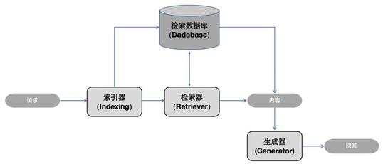
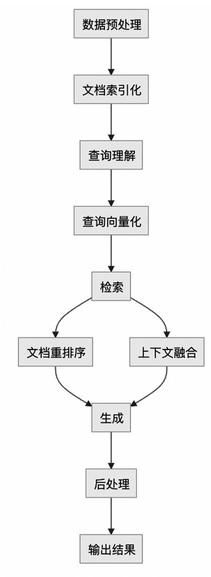

=+=+=+=+=+=+=+=+=
# 大模型检索增强生成(RAG)技术浅析

文 |国网思极网安科技(北京)有限公司 赵静 汤文玉 霍钰 傅金菲菲 乔芷琪

近年来,随着 \( \mathrm{A}2 \) 大模型的飞速发展,自然语言处理(NLP)领域也迎来了许多创新性的突破。其中, 检索增强生成(Retrieval-Augmented Generation, RAG)技术作为一种新兴的技术范式,受到了广泛关注和研究。本文将对RAG技术的基本概念、架构设计、应用及其优势进行详细探讨,并结合相关文献讲述其发展历程和未来研究方向。
=+=+=+=+=+=+=+=+=
## 一、基本概念与架构

检索增强生成是一种结合了信息检索和生成模型的技术,旨在通过引入外部知识库的信息来辅助大语言模型(Large Language Models, LLMs)生成更准确且符合上下文的答案。具体来说,当大模型需要生成文本或回答问题时,它会先从一个庞大的文档集合中检索出相关信息,然后利用这些检索到的信息来指导文本的生成。

RAG架构主要分为三个模块,如图1所示。

1)索引器(Indexing):索引是检索过程的基础,它将文本转换为向量表示并存储在向量数据库中,以便快速检索。高效的索引方法对于提升整体性能至关重要。

图1 RAG架构

2)检索器(Retriever):检索器负责从大规模文档集合中检索相关信息。常见的检索器包括基于向量的检索方法(如BM25、DPR)和深度学习检索方法。

3)生成器(Generator):生成器基于检索到的信息生成文本。大多数情况下,生成器采用先进的语言模型,如GPT系列模型,以确保生成内容的连贯性和准确性。
=+=+=+=+=+=+=+=+=
## 二、RAG的工作流程

RAG的工作流程是将信息检索技术与文本生成技术相结合,以提高生成文本的准确性和丰富性。RAG 工作流程如图2所示。

1)数据预处理(Data Preprocessing):对原始数据进行清洗,包括去除无关内容、格式化等。将数据转换为适合处理的格式,如文本数据的分词、去除停用词等。

2)文 档 索引化(Document Indexing) : 将处理后的数据分割成小块(Chunks), 以适应模型的输入要求。使用编码器 (如Transformer 的Encoder)将文本块转换为向量形式。建立索引,将文本块的向量存储在可检索的数据库中。

图2 RAG的工作流程

3) 查询理解 (Query Understanding) : 用户提出问题或请求,系统首先需要理解查询的意图。

4)查询向量化(Query Embedding):使用与索引阶段相同的编码器将用户查询转换为向量形式。

5)检索(Retrieval):利用查询向量在索引数据库中检索最相关的文档块。通常采用相似度度量 (如余弦相似度)来评估相关性。

6)文档重排序(Re-ranking):可选步骤,对检索到的文档块进行重排序,以优化结果的相关性。

7)上下文融合(Context Fusion):将检索到的文档块与原始查询结合,形成丰富的上下文信息。

8)生成(Generation):使用生成模型(如大型语言模型)根据融合后的上下文信息生成回答或文本。

9)后处理(Post-processing):对生成的文本进行语法检查、错误修正等,以提高文本质量。

10) 输出结果 (Result Output) : 将最终生成的文本作为回答输出给用户。
=+=+=+=+=+=+=+=+=
## 三、RAG的发展和分类

RAG的发展可以分为三个主要阶段:原始RAG (Naive RAG)、高级RAG(Advanced RAG)和模块化RAG (Modular RAG)。每个阶段都在不断改进模型的性能和适用范围。

原始RAG是RAG技术发展初期的一个基础形态, 它以一种相对简单直接的方式,结合了检索和生成两个步骤来增强语言模型的输出。Naive RAG的架构和流程相对简单,易于理解和实现,是RAG技术的起点。生成的回答质量在很大程度上依赖于检索阶段的效果,如果检索到的文本块与查询不够相关,可能会导致生成的回答质量下降。在生成阶段,如果检索到的多个文本块包含相似或重复的信息,可能会导致生成的回答中出现冗余内容。尽管Naive RAG存在一些局限性,但它为后续更高级的RAG技术发展奠定了基础,并且其简单性也使得它在一些应用场景下仍然具有一定的实用价值。

高级RAG是在Naive RAG的基础上发展起来的更高级的RAG技术范式。它通过引入更复杂的策略和技术来优化检索和生成过程,以提高整体性能和输出质量。高级 RAG在索引阶段进行了优化,可能会采用更细粒度的文本分块,例如基于句子或短语的分块, 以提高检索的精确度。在检索之前,高级RAG可能会对用户查询进行改写或扩展,以更好地匹配文档库中的内容。高级 RAG通过引入多种高级技术和策略,显著提高了RAG技术的性能和应用范围,使其在复杂的自然语言处理任务中更加有效和可靠。随着研究的深入,高级 RAG仍在不断发展,以解决更多的挑战和需求。
=+=+=+=+=+=+=+=+=
## (三)通过评价反馈,持续改进 实践教学

针对基于CIPP的计算机专业实践教学评价结果,专业建设工作小组将评价结果反馈给相关环节的负责人,如院校教学管理部门、专业负责人、实践教学课程组等,作为对院校实践教学制度修订、专业实践课程体系、实践课程内容、实践教学模式等各方面持续改进的依据。

专业建设工作小组收集各相关环节的反馈意见,从教育环境、资源配置、实施情况、实施效果整理出相关改进措施。从学校层面建立健全实践教学活动管理长效机制,根据管理机制定期对实践教学进行检查评估,根据反馈调整对实践教学活动的经费支持,确保实践教学的质量和效果。

表1 计算机科学与技术专业产教融合指标体系评价结果

<table><tr><td>一级指标</td><td>得分</td><td>二级指标</td><td>比例</td><td>得分</td></tr><tr><td rowspan="3">效果指标</td><td rowspan="3">74.4</td><td>学校效益</td><td>20%</td><td>71.56</td></tr><tr><td>教学成果应用</td><td>40%</td><td>61.56</td></tr><tr><td>学生发展</td><td>40%</td><td>88.65</td></tr><tr><td rowspan="3">过程指标</td><td rowspan="3">78.02</td><td>师生认知态度</td><td>15%</td><td>61.39</td></tr><tr><td>教学方法和考核方式</td><td>35%</td><td>77.56</td></tr><tr><td>学生学习情况</td><td>50%</td><td>83.34</td></tr><tr><td rowspan="4">资源配置</td><td rowspan="4">70.8</td><td>经费投入</td><td>30%</td><td>68.23</td></tr><tr><td>制度建设</td><td>10%</td><td>86.67</td></tr><tr><td>师资队伍</td><td>25%</td><td>70.56</td></tr><tr><td>实训基地</td><td>30%</td><td>80.08</td></tr><tr><td rowspan="3">保障措施</td><td rowspan="3">87.46</td><td>政策支持</td><td>65%</td><td>88.15</td></tr><tr><td>组织机构</td><td>25%</td><td>87.34</td></tr><tr><td>环境氛围</td><td>10%</td><td>83.24</td></tr></table>

四、小结

通过实施“两融一贯穿”实践教学和“四维融通”实践教学评价,不断优化和改进实践教学全过程,提高学生学习效果和实践能力,提升创新人才培养质量。近5年,河北工程大学计算机科学与技术专业毕业生工作与专业相关度较高,对工作具有较高的适应性,受到用人单位一致好评。涌现出一批优秀校友,就业于阿里巴巴、京东等代表性企业,毕业生为区域发展奠定了坚实的力量。

(上接72页)

模块化RAG是一种更灵活和高级的RAG技术范式,它通过将RAG技术分解为多个可替换和可组合的模块来增强其灵活性和适应性。模块化RAG将RAG 技术分解为多个独立的模块,每个模块负责特定的任务,如索引创建、检索、生成等。模块化RAG支持多任务学习和多模态检索,能够处理文本、图像、视频等多种类型的数据,并在多个任务上进行优化。模块化RAG的模块可以协同工作,通过模块间的交互和数据交换,实现更复杂的功能和更高效的处理。模块化 RAG通过其模块化设计,提供了一种灵活、可扩展且适应性强的RAG技术范式,使其在复杂的自然语言处理任务中更加有效和可靠。随着技术的不断发展,模块化RAG将继续在更多领域和任务中发挥重要作用。
=+=+=+=+=+=+=+=+=
## 四、未来展望

根据现状,未来针对RAG的研究可能会集中在以下几个方面:一是优化计算资源利用:通过算法优化和硬件加速技术,降低RAG模型的计算成本。二是实时信息更新:开发更高效的外部知识库更新机制,确保生成内容的时效性和准确性。三是跨模态应用: 探索RAG在图像、视频等多模态数据上的应用潜力。

检索增强生成技术作为一种前沿的大模型技术, 通过结合信息检索和生成模型的优势,显著提升了大语言模型的生成质量和理解能力。尽管检索增强生成技术仍面临一些挑战,但其广阔的应用前景和持续的技术进步,预示着其将在未来的自然语言处理领域发挥越来越重要的作用。
