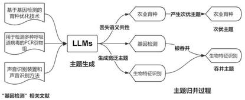
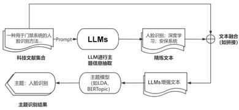
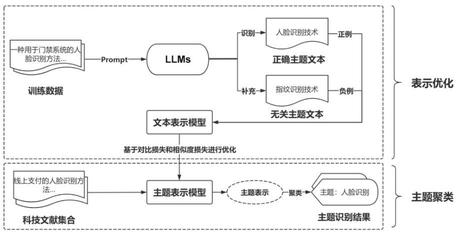
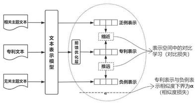
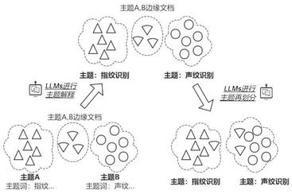
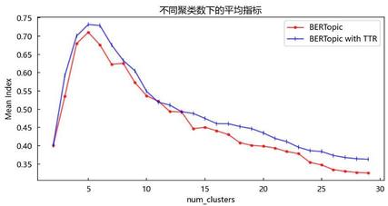
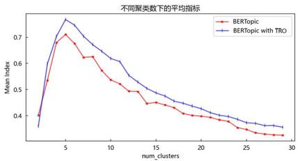

=+=+=+=+=+=+=+=+=
● 温晓波,姚长青,高影繁(中国科学技术信息研究所,北京 100038)

## 大语言模型增强的科技文献主题识别*

摘 要:[目的/意义] 为了将大语言模型 (Large Language Models, LLMs) 强大的分析能力运用于科技文献主题识别任务,解决 LLMs 在识别大量文献主题中存在的缺陷的同时提高主流主题识别方法在复杂科技文献主题识别中的性能,提出了使用LLMs增强主流主题识别的方法。[方法/过程] 在主题识别过程中利用LLMs的主题识别能力, 通过文本精炼、对比学习表示优化和主题解释与再划分的增强方式对主流主题识别方法LDA和BERTopic进行改进。[结果/结论] 在生物特征识别专利数据集中将 LDA 和 BERTopic 的识别效果相对增强前各平均提升了 20% 和 29.7%,其中增强后的 BERTopic 相较于完全基于LLMs的主题识别方法TopicGPT提升了36.7%。[局限] 未能充分探讨提示词工程和上下文学习对LLMs识别科技文献主题的提升效果,同时测试的模型与数据相对有限。

关键词:大语言模型；主题识别；科技文献；自然语言处理；对比学习

DOI: 10.16353/j. cnki. 1000-7490. 2025. 09. 020

引用格式:温晓波,姚长青,高影繁. 大语言模型增强的科技文献主题识别 [J]. 情报理论与实践,2025,48 (9): 185-193.

# LLM-Enhanced Topic Identification for Scientific and Technical Literature

Wen Xiaobo, Yao Changqing, Gao Yingfan

(Institute of Science and Technical Information of China, Beijing 100038)

Abstract: [Purpose/significance] To harness the powerful analytical capabilities of Large Language Models (LLMs) for the task of topic identification in scientific and technical literature, this study aims to address the deficiencies encountered by LLMs when identifying topics in numerous literature. Furthermore, it seeks to enhance the performance of conventional topic identification methods in the context of complex scientific and technical literature. Consequently, a novel approach is proposed that leverages LLMs to augment mainstream topic identification methods. [Method/process] In the process of topic identification, improvements are made to mainstream topic identification methods such as LDA and BERTopic by leveraging the topic recognition capabilities of LLMs. This is achieved through text refinement, representation optimization by contrastive learning, and topic interpretation and realignment. [Result/conclusion] In the biometric recognition patent dataset, the recognition performance of LDA and BERTopic was enhanced by an average of \( {20}\% \) and \( {29.7}\% \) , respectively, compared to their performance before enhancement. Notably, the enhanced BERTopic outperformed the fully LLMs-based topic recognition method, TopicGPT, by 36.7%. [Limitations] The effects of prompt engineering and contextual learning on the enhancement of LLMs’ ability to identify topics in scientific and technical literature have not been thoroughly explored, and the models and data tested are limited.

Keywords: large language models; topic identification; scientific and technical literature; natural language processing; contrastive learning

## 0 引言

主题识别, 也可称为主题建模 (Topic Modeling), 旨在从非结构化文档集合中, 基于语义结构与内容发现潜在主题 \( {}^{\left\lbrack  1\right\rbrack  } \) 。大数据时代下,海量科技文献的情报挖掘成为一项重要且困难的任务, 而主题识别在其中作为一项重要方法得到了广泛运用 \( {}^{\left\lbrack  2\right\rbrack  } \) 。然而,现有的主题识别方法存在着诸如辨识度低 \( {}^{\left\lbrack  3\right\rbrack  } \) 、稳定性弱 \( {}^{\left\lbrack  4\right\rbrack  } \) 和语义表示能力不足 \( {}^{\left\lbrack  5\right\rbrack  } \) 的问题。

近年来,大语言模型(Large Language Models, LLMs, 以下简称 “大模型” )凭借惊人的自然语言处理能力引发关注, 成为当下人工智能领域最为瞩目的发展方向之一。大模型凭借巨量参数与算力从大规模训练数据中学习得到的文本理解能力与知识, 为解决现有主题识别方法的不足提供了新的契机。已有的基于大模型的主题识别方式在通用领域表现良好, 但在科技情报分析这一专业垂直场景中受到诸多限制。主题识别的关键在于发现大量文档的语义共性, 而现有的大模型主题识别方案大多在单篇文档上进行主题生成,随后逐层识别归并得到文档集合主题, 这一模式缺乏对文档集合的全局性考虑。同时, 在科技情报领域, 文本中的信息密度大、组织难度高, 从单篇文档中直接构建主题将面临颗粒度混杂、主题归并偏差等问题。

---

* 本文为新一代人工智能国家科技重大专项 “面向复杂信息流的科技文献大模型增量构建”的成果,项目编号:2023ZD0121501。

---

本文着眼于大模型对科技文献主题识别的增强方式, 提出基于大模型增强主题识别的方法, 以传统的主题模型与聚类方法为基础, 在主题识别的全流程中使用大模型进行增强, 为大模型在智能情报挖掘中的运用提供新的思路。

## 1 相关研究
=+=+=+=+=+=+=+=+=
### 1.1 传统主题识别

主题识别通常被认为脱胎于 20 世纪 90 年代的潜语义索引 (Latent Semantic Indexing, LSI) \( {}^{\left\lbrack  6\right\rbrack  } \) ,在概率潜在语义索引 (Probabilistic Latent Semantic Indexing, PLSI) \( {}^{\left\lbrack  7\right\rbrack  } \) 中得到重要发展, 成熟于潜狄利克雷分布模型 (Latent Dirichlet Allocation, LDA) \( {}^{\left\lbrack  8\right\rbrack  } \) 的出现。以LDA模型为代表的众多基于生成式概率假设、依靠统计推断方法进行参数估计的主题识别方法被称为概率主题模型 (Probabilistic Topic Models)。这类较为经典的主题识别方法长期在科技情报领域中有着广泛应用 \( {}^{\left\lbrack  9 - {11}\right\rbrack  } \) ,但存在辨识度低 \( {}^{\left\lbrack  3\right\rbrack  } \) 、稳定性弱 \( {}^{\left\lbrack  4\right\rbrack  } \) 的问题。深度学习的兴起推动了神经主题模型 (Neural Topic Models) 的诞生, 深度神经网络或被广泛用于主题模型的参数估计 \( {}^{\left\lbrack  {12} - {13}\right\rbrack  } \) ,或通过文本嵌入增强主题模型的语义能力 \( {}^{\left\lbrack  {14} - {15}\right\rbrack  } \) 。经典的概率主题模型与神经主题模型普遍采纳文档的生成式假说, 基于文档的词袋表示进行建模,因此往往在语义表示能力上欠佳 \( {}^{\lbrack 5\rbrack } \) 。

主题识别方法在一定程度上扮演着聚类的角色, 主题相近的文档可以构成相似文档的聚类簇, 同理聚类簇也可以视作潜在主题。在深度学习时代尤其是大规模预训练模型兴起后, 表示模型的不断发展使得基于文本表示与聚类算法的主题识别方法开始流行。S. Sia 等 \( {}^{\left\lbrack  {16}\right\rbrack  } \) 较早地采用了聚类方法进行潜在主题识别, 基于多种预训练文本表示方法进行聚类, 并利用聚类簇中心附近的词汇来表征主题。 在此基础上, Grootendorst \( {}^{\left\lbrack  5\right\rbrack  } \) 提出 BERTopic,利用 Sentence-BERT \( {}^{\left\lbrack  {17}\right\rbrack  } \) 进行文本表示并在聚类簇中依据 cTF-IDF 权值选取主题词以进行主题表示。 在科技情报领域中, 利用文本表示与聚类算法进行主题识别也是一种流行的方式 \( {}^{\left\lbrack  {18} - {20}\right\rbrack  } \) 。然而,聚类算法受到文本表示能力的限制, 文本表示是否能够充分地、有针对性地揭示文档中的主题信息在较大程度上影响主题识别的效果。

图 1 大模型自行生成与归并科技主题的过程

Fig. 1 The process of LLMs autonomously generating and synthesizing scientific topics
=+=+=+=+=+=+=+=+=
### 1.2 基于大模型的主题识别

自 2022 年 11 月 OpenAI 公司推出聊天程序 “ChatGPT” 后,其突出的对话能力在社会各界掀起了大模型热潮。大模型(如 \( {\mathrm{{GPT}}}^{\left\lbrack  {21}\right\rbrack  } \) 、 \( {\mathrm{{LLaMa}}}^{\left\lbrack  {22}\right\rbrack  } \) )基于Transformer \( {}^{\left\lbrack  {23}\right\rbrack  } \) 架构,得益于指令微调与基于人类反馈的强化学习等技术手段 \( {}^{\lbrack {24}\rbrack } \) ,凭借海量参数、训练数据和算力涌现出极强的自然语言处理能力 \( {}^{\left\lbrack  {21}\right\rbrack  } \) 。许多研究已经开始尝试将大模型运用于主题识别或文本聚类任务当中。

在主题识别方面, 大模型可以用于完善识别结果, 如 Stammbach 等 \( {}^{\left\lbrack  {25}\right\rbrack  } \) 尝试利用 ChatGPT 等模型自动评估主题一致性, 并根据其标注的文档标签设置合适的主题数量; Rijcken 等 \( {}^{\left\lbrack  {26}\right\rbrack  } \) 、张凯等 \( {}^{\left\lbrack  {27}\right\rbrack  } \) 使用大模型对 LDA、BERTopic 模型的主题识别结果进行评价与解读; Chang 等 \( {}^{\left\lbrack  {28}\right\rbrack  } \) 则直接利用大模型对文档主题识别结果进行进一步细化与挖掘。大模型也可以直接用于主题生成。如 Pham 等 \( {}^{\left\lbrack  {29}\right\rbrack  } \) 、 Wang 等 \( {}^{\left\lbrack  {30}\right\rbrack  } \) 和Mu等 \( {}^{\left\lbrack  {31}\right\rbrack  } \) 基于提示工程使用大模型直接生成并识别文档主题,其方法可以分为以下三个阶段。①生成阶段:依靠大模型对输入的文档进行主题生成。②归并阶段:由大模型将相似的标注主题进行合并。③标注阶段:生成文档集合的最终主题列表后由大模型据此对文档进行主题标注。 完全由大模型主导的主题生成虽然在通用领域中表现良好, 但是在更为复杂的科技文献中存在颗粒度难以控制、 生成主题不合理等问题。这是因为在最开始的生成主题阶段, 大模型能处理的文本长度受限, 模型所能接收的文档数量有限, 难以有效概括出大量文档中的潜在共性, 易陷入局部最优的困境。而在随后的主题归并阶段, 即便输入的多个相似主题提供了一定的全局视野, 但文献间的语义共性在生成阶段的缺失依旧将导致次优的主题归并结果, 同时宽泛主题存在 “吞并” 具体主题的风险 (见图 1)。 传统主题模型如 LDA、BERTopic 等则通常直接在大量文档中探索语义共性, 相比大模型更易获得文献集的全局视野。

在文本聚类方面, 大模型能够以多种方式提升聚类效果,如 Viswanathan 等 \( {}^{\left\lbrack  {32}\right\rbrack  } \) 使用大模型对短语进行文本扩充以丰富语义信息来提升短语聚类效果, 同时在聚类结果中由大模型对聚类簇边缘数据重新进行划分以优化聚类结果; Zhang 等 \( {}^{\left\lbrack  {33}\right\rbrack  } \) 则利用大模型挖掘相似与不相似文本,在此基础上优化文本嵌入从而改善聚类结果。这些使用大模型提升聚类效果的方法对主题识别的改进具有重要的参考意义。

## 2 基于大模型的主题识别增强方法
=+=+=+=+=+=+=+=+=
### 2.1 主题文本精炼

大模型在单篇文献中具有出色的信息提取能力, 然而在科技文献主题识别任务中, 却难以全面分析文献集合, 并在此基础上归纳文献集合中的语义共性形成合理主题划分。相比之下,已有的主流主题识别方法如 LDA、BER-Topic 能够从大量文献中分析归纳语义共性(依靠直接在大量文献上进行的统计推断、聚类等方法)以提供主题划分, 但是却不能确保从单篇文献中提取到最符合主题识别需求的语义信息。在科技文献主题识别任务中, 大模型与现有主流主题识别方法之间是互补的。

为精确地从单篇文献中提取主题信息, 本文使用大模型对原始文献进行主题文本精炼(Topic Text Refinement, TTR)并据此增强主题识别的方法 (见图 2)。具体包括以下两个主要步骤。

图 2 文本精炼增强主题模型过程

Fig. 2 Enhancing the topic modeling process through topic text refinement

1)将原始文本输入大模型, 通过提示词使其分析并精炼得到原始文本中符合用户需求的主题信息 \( {}^{\left\lbrack  {34} - {35}\right\rbrack  } \) 。提示词示例见表 1。

图3 优化表示模型并生成主题过程

Fig. 3 The process of optimizing representation model and generating topic for new literature

2)将大模型精炼后的文本用于增强原始文本, 进而作为输入提升 LDA 或 BERTopic 的主题识别效果。

大模型的文本精炼过程可以通过提示词进行控制, 提示策略灵活可控, 可根据具体需求而定, 同时精炼文本可以通过多种方法增强原始文本, 如文本拼接 (本文选用)、 向量拼接。

表 1 文本精炼Prompt示例

Tab. 1 Examples of text refinement prompts

<table><tr><td>文本精炼方法</td><td>Prompt 示例</td></tr><tr><td>主题词精炼 (本文选用)</td><td>请为该专利精炼总结出最恰当 的 5 ~ 10 个技术主题词:|专利|</td></tr><tr><td>主题描述精炼</td><td>请为该专利精炼总结其涉及的 技术主题内容:|专利\}</td></tr><tr><td>特定主题信息精炼</td><td>请为该专利分析可能的应用领 域与应用场景:\{专利\}</td></tr></table>
=+=+=+=+=+=+=+=+=
### 2.2 表示模型优化

基于聚类的主题识别如 BERTopic, 往往使用大规模预训练语言模型作为文本表示模型。这些模型在预训练阶段通常使用 MLM (Masked Language Modeling) \( {}^{\left\lbrack  {36}\right\rbrack  } \) 、NSP (Next Sentence Prediction) 等任务进行训练吗, 为提升语义判别能力,对比学习也被用于优化预训练表示模型 \( {}^{\lbrack {37}\rbrack } \) 。 预训练过程并不直接针对主题识别任务, 能够反映文献主题的语义信息与其他语义信息在输出中被混合为单个向量,关注特定主题信息 \( {}^{\left\lbrack  {38} - {39}\right\rbrack  } \) 时,混合语义向量未必符合需求 \( {}^{\left\lbrack  {40}\right\rbrack  } \) 。对于作为下游任务的主题识别,需要对表示模型进行定向优化。

定向优化需要特定的监督信号, 而主题识别是具备探索性的无监督任务, 通常缺乏监督信息。本文提出基于大模型输出进行对比学习以优化表示模型(Topic Representation Optimization, TRO) 的方法 (见图 3)。具体包括以下步骤。

1)大模型对文献中符合需求的主题信息进行提取, 形成主题文本, 与原始文本构成相似样本对, 并输出无关主题构成不相似样本对, 无关主题可由大模型从待选主题中选取或自行生成。

2)进行对比学习 (见图 4), 提升相似样本对的相似度、降低不相似样本对的相似度, 以此定向优化表示模型,使之能定向提取主题语义。

图4 优化表示模型过程

Fig. 4 The training process of topic representation optimization

3)运用优化后得到的主题表示模型对科技文献进行聚类主题识别。

预训练文本表示通常具备足够信息, 因此冻结表示模型的参数, 只训练额外的前馈优化层从原始编码中提取主题信息, 并降低复杂模型在少量微调数据中的过拟合风险。在训练中将专利文本、相关主题与无关主题三者的文本表示用于计算 InfoNCE 对比损失 \( {}^{\left\lbrack  {41}\right\rbrack  } \) ,见公式 (1):

\[
{L}_{\text{InfoNCE }} =  - \frac{1}{N}\mathop{\sum }\limits_{{i = 1}}^{N}\log \left\{  \frac{\exp \left\lbrack  \frac{\operatorname{sim}\left( {{\mathbf{p}}_{i},{\mathbf{t}}_{i}}\right) }{\tau }\right\rbrack  }{\mathop{\sum }\limits_{{{t}_{j} \in  M}}\exp \left\lbrack  \frac{\operatorname{sim}\left( {{\mathbf{p}}_{i},{\mathbf{t}}_{j}}\right) }{\tau }\right\rbrack  }\right\}   \tag{1}
\]

式中, \( {p}_{i},{t}_{i} \) 分别是专利文本表示与正确主题表示; \( M = \) \( \left\{  {{t}_{l},..,{t}_{i},..,{t}_{m}}\right\} \) 是正例表示 \( {t}_{i} \) 与大模型输出负例的表示集合; \( \operatorname{sim}\left( {x, y}\right) \) 是向量 \( x \) 与向量 \( y \) 的相似度,本文中为余弦相似度; \( \tau \) 为温度系数。考虑到负样本对并非绝对不相似,为避免其相似度下降幅度过大导致部分语义识别能力丢失, 引入超参数 \( \alpha \) 约束负样本对相似度的下界,计算相似度损失以平滑训练过程, 见公式 (2):

\[
{L}_{\operatorname{sim}} = \frac{1}{N\left( {m - 1}\right) }\mathop{\sum }\limits_{{i = 1}}^{N}\mathop{\sum }\limits_{{{t}_{j} \in  M, j \neq  i}}{\left\lbrack  \alpha  - \operatorname{sim}\left( {p}_{i},{t}_{j}\right) \right\rbrack  }^{2} \tag{2}
\]

对比损失与相似度损失之和即为表示优化中的损失, 见公式 (3):

\[
\text{Loss} = {L}_{\text{InfoNCE }} + {L}_{\text{sim }} \tag{3}
\]

文本精炼与表示优化方法存在一定的不兼容性: 二者在对大模型的利用上存在重合,大模型输出的主题信息是前者主题识别的依据, 也是后者定向优化的方向；二者的主题识别对象不同,前者的识别对象是增强文本, 后者的识别对象是文献原文; 前者需要反复调用大模型, 而后者仅依靠部分输出的信息进行优化, 成本相对更低的同时效率更高。
=+=+=+=+=+=+=+=+=
### 2.3 主题解释与再划分

相较于过往方法依赖高权重主题词 \( {}^{\left\lbrack  1\right\rbrack  } \) 、聚类中心附近的词汇 \( {}^{\left\lbrack  {16}\right\rbrack  } \) 或类簇内文献集中的关键词 \( {}^{\left\lbrack  5\right\rbrack  } \) 对生成主题进行解释。大模型可利用文本精炼信息自动对生成主题进行解释 (见图5)。

通过生成的主题标签, 大模型可以对文档主题进行再划分 (Topic Realignment, TR), 即重新进行主题分类任务, 提高主题划分的精确度。 为提高效率, 在利用大模型进行主题再划分时, 只针对主题分配不确定性较高的文献进行重新划分, 其中不确定性主要通过信息熵进行度量, 并将信息熵最高的 15% 文献输入大模型进行主题再划分。以随机变量 \( X \) 表示文档对每个主题的概率分布, 则其信息熵计算见公式 (4):

\[
H\left( X\right)  = \mathop{\sum }\limits_{{x \in  X}} - p\left( x\right) \log \left\lbrack  {p\left( x\right) }\right\rbrack   \tag{4}
\]

## 3 实验结果与分析
=+=+=+=+=+=+=+=+=
### 3.1 实验数据

本文以生物特征相关专利构建科技文献主题识别实验数据集。具体而言, 根据国家知识产权局发布的人工智能专利分类体系 \( {}^{\lbrack {42}\rbrack } \) ,挑选了二级分类 “生物特征识别” 下的 5 个三级技术分支, 并根据相关分类号与关键词在国知局专利系统中进行检索, 每个技术分支随机选取 400 条专利 (技术分支之间无重叠专利),共计 2000 条相关专利(见表 2)。使用专利标题与摘要构建数据集, 以技术分支作为真实主题标签。对于表示模型优化方法, 随机选取 1000 条数据作为训练数据, 余下 1000 条作为测试集。本数据集选取的 5 个技术分支属于相同二级分类, 文献集合内部语义相似性较大, 这要求主题模型能够根据文献集分布归纳出更细微的整体结构, 更能体现主题模型对复杂科技文献中的主题结构识别能力, 因此不再补充更多其他技术类别的专利(如此将增大数据集内部差异,降低主题识别难度)。

图5 主题解释与再划分过程

Fig. 5 The process of Topics Interpretation and Realignment

表 2 生物特征识别技术分支

Tab. 2 The branches of biometric recognition technology

<table><tr><td>技术分支名称</td><td>专利分类号</td><td>关键词概述</td></tr><tr><td>指纹识别</td><td>G06K9*、G06F21/32、G06V40/12、G06V40/13、G07C9/00、G07C9/25、G07C9/37、H04L9/40</td><td>指纹输入、指纹提取等</td></tr><tr><td>人脸识别</td><td>G06K9*、G06F21/32、G06V40/16、G07C9/00、G07C9/25、G07C9/37、H04L9/40</td><td>面部捕获、面部提取等</td></tr><tr><td>声纹识别</td><td>G06F21/32、G10L15*、G10L17*、G10L25*、H04L9/40</td><td>声音识别、声纹辨认等</td></tr><tr><td>DNA识别</td><td>C07K*、C12Q*、G01N33*、G06F21/32、G16B*、H04L9/40</td><td>DNA 检测、DNA 编解 码等</td></tr><tr><td>行为特征识别</td><td>B60W40/08、B60W40/09、G06F3/01、G06F21/32、G06K9*、G06V20/40、G06V20/59、 G06V40/20</td><td>动作捕捉、动作识别等</td></tr></table>
=+=+=+=+=+=+=+=+=
### 3.2 实验设置

3.2.1 主题识别任务 以 LDA、BERTopic 作为待增强的主题识别方法。其中, BERTopic 使用 BAAI 开发的开源模型 BGE-M3 \( {}^{\left\lbrack  {43}\right\rbrack  } \) 作为文本表示模型。为对比完全基于大模型的主题识别方法在科技文献集中的性能,选取 TopicGPT \( {}^{\left\lbrack  {29}\right\rbrack  } \) 作为对照方法, 在主题合并阶段分别采用两种策略: ①采用原始策略, 选取相似度大于 0.7 的主题对进行迭代归并; ②为增强全局视野,将主题分批次直接输入大模型进行迭代整合, 并选择最终性能更佳的主题划分作为 TopicGPT 的测试结果。选用 Deepseek-V3 \( {}^{\left\lbrack  {44}\right\rbrack  } \) 作为主题识别中使用的大模型, DeepSeek-V3是拥有 671B 参数的开源混合专家 (Mixture of Experts, MoE) 大模型, 推理速度快且性能优异。

实验中, LDA 利用 jieba 分词器进行分词并去停用词后的词袋表示进行主题识别, 采用 Gensim 库封装的 LDA 模型进行实现, 预设主题个数根据困惑度由肘部法则确认,同时考虑到 LDA 模型稳定性欠佳 \( {}^{\left\lbrack  4\right\rbrack  } \) ,相关评估指标取重复 10 次运行后的平均值。BERTopic 模型使用 UMAP 算法将文本表示降维后由 HDBSCAN 算法进行聚类 \( {}^{\left\lbrack  5\right\rbrack  } \) ,聚类数由算法自动确定, 相关参数设置见表 3 。大模型增强时, 预处理方法与参数设置不变, 加入精炼文本进行 LDA 建模与 BERTopic 聚类, 同时后者按表 4 中参数设置在训练集上优化文本表示, 在测试集中进行主题识别。初步增强后, 利用主题词由大模型进行解释并构建主题标签, 最终进行主题再划分。

表 3 LDA与BERTopic部分参数设置

Tab. 3 Hyper parameters settings in LDA and BERTopic

<table><tr><td>模型</td><td>超参数</td><td>设置</td><td>备注</td></tr><tr><td rowspan="3">LDA</td><td>num_topics</td><td>5</td><td>主题数</td></tr><tr><td>passes</td><td>100</td><td>迭代次数</td></tr><tr><td>chunksize</td><td>2000</td><td>单次训练使用文档数</td></tr><tr><td rowspan="5">BERTopic</td><td>n_neighbors</td><td>15</td><td>邻近点数量</td></tr><tr><td>n_components</td><td>2</td><td>降维后维度</td></tr><tr><td>metric</td><td>欧氏距离</td><td>距离度量</td></tr><tr><td>min_dist</td><td>0.1</td><td>嵌入点最小距离</td></tr><tr><td>min_cluster_size</td><td>5</td><td>最小类簇大小</td></tr></table>

表 4 表示优化训练部分超参数

Tab. 4 Hyperparameters settings in Representation Optimization

<table><tr><td>超参数</td><td>设置</td><td>备注</td></tr><tr><td>num_layers</td><td>3</td><td>线性层层数</td></tr><tr><td>input_dim</td><td>1024</td><td>输入维度</td></tr><tr><td>output_dim</td><td>1024</td><td>输出维度</td></tr><tr><td>batch_size</td><td>100</td><td>批次大小</td></tr><tr><td>epoch</td><td>10</td><td>训练轮次</td></tr><tr><td>\( \tau \)</td><td>0.05</td><td>温度系数</td></tr><tr><td>\( \alpha \)</td><td>0.25</td><td>负样本相似度阈值</td></tr></table>

3.2.2 指标 为客观对比主题识别结果, 使用有真实主题标签的专利数据作为测试集。在此基础上沿用 Pham 等 \( {}^{\left\lbrack  {29}\right\rbrack  } \) 使用的评估指标 \( \left( {P}_{1}\right. \) 、 \( \left. {{A}^{2}\mathrm{A}\mathrm{R}\mathrm{I}\text{和}\mathrm{N}\mathrm{M}\mathrm{I}}\right) \) ,对识别结果进行定量评估。

\( {P}_{1} \) 计算方式见公式 (5) \( \sim \) 公式 (7):

\[
\operatorname{Precision}\left( {{\omega }_{j},{c}_{i}}\right)  = \left( \frac{\left| {c}_{i} \cap  {\omega }_{j}\right| }{\left| {\omega }_{j}\right| }\right)  \tag{5}
\]

\[
F\left( {{\omega }_{j},{c}_{i}}\right)  = \frac{2 * \operatorname{Precision}\left( {{\omega }_{j},{c}_{i}}\right)  \times  \operatorname{Precision}\left( {{c}_{j},{\omega }_{i}}\right) }{\operatorname{Precision}\left( {{\omega }_{j},{c}_{i}}\right)  + \operatorname{Precision}\left( {{c}_{j},{\omega }_{i}}\right) } \tag{6}
\]

\[
{P}_{1}\left( {\Omega , C}\right)  = \mathop{\sum }\limits_{k}\frac{\left| {\omega }_{k}\right| }{N}\mathop{\max }\limits_{i}\left\lbrack  {F\left( {{\omega }_{k},{c}_{i}}\right) }\right\rbrack   \tag{7}
\]

式中, \( \Omega \text{、}C \) 为同一数据集的两种分组方式; \( {\omega }_{i}\text{、}{c}_{j} \) 分别为 \( \Omega \) 、 \( C \) 中分组组别为 \( i \) 和 \( j \) 的数据集合; \( {P}_{1} \) 用于评估分组的相似程度,取值范围为 \( (0,1\rbrack \) ,值越高两种分组越相似。

调整兰德系数 (Adjusted Rand Index, ARI) 计算方式见公式 (8) ～公式 (9):

\[
\mathrm{{RI}} = \frac{\mathrm{{TP}} + \mathrm{{TN}}}{{C}_{N}^{2}} \tag{8}
\]

\[
\mathrm{{ARI}} = \frac{\mathrm{{RI}} - \operatorname{Excepted}\left( \mathrm{{RI}}\right) }{\max \left( \mathrm{{RI}}\right)  - \operatorname{Excepted}\left( \mathrm{{RI}}\right) } \tag{9}
\]

式中, TP 为同一类簇中真实类别相同的数据对数目; TN 为不同类簇中真实类别也不同的数据对数目; \( {C}_{N}^{2} \) 为数据点对的总数目。ARI 常用于对比聚类与真实分组的相似度,取值范围为 \( \left\lbrack  {-1,1}\right\rbrack \) ,越高越好。

归一化互信息(Normalized Mutual Information, NMI),计算方式见公式 (10) \( \sim \) 公式 (11):

\[
I\left( {X, Y}\right)  = H\left( X\right)  + H\left( Y\right)  - H\left( {X, Y}\right)  \tag{10}
\]

\[
\operatorname{NMI}\left( {X, Y}\right)  = \frac{2 \times  I\left( {X, Y}\right) }{H\left( X\right)  + H\left( Y\right) } \tag{11}
\]

式中, \( H\left( X\right) \) 为随机变量 \( X \) 的信息熵; NMI 的意义与 \( {P}_{1} \) 、 ARI相似,取值范围为 \( \left\lbrack  {0,1}\right\rbrack \) ,越高越好。
=+=+=+=+=+=+=+=+=
### 3.3 实验结果

3.3.1 对比测试结果 测试集中, 在利用大模型增强后, LDA 在 \( {P}_{1} \) 、ARI 和 NMI 三个指标上分别最大取得了 7.9%、30.5% 和 29.3% 的相对提升,平均指标提升了 20%；相比增强前, BERTopic 在三个指标上分别最大取得了 23.5%、62.8% 和 14.1% 的相对提升,平均指标提升了 29.7%(见表 5)。其中,增强后的 BERTopic 模型较 TopicGPT 平均指标提升了 36.7% 的同时, 对大模型调用更少,成本更低。 在有误差的主题标签上无法得到较优结果。

表 5 主题识别测试结果

Tab. 5 The results of Topic Identification

<table><tr><td>增强方式</td><td colspan="4">LDA</td><td colspan="4">BERTopic</td><td colspan="4">TopicGPT</td></tr><tr><td>指标</td><td>\( {P}_{1} \)</td><td>ARI</td><td>NMI</td><td>主题数</td><td>\( {P}_{1} \)</td><td>ARI</td><td>NMI</td><td>主题数</td><td>\( {P}_{1} \)</td><td>ARI</td><td>NMI</td><td>主题数</td></tr><tr><td>无</td><td>0.63</td><td>0.36</td><td>0.41</td><td>5</td><td>0.68</td><td>0.43</td><td>0.64</td><td>3</td><td>0.65</td><td>0.41</td><td>0.60</td><td>10</td></tr><tr><td>TTR</td><td>0.67</td><td>0.44</td><td>0.49</td><td>5</td><td>0.81</td><td>0.67</td><td>0.71</td><td>5</td><td>-</td><td>-</td><td>-</td><td>-</td></tr><tr><td>TTR+TR</td><td>0.68</td><td>0.47</td><td>0.53</td><td>5</td><td>0.84</td><td>0.70</td><td>0.73</td><td>5</td><td>-</td><td>-</td><td>-</td><td>-</td></tr><tr><td>TRO</td><td>-</td><td>-</td><td>-</td><td>-</td><td>0.69</td><td>0.45</td><td>0.67</td><td>3</td><td>-</td><td>-</td><td>-</td><td>-</td></tr><tr><td>TRO+TR</td><td>-</td><td>-</td><td>-</td><td>-</td><td>0.69</td><td>0.42</td><td>0.63</td><td>3</td><td>-</td><td>-</td><td>-</td><td>-</td></tr></table>

表 6 TopicGPT生成的最终主题

Tab. 6 Final Topics generated by TopicGPT

<table><tr><td>归并 策略</td><td>主题</td></tr><tr><td>(1)</td><td>基因与分子技术, 行为与情绪分析, 广告与精准投放, 不境与生物监测, 深度学习与特征提取, 动植物研究与 育种,生物特征识别与安全,法医与遗传技术...</td></tr><tr><td>(2)</td><td>基因检测与分析, 行为识别与分析系统, 智能交通与 车辆管理系统,农业与生物技术,医疗与健康监测系 统...</td></tr></table>

表示优化后的模型依旧趋向于生成较少的主题, 这主要是因为优化模型的训练数据存在不足: 训练数据数量较少,且大模型生成的部分主题文本不够全面。这导致主题无法进一步细分, 不合理的主题数使得主题再划分难以发挥作用。

生成的主题词对主题解释与再划分影响较大。原始 LDA 因其不稳定性、辨识度低,不利于主题解释。如表 7 所示, “指纹识别” “人脸识别” 两个主题相互混杂, 经增强后主题信息更为精确, 生成主题更加合理 (见表 8)。BERTopic 根据 c-tf-idf 算法从精炼文本中选取的主题词则较从原始文本中选取的主题词更为清晰明确(见表 9)。

## 4 结论与展望

本文深入分析了传统主题模型和近年来基于大模型的主题模型各自在科技文献领域中的优势与不足, 发现传统主题模型擅长在文献集全局视角下识别主题结构而在单篇

在 BERTopic 测试中, 聚类数对识别效果影响较大, 而实践场景中由于参数设置、用户需求等因素, 主题数存在不确定性。为全面对比增强方法的效果, 通过使用 K-Means 聚类算法, 保持聚类数一致并对比增强前后指标平均值,其结果如图 6~图 7 所示。证明本文提出的增强方法在各种设置下都能提升 BERTopic 的主题划分效果。

图 6 BERTopic 文本精炼前后效果对比

Fig. 6 Comparison of performance before and after TTR for BERTopic

3.3.2 结果分析 测试结果表明, 大模型的增强能够使 LDA 和 BERTopic 的科技文献主题识别结果得到较大的优化。 文本精炼使 LDA 建模过程中无关词影响下降, 最终性能得到提升; 文本精炼得到的主题信息能够使 BERTopic 更为精确地识别出文献主题的分布情形, 识别效果更为优异, 并且表现出比预设真实主题数更佳的识别效果 (见图 6)。Top-ieGPT在缺乏全局视野的情况下,尽管借助了大模型出色的主题分析能力, 但依旧难以控制主题划分颗粒度 (见表 6)。

图 7 BERTopic 表示优化前后效果对比

Fig. 7 Comparison of performance before and after TRO for BERTopic

表 7 LDA 生成的部分低辨识度主题

Tab. 7 Some ambiguous topics generated by LDA

<table><tr><td>主题</td><td>LDA 主题词</td><td>大模型解释</td></tr><tr><td>A</td><td>识别, 连接, 指纹, 装置, 智能, 控 制, 安装, 面部, 摄像头, 指纹识别</td><td>智能生物识别 技术</td></tr><tr><td>B</td><td>信息,检测,指纹,用户,行为,人 脸,识别,数据,采集,图像</td><td>用户生物特征 识别</td></tr></table>

表 8 LDA增强后生成的主题

Tab. 8 Topics generated by LDA with TTR

<table><tr><td>主题</td><td>LDA 主题词</td><td>大模型解释</td></tr><tr><td>A</td><td>检测,识别,面部,人脸,行为,人 脸识别, 图像, 情绪, 监控, 安全</td><td>人脸识别与情 绪检测</td></tr><tr><td>B</td><td>指纹, 指纹识别, 身份, 信息, 识别, 身份验证, 安全, 认证</td><td>指纹识别与认 证技术</td></tr><tr><td>C</td><td>动作, 识别, 视频, 姿态, 人体, 图 像, 检测, 数据, 手势</td><td>行为动作识别</td></tr></table>

表 9 BERTopic 依据精炼文本生成的主题

Tab. 9 Topics generated from Refined Text by BERTopic

<table><tr><td>主题</td><td>主题词</td><td>大模型解释</td></tr><tr><td>A</td><td>语音识别,声音识别,声学模型,语音 处理, 语音信号, 特征提取, 语音特征提 取, 声音分析, 语音数据, 语音特征</td><td>语音识别 技术</td></tr><tr><td>B</td><td>PCR 扩增, 分子生物学, 引物, 基因组, 基因分型,基因鉴定,荧光定量 PCR,基 因工程, 分子标记</td><td>基因检测 技术</td></tr><tr><td>C</td><td>人脸识别,面部识别,身份验证,动作 识别, 指纹验证, 人脸检测, 图像处理, 身份认证, 安全管理</td><td>身份验证 技术</td></tr></table>

文档上语义提取与表示能力不足,大模型擅长分析单篇文档中的语义信息却难以基于全局视角识别文献集的主题结构。在此基础上, 提出了通过大模型在输入阶段进行文本精炼、识别阶段对文本表示进行定向优化和主题生成后进行主题解释与再划分三种方式增强科技文献领域主题识别的方法, 并在生物特征识别技术主题识别实验中证明了经大模型增强的方法较传统主题识别方法与纯大模型方法普遍更具优势。 这一方法将传统主题模型的文献全局视野与大模型的信息提取分析能力结合互补, 故能提升现有主题模型在科技文献主题识别中的效果, 尤其是其中表示优化方法能够通过学习大模型输出的主题信息,将其主题信息提取能力蒸馏至轻量化的表示优化模块中,实现低成本且高效的主题识别增强。

本研究在以下方面存在不足:①没有充分探索提示词工程、上下文学习等方法对大模型增强效果的提升空间； ②表示模型训练数据较少,且质量上缺乏控制,此外对比训练中增加负样本相似度下界对抑制过拟合效果这一机制没有得到充分的探讨；③测试实验中使用的数据与模型有限,尤其是对大模型的主题识别能力挖掘不够深入,导致大模型的输出不能完全满足主题识别的需求。

本研究将在以下方面进行完善:①通过提示词工程探索更为优良的文本精炼、主题标注方式并进行测试比较；②增加更多优质训练数据,探索并进一步改进表示模型优化的方法, 同时采用更合理可靠的主题数设置方法; ③通过指令微调、强化学习等方式优化大模型的科技文献主题识别能力, 并测评多种模型对增强科技文献主题识别的效果。[ 参考文献

[ 1 ] BLEI D M. Probabilistic topic models [J]. Commun. ACM, 2012, 55 (4): 77-84.

[ 2 ] 关鹏, 王曰芬. 科技情报分析中 LDA 主题模型最优主题数确定方法研究 [J]. 现代图书情报技术, 2016 (9): 42-50. (GUAN Peng, WANG Yuefen. Identifying optimal topic numbers from Sci-Tech information with LDA model [J]. New Technology of Library and Information Service, 2016 (9): 42-50.)

[ 3 ] 伊惠芳, 刘细文. 一种专利技术主题分析的 IPC 语境增强 Context-LDA 模型研究 [J]. 数据分析与知识发现, 2021, 5 (4): 25-36. (YI Huifang, LIU Xiwen. Analyzing patent technology topics with IPC context-enhanced context-LDA model [J]. Data Analysis and Knowledge Discovery, 2021, 5 (4): 25-36. )

[ 4 ] ABDELRAZEK A, EID Y, GAWISH E, et al. Topic modeling algorithms and applications: a survey [J]. Information Systems, 2023, 112: 102-131.

[ 5 ] GROOTENDORST M. BERTopic: neural topic modeling with a class-based TF-IDF procedure [EB/OL]. (2022-03-11) [2024-12-24]. https://arxiv.org/pdf/2203.05794.

[ 6 ] DEERWESTER S, DUMAIS S T, FURNAS G W, et al. Indexing by latent semantic analysis [J]. J. Am. Soc. Inf. Sci, 1990, 41 (6): 391-407.

[ 7 ] HOFMANN T. Probabilistic latent semantic indexing [C] // Proceedings of the 22nd Annual International ACM SIGIR Conference on Research and Development in Information Retrieval. New York: ACM, 1999: 50-57.

[ 8 ] BLEI D M, NG A Y, JORDAN M I. Latent Dirichlet Allocation [J]. Journal of Machine Learning Research, 2003, 3: 993-1022.

[ 9 ] 范云满, 马建霞. 基于 LDA 与新兴主题特征分析的新兴主题探测研究 [J]. 情报学报, 2014, 33 (7): 698-711. (FAN Yunman, MA Jianxia. A study on detection of emerging topics based on LDA and analysis of emerging topics' features [J]. Journal of the China Society for Scientific and Technical Information, 2014, 33 (7): 698-711.)

[10] XU Shuo, ZHAI Dongsheng, WANG Feifei, et al. A novel method for topic linkages between scientific publications and patents [J]. Journal of the Association for Information Science and Technology, 2019, 70 (9): 1026-1042.

[11] 庞庆华, 姚玉康, 张丽娜. 基于 LDA-ARIMA 的我国智能手机关键技术主题识别与演化分析 [J]. 情报工程, 2024, 10 (3): 49-62. (PANG Qinghua, YAO Yukang, ZHANG Lina. Identification and evolution analysis of key technologies topics of smartphones in China based on LDA-ARIMA [J]. Technology Intelligence Engineering, 2024, 10 (3): 49-62.)

[12] SRIVASTAVA A, SUTTON C. Auto encoding variation AL inference for topic models [EB/OL]. (2017-03-04) [2024-12- 24]. https://arxiv.org/pdf/1703.01488.

[13] DING Ran, NALLAPATI R, XIANG Bing. Coherence-aware neural topic modeling [C] //Proceedings of the 2018 Conference on Empirical Methods in Natural Language Processing, EMNLP 2018. Brussels, Belgium: Association for Computational Linguistics (ACL), 2018: 830-836.

[14] MOODY C E. Mixing Dirichlet topic models and word embedding's to make LDA2Vec [EB/OL] . (2016-05-06) [2024- 12-24] . https://arxiv.org/pdf/1605.02019.

[15] DIENG A B, RUIZ F J R, BLEI D M. Topic modeling in embedding spaces [J]. Transactions of the Association for Computational Linguistics, 2020, 8 (2): 439-453.

[16] SIA S, DALMIA A, MIELKE S J. Tired of topic models? Clusters of pertained word embed dings make for fast and good topics too! [EB/OL]. (2020-10-06) [2024-12-24]. https:// arxiv. org/abs/2004. 14914.

[17] REIMERS N, GUREVYCH I. Sentence-BERT: sentence embed dings using Siamese BERT-networks [C] //Proceedings of the 2019 Conference on Empirical Methods in Natural Language Processing and the 9th International Joint Conference on Natural Language Processing (EMNLP-IJCNLP 2019). Hong Kong: Association for Computational Linguistics (ACL), 2019: 3982-3992.

[18] 刘晋霞,张志宇. 基于SBERT的专利前沿主题识别方法研究 ——以我国制氢技术为例 [J]. 情报工程,2022,8(6): 28-45. (LIU Jinxia, ZHANG Zhiyu. Research on patent frontier topic recognition method based on SBERT: case study of hydrogen production technology in China [J]. Technology Intelligence Engineering, 2022, 8 (6): 28-45.)

[19] 王秀红, 王欣, 王少凡, 等. 基于SimCSE-LDA 和异常检测的颠覆性技术识别方法——以农业机器人为例 [J]. 情报理论与实践, 2023, 46 (5): 135-143. (WANG Xiuhong, WANG Xin, WANG Shaofan, et al. Disruptive technology identification method based on SimCSE-LDA and anomaly detection: a case study of agricultural robots [J]. Information Studies: Theory & Application, 2023, 46 (5): 135-143.)

[20] WANG Zhangyi, CHEN Jing, CHEN Jiangping, et al. Identifying interdisciplinary topics and their evolution based on BER-Topic [J]. Scientometrics, 2024, 129 (11): 7359-7384.

[21] BROWN T, MANN B, RYDER N, et al. Language models are few-shot learners [C] //Proceedings of the 34th International Conference on Neural Information Processing Systems. Bangkok, Thailand: Asia Pacific Neural Network Society (APNNS), 2020, 33: 1877-1901.

[22] TOUVRON H, LAVRIL T, IZACARD G, et al. Llama: open and efficient foundation language models [EB/OL]. (2023-02-27) [2024-12-24]. https://arxiv.org/abs/ 2302. 13971.

[23] VASWANI A, SHAZEER N, PARMAR N, et al. Attention is all you need [C] //Proceedings of the 31st International Conference on Neural Information Processing Systems. New York: Curran Associates Inc, 2017: 6000-6010.

[24] LONG Ouyang, WU Jeff, XU Jiang, et al. Training language models to follow instructions with human feedback [EB/OL]. (2022-03-04) [2024-12-24]. https://arxiv.org/abs/2203.02155.

[25] STAMMBACH D, ZOUHAR V, HOYLE A, et al. Revisiting automated topic model evaluation with large language models [EB/OL]. (2023-05-20) [2024-12-24]. https://arxiv.org/ abs/2305. 12152.

[26] RIJCKEN E, SCHEEPERS F, ZERVANOU K, et al. Towards interpreting topic models with ChatGPT [C] //The 20th World Congress of the International Fuzzy Systems Association. Daegu, Republic of Korea: International Fuzzy Systems Association (IFSA), 2023: 269-275.

[27] 张凯, 杨敏纳, 隗玲. 融合 Finetuned-BERTopic 和大模型的技术主题识别方法研究 [J]. 情报理论与实践, 2025, 48 (3): 189-198. (ZHANG Kai, YANG Minna, WEI Ling. Research on method for technology topic identification based on finetuned-BERtopic and large language models [J]. Information Studies: Theory & Application, 2025, 48 (3): 189-198.)

[28] CHANG C H, TSAI J T, TSAI Y H, et al. LITA: an efficient LLM-assisted iterative topic augmentation framework [EB/ OL]. (2024-12-17) [2024-12-24]. https://arxiv.org/abs/ 2412. 12459.

[29] PHAM C M, HOYLE A, SUN Simeng, et al. TopicGPT: a prompt-based topic modeling framework [C] //Proceedings of the 2024 Conference of the North American Chapter of the Association for Computational Linguistics: Human Language Technologies. Mexico City: ACL, 2024: 2956-2984.

[30] WANG Han, PRAKASH N, HOANG N K, et al. Prompting large language models for topic modeling [EB/OL]. (2023-12- 15) [2024-12-24]. https://arxiv.org/abs/2312.09693.

[31] MU Yida, DONG Chun, BONTCHEVA K, et al. Large language models offer an alternative to the traditional approach of topic modelling [EB/OL]. (2024-03-26) [2024-12-24]. https://arxiv.org/abs/2403.16248.

[32] VISWANATHAN V, GASHTEOVSKI K, LAWRENCE C, et al. Large language models enable few-shot clustering [EB/ OL \( \rbrack \) . (2023-07-02) [2024-12-24]. https://arxiv.org/abs/ 2307.00524.

[33] ZHANG Yuwei, WANG Zihan, SHANG Jingbo. CLUSTERLLM: large language models as a guide for text clustering [EB/OL]. (2023-11-03) [2024-12-24]. https://arxiv.org/abs/2305.14871.

[34] KAPOOR S, GIL A, BHADURI S, et al. Qualitative insights tool (QualIT) : LLM enhanced topic modeling [EB/OL]. (2024-09-24) [2024-12-24]. https://arxiv.org/abs/2409.15626.

[35] AKASH P S, CHANG K C. Enhancing short-text topic modeling with LLM-driven context expansion and prefix-tuned VAEs [EB/OL]. (2024-10-19) [2024-12-24]. https://arxiv.org/ abs/2410.03071.

[36] DEVLIN J, CHANG Mingwei, LEE K, et al. BERT: pretraining of deep bidirectional transformers for language understanding [C] //Proceedings of the 2019 Conference of the North American Chapter of the Association for Computational Linguistics: Human Language Technologies. Minneapolis, MN: Association for Computational Linguistics, 2019: 4171- 4186.

[37] GAO Tianyu, YAO Xingcheng, CHEN Danqi. SimCSE: simple contrastive learning of sentence embedding's [C] //Proceedings of the 2021 Conference on Empirical Methods in Natural Language Processing. Punta Cana: Association for Computational Linguistics, 2021: 6894-6910.

[38] JAGARLAMUDI J, DAUMÉ H, UDUPA R. Incorporating lexical priors into topic models [C] //Proceedings of the 13th Conference of the European Chapter of the Association for Computational Linguistics. Avignon: European Chapter of the Association for Computational Linguistics (EACL), 2012: 204-213.

[39] MENG Yu, HUANG Jiaxin, WANG Guangyuan, et al. Discriminative topic mining via category-name guided text embedding [EB/OL]. (2020-01-27) [2024-12-24]. https://arxiv.org/abs/1908.07162.

[40] SU Hongjin, SHI Weijia, Jungo Kasai, et al. One embedder, any task: instruction-finetuned text embedding's [EB/OL]. (2023-05-30) [2024-12-24]. https://arxiv.org/abs/2212.09741.

[41] VAN DEN OORD A, LI YAZHE, VINYALS O. Representation learning with contrastive predictive coding [EB/OL] . (2019-01-22) [2024-12-24] . https://arxiv.org/abs/ 1807.03748.

[42] 国家知识产权局. 关键数字技术专利分类体系 (2023) [EB/ OL] . (2023-09-25) [2024-12-24] . https://www.cnipa.gov.cn/art/2023/9/25/art_75_187769.html.

[43] CHEN Jianlü, XIAO Shitao, ZHANG Peitian, et al. BGE M3- embedding: multi-lingual, multi-functionality, multi-granularity text embedding's through self-knowledge distillation [EB/OL]. (2024-06-28) [2024-12-24]. https://arxiv.org/abs/2309.03216.

[44] DeepSeek-AI, LIU Aixin, FENG Bei, et al. DeepSeek-V3 technical report [EB/OL]. (2024-12-27) [205-01-06]. https: //arxiv.org/abs/2412. 19437.

作者简介:温晓波,男,2002 年生,硕士。研究方向:自然语言处理,人工智能。姚长青,男,1974 年生,博士, 研究员。研究方向:情报理论与方法。高影繁(通信作者, Email: gaoyingf@istic.ac.cn), 女, 1974 年生, 博士, 研究员。研究方向:智能信息处理。

作者贡献声明: 温晓波, 提出研究思路, 进行实验, 论文撰写。姚长青, 指导研究方向与设计, 审核研究过程与内容。高影繁,选定技术路线,指导论文撰写,改进研究细节。

录用日期:2025-05-12
