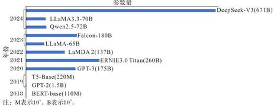
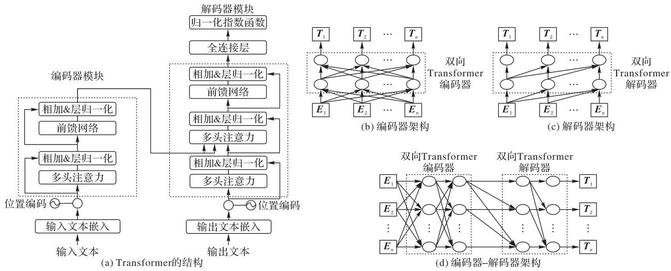
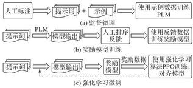
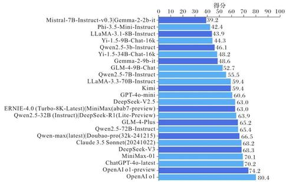
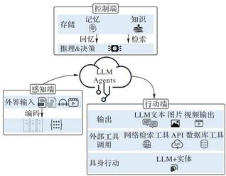
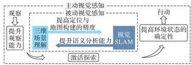

=+=+=+=+=+=+=+=+=
文章编号:1001-9081(2025)03-0685-12 DOI:10.11772/j.issn.1001-9081.2025010128

# 大语言模型综述与展望

秦小林 \( {}^{1,2 * } \) ,古徐 \( {}^{1,2} \) ,李弟诚 \( {}^{1,2} \) ,徐海文 \( {}^{3} \)

(1. 中国科学院 成都计算机应用研究所, 成都 610213; 2. 中国科学院大学 计算机科学与技术学院, 北京 100049; 3. 中国民用航空飞行学院 理学院, 四川 广汉 618307)

(* 通信作者电子邮箱qinxl2001@126.com)

摘 要:大语言模型(LLM)是由具有大量参数(通常数十亿个权重或更多)的人工神经网络组成的一类语言模型, 使用自监督学习或半监督学习对大量未标记文本进行训练,是当前生成式人工智能(AI)技术的核心。与传统语言模型相比, LLM通过大量的算力、参数和数据支持,展现出更强的语言理解与生成能力,广泛应用于机器翻译、问答系统、对话生成等众多任务中并表现卓越。现有的综述大多侧重于LLM的理论架构与训练方法, 对 LLM 的产业级应用实践及技术生态演进的系统性探讨仍显不足。因此,在介绍 LLM 的基础架构、训练技术及发展历程的基础上,分析当前通用的LLM关键技术和以LLM为底座的先进融合技术。通过归纳总结现有研究,进一步阐述LLM在实际应用中面临的挑战,包括数据偏差、模型幻觉和计算资源消耗等问题,并对LLM的持续发展趋势进行展望。

关键词:大语言模型；智能体；自然语言处理；检索增强生成；模型幻觉

中图分类号:TP182 文献标志码:A

# Survey and prospect of large language models

QIN Xiaolin \( {}^{1,{2}^{ * }} \) , GU Xu \( {}^{1,2} \) , LI Dicheng \( {}^{1,2} \) , XU Haiwen \( {}^{3} \)

(1. Chengdu Institute of Computer Application, Chinese Academy of Sciences, Chengdu Sichuan 610213, China; 2. School of Computer Science and Technology, University of Chinese Academy of Sciences, Beijing 100049, China; 3. Faculty of Science, Civil Aviation Flight University of China , Guanghan Sichuan 618307, China)

Abstract: Large Language Models (LLMs) are a class of language models composed of artificial neural networks with a vast number of parameters (typically billions of weights or more). They are trained on a large amount of unlabeled text using self-supervised or semi-supervised learning and are the core of current generative Artificial Intelligence (AI) technologies. Compared to traditional language models, LLMs demonstrate stronger language understanding and generation capabilities, supported by substantial computational power, extensive parameters, and large-scale data. They are widely applied in tasks such as machine translation, question answering systems, and dialogue generation with good performance. Most of the existing surveys focus on the theoretical construction and training techniques of LLMs, while systematic exploration of LLMs' industry-level application practices and evolution of the technological ecosystem remains insufficient. Therefore, based on introducing the foundational architecture, training techniques, and development history of LLMs, the current general key technologies in LLMs and advanced integration technologies with LLMs bases were analyzed. Then, by summarizing the existing research, challenges faced by LLMs in practical applications were further elaborated, including problems such as data bias, model hallucination, and computational resource consumption, and an outlook was provided on the ongoing development trends of LLMs.

Key words: Large Language Model (LLM); Agent; Natural Language Processing (NLP); Retrieval-Augmented Generation (RAG); model hallucination

## 0 引言

自然语言处理(Natural Language Processing, NLP)技术演进的本质是机器不断突破人类语言认知与理解能力边界的历程。20世纪 50 年代至 80 年代,基于规则的方法主导了早期语言模型研究, 它的核心依赖于语言学专家构建的形式文法与词典系统,如 Chomsky \( {}^{\left\lbrack  1\right\rbrack  } \) 的上下文无关文法。这类方法虽在有限领域如人机对话系统 ELIZA \( {}^{\left\lbrack  2\right\rbrack  } \) 中取得初步成功,却受制于人工规则的可扩展性困境一一构建覆盖英语基本语法的规则库成本高但精度极低 \( {}^{\left\lbrack  3\right\rbrack  } \) 。至 20 世纪 90 年代,统计语言模型的兴起标志着语言处理进入概率化时代, \( N \) -gram 模型与隐马尔可夫模型(Hidden Markov Model, HMM)通过大规模文本库 (如谷歌 10 亿词级 \( N \) -gram 库 \( {}^{\left\lbrack  4\right\rbrack  } \) ) 实现了词序列概率预测,提升了机器翻译的 BLEU (BiLingual Evaluation Understudy) 值 \( {}^{\left\lbrack  5\right\rbrack  } \) 。然而,统计方法面临维度灾难的致命缺陷:当 \( N \) -gram 的阶数超过 3 时,模型参数量呈指数级膨胀。

21 世纪初,基于神经网络的语言模型通过分布式表示开启了语言处理的向量化革命。Bengio 等 \( {}^{\left\lbrack  6\right\rbrack  } \) 提出的前馈神经网络模型首次将词汇映射至低维连续空间,使语义相似度计算成为可能。此后, 循环神经网络 (Recurrent Neural Network, RNN) \( {}^{\left\lbrack  7\right\rbrack  } \) 及其变体长短时记忆 (Long Short-Term Memory, LSTM) \( {}^{\left\lbrack  8\right\rbrack  } \) 通过门控机制捕捉长距离依赖,提高了 \( \mathrm{{NLP}} \) 下游任务的性能 \( {}^{\left\lbrack  9\right\rbrack  } \) 。尽管如此, RNN的时序计算特性导致 GPU 利用率不足 30%,且当超过 200 个单词时,文本的记忆保留率极低, 严重制约了模型规模与性能的进一步提升。

---

收稿日期:2025-02-10; 修回日期:2025-02-17; 录用日期:2025-02-19。 基金项目:国家重点研发计划项目 (2023YFB3308601)；四川省科技计划项目(2024NSFJQ0035,2024NSFSC0004)；四川省委组织部人才专项。

作者简介:秦小林(1980-),男,重庆人,研究员,博士, CCF高级会员,主要研究方向:自动推理、代数视觉、行业大模型；古徐(1998-), 男,四川成都人,博士研究生,主要研究方向:自然语言处理、行业大模型；李弟诚(2003-),男,安徽六安人,硕士研究生,主要研究方向:自然语言处理、行业大模型；徐海文(1978- ),男,山东菏泽人,教授,博士,主要研究方向:优化理论与算法、交通运输规划与管理。

---

自 Google 研究团队发表 Attention is all you need \( {}^{\left\lbrack  {10}\right\rbrack  } \) 以来, Transformer 架构已经驱动新一轮深度学习模型极速迭代, 特别是 ChatGPT (Chat Generative Pre-trained Transformer) \( {}^{\left\lbrack  {11}\right\rbrack  } \) 的问世推动了新一轮的人工智能(Artificial Intelligence, AI)浪潮, 加速了生成式人工智能 (Generative AI) 技术和 AI 算力的发展。大语言模型(Large Language Model, LLM),即“大模型”技术, 源于早期的预训练语言模型 (Pre-trained Language Model, PLM),如 Devlin 等 \( {}^{\left\lbrack  {12}\right\rbrack  } \) 提出的 BERT (Bidirectional Encoder Representations from Transformers) 与 OpenAI 开发的 GPT (Generative Pre-trained Transformer) 系列 \( {}^{\left\lbrack  {13} - {15}\right\rbrack  } \) 等,分别采用了Transformer框架的编码器(Encoder)和解码器(Decoder) 模块 \( {}^{\left\lbrack  {10}\right\rbrack  } \) ,它们的参数量从 \( {100} \times  {10}^{6} \) 到 \( {200} \times  {10}^{9} \) 不等。根据不同的下游任务,模型采用的预训练策略也不同,其中 BERT 模型采用掩码语言建模(Masked Language Modeling, MLM)和下句预测(Next Sentence Prediction, NSP)任务, GPT则采用自回归语言模型的目标函数, 即自左向右依次预测。

随着运算性能和数据质量等多方面的提升, LLM 在 NLP 和推理问题上的能力不断增强 \( {}^{\left\lbrack  {16} - {17}\right\rbrack  } \) 。这类模型不仅实现了高质量文本生成与深层语义理解,更在机器翻译 \( {}^{\left\lbrack  {18}\right\rbrack  } \) 、开放域可爱里久平工队马环区 日本国通信分析。它们的技术影响力已超越计算机领域, 成为多学科交叉创新的关键驱动力:2024 年诺贝尔物理学奖授予霍普菲尔德与辛顿,他们奠基性的工作(能量函数建模与反向传播算法)构建了现代机器学习基础；化学奖得主哈萨比斯团队开发的 AlphaFold2 , 通过引入几何约束的 Transformer 架构, 实现蛋白质结构预测的原子级精度, 将传统实验验证流程效率提升 4 个数量级。 这些跨学科突破揭示, LLM 技术不仅是算法优化的产物,更是重构科学智能(AI for Science)范式的关键——从 NLP 到计算生物学, 从符号推理到物理仿真, 掌握 LLM 的技术脉络已成为推动前沿探索的必备基础。

现有关于 LLM 的综述工作主要聚焦于以 GPT-4 \( {}^{\left\lbrack  {21}\right\rbrack  } \) 为代表的技术与应用。例如,文献[22-23]深入分析了 LLM 传统微调训练的技术与发展；文献[24]详细介绍了经典LLM 所依赖的核心技术与算法原理；文献[25-26]则分别从电力和金融视角解读 LLM 的应用技术与发展前景。然而, 由于 LLM 技术迭代迅速, 现有综述尚未将较新的 LLM 融合技术纳入框架。本文聚焦于最新的闭源与开源 LLM 进展, 系统归纳了 LLM 先进技术与前沿应用,填补了 LLM 技术从实验室原型到实际生产部署的综述空白, 为跨领域研究者提供兼具理论深度与实践价值的参考框架。在对当前 LLM 研究进行分析的基础上, 本文进一步总结了现有 LLM 技术与应用所面临的挑战, 并对未来的研究方向进行了展望。

## 1 大模型架构与技术
=+=+=+=+=+=+=+=+=
### 1.1 大模型基础架构

Transformer 是一种基于注意力机制处理序列数据的深度学习模型。由于它适合并行计算且只有模型本身的结构性, Transformer 在准确性和性能方面优于传统的递归神经网络架构。它的整体架构主要由编码器和解码器两大模块构成, 并在这 2 个模块中广泛应用了注意力机制。注意力机制的核心思想是在海量信息中聚焦少量关键信息,从而忽略无关或噪声部分。自注意力机制作为其中的一种重要变体, 不再依赖外部信息, 而是更专注于捕捉数据或特征内部的关联性;多头注意力则通过多重映射空间的视角进一步强化这种捕捉能力。在早期的 PLM 与近期的 LLM 开发过程中, 研究者普遍会采用编码器或解码器架构。随着高性能 GPU 的快速发展,学术界与工业界得以训练更深层、更大规模的模型, 从而使得 LLM 的参数量呈现指数级增长 (如图 1 所示)。例如,阿里集团开发的通义千问2.5系列 \( {}^{\left\lbrack  {27}\right\rbrack  } \) 覆盖从 \( {0.5} \times  {10}^{9} \) 级别的小模型到 \( {72} \times  {10}^{9} \) 级别的精调模型多个版本；而 DeepSeek-V3 版本 \( {}^{\left\lbrack  {28}\right\rbrack  } \) 则采用了混合专家模型 (Mixture of Experts, MoE) 策略 \( {}^{\left\lbrack  {29}\right\rbrack  } \) ,拥有高达 \( {671} \times  {10}^{9} \) 的模型参数,并包含 256个专家网络, 进一步拓展了对多场景任务的适应能力。

图 1 截至 2025 年 1 月公开的 LLM 参数统计

Fig. 1 Statistics of public LLMs' parameters up to January 2025

通常, PLM 架构分为 3 类: 编码器架构(Encoder-only)、解码器架构 (Decoder-only) 和编码器-解码器架构 (Encoder-Decoder)。解码器架构可进一步划分为前缀解码器(Prefix Decoder)和因果解码器(Causal Decoder)架构, 如图 2 所示。

1)编码器架构。代表经典编码器架构模型的 BERT 有 base 和 large 这 2 个版本, 但相比 LLM, 它的可训练参数量过少,且训练语料不具备时效性。BERT 及其变种 \( {}^{\left\lbrack  {11},{30} - {32}\right\rbrack  } \) 在过去的研究中能够有效处理多种下游任务。为了发挥 BERT 架构优秀的性能, Shazeer \( {}^{\left\lbrack  {33}\right\rbrack  } \) 和 Warner 等 \( {}^{\left\lbrack  {34}\right\rbrack  } \) 采用 GeGLU 激活函数、旋转位置嵌入 \( {}^{\left\lbrack  {35}\right\rbrack  } \) 和交替的局部-全局注意力机制,以现代化的 Transformer 架构, 设计了具有更长的文本处理能力的 ModernBERT。该模型提出了无填充 (Unpadding) 方法提升计算效率,避免了在处理变长序列时对填充 Token 的不必要计算,缩短了混合长度序列批次的处理时间。 ModernBERT 还使用 Flash Attention \( {}^{\left\lbrack  {36}\right\rbrack  } \) 以及硬件优化实现更高的推理速度和内存效率, 从而能够在更普通的 GPU 上运行,不需要昂贵的专业硬件。此外, ModernBERT 在大规模训练中使用了 2 万亿个 Token 的数据, 包括网页文档、代码和科学文献, 极大提升了泛化能力, 成为新一代高效编码模型。

2) 解码器架构。通常直接基于已有的上下文或提示进行续写和扩展,采用自回归方式训练,即通过预测下一个 Token逐步学习语言的统计分布与语义信息。这也意味着它能利用无监督预训练从海量未标注数据中捕捉语言规律,因此对上下文长度的处理能力和硬件负载也提出了更高要求。

3)编码器-解码器架构。以谷歌提出的T5(Text-To-Text Transfer Transformer) \( {}^{\left\lbrack  {37}\right\rbrack  } \) 为代表,在多种下游任务中展示了出色的迁移学习能力。BART(Bidirectional and Auto-Regressive Transformer) 模型 \( {}^{\left\lbrack  {38}\right\rbrack  } \) 则同时集成 3 种架构,在分类与生成场景都具有一定作用。事实上, 无论是编码器架构、解码器架构还是编码器-解码器架构模型(如表 1 所示),三者的核心差异在于如何在注意力机制中配置掩码矩阵, 从而实现自注意力、跨注意力或自回归等不同形式。以 GPT 系列 \( {}^{\left\lbrack  {12},{14}\right\rbrack  } \) 为代表的因果解码器采用下三角掩码, 使模型只能访问之前的词; 该自回归机制仍广泛应用于各种 LLM 的设计与训练中。

图 2 不同PLM架构的对比

Fig. 2 Comparison of different PLM architectures

表 1 现有LLM 架构及模型

Tab. 1 Existing LLM architectures and models

<table><tr><td>Baichuan 系列 \( {}^{\left\lbrack  {46}\right\rbrack  } \)</td><td>架构</td><td>代表模型</td></tr><tr><td>编码器架构</td><td/><td>\( {\mathrm{{BERT}}}^{\left\lbrack  {11}\right\rbrack  },{\mathrm{{ALBERT}}}^{\left\lbrack  {32}\right\rbrack  },{\mathrm{{ModernBERT}}}^{\left\lbrack  {34}\right\rbrack  } \)</td></tr><tr><td>编码器-解码器</td><td/><td>Flan-UL \( {2}^{\left\lbrack  {39}\right\rbrack  },{\mathrm{{T5}}}^{\left\lbrack  {37}\right\rbrack  },{\mathrm{{BART}}}^{\left\lbrack  {38}\right\rbrack  },{\mathrm{{mT5}}}^{\left\lbrack  {40}\right\rbrack  } \)</td></tr><tr><td rowspan="2">解码器 架构</td><td>因果解码器</td><td>GPT系列 \( {}^{\left\lbrack  {12},{14}\right\rbrack  } \) , BLOOM \( {}^{\left\lbrack  {41}\right\rbrack  } \) , OPT \( {}^{\left\lbrack  {42}\right\rbrack  } \) , Gopher \( {}^{\left\lbrack  {43}\right\rbrack  } \) , LLaMA \( {}^{\left\lbrack  {44}\right\rbrack  } \) , ChatGLM系列 \( {}^{\left\lbrack  {45}\right\rbrack  } \) ,</td></tr><tr><td>前缀解码器</td><td>PaLM \( {}^{\left\lbrack  {47}\right\rbrack  }, \) GLM- \( {1}^{\left\lbrack  {48}\right\rbrack  } \)</td></tr></table>
=+=+=+=+=+=+=+=+=
### 1.2 大模型训练与微调

LLM 发布使用前, LLM 开发团队如 OpenAI、阿里通义将大规模语料库进行重构, 并构建语言建模和去噪自编码作为模型的预训练任务, 从而将知识表示编码到模型参数中, 并通过参数优化与高效训练确保模型性能与可扩展性。参数优化通常采用大批量训练策略,如动态调整批量大小能够在训练过程中逐步扩展, 从而有效稳定训练过程。Adam 优化器 \( {}^{\left\lbrack  {49}\right\rbrack  } \) 及其变种 (如 \( {\mathrm{{AdamW}}}^{\left\lbrack  {50}\right\rbrack  } \) 和 \( {\mathrm{{Adafactor}}}^{\left\lbrack  {51}\right\rbrack  } \) ) 通过自适应调整学习率, 有效平衡收敛速度与计算稳定性, 被广泛应用于 LLM训练。此外, 引入权重衰减和梯度裁剪等技术以防止梯度爆炸和模型崩溃等问题 \( {}^{\lbrack {52}\rbrack } \) 。

随着参数与数据规模的不断扩大, LLM 训练方法面临计算资源和内存的双重挑战。为此, 从业者提出了众多优化技术, 例如 ZeRO(Zero Redundancy Optimizer) 技术 \( {}^{\left\lbrack  {53}\right\rbrack  } \) 、3D 并行技术 \( {}^{\left\lbrack  {54}\right\rbrack  } \) 和混合精度训练策略 \( {}^{\left\lbrack  {55}\right\rbrack  } \) 等。ZeRO 技术通过优化内存分配, 减少了数据冗余, 使得更大规模的模型能够在有限的硬件资源下训练；3D 并行技术通过数据并行、流水线并行与张量并行, 能够充分利用多 GPU 环境来显著提高训练吞吐量；混合精度训练策略在低精度计算下显著减少显存占用和计算开销, 同时保持模型的性能和准确性。结合 3D 并行与混合精度训练的方法 \( {}^{\left\lbrack  {56} - {57}\right\rbrack  } \) 可以在多GPU集群上高效地训练超大规模模型。此外, 模型量化技术被广泛应用于推理阶段 \( {}^{\left\lbrack  {55},{58}\right\rbrack  } \) ,以减少模型的存储需求和加速推理过程。

近期, MoE 训练方法 \( {}^{\left\lbrack  {59}\right\rbrack  } \) 展现出显著的优势,尤其是它在显著减少计算资源需求的同时仍能实现高效的预训练。 MoE 架构主要由两部分构成: 稀疏 MoE 层和门控网络。稀疏 MoE 层取代了传统 Transformer 模型中的前馈网络 (FeedForward Network, FFN), 由多个独立的 “专家” 网络组成,每个专家通常是一个前馈网络,但也可以是更复杂的结构, 甚至是层级化的 MoE 层。这种设计允许模型在处理不同的输入令牌时动态选择最合适的专家。门控网络负责将 Token 路由到相应的专家, 其中某个特定的 Token 可能被分配给某个专家或同时分配给多个专家。Switch Transformer \( {}^{\left\lbrack  {60}\right\rbrack  } \) 和 \( {\text{Mixtral}}^{\left\lbrack  {29}\right\rbrack  } \) 分别是最早应用 MoE 训练的预训练架构与 LLM,为 GPT-4 \( {}^{\left\lbrack  {21}\right\rbrack  } \) 和 DeepSeek \( {}^{\left\lbrack  {28}\right\rbrack  } \) 的开发提供了技术参考。

借助海量数据训练后, LLM 在通用领域的下游任务能力得到了较大提高。然而, 在各垂直场景仍需通过领域知识监督微调(Supervised Fine-Tuning, SFT)来适配模型, 达到增强 LLM 特定行业能力与对齐使用者偏好的效果。SFT 主要包括指令微调(Instruction Fine-Tuning)、基于人类反馈的强化学习微调 (Reinforcement Learning from Human Feedback, RLHF)以及高效微调。高效微调主要分为提示微调和低秩自适应(Low-Rank Adaptation, LoRA)微调。

1)指令微调。指令微调是一种在自然语言格式的示例集合上对预训练后的 LLM 进行微调的方法。与传统语言模型的有监督微调和多任务提示训练相似, 指令微调的核心是利用指令格式的输入输出对模型进行优化。首先需要收集或构建包含指令的训练示例, 并利用这些示例以有监督的方式对模型进行微调,通常采用序列到序列的损失函数进行训练。经过指令微调的模型在处理未见过的任务时展现出优异的泛化能力,且在多语言环境下也能保持良好的表现。

2)RLHF。RLHF 技术解决了预训练过程通常仅关注单词预测, 未能充分考虑人类的价值观和偏好的问题, 主要包含 3 个步骤:首先,收集包含指令和期望输出的监督数据集, 由人工标注者编写, 覆盖多样化任务和场景, 对预训练语言模型进行初步微调, 以确保它具备执行各类任务的基本能力；其次,利用人类反馈数据训练奖励模型(Reward Model, RM), 通过人工评估和排序模型生成的多种输出, 训练 RM 以预测人类对不同输出的偏好, 为后续的强化学习 (Reinforcement Learning, RL) 提供指导信号; 最后, 采用近端策略优化(Proximal Policy Optimization, PPO) \( {}^{\left\lbrack  {61}\right\rbrack  } \) 等 RL 策略 \( {}^{\left\lbrack  {62}\right\rbrack  } \) 基于RM优化语言模型,使生成的输出更符合人类反馈, 同时引入惩罚机制防止模型显著偏离初始状态。因此, RLHF 有效地将人类的价值观和偏好融入模型训练中, 显著提升了 LLM在实际应用中的对齐能力, 使输出更偏向用户真实需求。RLHF 和其他训练策略流程如图 3 所示。

图3 RLHF和其他训练策略流程

Fig. 3 Process of RLHF and other training strategies

3) 提示微调。提示微调是一种高效且低成本的半监督训练范式,只需要少量标注数据即可进行 \( {}^{\left\lbrack  {63}\right\rbrack  } \) 。它的目标是通过将输入样例重新定义为称为 “提示 (prompt)” 的封闭短语来缩小模型语义理解和人类认知水平之间的差距。通过提示学习, 可以有效利用少量标注数据指导模型生成高质量的推理结果, 而不需要微调全部参数。这种提示优化过程可以通过多种策略实现, 包括手动设计和自动生成。其中, 手动设计基于经验对提示进行构建, 定义适合的提示模式, 例如 PET(Pattern Exploiting Training) 方法 \( {}^{\left\lbrack  {64}\right\rbrack  } \) ; 自动生成则利用生成模型(如 \( {\mathrm{{T5}}}^{\left\lbrack  {37}\right\rbrack  } \) )自动构建提示,减少了人工设计的工作量和不确定性。软提示 (Soft Prompting) 是提示学习中的一种重要方法, 它通过在输入中引入可优化的伪提示词来替代手动设计的硬提示,从而实现参数的自动化学习。例如, P-tuning 方法 \( {}^{\left\lbrack  {63}\right\rbrack  } \) 通过添加伪提示词来进行学习,减少了模型参数的更新量,从而避免了过拟合问题。此外, 前缀调优 (Prefix Tuning) \( {}^{\left\lbrack  {65}\right\rbrack  } \) 方法进一步扩展了P-tuning的思想,通过引入更多的前缀参数进行优化, 增强了 LLM 的推理能力而不显著增加计算开销。

4) LoRA 微调。LoRA 通过引入低秩矩阵来调整预训练语言模型的权重, 在保留预训练模型通用知识的同时, 高效地学习特定任务所需的信息, 从而显著降低微调过程中所需的参数量和计算资源。该技术首先在目标 LLM 权重矩阵中引入 2 个低秩矩阵组成的低秩适应层并随机初始化, 用于捕捉特定任务的信息。在微调过程中, 仅更新低秩适应层的参数, 而保持模型的原始权重不变。在该处理下, 不仅降低了需要训练的参数量,还避免了对预训练知识的破坏, 使 LLM 能够高效地学习新任务。由于仅低秩层发生变化, 模型在保持通用能力的同时, 具备特定任务的适应性。
=+=+=+=+=+=+=+=+=
### 1.3 大模型缩放定律

缩放定律 (Scaling Law) \( {}^{\left\lbrack  {66}\right\rbrack  } \) 是描述模型性能随模型规模增加而提升的一组经验法则, 揭示了模型性能与计算量、模型参数量和数据大小之间的幂律关系, 即在不受其他因素制约的情况下, 模型性能会随着这些因素的增长而提高, 但提升的效果会随着这些因素的增加而递减。该定律在 LLM 的发展中起到了关键作用。

随着参数量的增加, 模型能够更好地捕捉数据中的复杂模式和特征,从而提高在各种任务上的表现。例如, GPT-3 和 PaLM(Pathways Language Model) 等模型通过将参数量分别提高到 \( {175} \times  {10}^{9} \) 和 \( {540} \times  {10}^{9} \) ,显著提升了模型的语言理解和生成能力。此外,训练数据的规模也是影响模型性能的重要因素。更大的数据集能够提供更多的信息和多样性, 帮助模型提升对未见过的数据的泛化能力。例如, 视觉大模型通过学习大量的图像数据, 能够泛化到新的图像域, 从而在各种视觉任务上表现出色。在实际应用中, 计算资源通常有限, 因此在有限的计算资源下优化模型性能成为一个重要的研究方向。Scaling Law 为这一问题提供了指导。例如, Chinchilla 缩放定律 \( {}^{\left\lbrack  {67}\right\rbrack  } \) 提出,当可用计算资源增加时,模型大小和数据量大小应当等比例增长,以实现最佳的性能提升。
=+=+=+=+=+=+=+=+=
### 1.4 大模型类别

在实际应用场景中, 数据通常以多源、异构的形式存储, 因此除了擅长处理文本的 LLM,擅长音频、视频、图像及时序数据的多模态大模型也同样被重点关注。

1) 文本大模型。文本大模型的演进始于 Transformer 架构的突破性应用。除了传统的 PLM 系列如 BERT \( {}^{\left\lbrack  {11},{30} - {32},{34}\right\rbrack  } \) 、 BART \( {}^{\left\lbrack  {38}\right\rbrack  } \) 、T5 \( {}^{\left\lbrack  {37},{40}\right\rbrack  } \) 和 \( {\mathrm{{GPT}}}^{\left\lbrack  {12} - {14}\right\rbrack  } \) 等,现有通用主流 LLM \( {}^{\left\lbrack  {10},{21},{27} - {28.41} - {42.45} - {46.48},{68}\right\rbrack  } \) 也推动着 NLP 实现通用与专用领域间的认知跃迁。

2)音频大模型。音频处理技术体系呈现“生成-理解- 转换”的三角架构。在生成层面, Meta 的 AudioCraft \( {}^{\left\lbrack  {69}\right\rbrack  } \) 提出层级式扩散模型, 通过谱图重建与声学参数联合建模实现高保真音乐合成；MAGNet (Masked Audio Generation using Non-autoregressive Transformers \( {)}^{\left\lbrack  {70}\right\rbrack  } \) 的掩码生成框架采用非对称自编码器结构, 在遮蔽率动态调整策略下音频修复精度提升 17.6%。在理解方面, Whisper 通过大规模多语言对齐训练 (68 万小时语料)建立端到端自动语音识别范式,它的鲁棒性较好,在噪声环境下的词错误率比隐马尔可夫模型 (HMM)低 42%。转换技术中, SpeechT5 采用统一编解码架构, 通过可学习模态标记实现文本-语音跨模态转换, 在 VCTK 数据集上的平均意见得分达 4.31。Wav2Vec 系列模型 \( {}^{\left\lbrack  {71}\right\rbrack  } \) 通过对比预测编码构建上下文感知能力,它的变体 \( \mathrm{w}2\mathrm{v} \) - BERT \( {}^{\left\lbrack  {72}\right\rbrack  } \) 在 LibriSpeech 基准测试中仅需 10% 标注数据即可达到全监督模型的性能。

3)时序大模型。时序数据通常应用于工业生产与信号检测场景中。文献[73]将现有时序大模型分为时间序列分析大模型 (Large Models for Time Series analysis, LM4TS) 和时空数据挖掘大模型 (Large Models for Spatio-Temporal Data mining, LM4STD), 并详细分析它们的技术。通用预训练模型 如 Voice2Series \( {}^{\left\lbrack  {74}\right\rbrack  } \) 、TS2Vec \( {}^{\left\lbrack  {75}\right\rbrack  } \) 和 CLUDA (Contrastive Learning in Unsupervised Domain Adaptation \( {)}^{\left\lbrack  {76}\right\rbrack  } \) 通过对比学习和自监督方法提升了时间序列数据的表示能力, 支持多元分析任务,同样推动了LLM对时序数据分析技术发展。

4)多模态大模型。与单模态模型仅处理单一数据类型不同, 多模态模型能够处理多种模态的输入和输出, 例如输入图像和文本生成文本, 或根据文本描述生成图像。以 Sora \( {}^{\left\lbrack  {77}\right\rbrack  } \) 为代表的多模态大模型呈现出巨大前景,只需要输入详细的提示词,模型便能够生成至多长达 60 s 且 60 frame/s 的高质量视频。这类模型通常以 LLM 作为骨干,利用基于扩散技术的SD(Stable Diffusion)模型逐步去噪生成高质量图像, 嵌入视觉编码器与映射器。多模态大模型的技术架构层面呈现出统一表征空间、参数高效微调与认知增强三大趋势。统一表征的代表工作如CLIP-ViT(Contrastive Language-Image Pre-training with Vision Transformer) \( {}^{\left\lbrack  {78} - {79}\right\rbrack  } \) 与 SigLip 编码器 \( {}^{\left\lbrack  {80}\right\rbrack  } \) 的对比研究表明,通过对比损失对齐的跨模态嵌入空间可使图文检索 Recall@1 提升 14%。在高效微调方面, SD 3 引入 LoRA 技术, 仅训练 0.3% 的参数即可完成风格迁移; 在认知增强上, PaLI-3(Pathways Language and Image model-3) \( {}^{\left\lbrack  {81}\right\rbrack  } \) 模型将视觉链式推理 (Visual Chain-of-Thought) 引入多模态 LLM, 在 VQA-v2 数据集上的准确率达 84.7%。

## 2 典型大模型形态
=+=+=+=+=+=+=+=+=
### 2.1 通用基础大模型

目前国际开源的 LLM 如 LLaMA3. 2 促进了该技术在各行业的落地与普惠化,国产开源 LLM 如 DeepSeek-V3、 Qwen2. 5-72B-Instruct 和 GLM4 凭借优异的性价比也增强了国产模型在国际市场中的竞争力。SuperCLUE \( {}^{\left\lbrack  {82}\right\rbrack  } \) 是一个全面的 LLM 能力评测榜单,在一系列国内外代表性的模型上使用推理、数学解题、问答等多维能力进行测试。它对国际市场领先 LLM 的综合能力测评结果如图 4 所示。

图 4 LLM 产品综合性能统计(截至 2025 年 1 月数据)

Fig. 4 Statistics of LLM products' comprehensive performance (up to January 2025)

近期 Kimi k1.5 \( {}^{\left\lbrack  {83}\right\rbrack  } \) 提出了一种利用 RLHF 策略和长文本思维链 (Chain of Thought, CoT) 推理的全新训练框架, 通过 RL使模型在探索过程中获得问题解决能力, 证明了长文本推理在 RL 训练中的关键作用。与之前的 RL 方法不同, Kimi k 1.5 将长文本的训练与短文本的训练相结合, 采用 “Long2Short”策略,将长文本 CoT 模型的知识迁移到短文本 \( \mathrm{{CoT}} \) 模型中,实现隐式的规划、反思和修正,从而提高问题解决的深度和复杂性, 提升了训练效率与 Token 利用率。此外, Kimi k1.5 引入策略优化、长度惩罚和课程学习等技术, 以提高训练的效率和性能。它在长文本 \( \mathrm{{CoT}} \) 模型的推理任务中,表现接近 OpenAI o1 (简写为 o1) 模型,同时在短文本 CoT模型上超越了 GPT-4o 和 Claude Sonnet 3.5 等现有模型。

o1 模型通过使用 RL 训练和 CoT 策略,具备了执行复杂推理的能力。o1 通过 RL 精炼它的内部 CoT, 能够在解决问题时进行反思、规划和修正,从而提升它在复杂推理任务中的表现。与以往的 RL 方法相比, o1 模型内化了长文本推理能力,结合了蒙特卡洛树搜索和推理过程监督,将 CoT 能力融入大语言模型中。这使得 o1 不仅在竞争性编程、数学和科学考试中超越了 GPT-4o 等模型, 还在一些高难度基准测试中达到接近人类专家的水平。此外, o1 在处理复杂问题时展示了卓越的稳定性,尤其是在 \( \mathrm{{RL}} \) 的支持下,推理时间的增加使得模型表现不断提升,为 LLM 的推理能力和安全性提供了新的可能性。

与 o1 相比, OpenAI o3 (简写为 o3 ) 模型在多个领域展现了显著的提升,尤其是在处理复杂推理任务的能力上。o3 不仅延续了 o1 在 RL 和 CoT 策略方面的创新, 还进一步增强了多路推理的能力, 使得模型在面对复杂问题时能够在多个方向同时推理, 从而有效地提高推理的准确性和效率。尤其在软件编码、数学推理以及跨学科技术难题的处理上, o3 相较于 o1 有着更为优异的表现, 如表 2 所示。在软件工程编码任务上, o3 在 SWE-bench Verified 上的准确率达到了 71.7%, 比 ol 有了显著的提高；在编程竞赛 Codeforces 中, o3 的 ELO (ELO rating system) 分数达到了 2727 , 远超过了 o1 之前的最高得分 1891。在数学竞赛 AIME(American Invitational Mathematics Examination) 2024 上, o3 的准确率为 96.7%, 而 ol 的准确率为 83.3%。o3 的进步不仅体现在推理深度的增加, 更重要的是在推理过程中能够更有效地利用计算资源。 传统的 LLM 通常依赖单一的推理路径解决问题,而 o3 通过多路推理和蒙特卡洛树搜索的结合, 能够在更大规模的 Token 空间中同时探索多个可能的解决方案, 从而找到最优解。这种方法的优势在于当面对不确定性或复杂决策时, \( \mathrm{o}3 \) 能更灵活地调整推理路径, 减少错误的发生, 并提高它在挑战性任务中的表现。此外, o3 在技术上还突破了传统单路推理的局限, 通过对推理过程的动态调整和优化, 使得推理时间和资源消耗得到了有效控制。

表 2 OpenAI o1 与 OpenAI o3 的性能对比结果

Tab. 2 Performance comparison results of OpenAI o1 and OpenAI o3

<table><tr><td rowspan="2">模型</td><td colspan="2">不同领域的准确率 \( /\% \)</td><td>ELO分数</td></tr><tr><td>SWE-bench Verified</td><td>AIME</td><td>Codeforces</td></tr><tr><td>OpenAI o1-preview</td><td>41. 3</td><td>56.7</td><td>1 258</td></tr><tr><td>Open AI o1</td><td>48.9</td><td>83. 3</td><td>1891</td></tr><tr><td>Open AI o3</td><td>71.7</td><td>96.7</td><td>2727</td></tr></table>

Qwen2. \( {5}^{\left\lbrack  {25}\right\rbrack  } \) 通过多个创新优化提升了它在长文本推理和复杂任务中的表现。在预训练阶段, Qwen2. 5 显著提升了数据质量和规模,采用 Qwen2-Instruct 进行多维度数据过滤, 并引入专门的数据集如 Qwen2.5-Math 和 Qwen2.5-Coder, 增强了数学推理和代码生成能力。另外, Qwen2. 5 提出了超参数缩放定律, 即通过优化批量大小和学习率等参数, 确保了它在密集模型和 MoE 模型之间训练的平衡。在上下文预训练方面, Qwen 2.5 采用了两阶段策略提高训练效率,同时引入 YARN (Yet Another Rotary position embeddings extensioN method) 和双块注意力技术,使 Turbo 版本支持高达 \( 1 \times  {10}^{6} \) 的上下文长度。在后训练阶段, Qwen2. 5 通过使用扩展的监督微调数据集和两阶段 RL 策略, 进一步提升了在长序列生成、 数学推理和代码生成等任务中的表现, 确保了模型在多个领域的优秀性能。在实际表现中, Qwen 2.5-72B 在多个语言、 数学和逻辑推理基准上超越了同类开源模型, Turbo 和 Plus 版本在成本与性能的平衡上甚至优于 GPT-4o-mini 和 GPT- 4o, 展示了它在长文本处理与多任务适配中的卓越性能。

DeepSeek-V3 \( {}^{\left\lbrack  {28}\right\rbrack  } \) 使用了 DeepSeekMoE 结构和多头潜在注意力(Multi-head Latent Attention, MLA)技术,实现了推理的高效性和较高的训练成本效益。DeepSeekMoE 系统会根据任务的需求动态激活 “专家”子集, 在有效扩展系统能力的同时, 避免计算资源过载。该架构还提出了动态冗余策略, 通过调整专家的分配避免额外校正机制平衡各部分的工作负载,能够在推理和训练过程中维持最佳的负载平衡。同时, MLA方法实现了潜在向量的紧凑压缩, 有效缓解了传统模型中因 KV cache 占用大量的内存空间导致的模型运行效率降低的问题。此外, DeepSeek-V3 还引入了多 Token 预测 (Multi-Token Prediction, MTP)模式, 能同时预测多个 Token, 极大提升了文本生成的流畅性和连贯性。在性能优化上, 模型融合了 FP8 混合精度框架, 并在不同的计算过程中灵活切换使用 16 位和 32 位浮点数, 减少了对内存使用的同时不影响模型生成准确性。与DeepSeek-V3模型相同, DeepSeek-R1 模型 \( {}^{\left\lbrack  {68}\right\rbrack  } \) 同样使用 FP8 训练,但 R1 版本无需大量的 SFT。模型结合群体相对策略优化 (Group Relative Policy Optimization, GRPO)技术, 通过组内样本的奖励相对比较优化策略模型, 进行面向推理的 RL, 以此提升模型的推理能力。此外, 模型使用拒绝采样和 SFT 再次进行 RLHF , 在所有场景下都表现良好。通过这些方法, DeepSeek-R1 模型展现了强大的推理能力,在多个任务上达到了与 OpenAI-o1-1217 相当的性能。

近期MiniMax- \( {01}^{\left\lbrack  {56}\right\rbrack  } \) 提出了一种基于线性注意力机制和混合架构的全新训练框架, 专注于提升 LLM 和视觉语言模型(Visual Language Model, VLM)的长上下文处理能力。与传统 Transformer 架构中的 Softmax 注意力机制不同, MiniMax-01引入了FA(Flash Attention)机制来对注意力查询与 \( \mathbf{K} \) 、 \( \mathbf{V} \) 向量进行分块计算,大幅降低了计算开销,并支持 400 万 Token 的超长上下文处理, 从理论上实现了线性时间复杂度。此外, MiniMax-01 采用混合架构, 每隔 8 层将 Softmax 注意力层替换为 FA 层,保持长上下文优势的同时也极大提升完成复杂任务的能力。MiniMax-01 还通过集成 MoE 架构, 优化路由策略, 解决了专家负载不均和 Token 丢弃率问题,从而充分释放参数规模和计算能力。此外, MiniMax-01 使用了三阶段训练策略,将上下文窗口逐步扩展至百万级别,并在下游任务上展现了超越传统模型的表现。
=+=+=+=+=+=+=+=+=
### 2.2 大模型智能涌现

智能涌现 (Emergent Abilities) 是 LLM 展现出的一种特性 \( {}^{\left\lbrack  {57}\right\rbrack  } \) ,即在规模较小的模型中难以察觉,而当模型体量跨越特定阈值后方才凸显的能力。这一现象构成了 LLM 与先前 PLM 的核心差异。随着模型参数量、数据规模以及计算资源的不断累加, 模型性能会产生飞跃式的提升。获得 LLM 高质量输出的本质可看作是通过文本提示激发 LLM 潜在的语言能力, 从而刺激涌现现象的过程。因此, 利用高效的提示输入引发 LLM 的智能涌现成为当下应用 LLM 的重要手段。 目前, 高效提示可分为上下文情景学习 (In-Context Learning, ICL) 和 CoT。

\( {\mathrm{{ICL}}}^{\left\lbrack  {58},{60}\right\rbrack  } \) 是一种特殊的提示形式。一个格式化的自然语言提示包括任务描述以及若干个示例,这些示例从任务数据集中选出, 并按照特定顺序组合成自然语言提示。通过适当的任务演示, ICL 帮助 LLM 识别和执行新的任务, 而不需要显式的梯度更新。ICL在 LLM 推理中的机制可分为任务识别(Task Recognition)和任务学习(Task Learning)。在任务识别中, 模型通过示例识别任务类型, 并利用预训练中获得的先验知识解决新任务。这可以看作是模型捕捉到任务类型的隐变量,并基于演示完成推理。任务学习则通过示例学习在预训练中未见的新任务, 与隐式微调类似。模型通过前向计算生成元梯度,并借助注意力机制隐式执行梯度下降。

\( \mathrm{{CoT}} \) 是一种提示学习方法 \( {}^{\left\lbrack  {61.63}\right\rbrack  } \) ,相较于简单的 \( \mathrm{{ICL}} \) 方法输入提示, CoT 通过引入中间推理步骤, 在输入和输出之间构建逻辑链条, 提升 LLM 在复杂推理任务中的表现。CoT 提示最初被提出作为 ICL 的扩展,这些中间推理步骤作为桥梁,帮助语言模型更好地理解并生成答案。基本的 CoT 提示通过逐步生成的推理链条连接输入和输出, 使用这些增强的演示, 模型可按照每一步推理生成新输入的答案, 通过诸如 "step by step"的简单指令, 自动触发模型生成中间推理步骤, 从而使得 CoT 提示更易用。
=+=+=+=+=+=+=+=+=
### 2.3 小模型应用

在边缘计算与物联网场景驱动下, 小型大语言模型 (Small LLM),即 “小模型”,通过模型压缩技术实现了效率- 性能的帕累托优化。核心技术集中在知识蒸馏、结构化剪枝与量化压缩 3 个维度: 知识蒸馏通过师生架构实现参数高效迁移,如 DistilBERT \( {}^{\left\lbrack  {84}\right\rbrack  } \) 采用 \( \mathrm{{KL}} \) (Kullback-Leibler)散度对齐输出分布,以 \( {67} \times  {10}^{6} \) 的参数量保留BERT-base 97%的性能；结构化剪枝基于参数重要性评估, 结合硬件感知实现稀疏化, 如 EdgeBERT \( {}^{\left\lbrack  {85}\right\rbrack  } \) 通过块级注意力头剪枝实现 2.3 倍加速,将精度损失控制在 1.2 个百分点内; 量化压缩技术突破低比特表征瓶颈,如 Qwen-1.5B-MoE 采用专家分级量化策略,通过混合FP16/4bit 精度将内存占用降低 63%,同时维持核心任务性能。

模型压缩技术的协同应用催生出工业级解决方案, 以 Qwen2. 5 系列 (0.5B/1.5B/3B) 为代表的三阶段压缩框架最具代表性:首先基于教师模型(Qwen-72B)进行任务特定知识蒸馏, 其次通过 Hessian 迹评估实施迭代式结构化剪枝, 最终采用激活感知权重量化(AWQ)实现 4 bit 压缩。该方案在嵌入式设备上每生成 1 个 Token 耗费 1.2 ms,能效相较于原始模型提升 9 倍。实验结果表明,组合式压缩策略相较于单一技术路径,在同等压缩率下能减少 32% 的精度损失。

轻量化架构创新进一步拓展了部署边界, 主要体现在注意力机制优化与模块化设计两个层面:Conformer-S模型 \( {}^{\left\lbrack  {86}\right\rbrack  } \) 融合分组自注意力与深度可分离卷积, 将语音识别词错误率 (Word Error Rate, WER) 降至 2.1%, 推理速度提升 3.7 倍； EfficientNet-Lite \( {}^{\left\lbrack  {87}\right\rbrack  } \) 通过复合缩放系数 \( \left( {\varphi  = {0.5}}\right) \) 动态平衡网络深度/宽度, 在 COCO 目标检测任务中实现边缘设备 35 frame/s 的实时性能。

## 3 大模型融合技术
=+=+=+=+=+=+=+=+=
### 3.1 检索增强生成

检索增强生成(Retrieval-Augmented Generation, RAG)技术的本质在于将传统的语言生成模型与外部知识源相结合。 传统的 LLM 虽然能够在广泛任务中表现出色, 但它们的知识库固定, 且随时间逐渐过时。通过引入外部检索机制, RAG 使得模型可以实时检索到最新的、与任务相关的外部知识, 以此来增强生成的内容, 使内容更加准确和相关。 RAG流程分为索引构建、信息检索与内容生成 3 个步骤: 1)基于嵌入算法如 Text2Vec ,每个文档块会被转换成固定维度的向量, 便于后续检索阶段的相似度匹配; 2) 当用户提出问题, 查询会被转换为向量形式, 并通过计算相似度算法与数据库中存储的向量进行比对, 检索到与查询最相关的文档块；3)检索到的文档块会作为上下文传递给 LLM, LLM 利用这些上下文信息生成最终的回答。目前常见的 RAG 框架包括 LlamaIndex、LangChain、RAGflow 等, 表 3 为这些框架间的不同与各自的优势。

表 3 不同的 RAG 框架对比

Tab. 3 Comparison of different RAG frameworks

<table><tr><td>RAG框架</td><td>聚焦点</td><td>关键组件</td><td>应用场景</td><td>灵活性</td><td>集成难易度</td><td>开发者适用性</td></tr><tr><td>Llamalndex</td><td>语言模型与外部资源 的深度集成</td><td>数据连接器、引擎、数 据代理、索引管理等 组件</td><td>语义搜索、文档索 引等任务</td><td>专为数据索引与搜索 优化,具备较高专注 性</td><td>与数据源集成较为顺 畅,数据源实时接入</td><td>LLM数据增强, 注重 数据整理与搜索</td></tr><tr><td>LangChain</td><td>索引构建与检索优化</td><td>检索系统、数据索引 机制等</td><td>上下文感知查询. 数据处理任务等</td><td>技术简单易于构建, 对复杂任务的扩展性 相对不足</td><td>与各种数据源和服务 的兼容性强, 能够灵 活应对集成需求</td><td>构建知识问答系统、 文档搜索引擎及其他 海量数据处理场景</td></tr><tr><td>RAGflow</td><td>智能文档解析和管理</td><td>智能文档解析系统、 基于LLM的查询、文 档上传与管理、多个 处理模板</td><td>会计、人力资源、 研究等行业应用 的智能文档处理 基于证据的问答</td><td>高度定制化的文档处 理, 支持多种行业与 角色的需求</td><td>易于集成文档上传和 管理,支持多种文档 格式及行业特定需求</td><td>开发智能文档处理系 统并结合LLM查询</td></tr></table>

1) LlamaIndex (原称 GPT Index)。专注于通过高效的数据索引与检索机制提升模型在长文本及大规模数据集上的查询能力。它的架构核心在于索引构建与检索优化, 通过向量搜索技术使得模型能够快速定位与查询相关信息。 LlamaIndex 支持灵活的数据索引结构与自定义查询逻辑, 能够适配多层次知识库及复杂文档管理需求。借助向量数据库技术旨在优化大规模数据的访问性能,为知识问答系统、 文档搜索引擎及其他海量数据处理场景提供有效解决方案。 与 LangChain 相比, LlamaIndex 更专注于索引性能与检索效率的优化, 尽管功能覆盖范围相对较窄, 但在特定数据处理任务中表现突出。

2) LangChain。是一个支持多种语言模型与检索工具集成的开源框架, 旨在通过提供通用接口与模块化架构, 简化 LLM 应用的开发流程。LangChain 的核心特性包括模型集成、提示工程、索引管理、记忆机制、链式调用以及代理功能。 它的链式架构支持将语言模型、外部工具和数据库等不同的功能组件灵活组合, 构建出适应复杂应用场景的任务处理流程。该框架特别强调语言模型与外部资源的深度集成, 例如通过向量数据库实现高效文档检索, 或通过代理模块动态调整模型的任务执行策略。它的抽象层设计进一步提升了组件间的互操作性,支持跨平台和多工具集成。此外, LangChain 内置记忆组件, 可维护长期对话上下文信息, 在对话型应用中展现出较强的适应性。

3)RAGflow。专注于简化 RAG 流程的构建和部署,通过深度优化的流水线架构提升性能和效率。该框架重点强调文档的精细化解析, 并在文档解析方面进行了大量优化, 能够从复杂格式的非结构化数据中提取信息, 提供基于模板的文本切片功能。RAGflow 内置了支持大规模分布式计算的功能, 适合处理高吞吐量的检索请求。此外, 该框架提供了多种配置选项, 允许开发者自定义索引方式、检索策略和生成逻辑。
=+=+=+=+=+=+=+=+=
### 3.2 智能体协同技术

智能体 (Agent) 技术, 作为人工智能领域的核心概念之一,具有巨大的潜力。随着 LLM 技术的进步,智能体不再仅仅是一个理想化的哲学概念, 而是逐步走向现实, 成为有着自主性、反应性、积极性和社交能力的实体。一个智能体通常由 3 个关键部分构成:感知端 (Perception)、控制端 (Brain) 和行动端 (Action) \( {}^{\left\lbrack  {88} - {89}\right\rbrack  } \) ,这 3 个框架的结构如图 5 所示。感知端赋予智能体多模态感知能力, 能够通过文本、视觉、听觉等多种输入感知世界, 增强它与环境互动的能力; 控制端作为智能体的大脑,负责信息处理、决策和推理,由 LLM 提供支持, 它使得智能体能够理解并生成自然语言, 进行推理和规划;行动端则是将决策转化为具体行为的部分, 包括文本输出、工具使用和具身行动,使智能体能够在物理或虚拟环境中执行任务。

LLM-based Agent不仅能处理复杂的自然语言任务,还能跨越传统 AI 的限制,进行推理、决策与多模态互动,涵盖了从单一任务优化到多智能体协同的广泛应用。RECODE (RElation detection via COmposite DEscription) \( {}^{\left\lbrack  {90}\right\rbrack  } \) 通过 LLM 生成视觉线索的详细描述并引入 \( \mathrm{{CoT}} \) ,从而提高视觉关系检测的可分辨性与过程可解释性。LLIFT \( {}^{\left\lbrack  {91}\right\rbrack  } \) 构建的智能体系统将 LLM 与静态分析方法结合, 成功识别了复杂错误并提高了软件分析精度。在复杂任务的执行方面, SwiftSage \( {}^{\left\lbrack  {92}\right\rbrack  } \) 结合直观的推理与详细规划, 展示了智能体在交互式推理中的强大潜力。此外,多个框架如 \( \mathrm{{RoCo}}{\left( \text{multi-Robot Collaboration}\right) }^{\left\lbrack  {93}\right\rbrack  } \) 和 ProAgent \( {}^{\left\lbrack  {94}\right\rbrack  } \) ,通过模拟人类协作与多机器人任务的协同工作, 进一步扩展了智能体在协作和路径规划中的应用范围。 特定领域智能体如材料科学 ChatMOF (Chat Metal-Organic Framework \( {)}^{\left\lbrack  {95}\right\rbrack  } \) ,显示了在数据检索和结构预测中的潜力。 InterAct \( {}^{\left\lbrack  {96}\right\rbrack  } \) 将 ChatGPT 集成到隐式智能体系统中,增强了 AlfWorld 模拟环境中的交互式决策能力, 在复杂家务任务中的成功率达到了 \( {98}\% \) ,明显优于传统的 ReAct 模型。在教育场景中, CGMI(Configurable General Multi-agent Interaction)框架通过树状角色模型与认知架构, 成功模拟了更为自然真实的人机互动 \( {}^{\left\lbrack  {97}\right\rbrack  } \) 。此外, Agents 框架 \( {}^{\left\lbrack  {98}\right\rbrack  } \) 作为一个开源平台,通过支持多智能体协作、任务规划及工具使用, 极大地提高了语言智能体的灵活性和可定制性, 使非专业人员部署和调用 LLM 驱动的智能体系统成为可能。

图 5 智能体开发框架结构

Fig. 5 Structure of Agent development framework
=+=+=+=+=+=+=+=+=
### 3.3 具身智能体

随着多模态 LLM 和机器人技术的飞速发展,具身智能成了全球科技与产业竞争的热点。具身智能体通常具备感知、决策、行动和反馈 4 个核心模块 \( {}^{\left\lbrack  {99} - {101}\right\rbrack  } \) ,这些模块通过不断地交互与调整形成闭环, 使智能体能够自主地理解环境并执行任务。感知模块原理如图 6 所示, 该框架通过视觉、触觉、 听觉、深度等传感器收集环境信息,并对三维空间进行理解和分析；决策模块将 LLM、VLM 和 RL算法结合,进行任务规划和推理, 指导智能体执行具体动作; 行动模块负责根据决策指令执行物理动作,如导航、抓取或交互,通常涉及机械臂、轮式或四足机器人等硬件；反馈模块通过实时反馈环境变化,不断优化感知、决策和行动过程,增强系统适应性。

近年来, 具身智能研究逐渐聚焦于三维感知、语言理解与交互式仿真技术的深度融合, 并取得了一系列显著的进展。例如,3D-VisTA模型 \( {}^{\left\lbrack  {102}\right\rbrack  } \) 通过自注意力机制,优化了三维视觉语言(3D Vision Language, 3D-VL)任务的处理效率, 并引入了ScanScribe 数据集, 为 3D 场景文本对的学习提供了丰富且高质量的资源。类似地, Holodeck 系统 \( {}^{\left\lbrack  {103}\right\rbrack  } \) 采用LLM生成基于文本描述的交互式 3D 环境, 显著提升了资产选择与布局设计的物理合理性。在视觉SLAM (Simultaneous Localization And Mapping) 领域, GS-SLAM (Gaussian Splatting SLAM) 方法 \( {}^{\left\lbrack  {104}\right\rbrack  } \) 采用三维高斯表示和实时渲染策略,显著提高了场景重建与摄像机姿态估计的效率和精度。PTV3 (Point Transformer V3) 方法 \( {}^{\left\lbrack  {105}\right\rbrack  } \) 在点云处理上进行了关键改进, 通过优化计算效率和处理精度, 推动了它在多种环境中的广泛应用,并通过多数据集联合训练增强了模型的泛化能力。此外, PixNav (Pixel-guided Navigation skill) 方法 \( {}^{\left\lbrack  {106}\right\rbrack  } \) 提出了一种创新的像素导航技巧, 专为家庭辅助机器人设计, 利用 RGB 图像成功实现了零样本物体导航,展现了它在实际应用中的高效性与广泛适用性。

图 6 具身智能体感知框架

Fig. 6 Framework of perception for embodied Agents

在视觉与语言融合的研究中, EDA (Explicit text-Decoupling and dense Alignment) 方法 \( {}^{\left\lbrack  {107}\right\rbrack  } \) 通过显式文本解耦与密集对齐技术, 有效解决了现有方法中存在的语义不平衡与歧义问题,进而提高了三维视觉定位任务的性能。同时, EmbodiedScan 数据集 \( {}^{\left\lbrack  {108}\right\rbrack  } \) 为具身智能的三维感知任务提供了一个全面的基准框架, 特别强调了多模态输入对增强场景理解能力的重要性。在仿真环境的研究方面, BVS (BEHAVIOR Vision Suite) \( {}^{\left\lbrack  {109}\right\rbrack  } \) 和 TDW (ThreeDWorld) \( {}^{\left\lbrack  {110}\right\rbrack  } \) 平台为 \( \mathrm{{AI}} \) 训练提供了高度可定制的模拟环境,支持基于视觉和物理交互的任务训练, 并为计算机视觉和行为理解的研究提供了强有力的支持。进一步地, MapGPT (Map-guided GPT-based Agent) \( {}^{\left\lbrack  {111}\right\rbrack  } \) 结合地图引导与自适应路径规划,提升了视觉和语言导航任务中的智能体表现,尤其在复杂环境的导航任务中展现出卓越的性能。这些先进研究不仅推动了具身智能理论的深入发展, 还为实际应用中的机器人导航、三维感知与多模态交互提供了宝贵的技术支持与研究思路。

## 4 未来展望

尽管 LLM 在多个领域取得了显著进展,但仍面临一系列挑战, 这些挑战限制了它在实际应用中的有效性和可持续发展性, 大致可分为以下 4 类:

1)高质量训练数据不足。高质量数据的短缺依然是制约模型性能提升的瓶颈。当前的训练数据大多来自公开的数据集, 这些数据通常存在偏倚, 难以全面涵盖真实世界的多样性和复杂性。此外, 部分领域的数据稀缺, 尤其是在特定行业或应用场景下,模型的泛化能力仍然受到限制。数据的数量和质量直接影响到模型的训练效果和应用能力, 缺乏高质量的数据集使得许多任务的精确率无法满足实际需求。

2)模型幻觉。所谓“模型幻觉”指的是 LLM 在生成内容时出现事实错误、无关推理或不一致的结果。尽管 LLM 能够生成高质量的自然语言文本, 它们仍然存在无法区分事实与虚构、产生不合理推论等问题。模型幻觉不仅影响了模型在知识密集型任务中的可靠性, 也使得它在对精确性要求极高的领域执行实际任务时面临较大风险。

3)价值观对齐。当前的 LLM 多依赖于海量的文本数据进行训练, 但这些数据并未经过充分的道德、伦理和价值观的筛选与调控。模型生成的文本可能包含偏见、不当内容, 甚至与人类社会的普遍价值观相冲突。

4)高成本部署与训练。LLM 的训练和部署通常需要庞大的计算资源和数据存储,这使得它的成本高昂,成为许多机构和研究者难以承受的负担。随着模型规模的不断扩大, 训练成本和部署成本呈现指数级增长, 这使得 LLM 的普适性和可持续性受到限制。

针对以上问题, 本文提出未来 LLM 具有较大发展潜力的研究方向如下:

1)高质量数据增强。为了应对训练数据质量和数量的不足, 未来研究可以着重于数据增强技术, 尤其是在特定领域和任务上的数据生成和扩展。例如, 基于生成对抗网络和迁移学习等方法, 生成具有代表性和多样性的训练数据, 从而提高数据的广泛性和代表性。数据增强不仅可以丰富模型的训练数据集, 还能确保数据分布更符合真实世界场景, 提升模型的泛化能力。

2)幻觉缓解与消除。针对模型幻觉的研究可聚焦于如何有效地融合外部知识库与模型生成能力。采用RAG 是最具潜力的技术路线之一, 结合外部知识库和实时信息更新, 使得模型在生成过程中能够获得更准确的事实依据。通过集成事实验证机制、推理校正和多模态信息输入, 未来的 LLM能够减少幻觉现象,提高生成内容的准确性和一致性。

3)LLM 价值观与人类对齐。为了确保 LLM 的输出与人类的价值观对齐,未来研究需要重视模型的伦理与道德性。 通过加强对模型训练数据的筛选和控制, 结合道德伦理框架的设计, 确保模型的输出不会造成伤害或误导。此外, 通过多方参与的审查机制, 能够确保模型在生成过程中遵循社会公认的伦理标准和法律规范, 避免模型产生与社会价值观相悖的行为。

4)LLM蒸馏小模型与新型架构。采用如知识蒸馏等方法将 LLM 的知识转移到小型、高效的模型中, 从而保证它在特定下游任务上的能力。模型不仅能够在精度和计算效率之间找到平衡, 还能实现低成本、高效的应用部署。此外, 采取更加高效的架构搭建 LLM 并协同软硬件优化, 突破弱自回归局限,实现效率与性能间的平衡。

## 5 结语

LLM 技术作为当前 AI 领域最重要的研究方向之一, 已经展现出在 NLP、推理任务以及跨领域应用中的巨大潜力。 本文回顾了 LLM 的架构、技术以及最新的应用进展,深入探讨了不同类型的前沿 LLM 与实际应用中的优势与挑战, 尤其是聚焦于 RAG、智能体协同和具身智能体等前沿技术的融合应用。通过对现有技术的梳理,本文不仅展示了先进 LLM 技术与融合应用,也揭示了当前技术在数据质量、模型幻觉、价值观对齐以及计算成本等方面所面临的挑战。 参考文献 (References)

[1] CHOMSKY N. Syntactic structures [M]. Berlin: De Gruyter Mouton, 1957: 8-29.

[2] WEIZENBAUM J. ELIZA - a computer program for the study of natural language communication between man and machine [J]. Communications of the ACM, 1966, 9(1): 36-45.

[3] MILLER G A. WordNet: a lexical database for English [J]. Communications of the ACM, 1995, 38(11): 39-41.

[4] BRANTS T, POPAT A C, XU P, et al. Large language models in machine translation [C]// Proceedings of the 2007 Joint Conference on Empirical Methods in Natural Language Processing and Computational Natural Language Learning. Stroudsburg: ACL, 2007 : 858-867.

[5] BERGER A L, DELLA PIETRA S A, DELLA PIETRA V J. A maximum entropy approach to natural language processing [J]. Computational Linguistics, 1996, 22(1): 39-71.

[6] BENGIO Y, DUCHARME R, VINCENT P, et al. A neural probabilistic language model [J]. Journal of Machine Learning Research, 2003, 3: 1137-1155.

[7] LIPTON Z C, BERKOWITZ J, ELKAN C. A critical review of recurrent neural networks for sequence learning [EB/OL]. [2024- 08-01]. https://arxiv.org/pdf/1506.00019.

[8] SCHMIDHUBER J, HOCHREITER S. Long short-term memory [J]. Neural Computation, 1997, 9(8): 1735-1780.

[9] WU Y, SCHUSTER M, CHEN Z, et al. Google's neural machine translation system: bridging the gap between human and machine translation [EB/OL]. [2024-03-02]. https://arxiv.org/pdf/ 1609. 08144.

[10] VASWANI A, SHAZEER N, PARMAR N, et al. Attention is all you need \( \left\lbrack  \mathrm{C}\right\rbrack  // \) Proceedings of the 31st International Conference on Neural Information Processing Systems. Red Hook: Curran Associates Inc., 2017: 6000-6010.

[11] ZHOU Y, MURESANU A I, HAN Z, et al. Large language models are human-level prompt engineers [EB/OL]. [2024-08- 23]. https://arxiv.org/pdf/2211.01910.

[12] DEVLIN J, CHANG M W, LEE K, et al. BERT: pre-training of deep bidirectional Transformers for language understanding [C]// Proceedings of the 2019 Conference of the North American Chapter of the Association for Computational Linguistics: Human Language Technologies, Volume 1 (Long and Short Papers). Stroudsburg: ACL, 2019: 4171-4186.

[13] RADFORD A, NARASIMHAN K, SALIMANS T, et al. Improving language understanding by generative pre-training [EB/OL]. [2024-10-01]. https://cdn.openai.com/research-covers/language-unsupervised/language_understanding_paper.pdf.

[14] RADFORD A, WU J, CHILD R, et al. Language models are unsupervised multitask learners [EB/OL]. [2024-01-13]. https:// cdn. openai. com/better-language-models/language_models_are_ unsupervised_multitask_learners.pdf.

[15] BROWN T B, MANN B, RYDER N, et al. Language models are few-shot learners [C]// Proceedings of the 34th International Conference on Neural Information Processing Systems. Red Hook: Curran Associates Inc. , 2020: 1877-1901.

[16] HUANG J, CHANG K C C. Towards reasoning in large language models: a survey \( \left\lbrack  \mathrm{C}\right\rbrack  // \) Findings of the Association for Computational Linguistics: ACL 2023. Stroudsburg: ACL, 2023: 1049-1065.

[17] WENG Y, ZHU M, XIA F, et al. Large language models are better reasoners with self-verification [C]// Findings of the Association for Computational Linguistics: EMNLP 2023. Stroudsburg: ACL, 2023: 2550-2575.

[18] PENG K, DING L, ZHONG Q, et al. Towards making the most of ChatGPT for machine translation [C]// Findings of the Association for Computational Linguistics: EMNLP 2023. Stroudsburg: ACL, 2023 : 5622-5633.

[19] SHAILENDRA P, GHOSH R C, KUMAR R, et al. Survey of large language models for answering questions across various fields [C]// Proceedings of the 10th International Conference on Advanced Computing and Communication Systems. Piscataway: IEEE, 2024: 520-527.

[20] GU X, CHEN X, LU P, et al. AGCVT-prompt for sentiment classification: automatically generating chain of thought and verbalizer in prompt learning [J]. Engineering Applications of Artificial Intelligence, 2024, 132: No. 107907.

[21] OpenAI. GPT-4 technical report [R/OL]. [2024-07-12]. https:// cdn. openai. com/papers/gpt-4. pdf.

[22] LIU P, YUAN W, FU J, et al. Pre-train, prompt, and predict: a systematic survey of prompting methods in natural language processing[J]. ACM Computing Surveys, 2023, 55(9): No. 195.

[23] 张钦彤,王昱超,王鹤羲,等. 大语言模型微调技术的研究综述 [J]. 计算机工程与应用, 2024, 60(17):17-33. (ZHANG Q T, WANG Y C, WANG H X, et al. Comprehensive review of large language model fine-tuning [J]. Computer Engineering and Applications, 2024, 60(17): 17-33. )

[24] 罗锦钊,孙玉龙,钱增志,等. 人工智能大模型综述及展望 [J]. 无线电工程, 2023, 53(11): 2461-2472. (LUO J Z, SUN Y L, QIAN Z Z, et al. Overview and prospect of artificial intelligence large models [J]. Radio Engineering, 2023, 53(11): 2461-2472. )

[25] 张俊, 徐箭, 许沛东, 等. 人工智能大模型在电力系统运行控制中的应用综述及展望[J]. 武汉大学学报(工学版),2023, 56(11) :1368-1379. (ZHANG J, XU J, XU P D, et al. Review and prospect of application of artificial intelligence large model in power system operation control [J]. Engineering Journal of Wuhan University, 2023, 56(11): 1368-1379. )

[26] 刘安平,金昕,胡国强. 人工智能大模型综述及金融应用展望 [J]. 人工智能, 2023(2):29-40. (LIU A P, JIN X, HU G Q. Overview of large models of artificial Intelligence and their prospects of financial applications [J]. Artificial Intelligence View, 2023(2): 29-40. )

[27] Qwen Team. Qwen2. 5 technical report [R/OL]. [2025-01-13]. https://arxiv.org/pdf/2412.15115.

[28] DeepSeek-AI. DeepSeek-V3 technical report [R/OL]. [2025-02- 19]. https://arxiv.org/pdf/2412.19437.

[29] JIANG A Q, SABLAYROLLES A, ROUX A, et al. Mixtral of experts [EB/OL]. [2024-10-24]. https://arxiv.org/pdf/ 2401. 04088.

[30] JIAO X, YIN Y, SHANG L, et al. TinyBERT: distilling BERT for natural language understanding \( \left\lbrack  \mathrm{C}\right\rbrack  // \) Findings of the Association for Computational Linguistics: EMNLP 2020. Stroudsburg: ACL, 2020: 4163-4174.

[31] BAI H, ZHANG W, HOU L, et al. BinaryBERT: pushing the limit of BERT quantization [C]// Proceedings of the 59th Annual Meeting of the Association for Computational Linguistics and the 11th International Joint Conference on Natural Language Processing (Volume 1: Long Papers). Stroudsburg: ACL, 2021: 4334-4348.

[32] LAN Z, CHEN M, GOODMAN S, et al. ALBERT: a lite BERT for self-supervised learning of language representations [EB/OL]. [2024-04-23]. https://arxiv.org/pdf/1909.11942.

[33] SHAZEER N. GLU variants improve transformer[EB/OL]. [2024- 03-14]. https://arxiv.org/pdf/2002.05202.

[34] WARNER B, CHAFFIN A, CLAVIÉ B, et al. Smarter, better, faster, longer: a modern bidirectional encoder for fast, memory efficient, and long context finetuning and inference [EB/OL]. [2024-12-25]. https://arxiv.org/pdf/2412.13663.

[35] SU J, AHMED M, LU Y, et al. Roformer: enhanced Transformer with rotary position embedding [J]. Neurocomputing, 2024, 568: No. 127063.

[36] DAO T. FlashAttention-2: faster attention with better parallelism and work partitioning [EB/OL]. [2024-11-07]. https:// openreview. net/pdf? id=mZn2Xyh9Ec.

[37] TAY Y, DEHGHANI M, TRAN V Q, et al. UL2: unifying language learning paradigms [EB/OL]. [2024-06-03]. https:// arxiv. org/pdf/2205. 05131.

[38] RAFFEL C, SHAZEER N, ROBERTS A, et al. Exploring the limits of transfer learning with a unified text-to-text Transformer [J]. Journal of Machine Learning Research, 2020, 21: 1-67.

[39] LEWIS M, LIU Y, GOYAL N, et al. BART: denoising sequence-to-sequence pre-training for natural language generation, translation, and comprehension [C]// Proceedings of the 58th Annual Meeting of the Association for Computational Linguistics. Stroudsburg: ACL, 2020: 7871-7880.

[40] XUE L, CONSTANT N, ROBERTS A, et al. mT5: a massively multilingual pre-trained Text-to-Text Transformer [C]// Proceedings of the 2021 Conference of the North American Chapter of the Association for Computational Linguistics. Stroudsburg: ACL, 2021: 483-498.

[41] BigScience Workshop. BLOOM: a 176B-parameter open-access multilingual language model [EB/OL]. [2024-09-04]. https:// arxiv. org/pdf/2211. 05100.

[42] ZHANG S, ROLLER S, GOYAL N, et al. OPT: open pre-trained Transformer language models [EB/OL]. [2024-05-01]. https:// arxiv. org/pdf/2205. 01068.

[43] RAE J W, BORGEAUD S, CAI T, et al. Scaling language models: methods, analysis & insights from training gopher [EB/OL]. [2024-11-03]. https://arxiv.org/pdf/2112.11446.

[44] TOUVRON H, LAVRIL T, IZACARD G, et al. LLaMA: open and efficient foundation language models [EB/OL]. [2024-12- 22]. https://arxiv.org/pdf/2302.13971.

[45] Team GLM. ChatGLM: a family of large language models from GLM-130B to GLM-4 all tools [EB/OL]. [2024-09-13]. https:// arxiv. org/pdf/2406. 12793.

[46] YANG A, XIAO B, WANG B, et al. Baichuan 2: open large-scale language models [EB/OL]. [2024-02-01]. https://arxiv.org/pdf/2309.10305.

[47] CHOWDHERY A, NARANG S, DEVLIN J, et al. PaLM: scaling language modeling with pathways [J]. Journal of Machine Learning Research, 2023, 24: 1-113.

[48] DU Z, QIAN Y, LIU X, et al. GLM: general language model pretraining with autoregressive blank infilling [C]// Proceedings of the 60th Annual Meeting of the Association for Computational Linguistics (Volume 1: Long Papers). Stroudsburg: ACL, 2022: 320-335.

[49] KINGMA D P, BA L J. Adam: a method for stochastic optimization [EB/OL]. [2024-05-05]. https://arxiv.org/pdf/ 1412. 6980.

[50] LOSHCHILOV I, HUTTER F. Decoupled weight decay regularization [EB/OL]. [2023-11-01]. https://arxiv.org/pdf/ 1711. 05101.

[51] SHAZEER N, STERN M. Adafactor: adaptive learning rates with sublinear memory cost \( \left\lbrack  \mathrm{C}\right\rbrack  // \) Proceedings of the 35th International Conference on Machine Learning. New York: JMLR. org, 2018: 4596-4604.

[52] ZHENG Q, XIA X, ZOU X, et al. CodeGeeX: a pre-trained model for code generation with multilingual benchmarking on HumanEval-X [C]// Proceedings of the 29th ACM SIGKDD Conference on Knowledge Discovery and Data Mining. New York: ACM, 2023: 5673-5684.

[53] RASLEY J, RAJBHANDARI S, RUWASE O, et al. DeepSpeed: system optimizations enable training deep learning models with over 100 billion parameters [C]// Proceedings of the 26th ACM SIGKDD International Conference on Knowledge Discovery and Data Mining. New York: ACM, 2020: 3505-3506.

[54] MICIKEVICIUS P, NARANG S, ALBEN J, et al. Mixed precision training [EB/OL]. [2024-08-17]. https://arxiv.org/pdf/ 1710.03740.

[55] DETTMERS T, LEWIS M, BELKADA Y, et al. LLM. int8(   ): 8-bit matrix multiplication for transformers at scale [C]// Proceedings of the 36th International Conference on Neural Information Processing Systems. Red Hook: Curran Associates Inc. , 2022: 30318-30332.

[56] MiniMax. MiniMax-01: scaling foundation models with lightning attention \( \left\lbrack  {\mathrm{{EB}}/\mathrm{{OL}}}\right\rbrack \) . \( \left\lbrack  {{2025} - {02} - {11}}\right\rbrack \) . https://arxiv.org/pdf/ 2501. 08313.

[57] WEI J, TAY Y, BOMMASANI R, et al. Emergent abilities of large language models [EB/OL]. [2024-03-23]. https://arxiv.org/pdf/2206.07682.

[58] TAO C, HOU L, ZHANG W, et al. Compression of generative pre-trained language models via quantization [C]// Proceedings of the 60th Annual Meeting of the Association for Computational Linguistics (Volume 1: Long Papers). Stroudsburg: ACL, 2022: 4821-4836.

[59] JACOBS R A, JORDAN M I, NOWLAN S J, et al. Adaptive mixtures of local experts [J]. Neural Computation, 1991, 3(1): 79-87.

[60] FEDUS W, ZOPH B, SHAZEER N. Switch Transformers: scaling to trillion parameter models with simple and efficient sparsity [J]. Journal of Machine Learning Research, 2022, 23: 1-39.

[61] SCHULMAN J, WOLSKI F, DHARIWAL P, et al. Proximal policy optimization algorithms [EB/OL]. [2024-06-01]. https:// arxiv. org/pdf/1707. 06347.

[62] STIENNON N, OUYANG L, WU J, et al. Learning to summarize from human feedback [C]// Proceedings of the 34th International Conference on Neural Information Processing Systems. Red Hook: Curran Associates Inc. , 2020: 3008-3021.

[63] LIU X, ZHENG Y, DU Z, et al. GPT understands, too [J]. AI Open, 2024, 5: 208-215.

[64] SCHICK T, SCHÜTZE H. Exploiting cloze-questions for few-shot text classification and natural language inference [C]// Proceedings of the 16th Conference of the European Chapter of the Association for Computational Linguistics: Main Volume. Stroudsburg: ACL, 2021: 255-269.

[65] LI X L, LIANG P. Prefix-tuning: optimizing continuous prompts for generation [C]// Proceedings of the 59th Annual Meeting of the Association for Computational Linguistics and the 11th International Joint Conference on Natural Language Processing (Volume 1: Long Papers). Stroudsburg: ACL, 2021: 4582-4597.

[66] KAPLAN J, McCANDLISH S, HENIGHAN T, et al. Scaling laws for neural language models [EB/OL]. [2024-05-14]. https:// arxiv. org/pdf/2001. 08361.

[67] HOFFMANN J, BORGEAUD S, MENSCH A, et al. Training compute-optimal large language models [C]// Proceedings of the 36th International Conference on Neural Information Processing Systems. Red Hook: Curran Associates Inc. , 2022: 30016-30030.

[68] DeepSeek-AI. DeepSeek-R1: incentivizing reasoning capability in LLMs via reinforcement learning [EB/OL]. [2025-02-07]. https://arxiv.org/pdf/2501.12948.

[69] ROMAN R S, ADI Y, DELEFORGE A, et al. From discrete tokens to high-fidelity audio using multi-band diffusion [C]// Proceedings of the 37th International Conference on Neural Information Processing Systems. Red Hook: Curran Associates Inc., 2023: 1526-1538.

[70] ZIV A, GAT I, LE LAN G, et al. Masked audio generation using a single non-autoregressive Transformer [EB/OL]. [2024-09-01]. https://arxiv.org/pdf/2401.04577.

[71] SCHNEIDER S, BAEVSKI A, COLLOBERT R, et al. Wav2Vec: unsupervised pre-training for speech recognition [C]// Proceedings of the INTERSPEECH 2019. [S. I. ] : International Speech Communication Association, 2019: 3465-3469.

[72] CHUNG Y A, ZHANG Y, HAN W, et al. w2v-BERT: combining contrastive learning and masked language modeling for self-supervised speech pre-training [C]// Proceedings of the 2021 IEEE Automatic Speech Recognition and Understanding Workshop. Piscataway: IEEE, 2021: 244-250.

[73] JIN M, WEN Q, LIANG Y, et al. Large models for time series and spatio-temporal data: a survey and outlook [EB/OL]. [2024- 01-24]. https://arxiv.org/pdf/2310.10196.

[74] YANG C H H, TSAI Y Y, CHEN P Y. Voice2Series: reprogramming acoustic models for time series classification [C]// Proceedings of the 38th International Conference on Machine Learning. JMLR. org, 2021: 11808-11819.

[75] YUE Z, WANG Y, DUAN J, et al. TS2Vec: towards universal representation of time series [C]// Proceedings of the 36th AAAI Conference on Artificial Intelligence. Palo Alto: AAAI Press, 2022: 8980-8987.

[76] VAYYAT M, KASI J, BHATTACHARYA A, et al. CLUDA: contrastive learning in unsupervised domain adaptation for semantic segmentation [EB/OL]. [2024-11-21]. https://arxiv.org/pdf/2208.14227.

[77] BROOKS T, PEEBLES B, HOLMES C, et al. Video generation models as world simulators [EB/OL]. [2024-07-21]. https:// openai. com/index/video-generation-models-as-world-simulators/.

[78] DOSOVITSKIY A, BEYER L, KOLESNIKOV A, et al. An image is worth \( {16} \times  {16} \) words: Transformers for image recognition at scale [EB/OL]. [2024-08-11]. https://arxiv.org/pdf/2010.11929.

[79] RADFORD A, KIM J W, HALLACY C, et al. Learning transferable visual models from natural language supervision [C]// Proceedings of the 38th International Conference on Machine Learning. New York: JMLR. org, 2021: 8748-8763.

[80] ZHAI X, MUSTAFA B, KOLESNIKOV A, et al. Sigmoid loss for language image pre-training [C]// Proceedings of the 2023 IEEE/ CVF International Conference on Computer Vision. Piscataway: IEEE, 2023: 11941-11952.

[81] CHEN X, WANG X, BEYER L, et al. PaLI-3 vision language models: smaller, faster, stronger [EB/OL]. [2024-08-24]. https://arxiv.org/pdf/2310.09199.

[82] XU L, LI A, ZHU L, et al. SuperCLUE: a comprehensive Chinese large language model benchmark [EB/OL]. [2025-01- 08]. https://arxiv.org/pdf/2307.15020.

[83] Kimi Team. Kimi k1. 5: scaling reinforcement learning with LLMs [R/OL]. [2025-02-12]. https://arxiv.org/pdf/2501.12599.

[84] SANH V, DEBUT L, CHAUMOND J, et al. DistilBERT, a distilled version of BERT: smaller, faster, cheaper and lighter [EB/OL]. [2024-08-23]. https://arxiv.org/pdf/1910.01108.

[85] TAMBE T, HOOPER C, PENTECOST L, et al. EdgeBERT: sentence-level energy optimizations for latency-aware multi-task NLP inference [C]// Proceedings of the 54th Annual IEEE/ACM International Symposium on Microarchitecture. New York: ACM, 2021 : 830-844.

[86] GULATI A, QIN J, CHIU C C, et al. Conformer: convolution-augmented Transformer for speech recognition [C]// Proceedings of the INTERSPEECH 2020. [S. I. ] : International Speech Communication Association, 2020: 5036-5040.

[87] TAN M, LE Q V. EfficientNet: rethinking model scaling for convolutional neural networks [C]// Proceedings of the 36th International Conference on Machine Learning. New York: JMLR. org, 2019: 6105-6114.

[88] WANG L, MA C, FENG X, et al. A survey on large language model based autonomous agents [J]. Frontiers of Computer Science, 2024, 18(6): No. 186345.

[89] XI Z, CHEN W, GUO X, et al. The rise and potential of large language model based agents: a survey [J]. SCIENCE CHINA Information Sciences, 2025, 68(2): No. 121101.

[90] LI L, XIAO J, CHEN G, et al. Zero-shot visual relation detection via composite visual cues from large language models [C]// Proceedings of the 37th International Conference on Neural Information Processing Systems. Red Hook: Curran Associates Inc., 2023: 50105-50116.

[91] LI H, HAO Y, ZHAI Y, et al. The Hitchhiker's guide to program analysis: a journey with large language models [EB/OL]. [2024- 09-06]. https://arxiv.org/pdf/2308.00245.

[92] LIN B Y, FU Y, YANG K, et al. SwiftSage: a generative agent with fast and slow thinking for complex interactive tasks [C]// Proceedings of the 37th International Conference on Neural Information Processing Systems. Red Hook: Curran Associates Inc. , 2023: 23813-23825.

[93] MANDI Z, JAIN S, SONG S. RoCo: dialectic multi-robot collaboration with large language models [C]// Proceedings of the 2024 IEEE International Conference on Robotics and Automation. Piscataway: IEEE, 2024: 286-299.

[94] ZHANG C, YANG K, HU S, et al. ProAgent: building proactive cooperative agents with large language models [C]// Proceedings of the 38th AAAI Conference on Artificial Intelligence. Palo Alto: AAAI Press, 2024: 17591-17599.

[95] KANG Y, KIM J. ChatMOF: an autonomous AI system for predicting and generating metal-organic frameworks [J]. Nature Communications, 2024, 15: No. 4705.

[96] CHEN P L, CHANG C S. InterAct: exploring the potentials of ChatGPT as a cooperative agent [EB/OL]. [2024-03-11]. https:// arxiv. org/pdf/2308. 01552.

[97] SHI J, ZHAO J, WANG Y, et al. CGMI: configurable general multi-agent interaction framework [EB/OL]. [2024-02-21]. https://arxiv.org/pdf/2308.12503.

[98] ZHOU W, JIANG Y E, LI L, et al. Agents: an open-source framework for autonomous language agents [EB/OL]. [2024-01- 22]. https://arxiv.org/pdf/2309.07870.

[99] LIU Y, CHEN W, BAI Y, et al. Aligning cyber space with physical world: a comprehensive survey on embodied AI [EB/OL]. [2024-12-01]. https://arxiv.org/pdf/2407.06886.

[100] DUAN J, YU S, TAN H L, et al. A survey of embodied AI: from simulators to research tasks [J]. IEEE Transactions on Emerging Topics in Computational Intelligence, 2022, 6(2): 230-244.

[101] PFEIFER R, BONGARD J. How the body shapes the way we think: a new view of intelligence [M]. Cambridge: MIT Press, 2006.

[102] ZHU Z, MA X, CHEN Y, et al. 3D-VisTA: pre-trained Transformer for 3D vision and text alignment [C]// Proceedings of the 2023 IEEE/CVF International Conference on Computer Vision. Piscataway: IEEE, 2023: 2899-2909.

[103] YANG Y, SUN F Y, WEIHS L, et al. Holodeck: language guided generation of 3D embodied AI environments [C]// Proceedings of the 2024 IEEE/CVF Conference on Computer Vision and Pattern Recognition. Piscataway: IEEE, 2024: 16277-16287.

[104] YAN C, QU D, XU D, et al. GS-SLAM: dense visual SLAM with 3D Gaussian splatting [C]// Proceedings of the 2024 IEEE/ CVF Conference on Computer Vision and Pattern Recognition. Piscataway: IEEE, 2024: 19595-19604.

[105] WU X, JIANG L, WANG P S, et al. Point Transformer V3: simpler faster stronger \( \left\lbrack  \mathrm{C}\right\rbrack  // \) Proceedings of the 2024 IEEE/CVF Conference on Computer Vision and Pattern Recognition. Piscataway: IEEE, 2024: 4840-4851.

[106] CAI W, HUANG S, CHENG G, et al. Bridging zero-shot object navigation and foundation models through pixel-guided navigation skill [C]// Proceedings of the 2024 IEEE International Conference on Robotics and Automation. Piscataway: IEEE, 2024: 5228-5234.

[107] WU Y, CHENG X, ZHANG R, et al. EDA: explicit text-decoupling and dense alignment for 3D visual grounding [C]// Proceedings of the 2023 IEEE/CVF Conference on Computer Vision and Pattern Recognition. Piscataway: IEEE, 2023: 19231-19242.

[108] WANG T, MAO X, ZHU C, et al. EmbodiedScan: a holistic multi-modal 3D perception suite towards embodied AI [C]// Proceedings of the 2024 IEEE/CVF Conference on Computer Vision and Pattern Recognition. Piscataway: IEEE, 2024: 19757-19767.

[109] GE Y, TANG Y, XU J, et al. BEHAVIOR Vision Suite: customizable dataset generation via simulation [C]// Proceedings of the 2024 IEEE/CVF Conference on Computer Vision and Pattern Recognition. Piscataway: IEEE, 2024: 22401-22412.

[110] GAN C, SCHWARTZ J, ALTER S, et al. ThreeDWorld: a platform for interactive multi-modal physical simulation [EB/OL]. [2024-03-23]. https://arxiv.org/pdf/2007.04954.

[111] CHEN J, LIN B, XU R, et al. MapGPT: map-guided prompting with adaptive path planning for vision-and-language navigation [C]// Proceedings of the 62nd Annual Meeting of the Association for Computational Linguistics (Volume 1: Long Papers). Stroudsburg: ACL, 2024: 9796-9810.

This work is partially supported by National Key Research and Development Program of China (2023YFB3308601); Sichuan Science and Technology Program (2024NSFJQ0035, 2024NSFSC0004) ; Talents by Sichuan Provincial Party Committee Organization Department.

QIN Xiaolin, born in 1980, Ph. D., research fellow. His research interests include automated reasoning, algebraic vision, industry-specific large language models.

GU Xu, born in 1998, Ph. D. candidate. His research interests include natural language processing, industry-specific large language models.

LI Dicheng, born in 2003, M. S. candidate. His research interests include natural language processing, industry-specific large language models.

XU Haiwen, born in 1978, Ph. D., professor. His research interests include optimization theory and algorithms, transportation planning and management.
