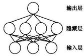
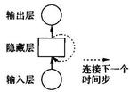
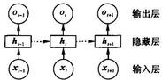
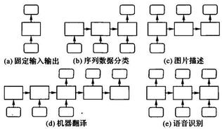
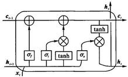
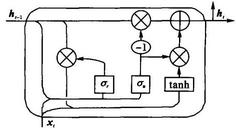

=+=+=+=+=+=+=+=+=
文章编号:1001-9081 (2018) S2-0001-06

# 循环神经网络研究综述

杨 \( {丽}^{1} \) ,吴雨茜 \( {}^{1} \) ,王俊丽 \( {}^{1} \) ,刘义理 \( {}^{2} \)

(1. 同济大学 电子与信息工程学院, 上海 201804; 2. 同济大学 经济与管理学院, 上海 201804) ( * 通信作者电子邮箱 yangli2309@163.com)

擅 要:循环神经网络(RNN)是一类非常强大的用于处理和预测序列数据的神经网络模型。循环结构的神经网络克服了传统机器学习方法对输入和输出数据的许多限制,使其成为深度学习领域中一类非常重要的模型。RNN 及其变体网络已经被成功应用于多种任务,尤其是当数据中存在一定时间依赖性的时候。语音识别、机器翻译、语言模型、文本分类、词向量生成、信息检索等,都需要一个模型能够将具有序列性质的数据作为输入进行学习；然而, RNN 通常难以训练,循环多次之后,大多数情况下梯度往往倾向于消失,也有较少情况会发生梯度爆炸的问题。针对 RNN 在实际应用中存在的问题,长短期记忆(LSTM)网络被提出,它能够保持信息的长期存储而备受关注,关于 LSTM 结构的改进工作也陆续出现。然后,主要针对循环结构的神经网络的发展进行详细阐述,对目前流行的几种变体模型进行详细的讨论和对比。最后,对循环结构的神经网络的发展趋势进行了探讨。

关键词:循环神经网络；长短期记忆网络；深度学习；神经网络；序列数据

中图分类号:TP18 文献标志码:A

# Research on recurrent neural network

YANG Li \( {}^{1 * } \) , WU Yuxi \( {}^{1} \) , WANG Junli \( {}^{1} \) , LIU Yili \( {}^{2} \)

(1. College of Electronics and Information Engineering, Tongji University, Shanghai 201804, China; 2. College of Economics and Management, Tongji University, Shanghai 201804, China)

Abstract: Recurrent Neural Network (RNN) is a kind of very powerful neural network for processing and predicting sequence data. The neural network of recurrent structure overcomes many limitations of traditional machine learning methods on input and output, making it a very important model in the field of deep learning. RNN and its variants have been successfully applied to a variety of tasks, especially with time-dependent data. Speech recognition, machine translation, language model, text classification, word vector generation, information retrieval and so on, all need a model that can learn sequence data. However, Learning with RNN has long been considered to be difficult, the gradient tends to vanish in most cases, and there are less cases where exploding will occur when backpropagating errors across many time steps. Due to problems in practical application of RNN, LSTM has been proposed for their long-term storage of information, and improvements have also been made to the structure of LSTM. Then, the development of the neural network based on recurrent structure was mainly analyzed. Several popular variants were discussed and compared in detail. Finally, the development trend of neural network with recurrent structure was discussed.

Key words: Recurrent Neural Network (RNN); Long-Short Term Memory (LSTM) network; deep learning; neural network; sequence data

传统的神经网络, 也称为前馈神经网络(Feed-Forward Neural Network, FNN), 由一系列简单的神经元组成。图 1 是一个简单的 FNN, 包括输入层、隐藏层和输出层。其层级结构通常为每层神经元与下一层神经元全连接, 同层的神经元之间不存在连接。网络结构上不存在环或者回路, 网络的输出和模型本身不存在反馈连接。数据从输入层开始逐层通过网络, 直到输出层。这些连接的权重编码了网络的知识。使用 \( x, y \) 分别代表网络的输入和输出, FNN的目标在于近似某个映射关系 \( {f}_{1} \) ,即 \( \mathbf{y} = {f}_{1}\left( {\mathbf{x};\mathbf{\theta }}\right) \) ,学习参数 \( \mathbf{\theta } \) 之后,使其能够得到最佳的近似关系。

在 FNN 中, 所有的观测值都是相互独立地进行处理。然而许多任务中的数据富含大量的上下文信息, 彼此之间也有复杂的关联性, 比如, 音频、视频和文本等, 因此 FNN 在许多任务中仍然存在很大的局限性。也有一些方法为输入提供上下文信息, 比如, 通过固定大小的窗口来将当前特征向量和先前的特征向量连接, 但是这种方法的缺点也是显而易见的, 通常可能需要更长的训练时间以及固定的、相对较短的上下文依赖。

图 1 FNN

循环神经网络(Recurrent Neural Network, RNN)主要用于处理序列数据, 其最大的特点就是神经元在某时刻的输出可以作为输入再次输入到神经元,这种串联的网络结构非常适合于时间序列数据, 可以保持数据中的依赖关系。对于展开后的 RNN,可以得到重复的结构并且网络结构中的参数是共享的,大大减少了所需训练的神经网络参数。另一方面,共享参数也使得模型可以扩展到不同长度的数据上,所以 RNN 的输入可以是不定长的序列。例如, 要训练一个固定长度的句子:若使用前馈神经网络的话,会给每个输入特征一个单独的参数; 若使用循环神经网络, 则可以在时间步内共享相同的权重参数。虽然 RNN 在设计之初的目的就是为了学习长期的依赖性, 但是大量的实践也表明, 标准的 RNN 往往很难实现信息的长期保存。Bengio 等 \( {}^{\left\lbrack  1\right\rbrack  } \) 提出标准 RNN 存在梯度消失和梯度爆炸的困扰。这两个问题都是由于 RNN 的迭代性引起的,因此, RNN 在早期并没有得到广泛的应用。

---

收稿日期:2018-03-15；修回日期:2018-04-24。基金项目:同济大学中央高校基本科研业务费资助项目。

作者简介:杨丽(1992 - ),女,河南焦作人,硕士研究生,主要研究方向:深度学习；吴雨茜(1994 - ),女,安徽安庆人,硕士研究生,主要研究方向:深度学习；王俊丽(1978-),女,山西祁县人,副研究员,博士,主要研究方向:深度学习、网络数据分析、语义网络；刘义理 (1974-),男,山东莱州人,副教授,博士,主要研究方向:电子商务、管理信息系统。

---

为解决长期依赖的问题, Hochreiter 等 \( {}^{\left\lbrack  2\right\rbrack  } \) 提出长短期记忆 ( Long-Short Time Memory, LSTM) 网络, 用于改进传统的循环神经网络模型。LSTM 也成为现如今在实际应用中最有效的序列模型。相较于 RNN 的隐藏单元, LSTM 的隐藏单元的内部结构更加复杂, 信息在沿着网络流动的过程中, 通过增加线性干预使得 LSTM 能够对信息有选择地添加或者减少。RNN 存在多种优秀的变体结构, 比如在实践中广泛流行的门控循环单元 (Gated Recurrent Unit, GRU)。LSTM 和 GRU 都是通过添加内部的门控机制来维持长期依赖的。它们的循环结构只对所有的过去状态存在依赖关系, 相应的, 当前的状态也可能和未来的信息存在依赖。Schuster 等 \( {}^{\left\lbrack  3\right\rbrack  } \) 提出双向循环神经网络 (Bi-directional RNN, BRNN), BRNN 能够在两个时间方向上学习上下文, BRNN 包含两个不同的隐藏层, 在两个方向上分别对输入进行处理。Graves 等[4]使用双向长短期记忆[7 络(Bi-directional LSTM, BLSTM)在音素识别上取得优异结果。

尤其是最近两年, 出现了很多基于 RNN 的变体结构并被应用在各个领域中。本文介绍关于 RNN 的主要内容, 包括其网络结构特点和在实际应用中存在的问题; 详细介绍 LSTM 模型的结构特点、各个计算组件的功能以及实验对比; 主要介绍两种其他的变体结构以及性能对比; 对循环结构的神经网络的发展趋势展开探讨。

## 1 RNN

RNN 是深度学习领域中一类特殊的内部存在自连接的神经网络, 可以学习复杂的矢量到矢量的映射。关于 RNN 的研究最早是由 Hopfield 提出的 Hopfield 网络模型, 其拥有很强的计算能力并且具有联想记忆功能。但因其实现较困难而被后来的其他人工神经网络和传统机器学习算法所取代。 Jordan 和 Elman 分别于 1986 年和 1990 年提出循环神经网络框架, 称为简单循环网络 (Simple Recurrent Network, SRN), 被认为是目前广泛流行的 RNN 的基础版本, 之后不断出现的更加复杂的结构均可认为是其变体或者扩展。RNN 已经被广泛用于各种与时间序列相关的任务中 \( {}^{\lbrack 5 - 7\rbrack } \) 。
=+=+=+=+=+=+=+=+=
### 1.1 RNN 网络结构

图 2 展示了 RNN 的网络结构, 通过隐藏层上的回路连接, 使得前一时刻的网络状态能够传递给当前时刻, 当前时刻的状态也可以传递给下个时刻。 万方数据

图 2 存在回路的 RNN 结构

可以将 RNN 看作所有层共享权值的深度 FNN, 通过连接两个时间步来扩展。参数共享的概念早在隐马尔可夫模型 (Hidden Markov Model, HMM) 中就已经出现, HMM 也常用于序列数据建模并且在语音识别领域一度取得很好的效果。 HMM 和 RNN 均使用内部状态来表示序列中的依赖关系。当时间序列数据存在长距离的依赖, 并且该依赖的范围随时间变化或者未知, 那么 RNN 可能是相对较好的解决方案。图 3 中,在时刻 \( t \) ,隐藏单元 \( \mathbf{h} \) 接收来自两方面的数据,分别为网络前一时刻的隐藏单元的值 \( {\mathbf{h}}_{t - 1} \) 和当前的输入数据 \( {\mathbf{x}}_{t} \) ,并通过隐藏单元的值计算当前时刻的输出。 \( t - 1 \) 时刻的输入 \( {\mathbf{x}}_{t - 1} \) 可以在之后通过循环结构影响 \( t \) 时刻的输出。RNN 的前向计算按照时间序列展开,然后使用基于时间的反向传播算法 (Back Propagation Through Time, BPTT) \( {}^{\left\lbrack  8\right\rbrack  } \) 对网络中的参数进行更新,也是目前循环神经网络最常用的训练算法。

图 3 展开后的 RNN 结构

RNN 的前向传播可以表示如下:

\[
\left\{  \begin{array}{l} {\mathbf{h}}_{t} = \sigma \left( {{\mathbf{W}}_{xh}{\mathbf{x}}_{t} + {\mathbf{W}}_{hh}{\mathbf{h}}_{t - 1} + {\mathbf{b}}_{h}}\right) \\  {\mathbf{o}}_{t + 1} = {\mathbf{W}}_{hy}{\mathbf{h}}_{t} + {\mathbf{b}}_{y} \\  {\mathbf{y}}_{t} = \operatorname{softmax}\left( {\mathbf{o}}_{t}\right)  \end{array}\right.  \tag{1}
\]

其中: \( {\mathbf{W}}_{xh} \) 为输入单元到隐藏单元的权重矩阵, \( {\mathbf{W}}_{hh} \) 为隐藏单元之间的连接权重矩阵, \( {\mathbf{W}}_{hy} \) 为隐藏单元到输出单元的连接权重矩阵, \( {\mathbf{b}}_{y} \) 和 \( {\mathbf{b}}_{h} \) 为偏置向量。计算过程中所需要的参数是共享的,因此理论上 RNN 可以处理任意长度的序列数据。 \( {\mathbf{h}}_{l} \) 的计算需要 \( {\mathbf{h}}_{t - 1},{\mathbf{h}}_{t - 1} \) 的计算又需要 \( {\mathbf{h}}_{t - 2} \) ,以此类推,所以 RNN 中某一时刻的状态对过去的所有状态都存在依赖。RNN 能够将序列数据映射为序列数据输出, 但是输出序列的长度并不是一定与输入序列长度一致, 根据不同的任务要求, 可以有多种对应关系。
=+=+=+=+=+=+=+=+=
### 1.2 RNN 的输出

FNN 中, 通过学习得到的映射关系, 可以将输入向量映射到输出向量, 从而使得输入和输出向量相互关联; RNN 是前馈神经网络在时间维度上的扩展。对于 FNN, 它接受固定大小的向量作为输入并产生固定大小的输出, 这样对于输入的限制就很大；然而, RNN 并没有这个限制,无论是输入序列的长度还是输出序列。图 \( {4}^{\left\lbrack  9\right\rbrack  } \) 进行了更加详细的说明。

图 4 中: (a) 表示传统的、固定尺度的输入到固定尺度的输出; (b) 序列输入, 可用于表示例如情感分析等任务, 给定句子然后将其与一个情感表示向量关联；(c)序列输出,可以用于表示图片标注等任务,输入固定大小的向量表示的图片, 输出图片描述；(d) 和 (e) 中的输入和输出均为序列数据,且输入和输出分别为非同步和同步, (d) 可以用于机器翻译等任务,(e)常用于语音识别中。

图 4 RNN 的输入和输出
=+=+=+=+=+=+=+=+=
### 1.3 梯度消失和梯度爆炸

在实际应用中, RNN 常常面临训练方面的难题; 尤其随着模型深度不断增加,使得 RNN 并不能很好地处理长距离的依赖 \( {}^{\left\lbrack  1\right\rbrack  } \) 。Jacobian 矩阵的乘积往往会以指数级增大或者减小,其结果是使得长期依赖特别困难。

通常使用 BPTT 算法来训练 RNN, 对于基于梯度的学习需要模型参数 \( \mathbf{\theta } \) 和损失函数 \( L \) 之间存在闭式解,根据估计值和实际值之间的误差来最小化损失函数, 那么在损失函数上计算得到的梯度信息可以传回给模型参数并进行相应修改。 假设对于序列 \( {\mathbf{x}}_{1},{\mathbf{x}}_{2},\cdots ,{\mathbf{x}}_{t} \) ,通过 \( {\mathbf{s}}_{t} = {F}_{\theta }\left( {{\mathbf{s}}_{t - 1},{\mathbf{x}}_{t}}\right) \) 将上一时刻的状态 \( {s}_{t - 1} \) 映射到下一时刻的状态 \( {s}_{t} \) 。 \( T \) 时刻损失函数 \( {L}_{T} \) 关于参数的梯度为:

\[
{\nabla }_{\theta }{L}_{T} = \frac{\partial {L}_{T}}{\partial \mathbf{\theta }} = \mathop{\sum }\limits_{{t \leq  T}}\frac{\partial {L}_{T}}{\partial {\mathbf{s}}_{T}}\frac{\partial {\mathbf{s}}_{T}}{\partial {\mathbf{s}}_{t}}\frac{\partial {F}_{\theta }\left( {{\mathbf{s}}_{t - 1},{\mathbf{x}}_{t}}\right) }{\partial \mathbf{\theta }} \tag{2}
\]

根据链式法则,将 Jacobian 矩阵 \( \frac{\partial {s}_{r}}{\partial {s}_{t}} \) 分解如式 (3) 所示:

\[
\frac{\partial {\mathbf{s}}_{T}}{\partial {\mathbf{s}}_{t}} = \frac{\partial {\mathbf{s}}_{T}}{\partial {\mathbf{s}}_{T - 1}}\frac{\partial {\mathbf{s}}_{T - 1}}{\partial {\mathbf{s}}_{T - 2}}\cdots \frac{\partial {\mathbf{s}}_{t + 1}}{\partial {\mathbf{s}}_{t}} = {f}_{T}^{\prime }{f}_{T - 1}^{\prime }\cdots {f}_{1}^{\prime } \tag{3}
\]

根据文献 \( \left\lbrack  {1,{10} - {11}}\right\rbrack \) ,循环网络若要可靠地存储信息, \( \left| {f}_{t}^{\prime }\right|  < 1 \) ,也意味着当模型能够保持长距离依赖 \( z \) 时,其本身也处于梯度消失的情况下。随着时间跨度增加,梯度 \( {\nabla }_{\theta }{L}_{T} \) 也会以指数级收敛于 \( {0}_{ \circ  } \) 当 \( \left| {f}_{t}^{\prime }\right|  > 1 \) 时,发生梯度爆炸的现象, 网络也陷入局部不稳定。

## 2 LSTM

使用梯度下降方法来优化 RNN 的一个主要问题就是梯度在沿着序列反向传播的过程中可能快速消失 \( {}^{\left\lbrack  1\right\rbrack  } \) 。已经有大量的研究工作用于解决 RNN 中存在的训练问题并且提出了关于 RNN 的变体, 其中最具代表性的两个网络分别为回声状态网络(Echo State Network, ESN) 和 LSTM。下面将重点围绕 LSTM 模型的网络结构及其特性进行介绍。

目前, 在实际应用中使用最广泛的循环结构网络架构来自于 Hochreiter 等 \( {}^{\left\lbrack  2\right\rbrack  } \) 提出的 LSTM 模型(无遗忘门),它能够有效克服 RNN 中存在的梯度消失问题, 尤其在长距离依赖的任务中的表现远优于 \( {\mathrm{{RNN}}}^{\left\lbrack  {12}\right\rbrack  } \) ,梯度反向传播过程中不会再受到梯度消失问题的困扰, 可以对存在短期或者长期依赖的数据进行精确的建模。LSTM 的工作方式与 RNN 基本相同, 区别在于 LSTM 实现了一个更加细化的内部处理单元, 来实现上下文信息的有效存储和更新。由于其优秀的性质, LSTM 已经被用于大量的和序列学习相关的任务中, 比如语音识别 \( {}^{\left\lbrack  {13}\right\rbrack  } \) 、语言模型 \( {}^{\left\lbrack  {14} - {16}\right\rbrack  } \) 、词性标注 \( {}^{\left\lbrack  {17}\right\rbrack  } \) 、机器翻译 \( {}^{\left\lbrack  {18} - {19}\right\rbrack  } \) 。 Palangi 等 \( {}^{\left\lbrack  5\right\rbrack  } \) 使用 LSTM 来学习具有语义的句子向量,然后将该特征向量用于网络中的文档检索任务, 网络的隐藏层提供了整个句子的语义表示并且能够检测句子中的关键字。 Miyamoto 等 \( {}^{\left\lbrack  {15}\right\rbrack  } \) 引入了基于 BLSTM 的语言模型,并且提出词- 字符门用于解决未登录词的表示, 可以自适应地对词和字符级的词向量进行混合来得到最终的词向量表示。Li 等 \( {}^{\left\lbrack  {20}\right\rbrack  } \) 提出基于动态扩展树的 BLSTM( Dynamaic extended tree BLSTM, DET-BLSTM)模型用于事件提取, 使用动态扩展树、词性和距离信息对输入进行丰富。谷歌公司将 LSTM 用于其智能手机上的语音识别以及谷歌翻译 \( {}^{\left\lbrack  {18}\right\rbrack  } \) 。
=+=+=+=+=+=+=+=+=
### 2.1 LSTM 单元

Hochreiter 等 \( {}^{\left\lbrack  2\right\rbrack  } \) 的主要贡献是引入了记忆单元和门控记忆单元保存历史信息、长期状态, 使用门控来控制信息的流动。本文将 LSTM 网络中的隐藏单元称为 LSTM 单元, 将隐藏单元为 LSTM 单元的循环神经网络称为 LSTM 网络或者 LSTM。本文介绍的 LSTM 架构来自于 Graves 等 \( {}^{\left\lbrack  4\right\rbrack  } \) ,但是没有窥视孔连接 (peephole connection, pc)。

如图 5 所示, LSTM 单元中有三种类型的门控, 分别为: 输入门、遗忘门和输出门。门控可以看作一层全连接层, LSTM 对信息的存储和更新正是由这些门控来实现。更具体地说, 门控是由 sigmoid 函数和点乘运算实现,门控并不会提供额外的信息。门控的一般形式可以表示为:

\[
g\left( x\right)  = \sigma \left( {{Wx} + b}\right)  \tag{4}
\]

其中 \( \sigma \left( x\right)  = 1/\left( {1 + \exp \left( {-x}\right) }\right) \) ,称为 Sigmoid 函数,是机器学习中常用的非线性激活函数, 可以将一个实值映射到区间 0~1,用于描述信息通过的多少。当门的输出值为 0,表示没有信息通过,当值为 1 则表示所有信息都可以通过。

分别使用 \( \mathbf{i} \) 、 \( \mathbf{f} \) 和 \( \mathbf{o} \) 来表示输入、遗忘和输出门, \( \odot \) 代表对应元素相乘, \( \mathbf{W} \) 和 \( \mathbf{b} \) 表示网络的权重矩阵和偏置向量。

图 5 LSTM 单元结构

LSTM 的前向计算过程可以表示为式(5)~(9)。在时间步 \( t \) 时, LSTM 的隐藏层的输入和输出向量分别为 \( {\mathbf{x}}_{t} \) 和 \( {\mathbf{h}}_{t} \) ,记忆单元为 \( {\mathbf{c}}_{t} \) 。输入门用于控制网络当前输入数据 \( {\mathbf{x}}_{t} \) 流入记忆单元的多少,即有多少可以保存到 \( {c}_{t} \) ,其值为:

\[
{\mathbf{i}}_{t} = \sigma \left( {{\mathbf{W}}_{xi}{\mathbf{x}}_{t} + {\mathbf{W}}_{hi}{\mathbf{h}}_{t - 1} + {\mathbf{b}}_{i}}\right)  \tag{5}
\]

遗忘门是 LSTM 单元的关键组成部分,可以控制哪些信息要保留哪些要遗忘, 并且以某种方式避免当梯度随时间反向传播时引发的梯度消失和爆炸问题。遗忘门控制自连接单元,可以决定历史信息中的哪些部分会被丢弃。即上一时刻记忆单元 \( {\mathbf{c}}_{t - 1} \) 中的信息对当前记忆单元 \( {\mathbf{c}}_{t} \) 的影响。

\[
{\mathbf{f}}_{t} = \sigma \left( {{\mathbf{W}}_{xf}{\mathbf{x}}_{t} + {\mathbf{W}}_{hf}{\mathbf{h}}_{t - 1} + {\mathbf{b}}_{f}}\right)  \tag{6}
\]

\[
{\mathbf{c}}_{t} = {\mathbf{f}}_{t} \odot  {\mathbf{c}}_{t - 1} + {\mathbf{i}}_{t} \odot  \tanh \left( {{\mathbf{W}}_{xc}{\mathbf{x}}_{t} + {\mathbf{W}}_{hc}{\mathbf{h}}_{t - 1} + {\mathbf{b}}_{c}}\right)  \tag{7}
\]

输出门控制记忆单元 \( {\mathbf{c}}_{t} \) 对当前输出值 \( {\mathbf{h}}_{t} \) 的影响,即记忆单元中的哪一部分会在时间步 \( t \) 输出。输出门的值如式 (8) 所示, LSTM 单元的在 \( t \) 时刻的输出 \( {\mathbf{h}}_{t} \) 可以通过式 (9) 得到。

\[
{o}_{t} = \sigma \left( {{W}_{xo}{x}_{t} + {W}_{ho}{h}_{t - 1} + {b}_{o}}\right)  \tag{8}
\]

\[
{\mathbf{h}}_{t} = {\mathbf{o}}_{t} \odot  \tanh \left( {\mathbf{c}}_{t}\right)  \tag{9}
\]
=+=+=+=+=+=+=+=+=
### 2.2 LSTM 与其变体的分析

LSTM 已经可以解决很多 RNN 无法处理的任务, 在此之后也陆续出现了很多关于 LSTM 单元的改进工作。Gers 等 \( {}^{\left\lbrack  {21}\right\rbrack  } \) 对 LSTM 单元进行了完善,引入了遗忘门。遗忘门使得 LSTM 能够学习一些连续的任务并且可以对其内部状态进行重置,其也成为现如今广泛使用的 LSTM 中的一个标准组件。 Gers 等 \( {}^{\left\lbrack  {22}\right\rbrack  } \) 提出窥视孔连接 (pc),其前向传播如式 (10) 所示, 主要是增加三个门控单元和记忆单元的连接, 即门控单元可以观察到记忆单元。

\[
\left\{  \begin{array}{l} {\mathbf{i}}_{t} = \sigma \left( {{\mathbf{W}}_{xi}{\mathbf{x}}_{t} + {\mathbf{W}}_{hi}{\mathbf{h}}_{t - 1} + {\mathbf{W}}_{ci}{\mathbf{c}}_{c, t - 1} + {\mathbf{b}}_{i}}\right) \\  {\mathbf{f}}_{ft} = \sigma \left( {{\mathbf{W}}_{xf}{\mathbf{x}}_{t} + {\mathbf{W}}_{hf}{\mathbf{h}}_{t - 1} + {\mathbf{W}}_{cf}{\mathbf{c}}_{t - 1} + {\mathbf{b}}_{f}}\right) \\  {\mathbf{c}}_{t} = {\mathbf{f}}_{t} \odot  {\mathbf{c}}_{t - 1} + {i}_{t} \odot  \tanh \left( {{\mathbf{W}}_{xc}{\mathbf{x}}_{t} + {\mathbf{W}}_{hc}{\mathbf{h}}_{t - 1} + {\mathbf{b}}_{c}}\right) \\  {\mathbf{o}}_{t} = \sigma \left( {{\mathbf{W}}_{xo}{\mathbf{x}}_{t} + {\mathbf{W}}_{ho}{\mathbf{h}}_{t - 1} + {\mathbf{W}}_{co}{\mathbf{c}}_{t} + {\mathbf{b}}_{o}}\right) \\  {\mathbf{h}}_{t} = {\mathbf{o}}_{t} \odot  \tanh \left( {\mathbf{c}}_{t}\right)  \end{array}\right.  \tag{10}
\]

LSTM 的内部结构相对复杂, LSTM 结构中哪些部分是真正必须的? 起到什么作用? 还可以设计哪些组件? 接下来, 本文在语言模型这个任务中, 对 LSTM 结构中的组件进行分析和探究。一个句子通常可以看作是单词的序列, 如长度为 \( m \) 的句子 \( {se}, w \) 表示单词,则 \( {se} = \left( {{w}_{1}, w,{w}_{2},\cdots ,{w}_{m}}\right) \) ,其概率为:

\[
p\left( \mathbf{{se}}\right)  = p\left( {{\mathbf{w}}_{1},{\mathbf{w}}_{2},\cdots ,{\mathbf{w}}_{m}}\right)  = p\left( {\mathbf{w}}_{1}\right) p\left( {{\mathbf{w}}_{2} \mid  {\mathbf{w}}_{1}}\right) \cdots
\]

\[
p\left( {{w}_{m} \mid  {w}_{1},{w}_{2},\cdots ,{w}_{m - 1}}\right)  \tag{11}
\]

语言模型可以用于计算和预测下一个单词出现的概率。 复杂度(perplexity) 是用于衡量模型性能的重要指标, 可理解为模型预测下一个单词的平均可选择数量。perplexity 值越低, 模型性能越好。perplexity 计算如下:

\[
\text{perplexity}\left( {se}\right)  = p{\left( {w}_{1},{w}_{2},\cdots ,{w}_{m}\right) }^{1/m} =
\]

\[
\sqrt[m]{\frac{1}{p\left( {{w}_{1},{w}_{2},\cdots ,{w}_{m}}\right) }} =
\]

\[
\sqrt[m]{\mathop{\prod }\limits_{{i = 1}}^{m}\frac{1}{p\left( {{w}_{1} \mid  {w}_{1},{w}_{2},\cdots ,{w}_{i - 1}}\right) }} \tag{12}
\]

以下网络使用语言模型任务中常用的 PTB 数据集,实验基于 TensorFlow 框架,平台配置为 Ubuntu 16.04, GTX1080 *2。

以 LSTM 为基准,去除单一组件分别获得以下几种变体: 没有输入门的 LSTM-i(设置 \( {i}_{t} = 1 \) ),没有遗忘门的 LSTM-f (设置 \( {f}_{t} = 1 \) ),没有输出门 LSTM-o(设置 \( {o}_{t} = 1 \) ),具有窥视孔连接 LSTM-pc。

表 1 展示了上述变体网络分别在验证集 (Validation) 和测试集 (Test) 上取得的结果。发现 LSTM 和 LSTM-pc 的性能基本相当, 没有输入门的 LSTM 虽然得到收敛, 但是表现较差。遗忘门和输入门对于网络来说非常重要。

表 1 各模型复杂度

<table><tr><td>模型</td><td>Validation</td><td>Test</td></tr><tr><td>LSTM</td><td>104.261</td><td>100.031</td></tr><tr><td>LSTM-i</td><td>115.447</td><td>111.352</td></tr><tr><td>LSTM-f</td><td>119.236</td><td>114.561</td></tr><tr><td>\( \mathbf{{LSTM} - o} \)</td><td>106.589</td><td>101.705</td></tr><tr><td>\( \mathbf{{LSTM} - {pc}} \)</td><td>104.570</td><td>100.322</td></tr></table>

## 3 LSTM 单元的改进与其分析
=+=+=+=+=+=+=+=+=
### 3.1 GRU

另一个广泛流行的 LSTM 单元的变体是 Cho 等 \( {}^{\left\lbrack  {17}\right\rbrack  } \) 提出的一种简化结构称为 GRU, 其结构如图 6 所示。Zhao 等 \( {}^{\left\lbrack  {23}\right\rbrack  } \) 提出基于局部特征的 GRU ( Local Feature-based GRU, 万方数据 LFGRU), 使用双向 GRU 结构提高模型的表现力, 并在机器健康侦测的三个实际任务中证明了模型的有效性和鲁棒性。 GRU 没有窥视孔连接和输出激活函数, 也没有线性自连接的记忆单元,而是直接线性累积在隐藏状态 \( \mathbf{h} \) 上。使用两个门控控制信息流动, LSTM 单元中的输入门和遗忘门在 GRU 中耦合为更新门,更新门用于控制隐藏状态的更新,即当 \( {\mathbf{u}}_{t} = \) 0,无论序列有多长,都可以保持最初时间步中的信息。重置门决定是否忽略之前的隐藏状态,分别使用 \( \mathbf{u} \) 和 \( \mathbf{r} \) 表示更新门和复位门。GRU 前向传播计算如下:

\[
\left\{  \begin{array}{l} {\mathbf{u}}_{t} = \sigma \left( {{\mathbf{W}}_{xu}{\mathbf{x}}_{t} + {\mathbf{W}}_{hu}{\mathbf{h}}_{t - 1} + {\mathbf{b}}_{u}}\right) \\  {\mathbf{r}}_{t} = \sigma \left( {{\mathbf{W}}_{xr}{\mathbf{x}}_{t} + {\mathbf{W}}_{hr}{\mathbf{h}}_{t - 1} + {\mathbf{b}}_{r}}\right) \\  {\widetilde{\mathbf{h}}}_{t} = \tanh \left( {{\mathbf{W}}_{xh}{\mathbf{x}}_{t} + {\mathbf{W}}_{hh}\left( {{\mathbf{r}}_{t} \odot  {\mathbf{h}}_{t - 1}}\right)  + {\mathbf{b}}_{h}}\right) \\  {\mathbf{h}}_{t} = {\mathbf{u}}_{t}{\mathbf{h}}_{t - 1} + \left( {1 - {\mathbf{u}}_{t}}\right)  \odot  {\widetilde{h}}_{t} \end{array}\right.  \tag{13}
\]

图 6 GRU 单元结构

Chung 等 \( {}^{\left\lbrack  {24}\right\rbrack  } \) 进行了 GRU、LSTM 和使用双曲正切激活函数 (Tanh) 的 RNN 的比较。为进行合理的比较, 每个模型具有大致相同数量的参数, 模型参数的信息如表 2 所示。

表 2 模型规模

<table><tr><td>任务类型</td><td>Unit</td><td>#of Unit</td><td>#of Parameters</td></tr><tr><td rowspan="3">复调音 乐建模</td><td>LSTM</td><td>36</td><td>1.98E +4</td></tr><tr><td>GRU</td><td>46</td><td>\( {2.02E} + 4 \)</td></tr><tr><td>Tanh</td><td>100</td><td>2.01E + 4</td></tr><tr><td rowspan="3">语音信 号建模</td><td>LSTM</td><td>195</td><td>1.691E + 5</td></tr><tr><td>GRU</td><td>227</td><td>1.689E +5</td></tr><tr><td>Tanh</td><td>400</td><td>1. 684E + 5</td></tr></table>

尽可能使得模型规模比较小, 这样可以避免过拟合。分别在复调音乐建模、语音信号建模任务上进行评估。对于复调音乐建模, 数据集来自于文献[25], 分别为: Nottingham、JSB Chorales、MuseData 和 Piano-midi；语音信号建模的数据集来自于 Ubisoft。

表 3 展示了 3 个模型分别在测试集和训练集上的表现。

表 3 训练集和测试集上的平均负对数概率

<table><tr><td>数据集 类型</td><td>数据集 名称</td><td>训练集/ 测试集</td><td>Tanh</td><td>GRU</td><td>LSTM</td></tr><tr><td rowspan="8">音乐 数据集</td><td rowspan="2">Nottingham</td><td>train</td><td>3.22</td><td>2.79</td><td>3.08</td></tr><tr><td>test</td><td>3.13</td><td>3.23</td><td>3.20</td></tr><tr><td rowspan="2">JSB Chorales</td><td>train</td><td>8.82</td><td>6.49</td><td>8. 15</td></tr><tr><td>test</td><td>9.10</td><td>8.54</td><td>8.67</td></tr><tr><td rowspan="2">MuseData</td><td>train</td><td>5.64</td><td>5.06</td><td>5.18</td></tr><tr><td>test</td><td>6.23</td><td>5.99</td><td>6.23</td></tr><tr><td rowspan="2">Piano-midi</td><td>train</td><td>5.64</td><td>4.93</td><td>6.49</td></tr><tr><td>test</td><td>9.03</td><td>8.82</td><td>9.03</td></tr><tr><td rowspan="4">Ubisoft 数据集</td><td>Ubisoft</td><td>train</td><td>6.29</td><td>2.31</td><td>1.44</td></tr><tr><td>数据集 A</td><td>test</td><td>6.44</td><td>3.59</td><td>2.70</td></tr><tr><td>Ubisoft</td><td>train</td><td>7.61</td><td>0.38</td><td>0.80</td></tr><tr><td>数据集 B</td><td>test</td><td>7.62</td><td>0.88</td><td>1.26</td></tr></table>

通过实验可以发现, 基于门控结构的循环网络比传统的 RNN 的性能更好。GRU 和 LSTM 的表现基本相当, GRU 在复调音乐建模的表现优于 LSTM(除了 Nottingham 数据集上), 所以 GRU 和 LSTM 可以根据实际任务进行选择。
=+=+=+=+=+=+=+=+=
### 3.2 SRU

对于具有循环结构的神经网络, 由于当前时间步的计算依赖于上一时间步的输出, 比如在 LSTM 单元中, 时刻门控单元的更新依赖于 \( t - 1 \) 时刻的隐藏状态 \( {\mathbf{h}}_{t - 1} \) ,这阻碍了序列的并行处理, 序列中的每个元素必须按顺序计算。如何加速循环结构的网络的训练,也是最近一个非常热门的研究课题。

Bradbury 等 \( {}^{\left\lbrack  {25}\right\rbrack  } \) 提出加速算法类循环神经网络 (Quasi-Recurrent Neural Network, QRNN), 是一种交替使用卷积层的序列建模方法。通过在情感分类、语言模型和机器翻译 3 个与序列数据相关的任务中进行验证, 它在保持性能不错的同时获得了很好的加速效果。Lei 等 \( {}^{\left\lbrack  {27}\right\rbrack  } \) 为提高模型的训练速度, 提出简单循环单元 (Simple Recurrent Unit, SRU)。在目前的深度学习领域中, 为了提高模型的表现能力, 在一些任务中通常会使用更深的深层网络; 然而, 这往往也会需要更多的计算资源、耗费更多的训练时间。SRU 正是为提高 LSTM 训练速度的一种变体结构, 丢弃循环结构中的依赖关系。SRU 在简化门控单元的计算同时, 仍保持强大的表现能力。加速的实现主要从两点出发:

1)门控单元和输入的转换只依赖于当前时间步的输入, 所以在多个时间步上可以同时处理, 无需因为依赖关系而必须顺序进行。

\[
\left\{  \begin{array}{l} {\widetilde{x}}_{t} = W{x}_{t} \\  {f}_{t} = \sigma \left( {{W}_{xf}{x}_{t} + {b}_{d}}\right) \\  {r}_{t} = \sigma \left( {{W}_{yc}{x}_{t} + {b}_{c}}\right)  \end{array}\right.  \tag{14}
\]

但是记忆单元 \( {\mathbf{c}}_{t} \) 的更新计算仍然依赖于上一时间步,记忆单元的时间依赖并没有解除,如式 (15),在 \( t \) 时刻的输出为 \( {h}_{t} \) 。

\[
{\mathbf{c}}_{t} = {\mathbf{f}}_{t} \odot  {\mathbf{c}}_{t - 1} + \left( {1 - {\mathbf{f}}_{t}}\right)  \odot  {\widetilde{\mathbf{x}}}_{t} \tag{15}
\]

\[
{\mathbf{h}}_{t} = {\mathbf{r}}_{t} \odot  \tanh \left( {\mathbf{c}}_{t}\right)  + \left( {1 - {\mathbf{c}}_{t}}\right)  \odot  {\mathbf{x}}_{t} \tag{16}
\]

2)CUDA(Compute Unified Device Architecture)级优化。

将式(15)、(16)中的元素之间的操作,通过 CUDA 级的矩阵运算快速计算。

## 4 循环神经网络的发展趋势

目前,对于循环神经网络的改进有很多,这些技术大多都是基于 LSTM 的扩展。这些改进的工作, 可能会在未来几年的深度学习领域中发挥重要作用。
=+=+=+=+=+=+=+=+=
### 4.1 网络结构的探究

越来越多的任务需要处理序列数据, RNN 是一个非常强大的用于序列建模的神经网络, 在深度学习领域占据非常重要的地位。LSTM 是隐藏单元加入复杂门控机制的循环网络架构, 由于其能够保持数据中的长期依赖, 在实际应用中得到广泛的使用。在 LSTM 被提出以来, 关于其的变体结构就不断涌现。虽然 LSTM 已经在许多领域取得了优异的结果, 但是值得思考的问题是, 虽然 LSTM 确实可以解决梯度消失问题, 但是其中各个组件的作用难以证明。在这些复杂的组件中,到底哪些计算组件是必不可少的? 很多研究工作基于该目的出发,探究 LSTM 中每个组件的作用,获取更多的可解释性并试图寻找更优的架构。Jozefowicz 等 \( {}^{\left\lbrack  {28}\right\rbrack  } \) 对 LSTM 架构展开评估, 进行了全面的架构搜索, 得到的 3 个优秀架构都和 GRU 类似。发现 GRU 可以作为 LSTM 的一种替代, 并且几乎在所有任务上的表现都优于 LSTM; 同时还开展了额外的实验来探究 LSTM 中各组件的重要性, 发现输出门是不重要的, 输入门和遗忘门是重要的; 并且还提到了关于 LSTM 讨论中的另外一个重要技术细节, 当遗忘门的偏置设置为 1 时, 可以提高 LSTM 的性能。Greff 等 \( {}^{\left\lbrack  {29}\right\rbrack  } \) 也将 LSTM 的变体在各个数据集中进行比较, 使用了 8 种可能的修改方案, 但是并没有那一种修改可以显著提高 LSTM 的性能。
=+=+=+=+=+=+=+=+=
### 4.2 混合的神经网络

在大多数的实际任务中, 循环网络模型通常使用双向结构或者深层网络来提高模型的表现能力。也有很多尝试将其他网络和循环神经网络进行结合以取得更好的效果。

#### 4.2.1 CNN 和 LSTM 结合

将卷积神经网络 (Convolutional Neural Network, CNN) 和 ISTM进行结合 在自然语言处理领域 I i 等 [30] 设 CNN I BLSTM 结合用于电影推荐中的情感分析。Zhou 等 \( {}^{\left\lbrack  {31}\right\rbrack  } \) 提出 \( \mathrm{C} \) - LSTM(Convolutional-LSTM) 用于分类任务, CNN 能够提取局部特征, LSTM 能够获取整个句子的表示,能够捕获特征序列上的长期依赖。其他领域中, Tsironi 等 \( {}^{\left\lbrack  {32}\right\rbrack  } \) 提出卷积长短期记忆网络 (Convolutional Long Short-Term Memory Recurrent Neural Network, CNNLSTM), 将 CNN 和 LSTM 结合用于手势识别,并且通过对比实现证明 CNNLSTM 的表现比单独只使用 CNN 或者 LSTM 的效果更好。Donahue 等 \( {}^{\left\lbrack  {33}\right\rbrack  } \) 将 CNNLSTM 用于计算机视觉中的识别和描述。

#### 4.2.2 引入 Attention 机制

人们在观察和思考的过程中, 目光总会随着感兴趣的区域发生移动。Attention 机制正是受到这种思想的启发, 在图像识别、语言翻译等任务中已经使用,来提升模型的表现能力。He 等 \( {}^{\left\lbrack  {34}\right\rbrack  } \) 在混合的网络 (CNN 和 BLSTM) 中加入 Attention,提取文档的语义特征。Wang 等 \( {}^{\left\lbrack  {35}\right\rbrack  } \) 使用基于 Atttention 的 LSTM 进行情感分类, Attention 机制可以关注句子的不同部分。Liu 等 \( {}^{\left\lbrack  {36}\right\rbrack  } \) 在 LSTM 中加入 Attention 进行三维动作识别, LSTM 可以对动态序列数据建模并且保持数据中的依赖,但是在动作分析中并不需要所有的关节点, 不相关的关节点反而会带来很多噪声, Attention 机制可以更多地关注提供有用信息的关节点。

除此之外, 还有一些工作通过将其他网络和循环结构网络结合来获得更好的表现。比如, Zhao 等 \( {}^{\left\lbrack  {37}\right\rbrack  } \) 使用 LSTM-Autoencoders 用于人脸识别, Lee 等 \( {}^{\left\lbrack  {38}\right\rbrack  } \) 提出 LSTM-CRF (LSTM Conditional Random Field) 用于命名实体识别。
=+=+=+=+=+=+=+=+=
### 4.3 加速计算和新的变体

如 3.2 节中提到的 SRU、QRNN 等, 都是为了实现循环结构的并行计算而提出的变体。如何加速循环结构网络的计算仍然是一个值得探究的课题, Graves \( {}^{\left\lbrack  {39}\right\rbrack  } \) 提出 \( \mathrm{{ACT}} \) ( Adaptive Computation Time) 算法, 该算法允许循环网络能够学习, 在输入到输出之间需要使用多少计算步骤。Kalchbrenner 等 \( {}^{\left\lbrack  {40}\right\rbrack  } \) 对 LSTM 进行改进, 提出的 Grid LSTM 能够接受更高维度的输入。Bouaziz 等 \( {}^{\left\lbrack  {41}\right\rbrack  } \) 提出 PLSTM (Parallel LSTM) 可以用于并行序列分类。Ghosh 等 \( {}^{\left\lbrack  {42}\right\rbrack  } \) 提出的 CLSTM (Contextual LSTM) 在自然语言处理领域的相关任务中获得了不错的表现。

## 5 结语

本文对具有循环结构的神经网络展开讨论, 作了一个全面的综述。分析了 RNN 和在实际应用得到广泛使用的变体如 LSTM、GRU、SRU,特别集中在具有门控机制的循环结构上,并对隐藏单元中的组件的作用进行探究。对 RNN 的几种变体的网络结构、主要特点进行详细的阐述和比较。

目前, 循环神经网络已经成为深度学习领域中一类非常重要的模型, 使得网络可以处理文本、音频和视频等序列数据, 并且在许多领域都取得瞩目的结果。但是, 关于循环结构中计算组件的探究仍在继续, 通过改变循环结构中的计算组件以提升其性能, 这也将是本研究未来努力的方向。 参考文献:

[1] BENGIO Y, SIMARD P, FRASCONI P. Learning long-term dependencies with gradient descent is difficult[J]. IEEE Transactions on Neural Networks, 1994, 5(2):157-166.

[2] HOCHREITER S, SCHMIDHUBER J. Long short-term memory[ J]. Neural Computation, 1997, 9(8) : 1735-1780.

[3] SCHUSTER M, PALIWAL K K. Bidirectional recurrent neural networks[J]. IEEE Transactions on Signal Processing, 1997, 45(11): 2673 - 2681 .

[4] GRAVES A, SCHMIDHUBER J. Framewise phoneme classification with bidirectional LSTM and other neural network architectures[J]. Neural Networks, 2005, 18(5/6):602-610.

[5] PALANGI H, DENG L, SHEN Y, et al. Deep sentence embedding using long short-term memory networks: Analysis and application to information retrieval [J]. IEEE/ACM Transactions on Audio, Speech and Language Processing, 2016, 24(4): 694-707.

[6] 张剑, 屈丹, 李真. 基于词向量特征的循环神经网络语言模型 [J]. 模式识别与人工智能, 2015, 28(4): 299-305.

[7] MIKOLOV T, SUTSKEVER I, CHEN K, et al. Distributed representations of words and phrases and their compositionality[C]//Proceedings of the 26th International Conference on Neural Information Processing Systems. Red Hook: Curran Associates Inc, 2013, 2: 3111 - 3119.

[8] WERBOS P J. Backpropagation through time: what it does and how to do it[ J]. Proceedings of the IEEE, 1990, 78(10) : 1550-1560.

[9] KARPATHY A. The unreasonable effectiveness of recurrent neural networks[EB/OL]. [2016-08-13]. http://karpathy.github.io/ 2015/05/21/rnn-effectiveness/.

[10] KOLEN J F, KREMER S C. Gradient flow in recurrent nets: the difficulty of learning long term dependencies \( \left\lbrack  {\mathrm{C}/\mathrm{{OL}}}\right\rbrack  // \) A Field Guide to Dynamical Recurrent Neural Networks. Piscataway: IEEE, 2001[2018-03-01]. http://www.bioinf.jku.at/publications/older/ch7.pdf.

[11] BIANCHI F M, LIVI L, ALIPPI C. Investigating echo-state networks dynamics by means of recurrence analysis[J]. IEEE Transactions on Neural Networks & Learning Systems, 2016, 29(2): \( {427} - {439} \)

[12] GERS F A, SCHRAUDOLPH N N. Learning precise timing with LSTM recurrent networks [J]. Journal of Machine Learning Research, \( {2002},3\left( 1\right)  : {115} - {143} \) .

[13] GRAVES A, JAITLY N. Towards end-to-end speech recognition with recurrent neural networks[C]// Proceedings of the 31st International Conference on Machine Learning. Beijing: JMLR, 2014: 1764 - 1772.

[14] AKASE S, SUZUKI J, NAGATA M. Input-to-output gate to improve RNN language models [J]. arXiv Preprint, 2017, 2017: arXiv: 1709. 08907. 万方数据

[15] MIYAMOTO Y, CHO K. Gated word-character recurrent language model[J]. arXiv Preprint, 2016, 2016: arXiv: 1606.01700.

[16] JOZEFOWICZ R, VINYALS O, SCHUSTER M, et al. Exploring the limits of language modeling[J]. arXiv Preprint, 2016, 2016: arXiv: 1602.02410.

[17] CHO K, van MERRIENBOER B, GULCEHRE C, et al. Learning phrase representations using RNN encoder-decoder for statistical machine translation[J]. arXiv Preprint, 2014, 2014: arXiv: 1406. 1078.

[18] BAHDANAU D, CHO K, BENGIO Y. Neural machine translation by jointly learning to align and translate[J]. arXiv Preprint, 2014, 2014: arXiv: 1409.0473.

[19] WU Y, SCHUSTER M, CHEN Z, et al. Google's neural machine translation system: Bridging the gap between human and machine translation[J]. arXiv Preprint, 2016, 2016: arXiv:1609.08144.

[20] LI L, ZHENG J, WAN J, et al. Biomedical event extraction via long short term memory networks along dynamic extended tree [C] // Proceedings of the 2016 IEEE International Conference on Bioinformatics and Biomedicine. Piscataway, NJ: IEEE, 2017: 739-742.

[21] GERS F A, SCHMIDHUBER J, CUMMINS F. Learning to forget: continual prediction with LSTM [J]. Neural Computation, 2000, \( {12}\left( {10}\right)  : {2451} - {2471} \)

[22] GERS F A, SCHMIDHUBER J. Recurrent nets that time and count[C]// Proceedings of the IEEE-INNS-ENNS International Joint Conference on Neural Networks. Washington, DC: IEEE Computer Society, 2000, 3: 189 - 194.

[23] ZHAOR, WANG D, YAN R, et al. Machine health monitoring using local feature-based gated recurrent unit networks[J]. IEEE Transactions on Industrial Electronics, 2018, 65(2): 1539-1548.

[24] CHUNG J, GULCEHRE C, CHO K H, et al. Empirical evaluation of gated recurrent neural networks on sequence modeling[J]. arXiv Preprint, 2014, 2014: arXiv: 1412.3555.

[25] BOULANGERLEWANDOWSKI N , BENGIO Y , VINCENT P . Modeling temporal dependencies in high-dimensional sequences: application to polyphonic music generation and transcription \( \{ J\} \) . Chemistry: A European Journal, 2012, 18(13) :3981-3991.

[26] BRADBURY J, MERITY S, XIONG C, et al. Quasi-recurrent neural networks[J]. arXiv Preprint, 2016, 2016: arXiv: 1611. 01576.

[27] LEI T, ZHANG Y, ARTZI Y. Training RNNs as fast as CNNs[ J]. arXiv Preprint, 2017, 2017: arXiv: 1709.02755.

[28] JOZEFOWICZ R, ZAREMBA W, SUTSKEVER I. An empirical exploration of recurrent network architectures[C]// Proceedings of the 32nd International Conference on Machine Learning. Lille, France: JMLR, 2015: 2342 - 2350.

[29] GREFF K, SRIVASTAVA R K, KOUTNIK J, et al. LSTM: a search space Odyssey[ J]. IEEE Transactions on Neural Networks & Learning Systems, 2017, 28(10):2222-2232.

[30] LI S, YAN Z, WU X, et al. A method of emotional analysis of movie based on convolution neural network and bi-directional LSTM RNN [C]// Proceedings of the IEEE Second International Conference on Data Science in Cyberspace. Piscataway: IEEE, 2017:156-161.

[31] ZHOU C, SUN C, LIU Z, et al. A C-LSTM neural network for text classification[ J ]. arXiv Preprint, 2015, 2015: arXiv: 1511. 08630. (下转第 26 页) 前聚集的区域, 去更远的解空间中寻找是否存在更优解。如果种群中的粒子运动过于分散, 长时间不收敛, 就需要减小变异率,加强局部搜索,保证种群在可接受的时间内收敛。

从图 6(c) 中可以看出, 当变异强度在 0.2 附近时, 算法求得最优解的概率较大。说明就当前种群的规模而言, 粒子的变异强度在 \( \left\lbrack  {{0.15},{0.25}}\right\rbrack \) 区间内时,取得比较适合的飞行步长,太大则易导致开采不够细致, 太小则造成勘探能力不足。

总结实验结果, 算法中参数的选取具有一定的规律可寻, 当参数取值从小到大变化时, 算法收敛后的适应度值总是先减小后增大,并且能够在一个较宽的区间内取得最优。说明算法收敛精度受参数影响相对较小,鲁棒性较强。

## 5 结语

本文提出了一种适用于解决带时间窗车辆路径问题的粒子群优化算法。首先构造排位编码方式将算法与问题紧密联系起来, 其次依据 PSO 原理设计了基于 “学习” 和 “变异” 的粒子更新方法, 实现粒子种群对解空间的开采和勘探。通过学习使种群中的粒子在认知和社会部分的影响下逐渐收敛, 而变异则增强粒子在解空间中的勘探能力, 避免陷入局部最优解, 最终在可接受的时间内找出令人满意的解。

针对实际生产生活中的车辆路径问题可以在此算法的基础上根据不同要求进行优化, 例如进一步提高解的质量: 可以将粒子群划分为若干个两两互相重叠的相邻子群, 从而进一步减小算法陷于局部最优解的可能；增加更多的约束,使之更符合实际问题:考虑站点之间的实际距离和可达性；增加算法可解决问题的场景:考虑将算法应用到多仓储中心的物流配送优化中等。

## 参考文献:

[1] 孙梦黎. “最后一公里”物流配送优化研究[J]. 重庆交通大学学报(社会科学版). 2017, 17(1):60-62.

[2] DANTZIG G, RAMSER J. The truck dispatching problem[J]. Management Science, 1959, 6(1): 80-91.

[3] 李宁, 邹彤, 孙德宝. 带时间窗车辆路径问题的粒子群算法 [J]. 系统工程理论与实践, 2004, 24(4): 130-135.

[4] 马炫, 彭芃, 刘庆. 求解带时间窗车辆路径问题的改进粒子群算法[J]. 计算机工程与应用, 2009, 45(27): 200-202.

[5] 吴艳群, 董鹏. 供应链中车辆路径问题的改进模拟退火算法 [J]. 计算机工程与应用, 2016, 52(12): 256-260.

[6] 李进, 傅培华, 李修琳, 等. 低碳环境下的车辆路径问题及禁忌搜索算法研究[J]. 中国管理科学, 2015, 23(10): 98-106.

[7] 王旭升,尤小霞. 基于混合遗传优化算法的物流配送路径分析 [J]. 物流技术, 2014, 33(3): 269-271.

[8] SUN X, FU Y, LIU T. A hybrid ACO algorithm for capacitated vehicle routing problems [C]// IAEAC 2017: Proceedings of the 2017 IEEE 2nd Advanced Information Technology, Electronic and Automation Control Conference. Piscataway: IEEE, 2017: 510-514.

[9] KENNEDY J, EBERHART R. Particle swarm optimization [C]// Processing of the 1995 IEEE International Conference on Neural Networks. Piscataway: IEEE, 1995: 1942 - 1948.

[10] 吴耀华,张念志. 带时间窗车辆路径问题的改进粒子群算法研究[J]. 计算机工程与应用, 2010, 46(15): 230-234.

[11] VEERAMACHANENI K, PERAM T, MPHAN C, et al. Optimization using particle swarms with near neighbor interactions[C]// GECCO 2003: Genetic and Evolutionary Computation Conference. Heidelberg: Springer-Verlag Berlin, 2003: 110-121.

[12] 马冬青, 王蔚. 基于改进粒子群算法的物流配送车辆调度[J]. 计算机工程与应用, 2014, 50(11): 246-250.

[13] 陶新民, 刘福荣, 刘玉, 等. 一种多尺度协同变异的粒子群优化算法[J]. 软件学报, 2012, 23(7): 1805-1815.

[14] 崔岩, 张子祥, 时新, 等. 考虑顾客时间紧迫度的生鲜电商配送路径优化问题[J]. 郑州大学学报(工学版),2017,38(6): 59 - 63.

[15] 郭森, 秦贵和, 张晋东, 等. 多目标车辆路径问题的粒子群优化算法研究[J]. 西安交通大学学报, 2016, 50(9): 97-104.

(上接第 6 页)

[32] TSIRONI E, BARROS P, WEBER C, et al. An analysis of convolutional long-short term memory recurrent neural networks for gesture recognition \( \left\lbrack  \mathrm{J}\right\rbrack \) . Neurocomputing,2017,268: \( {78} - {86} \) .

[33] DONAHUE J, HENDRICKS L A, ROHRBACH M, et al. Long-term recurrent convolutional networks for visual recognition and description[J]. IEEE Transactions on Pattern Analysis & Machine Intelligence, 2017, 39(4) :677-691.

[34] HE D, ZHANG H, HAO W, et al. An attention-based hybrid neural network for document modeling[J]. IEICE Transactions on Information & Systems, 2017, 100(6) :1372 - 1375.

[35] WANG Y, HUANG M, ZHU X, et al. Attention-based LSTM for aspect-level sentiment classification \( \left\lbrack  \mathrm{C}\right\rbrack  // \) Proceedings of the 2016 Conference on Empirical Methods in Natural Language Processing. Austin, Texas: Association for Computational Linguistics, 2017: 606-615.

[36] LIU J, WANG G, HU P, et al. Global context-aware attention LSTM networks for 3D action recognition \( \left\lbrack  \mathrm{C}\right\rbrack  // \) Proceedings of the 2017 IEEE Conference on Computer Vision and Pattern Recognition. Washington, DC: IEEE Computer Society, 2017: 3671 - 3680 .

[37] ZHAO F, FENG J, JIAN Z, et al. Robust LSTM-autoencoders for face de-occlusion in the wild[J]. IEEE Transactions on Image Processing, 2018, 27(2): 778-790.

[38] LEE C. LSTM-CRF Models for named entity recognition [J]. IEICE Transactions on Information &Systems, 2017, 100 (4) : \( {882} - {887} \) .

[39] GRAVES A. Adaptive computation time for recurrent neural networks[J]. arXiv Preprint, 2016, 2016: arXiv:1603.08983.

[40] KALCHBRENNER N, DANIHELKA I, GRAVES A. Grid long short-term memory \( \left\lbrack  \mathrm{J}\right\rbrack \) . arXiv Preprint,2015,2015: arXiv: 1507.01526.

[41] BOUAZIZ M, MORCHID M, DUFOUR R, et al. Parallel long short-term memory for multi-stream classification [C]// Proceedings of the 2016 IEEE Spoken Language Technology Workshop. Piscataway, NJ: IEEE, 2016: 218-223.

[42] GHOSH S, VINYALS O, STROPE B, et al. Contextual LSTM (CLSTM) models for large scale NLP tasks[J]. arXiv Preprint, 2016, 2016: arXiv:1602.06291.

[43] 李超, 柴玉梅, 南晓斐, 等. 基于深度学习的问题分类方法研究[J]. 计算机科学, 2016, 43(12): 115-119.

[44] 任智慧, 徐浩煜, 封松林, 等. 基于 LSTM 网络的序列标注中文分词法[J]. 计算机应用研究, 2017, 34(5): 1321-1324.
