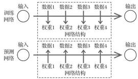
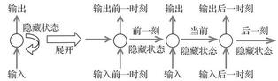
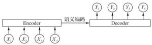
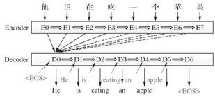
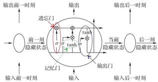
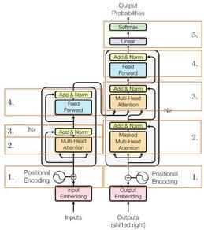
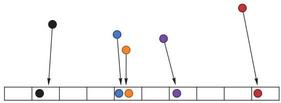
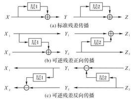

=+=+=+=+=+=+=+=+=
文章编号:1001-9081(2021)S1-0001-06 DOI: 10.11772/j. issn. 1001-9081. 2020101634

# 注意力机制综述

任 欢*,王旭光

(华北电力大学 自动化系, 河北 保定 071003)

摘 要:现在注意力机制已广泛地应用在深度学习的诸多领域。基于注意力机制的结构模型不仅能够记录信息间的位置关系,还能依据信息的权重去度量不同信息特征的重要性。通过对信息特征进行相关与不相关的抉择建立动态权重参数, 以加强关键信息弱化无用信息, 从而提高深度学习算法效率同时也改进了传统深度学习的一些缺陷。 从图像处理、自然语言处理、数据预测等不同应用方面介绍了一些与注意力机制结合的算法结构,并对近几年大火的基于注意力机制的 transformer 和 reformer 算法进行了综述。鉴于注意力机制的重要性, 综述了注意力机制的研究发展,分析了注意力机制目前的发展现状并探讨了该机制未来可行的研究方向。

关键词:注意力机制；深度学习；位置关系；信息特征；关键信息；transformer；reformer

中图分类号:TP183 文献标志码:A

# Review of attention mechanism

REN Huan*, WANG Xuguang

(Department of Automation, North China Electric Power University, Baoding Hebei 071003, China)

Abstract: Now the attention mechanism has been widely used in many fields of deep learning. The structural model based on the attention mechanism can not only record the positional relationship between information, but also measure the importance of different information features based on the weight of the information. Through the selection of relevant and irrelevant information features, dynamic weight parameters were established to strengthen key information and weaken useless information, thereby improving the efficiency of deep learning algorithms and improving some of the defects of traditional deep learning. Some algorithm structures combined with the attention mechanism were introduced from different application fields of image processing, natural language processing, and data prediction, and the attention mechanism-based transformer and reformer algorithms that have been popular in recent years were reviewed. In view of the importance of attention mechanism, the research development of attention mechanism was reviewed, the current development status of attention mechanism was analyzed, and the feasible research directions of this mechanism in the future were discussed.

Key words: attention mechanism; deep learning; positional relationship; information characteristic; key information; transformer; reformer

## 0 引言

信息一直在人们生活交往中扮演着重要角色,如图像处理、信息识别、智能计算、自动控制等方面,都是以信息为基础进行研究 \( {}^{\left\lbrack  1\right\rbrack  } \) ,但是繁琐庞大、又时常模糊的信息往往让专家学者在探索信息内容时遇到了阻碍, 因此一些关于处理信息的科学技术便如雨后春笋般的涌现, 其中以深度学习为主要代表的人工智能开始活跃在人们视线中。

近年来, 深度学习在人工智能的领域一直充当领跑者的身份, 在模式识别、计算机视觉、自然语言处理中有着广泛的应用 \( {}^{\left\lbrack  2\right\rbrack  } \) 。深度学习的想法源于人工神经网络的研究,而神经网络的研究是由真实大脑结构激发的, 神经网络有很多种类型, 如文献[3]中介绍, 但基本原理是非常相似的。网络中的每个神经元都能够接收、处理输入信号并发送输出信号。每个神经元与其他神经元连接的关系用一个称为权系数的实数来评估, 该实数反映了给定连接在神经网络中的重要程度 \( {}^{\left\lbrack  4\right\rbrack  } \) 。 深度学习就是像神经网络结构一样, 通过每层间的输入输出的连接关系,人们可以学习到大量信息特征 \( {}^{\left\lbrack  5\right\rbrack  } \) 。

而注意力机制是自深度学习快速发展后广泛应用于自然语言处理、统计学习、图像检测、语音识别等领域的核心技术 \( {}^{\left\lbrack  6\right\rbrack  } \) 。专家学者根据对人类注意力的研究,提出了注意力机制,本质上说就是实现信息处理资源的高效分配 \( {}^{\left\lbrack  7\right\rbrack  } \) 。当一个场景进入人类视野时, 往往会先关注场景中的一些重点, 如动态的点或者突兀的颜色,剩下的静态场景可能会被暂时性地忽略 \( {}^{\left\lbrack  8\right\rbrack  } \) 。例如当人们需要寻找图片中的人物信息时,会更多地注意符合人物特征的图片区域, 而忽略那些不符合人物特征的图片区域, 这样就是注意力的合理有效分配。注意力是人类大脑中一项不可或缺的复杂认知功能, 在日常生活中, 人们通过视觉、听觉、触觉等方式接收大量的信息,但是人们在这些外界的信息轰炸中还能有条不紊地工作, 是因为人脑可以有意或无意地从这些大量输入信息中选择小部分的有用信息来重点处理,并忽略其他信息,这种能力叫作注意力。注意力机制能够以高权重去聚焦重要信息,以低权重去忽略不相关的信息,并且还可以不断调整权重,使得在不同的情况下也可以选取重要的信息,因此具有更高的可扩展性和鲁棒性 \( {}^{\left\lbrack  9\right\rbrack  } \) 。 其基本网络框架如图 1 所示。

---

收稿日期:2020-10-21；修回日期:2021-01-05；录用日期:2021-01-07。

作者简介:任欢 (1996一),女,山西阳泉人,硕士研究生,主要研究方向:深度学习；王旭光 (1980- ),男,河北保定人,副教授,博士,主要研究方向:深度学习、图像内容理解。

---

图 1 注意力机制基本网络架构

此外, 它还能通过共享重要信息(即选定的重要信息)与其他人进行信息交换,从而实现重要信息的传递 \( {}^{\left\lbrack  {10}\right\rbrack  } \) 。因此注意力机制得到广大研究学者的关注, 基于注意力机制的一些新的研究算法也在不断被提出验证和应用。

注意力机制在深度学习中能够发展迅速的原因主要有以下 3 个方面:

1)这个结构是解决多任务最先进的模型, 如机器翻译、 问题回答、情绪分析、词性标记、对话系统、数据监测、故障诊断等 \( {}^{\left\lbrack  {11} - {17}\right\rbrack  } \) 。

2)注意力机制的显著优点就是关注相关的信息而忽略不相关的信息, 不通过循环而直接建立输入与输出之间的依赖关系,并行化程度增强,运行速度有了很大提高 \( {}^{\left\lbrack  {18} - {19}\right\rbrack  } \) 。

3)它克服了传统神经网络中的一些局限,如随着输入长度增加系统的性能下降、输入顺序不合理导致系统的计算效率低下、系统缺乏对特征的提取和强化等。但是注意力机制能够很好地建模具有可变长度的序列数据, 进一步增强了其捕获远程依赖信息的能力, 减少层次深度的同时有效提高精度 \( {}^{\left\lbrack  9,{20}\right\rbrack  } \) 。

本文以注意力机制中重要的 transformer 算法为分界点, 分别介绍了前期注意力机制与传统算法循环神经网络 (Recurrent Neural Network, RNN)、编 - 解 码器 (encoder-decoder)、长短期记忆 (Long Short-Term Memory, LSTM) 人工神经网络等的结合, 并应用于图像处理、自然语言处理和数据预测等领域；和后期以自注意力(self-attention)为基本结构单元的 transformer、reformer 和 Hopfield 等算法的发展与应用。 最后在文末综述了注意力机制的应用领域和未来研究方向的展望。

## 1 注意力机制前期应用

注意力机制自提出后,影响了基于深度学习算法的许多人工智能领域的发展。而当前注意力机制已成功地应用于图像处理、自然语言处理和数据预测等方面, 现介绍其应用领域如下。
=+=+=+=+=+=+=+=+=
### 1.1 图像处理领域的应用

注意力机制的第一次提出是在视觉图像领域中 \( {}^{\left\lbrack  {21}\right\rbrack  } \) ,它指出注意力的作用就是将之前传统的视觉搜索方法进行优化, 可选择地调整视觉对网络的处理, 减少了需要处理的样本数据并且增加了样本间的特征匹配。文献[22]利用灵长类动物的视觉注意力提供了一个科学解释, 提出的视觉注意模型结构比较简单,能够对接收到的信息进行特征提取并且快速检测出各种形状和颜色,但是因为结构的简单,无法检测到特征间的相关性, 并且没有任何循环机制, 所以在整个视觉识别过程中, 无法重现图像轮廓, 因此人们就想到了将注意力机制与具有循环机制的循环神经网络(RNN)结合,并且在此基础上进行了一系列研究发现。

循环神经网络框架(RNN)是由 Jorden 和 Elman 分别于 1986 年和 1990 年提出的, 被认为是目前 RNN 的最基础版本, 之后随着科技进步, 问题复杂度的加深, RNN结构也在不断丰富和扩展 \( {}^{\left\lbrack  {23}\right\rbrack  } \) 。循环神经网络,顾名思义其结构中含有循环层, 而循环表示前一个和后一个是相关联的, 即网络会对前面的信息进行记忆并作用于输出, 这样神经网络中的隐藏层就存储了具有相关性的特征信息 \( {}^{\left\lbrack  {24}\right\rbrack  } \) ,其结构如图 2 所示。

图 2 RNN结构和展开图

由图 2 可知, RNN下一时刻的输出与前面多个时刻的输入和自己当前状态有关, 因此能够保留特征间的相关性, 但是由于每一步状态的记录也会导致误差累积, 从而有可能造成梯度爆炸;并且如果输入过多的序列信息, 梯度的传递性不是很高,也会出现梯度消失的现象 \( {}^{\left\lbrack  {24}\right\rbrack  } \) 。因此, Google mind 团队在 2014 年将循环神经网络 (RNN) 模型与 attention 机制结合 \( {}^{\left\lbrack  {25}\right\rbrack  } \) ,利用注意力机制对特定的区域进行高分辨率处理。该模型受人类注意力的启发, 根据需求将注意力集中在图片中特定的部分, 类似于人类观察衣服图片时, 往往不会看图片中所有因素, 而是先注意到其中的突出因素。所以基于任务需求, 这个模型不是处理全部图像, 而是有针对性地选择相应位置处理,使整个模型的性能提高。众多实验结果表明,基于注意力机制的循环神经网络可以比单纯的循环神经网络更好地处理一些杂波图像和像素比较大的图像,是因为它可以将需要处理的图像特征提取简化, 从而缩短处理数据的时间并且保留重要信息。

将注意力机制与RNN结合, 很好地解决了单纯使用RNN 在图像处理中的局限, 如处理繁琐的特征信息往往会因为层数过深而梯度爆炸。注意力机制巧妙地提取图像中的关键信息同时忽略无关信息,为数据处理提供了更多的便利,网络层数也不会过深, 梯度爆炸的问题也得到了很好的解决。
=+=+=+=+=+=+=+=+=
### 1.2 自然语言处理领域的应用

注意力机制在视觉图像方面取得了很大突破后,一些学者同样将其思想应用在自然语言处理方面,也取得了丰硕的成果。利用神经网络实现机器翻译是新提出的一种翻译方法, 不同于之前传统的基于段翻译, 神经网络机器翻译可以建立一个能够读取单个句子并可以输出对应翻译句子的系统。 之前提出的许多神经网络机器翻译都属于 encoder-decoder 机制, 其基本结构如图 3 所示。

图 3 encoder-decoder结构

Encoder-Decoder方法最早在文献[26]中提出, 文献使用了两个RNN来完成机器翻译(Statistical Machine Translation, SMT)工作:第一个RNN把一串符号序列编码成一个固定长度的向量, 这就是编码器的工作; 第二个 RNN 把这个固定长度的向量解码成目标符号序列然后输出, 担任的是解码器的工作。因此可知, encoder-decoder 机制就是将输入序列先利用编码转化成一个包含有特定信息的向量, 通过不同语言对应的语义编码,再将其利用解码器将向量翻译为输出信息 \( {}^{\left\lbrack  {26}\right\rbrack  } \) 。 例如输入英文 “I eat an apple” 通过编解码器翻译后, 便可以得到中文的“我吃了一个苹果”。但是 encoder-decoder 方法有个明显缺陷就是, 它的编码解码都是对应定长的句子, 所以当输入不同长度的句子时,这个方法的性能往往会降低很多；此外还有针对不同语言、不同情况的需要选择不同的编解码器, 所以不具有普遍适用性 \( {}^{\left\lbrack  {27}\right\rbrack  } \) 。因此 Bahdanau 等在文献 [28]中,首次将注意力机制 attention 应用到机器翻译的任务中去, 实现了翻译和对齐同时进行,解决了语句长度不同的问题 \( {}^{\left\lbrack  {28}\right\rbrack  } \) 。文献[28]中提出的模型不再是将输入都编码为定长的向量, 而是将输入都转换为向量, 然后在解码过程中根据注意力机制自适应地选择向量的子集, 避免了将输入句子压缩, 保留完整句子信息。通过实验验证, 基于注意力机制的对齐和翻译联合学习的方法比传统的 encoder-decoder 模型在翻译性能上有显著的提高。文献[28]的基本模型如图 4 所示。

图 4 基于注意力机制的机器翻译

由上面的举例可知, 当输入长度不同的句子时, 编码只需把所有输入转换为向量, 而解码则自适应地选择向量长度, 所以可以让模型更好地处理不同长度的句子。基于注意力机制的 encoder-decoder 在语言翻译中发展更为迅速,文献[29-30] 更是将注意力机制与 encoder-decoder 结合后如何扩展描述得更为详尽, 对之后的自然语言处理的应用起了很大的推动作用。
=+=+=+=+=+=+=+=+=
### 1.3 数据预测领域的应用

在各行各业的数据分析中, 数据预测也是其中一项重要工作 \( {}^{\left\lbrack  {31}\right\rbrack  } \) 。之前传统神经网络预测数据常使用RNN进行预测, 但是这种方法同样因为训练层数多和长距离的序列时常存在梯度爆炸和梯度消失等问题 \( {}^{\left\lbrack  {32}\right\rbrack  } \) ,因此一种结合了注意力机制想法的 RNN 变体出现——长短期记忆人工神经网络 (LSTM)。LSTM \( {}^{\left\lbrack  {33}\right\rbrack  } \) 最初是由 Hochreiter 和 Schmidhuber 在 1997 年提出的,在近期 Alex Graves 进行了改良和推广 \( {}^{\left\lbrack  {34}\right\rbrack  } \) ,使之更加灵活地应用于多种场合。

LSTM 本质上仍然是一种 RNN 的递归神经网络结构 \( {}^{\left\lbrack  {351}\right\rbrack  } \) , 但它能够解决 RNN 中存在的梯度消失问题, 是因为它有着独特设计的“门”结构(输入门、遗忘门和输出门),其结构如图 5 所示。

图 5 LSTM结构单元

LSTM模型结构将细胞单元进行了扩充, 其中遗忘门就是决定“忘记”哪些无用的信息; 而记忆门则是决定保留哪些重要信息,从而进行传递；输出门则是将遗忘门和记忆门的细胞状态进行整合, 然后输出至下一个细胞单元 \( {}^{\left\lbrack  {35}\right\rbrack  } \) 。因此 LSTM 模型就是RNN结合了注意力机制的变体 \( {}^{\left\lbrack  {36}\right\rbrack  } \) 。它将细胞单元进行更改,新增“遗忘门”“记忆门”和“输出门”就是为了对长序列进行挑选, 然后将较长的序列转化为包含有重要信息的短序列, 将数据进行传递, 有效解决了传统算法预测数据时常遇到的问题,并得到广泛的应用。

注意力机制从一开始就因其独特的思想深受广泛学者的喜爱, 通过实验研究将其进行拓展应用于多种情景。注意力机制与传统算法的简单结合就可以提高系统的性能, 因此注意力机制的提出对深度学习许多结构都有着性能提高的作用。而在 2017 年, Vaswani 提出了 Transformer 模型 \( {}^{\left\lbrack  {37}\right\rbrack  } \) ,更是将注意力机制推向了诸多应用方向的热潮。

## 2 注意力机制当前研究

由上文可知, 注意力机制早在 20 世纪 90 年代就已经提出, Google mind 团队将注意力机制与 RNN 结合进行图像分类也取得显著成果 \( {}^{\lbrack {25}\rbrack } \) 。此外 Bahdanau 等将注意力机制运用在自然语言处理中,大大提高了翻译精度 \( {}^{\left\lbrack  {28}\right\rbrack  } \) ,也让注意力机制得到不断发展,应用于各大领域。分析比较注意力机制的各个应用领域, 人们也一直以提高效率且克服卷积神经网络 (Convolutional Neural Network, CNN)、RNN 等算法的局限性为目的进行研究, 尝试提出新的算法结构。而 Vaswani 等在 2017 年发表的 “Attention is all you need” 介绍了以 self-attention 为基本单元的 Transformer 模型 \( {}^{\left\lbrack  {37}\right\rbrack  } \) 使得注意力机制得到真正的成功运用。

例如近期 Google 团队利用 transformer 代替了 Seq2Seq 的问题, 再用自注意力代替了LSTM, 在翻译等任务中取得了更好的成绩。文献[37]中介绍的transformer 的整体架构如图 6 所示。由图 \( {6}^{\left\lbrack  {37}\right\rbrack  } \) 可知, transformer是由左边的编码器和右边的解码器组成。编码器负责把输入序列进行位置编码后映射为隐藏层, 然后解码器再把隐藏层映射为输出序列。编码器包含 4 个部分, 编码器的第一个位置是将输入的数据转换为向量, 通过位置编码后, 将其输入到多头注意力。这里的位置编码就是记录序列数据之间顺序的相关性, 相比较上文提到的 RNN顺序输入, transformer 方法不需要将数据一一输入, 可以直接并行输入, 并存储好数据之间的位置关系, 大大提高了计算速度,减少了存储空间。接下来第二部分的多头注意力是为了获取数据内部之间的相关性, 也弥补了 CNN 方法中数据缺少关联性的缺点。第三部分是残差连接和标准化, 在映射关系转换过程中, 往往会存在计算产生的残差, 而残差的存在会因为网络层数的增加, 模型学习的映射关系越来越不精确, 因此要通过第三部分残差连接和层标准化, 有效提高模型的学习能力,并使数据更加标准,加快收敛,这也是一种优化技巧 \( {}^{\left\lbrack  {38}\right\rbrack  } \) 。最后再通过由两个全连接层组成的前向反馈层,将学习得到的数据进行非线性映射, 即加大强的部分, 减小弱的部分, 最后再标准化, 这样通过编码器得到的学习结果更加精准和具有代表性。

图 6 transformer整体架构

根据 transformer 结构可知, 解码器相对比编码器是在第二部分多了一个掩码多头注意力。这个的目的是因为前面编码器训练时数据的长度是不一样的, 而这里的解码器将这些数据中最大的长度作为计算单元进行训练, 并且只需要之前数据对当前的影响, 而不需要未来数据对它的影响, 因此将后面未来预测的数据利用函数掩码掉, 从而不参与训练。之后的两项与解码器中相同, 最后再通过一次线性化和 softmax 层完成输出, 这里的线性化和 softmax 层是将向量转换为输出所要求的类型, 如机器翻译中, 就会将向量根据概率大小选出合适的词语,从而完成翻译。

transformer 通过注意力机制、编码解码、残差前馈网络和线性化等解决了许多问题。如解决了传统神经网络算法训练慢的缺陷, 是因为它根据 CNN 中的卷积思想, 结合了多头注意力,实现并行计算,大大加快了计算速度,并在多项语言翻译任务中取得较好的结果; 而位置编码又使得 transformer 具备了CNN欠缺而RNN擅长的能力,将序列数据间的关系可以存储下来, 在自然语言处理的上下文语义等应用方面得到了广泛的应用 \( {}^{\left\lbrack  {39}\right\rbrack  } \) 。但是同时 transformer 也有其他缺陷,如只能让长序列得到高效处理, 短序列的效率并没有得到提高; 针对长序列, 训练这些模型的成本就会很高。针对 transformer 中还存在的一些问题, Kitaev 等将其中的一些结构进行优化, 提出了新的模型 reformer \( {}^{\left\lbrack  {40}\right\rbrack  } \) 。

针对 transformer 中一些缺陷, reformer 对其进行了改进。 首先是将 transformer 中的点积注意力替换为局部位置敏感哈希注意力。transformer 中的多头注意力是并行计算并叠加, 它计算两个数据点之间的 attention score 需要将多个自注意力连起来因此导致计算量很大,所占内存较多。而文献[40]中选了用局部敏感哈希注意力,代替多头注意力。局部敏感哈希的基本思想如图 7 所示。

图7 局部敏感哈希的基本思想

由图 7 可知, attention score 分数接近的数据将会映射到同一个空间, 其余相关性不大的数据则是被映射到其余空间, 并且按照 attention score 分数排序, 这便利了数据的查找也减少了计算量。因此将计算量复杂度大大降低, 从而提高了对长序列训练的效率 \( {}^{\left\lbrack  {41}\right\rbrack  } \) 。

此外, 在训练网络时为了反向传播计算, 往往每一层的激活值都要被记录下来,所以层数越多,所占内存也越多。因此 reformer便提出了用可逆残差取代标准残差层 \( {}^{\lbrack {42}\rbrack } \) 。

transformer 是一个具有梯度下降的多层模型, 为了之后的反向传播计算,需要保存每一层的激活值,而 reformer 利用可逆残差方法减少内存占用。在反向传播时按需计算每个层的激活值, 而不需要把它们都存在内存中, 在网络中的最后一层激活值可以恢复中间任何一层的激活值。可逆残差层如图 \( {8}^{\left\lbrack  {42}\right\rbrack  } \) 所示。

图8 可逆残差层基本示意图

由图 8 可知: 图 8(a)是标准残差层, 每一层的激活用于更新下一层的输入；图 8(b)指的是可逆网络中,要保持两组都激活,所以每层只更新其中一组; 图 8(c)指的是反向传播时可以恢复中间所有值的激活值。对比图 8(b) 和图 8(c) 可以看出, reformer 的可逆残差层分为两组激活, 一个是标准的残差, 逐层更新到下一层, 还有一组是只记录对第一层的变化, 因此在反向时很容易相减得到每层的激活值 \( {}^{\left\lbrack  {42}\right\rbrack  } \) 。这样训练网络时就不会因为激活值占大量的内存而局限了许多应用。

此外 reformer 还使用了一个小技巧来减少内存的使用, 就是将比较厚的层进行分块预处理。Reformer模型中一些改进的结构都是为了训练更长的序列, 并且减少内存占用从而节省成本。Reformer 经过实验验证, 在使用比 transformer 实验更长的序列数据、得到相同的性能情况下,占用更少的内存并且更高效率地完成训练 \( {}^{\left\lbrack  {43}\right\rbrack  } \) ,因此 reformer 为序列扩展提供了更多的可能,同时内存使用的减少也使得实验成本更低。

现在深度学习领域中, 注意力机制作为 RNN 的代替方法, 还是一直处于核心位置, 而基于注意力机制的 transformer 和改进版的 reformer 也将训练的性能推向一个更高点。 transformer 和 reformer 在效率和占用内存上实现了很大的改进, 现已成为各个领域的研究重点。无独有偶, 近期一些研究者又提出 transformer 其实是 Hopfield 网络在连续状态下的一种特殊情况, 因此基于注意力机制的这些算法与早在 20 世纪提出的Hopfield网络的原理相似。

Hopfield 网络本质上就是一种 RNN 结构, 是由 John Hopfield 于 1982 年提出 \( {}^{\left\lbrack  {44}\right\rbrack  } \) 。古老的 Hopfield 网络是利用二值系统进行储存,并且实现能量系统向局部极小值收敛,后来 Hopfield 等又将其从二值状态扩展为连续状态, 并且把新的连续状态的 Hopfield 网络与 transformer 注意力机制进行了分析, 发现它们具有等价性；并且 Hopfield 网络经实验验证,能够实现模式存储的指数级提升,一次更新即可收敛,并且检索误差也呈现指数级下降[44]。

文献[44]中的研究表明, 基于注意力机制的 transformer 其实等价于这种新的连续状态的 Hopfield 网络的更新规则。 前面 transformer 中利用 softmax 得到的分值当作它的评价标准,而这次 Hopfield 网络是利用 softmax 将能量公式进行了重新定义, 寻找能量最低点就是寻找网络的稳定状态, 而到达稳定状态则表示训练的神经网络结构已经稳定于训练样本,则稳定状态为它的评价标准, 二者是等价的。此外 Hopfield 网络因其存储的样本为矢量,所以存储量大大提高,并且寻找稳定状态也比 softmax 评分更加准确,大大提高了训练速度 \( {}^{\left\lbrack  {45}\right\rbrack  } \) 。

在自然语言处理等方面, transformer 和 reformer 算法已经在效率和使用内存上作出了巨大的贡献。这些算法也同样给其他专家研究学者提供了新的思路, 以注意力机制为基本框架的神经网络算法也将会被不断地改进更新, 从而探寻更优的算法。

## 3 注意力机制的应用展望

由于注意力机制在近几年受到了广泛关注, 所以学者和研究人员也在不断地研究将其应用于更多的领域 \( {}^{\left\lbrack  {37}\right\rbrack  } \) 。如数据预测, 利用注意力机制实现序列到序列的建模, 利用编解码器不仅可以具有可变长度的序列数据, 还可以将当前的输入与上一时刻输出以及自身状态联系起来, 提高了模型的复杂程度,因此可提高模型的预测精度,且具有较好的扩展性 \( {}^{\left\lbrack  9,{46} - {47}\right\rbrack  } \) 。 如图像处理,利用注意力机制的图像识别系统,不仅减少了无效信息的存储问题还大大提高了识别准确率, 在生活中为解决更多问题提供了便利,如车牌、车票、身份信息等识别 \( {}^{\left\lbrack  {48} - {49}\right\rbrack  } \) 。 此外还有异常诊断,注意力机制中特有的不同权重参数配比, 可以快速提取关键特征,模型特征可以有效地进行缩减从而提高判别效率, 并且参数阈值都是动态可调整的, 这样进行多次误差或异常的检测,诊断精度也有明显提升 \( {}^{\left\lbrack  {16} - {17},{48},{50}\right\rbrack  } \) 。

先前的算法如 encoder-decoder、LSTM 对注意力机制的应用都是浅尝辄止, 而近几年涌现的 transformer 和 reformer 等结构算法则是将注意力机制展现得淋漓尽致, 但是对于现有的方法结构模型不断地改进仍是研究的热点。如:

1)注意力机制在训练过程中对一些超参数的依赖性很大,因此对于这些超参数的设定还可以有更多研究；

2)系统模型的可解释性差, 人们对模型预测的推理过程还是无法详尽地解释 \( {}^{\lbrack {51}\rbrack } \) ；

3) 将算法与多对象识别融合, 如对于图像的处理可以通过注意力机制将视频中的图片和文字信息同时提取识别;

4)将识别准确率结合入训练结构中 \( {}^{\lbrack {52}\rbrack } \) 。

随着对基于注意力机制算法结合本身还存在的不足进行不断改进, 注意力机制将会应用于更多领域, 以探求更多的可能。

## 4 结语

注意力机制近年来在基于深度学习领域得到很广泛的应用,对深度学习和人工智能产生了重要影响。本文以 transformer 算法的提出时间为分界点, 介绍了前期应用于不同场景的各种基于注意力机制的实现方法、transformer算法、 基于transformer 的改进算法 reformer 算法, 以及 Hopfield 连续状态网络 \( {}^{\left\lbrack  {44}\right\rbrack  } \) 等。此外本文还介绍了针对注意力机制提出的一些超参数改进、多对象融合等方法, 这些方法对注意力机制的发展提供了新思路。本文分析了注意力机制在深度学习算法发展过程中的变革和在各个领域的应用, 表现出注意力机制算法具有较好的表现效果和很高的研究意义。 参考文献(References)

[1] 张妮, 徐文尚, 王文文. 人工智能技术发展及应用研究综述[J]. 煤矿机械, 2009, 30(2): 4-7.

[2] SVOZIL D, KVASNICKA V, POSPICHAL J. Introduction to multilayer feed-forward neural networks [J]. Chemometrics and Intelligent Laboratory Systems, 1997, 39(1): 43-62.

[3] 孙志军,薛磊,许阳明,等. 深度学习研究综述[J]. 计算机应用研究, 2012, 29(8): 2806-2810.

[4] 赵德宇. 深度学习和深度强化学习综述[J]. 中国新通信, 2019, 21(15): 174-175.

[5] 刘建伟, 刘媛, 罗雄麟. 深度学习研究进展[J]. 计算机应用研究, 2014, 31(7): 1921-1930.

[6] 申翔翔, 侯新文, 尹传环. 深度强化学习中状态注意力机制的研究[J]. 智能系统学报, 2020, 15(2): 317-322.

[7] 高芬, 苏依拉, 牛向华, 等. 基于Transformer的蒙汉神经机器翻译研究[J]. 计算机应用与软件, 2020, 37(2): 141-146, 225.

[8] CHAUDHARI S, POLATKAN G, RAMANATH R, et al. An attentive survey of attention [EB/OL]. [2019-04-05]. https://arxiv.org/pdf/1904.02874.pdf.

[9] HAO S, LEE D-H, ZHAO D. Sequence to sequence learning with attention mechanism for short-term passenger flow prediction in large-scale metro system [J]. Transportation Research Part C: Emerging Technologies, 2019, 107: 287-300.

[10] ZILLICH M, FRINTROP S, PIRRI F, et al. Workshop on attention models in robotics: visual systems for better HRI [C]// Proceedings of the 2014 ACM/IEEE International Conference on Human-robot Interaction. New York: ACM, 2014: 499-500.

[11] TAN Z, SU J, WANG B, et al. Lattice-to-sequence attentional neural machine translation models [J]. Neurocomputing, 2018, 284: 138-147.

[12] ALAJAJI A, GERYCH W, CHANDRASEKARAN K, et al. DeepContext: parameterized compatibility-based attention CNN for human context recognition [C]// Proceedings of the 2020 IEEE 14th International Conference on Semantic Computing. Piscataway: IEEE, 2020: 53-60.

[13] 李福鹏,付东翔. 基于Transformer编码器的金融文本情感分析方法[J]. 电子科技, 2020, 33(9): 10-15.

[14] 余珊珊,苏锦钿,李鹏飞. 一种基于自注意力的句子情感分类方法 \( \left\lbrack  \mathrm{J}\right\rbrack \) . 计算机科学,2020,47(4): 204-210.

[15] MAHDI MAHSULI M, SAFABAKHSH R. English to Persian transliteration using attention-based approach in deep learning [C]// Proceedings of the 2017 Iranian Conference on Electrical Engineering. Piscataway: IEEE, 2017: 174-178.

[16] 孟恒宇,李元祥. 基于Transformer 重建的时序数据异常检测与关系提取[J]. 计算机工程, 2021, 47(2): 69-76.

[17] LI X, ZHANG W, DING Q. Understanding and improving deep learning-based rolling bearing fault diagnosis with attention mechanism[J]. Signal Processing, 2019, 161: 136-154.

[18] 王明申, 牛斌, 马利. 一种基于词级权重的 Transformer模型改进方法[J]. 小型微型计算机系统, 2019, 40(4): 744-748.

[19] ZHAN Q, CAI X, CHEN C, et al. Commented content classification with deep neural network based on attention mechanism [C]// Proceedings of the 2017 IEEE 2nd Advanced Information Technology, Electronic and Automation Control Conference. Piscataway: IEEE, 2017: 2016-2019.

[20] 周才东,曾碧卿,王盛玉,等. 结合注意力与卷积神经网络的中文摘要研究[J]. 计算机工程与应用, 2019, 55(8): 132-137.

[21] TSOTSOS J K, CULHANE S M, WAI W Y K, et al. Modeling visual attention via selective tuning [J]. Artificial Intelligence, 1995, 78(1/2): 507-545.

[22] ITTI L, KOCH C, NIEBUR E. A model of saliency-based visual attention for rapid scene analysis [J]. IEEE Transactions on Pattern Analysis and Machine Intelligence, 2002, 20(11) : 1254- 1259.

[23] 杨丽, 吴雨茜, 王俊丽, 等. 循环神经网络研究综述[J]. 计算机应用, 2018, 38(S2): 1-6, 26.

[24] 夏瑜潞. 循环神经网络的发展综述[J]. 电脑知识与技术, 2019, 15(21): 182-184.

[25] MNIH V, HEESS N, GRAVES A. Recurrent models of visual attention [C]// Proceedings of the 27th International Conference on Neural Information Processing Systems. Cambridge: MIT Press, 2014, 2: 2204-2212.

[26] CHO K, VAN MERRIENBOER B, GULCEHRE C, et al. Learning phrase representations using RNN encoder-decoder for statistical machine translation [EB/OL]. [2014-09-07]. https:// arxiv. org/pdf/1406. 1078. pdf.

[27] 贺浩, 王仕成, 杨东方, 等. 基于 Encoder-Decoder 网络的遥感影像道路提取方法[J]. 测绘学报, 2019, 48(3): 330-338.

[28] BAHDANAU D, CHO K, BENGIO Y. Neural machine translation by jointly learning to align and translate [EB/OL]. [2016-03-19]. https://arxiv.org/pdf/1409.0473.pdf.

[29] CHO K, VAN MERRIENBOER B, BAHDANAU D, et al. On the properties of neural machine translation: encoder-decoder approaches [EB/OL]. [2014-10-07]. https://arxiv.org/pdf/ 1409. 1259. pdf.

[30] LUONG M-T, PHAM H, MANNING C D. Effective approaches to att ention-based neural machine translation [EB/OL]. [2015-09- 20]. https://arxiv.org/pdf/1508.04025.pdf.

[31] 王鑫, 吴际, 刘超, 等. 基于 LSTM 循环神经网络的故障时间序列预测[J]. 北京航空航天大学学报, 2018, 44(4): 772-784.

[32] HOCHREITER S. The vanishing gradient problem during learning recurrent neural nets and problem solutions [J]. International Journal of Uncertainty, Fuzziness and Knowledge-Based Systems, 1998, 6(2): 107-116.

[33] HOCHREITER S, SCHMIDHUBER J. Long short-term memory [J]. Neural Computation, 1997, 9(8): 1735-1780.

[34] GRAVES A. Long short-term memory [C]// Supervised Sequence Labelling with Recurrent Neural Networks, SCI 385. Berlin: Springer, 2012: 37-45.

[35] 王红, 史金钏, 张志伟. 基于注意力机制的 LSTM 的语义关系抽取 \( \left\lbrack  \mathrm{J}\right\rbrack \) . 计算机应用研究,2018,35(5): 1417-1420,1440.

[36] WANG Y, HUANG M, ZHU X, et al. Attention-based LSTM for aspect-level sentiment classification [C]// Proceedings of the 2016 Conference on Empirical Methods in Natural Language Processing. Stroudsburg: Association for Computational Linguistics, 2016: 606-615.

[37] VASWANI A, SHAZEER N, PARMAR N, et al. Attention is all you need [EB/OL]. [2017-12-06]. https://arxiv.org/pdf/1706.03762.pdf.

[38] 李岚欣. 面向自然语言处理的注意力机制研究[D]. 北京:北京邮电大学, 2019: 10-14.

[39] KATHAROPOULOS A, VYAS A, PAPPAS N, et al. Transformers are RNNs: fast autoregressive transformers with linear attention [C]// Proceedings of the 37th International Conference on Machine Learning. Cham: Springer, 2020: 1-4.

[40] KITAEV N, KAISER L, LEVSKAYA A. Reformer: the efficient transformer [EB/OL]. [2020-03-11]. https://arxiv.org/pdf/2001.04451.pdf.

[41] KITANO H, DING T. Applying and adapting the reformer as a computationally efficient approach to the SQuAD 2.0 question-answering task [EB/OL]. [2020-05-12]. https://web.stanford.edu/ class/cs224n/reports/default/report07. pdf.

[42] GOMEZ A N, REN M, URTASUN R, et al. The reversible residual network: backpropagation without storing activations. [EB/OL]. [2017-06-14]. https://arxiv.org/pdf/1707.04585.pdf.

[43] TAY Y, DEHGHANI M, BAHRI D, et al. Efficient transformers: a survey [EB/OL]. [2020-03-16]. https://arxiv.org/pdf/2009.06732.pdf.

[44] RAMSAUER H, SCHFL B, LEHNER J, et al. Hopfield networks is all you need [EB/OL]. [2020-03-16]. https://arxiv.org/abs/ 2008. 02217. pdf.

[45] HOPFIELD J. Neural networks and physical systems with emergent collective computational abilities [J]. Proceedings of the National Academy of Sciences, 1982, 79: 2554-2558.

[46] 孙亚圣, 姜奇, 胡洁, 等. 基于注意力机制的行人轨迹预测生成模型[J]. 计算机应用, 2019, 39(3): 668-674.

[47] CHEN Y, PENG G, ZHU Z, et al. A novel deep learning method based on, attention mechanism for bearing remaining useful life prediction[J]. Applied Soft Computing, 2020, 86: 105919.

[48] 王凯诚, 鲁华祥, 龚国良, 等. 基于注意力机制的显著性目标检测方法[J]. 智能系统学报, 2020, 15(5): 956-963.

[49] 王亚飞. 带注意力机制的车辆目标检测与识别[D]. 上海: 华东师范大学, 2020: 25-31.

[50] 孙萍, 胡旭东, 张永军. 结合注意力机制的深度学习图像目标检测[J]. 计算机工程与应用, 2019, 55(17): 180-184.

[51] 叶绍林. 基于注意力机制编解码框架的神经机器翻译方法研究 [D]. 合肥:中国科学技术大学,2019: 16-18.

[52] 朱张莉, 饶元, 吴渊, 等. 注意力机制在深度学习中的研究进展 [J]. 中文信息学报, 2019, 33(6): 1-11.
