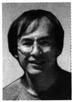

=+=+=+=+=+=+=+=+=
# 深度学习的昨天、今天和明天

余 凯 贾 磊 陈雨强 徐 伟

(百度 北京 100085)

(yukai@baidu.com)

## Deep Learning: Yesterday, Today, and Tomorrow

Yu Kai, Jia Lei, Chen Yuqiang, and Xu Wei

(Baidu, Beijing 100085)

Abstract Machine learning is an important area of artificial intelligence. Since 1980s, huge success has been achieved in terms of algorithms, theory, and applications. From 2006, a new machine learning paradigm, named deep learning, has been popular in the research community, and has become a huge wave of technology trend for big data and artificial intelligence. Deep learning simulates the hierarchical structure of human brain, processing data from lower level to higher level, and gradually composing more and more semantic concepts. In recent years, Google, Microsoft, IBM, and Baidu have invested a lot of resources into the R&D of deep learning, making significant progresses on speech recognition, image understanding, natural language processing, and online advertising. In terms of the contribution to real-world applications, deep learning is perhaps the most successful progress made by the machine learning community in the last 10 years. In this article, we will give a high-level overview about the past and current stage of deep learning, discuss the main challenges, and share our views on the future development of deep learning.

Key words machine learning; deep learning; speech recognition; image recognition; natural language processing; online advertising

摘 要 机器学习是人工智能领域的一个重要学科. 自从 20 世纪 80 年代以来, 机器学习在算法、理论和应用等方面都获得巨大成功. 2006 年以来,机器学习领域中一个叫“深度学习”的课题开始受到学术界广泛关注,到今天已经成为互联网大数据和人工智能的一个热潮. 深度学习通过建立类似于人脑的分层模型结构,对输入数据逐级提取从底层到高层的特征,从而能很好地建立从底层信号到高层语义的映射关系. 近年来,谷歌、微软、IBM、百度等拥有大数据的高科技公司相继投入大量资源进行深度学习技术研发,在语音、图像、自然语言、在线广告等领域取得显著进展. 从对实际应用的贡献来说,深度学习可能是机器学习领域最近这十年来最成功的研究方向. 将对深度学习发展的过去和现在做一个全景式的介绍, 并讨论深度学习所面临的挑战, 以及将来的可能方向.

关键词 机器学习；深度学习；语音识别；图像识别；自然语言处理；在线广告

中图法分类号 TP18

2012 年 6 月,《纽约时报》披露了谷歌的 Google Brain 项目 \( {}^{\left\lbrack  1\right\rbrack  } \) ,吸引了公众的广泛关注. 这个项目是由著名的斯坦福大学的机器学习教授 \( \mathrm{{Ng}} \) 和在大规模计算机系统方面的世界顶尖专家 Dean 共同主导, 用 16000 个 CPU Core 的并行计算平台训练一种称为 “深度神经网络” (deep neural networks, DNN) 的机器学习模型, 在语音识别和图像识别等领域获得了巨大的成功. 2012 年 11 月,微软在中国天津的一次活动上公开演示了一个全自动的同声传译系统,讲演者用英文演讲,后台的计算机一气呵成自动完成语音识别、英中机器翻译和中文语音合成,效果非常流畅. 据报道,后面支撑的关键技术也是 DNN, 或者深度学习 (deep learning, DL) \( {}^{\left\lbrack  2\right\rbrack  } \) . 2013 年的 1 月, 在中国最大的互联网搜索引擎公司百度的年会上, 创始人兼 CEO 李彦宏高调宣布要成立百度研究院, 其中第一个重点方向的就是深度学习, 并为此而成立 Institute of Deep Learning (IDL). 这是百度成立 10 多年以来第一次成立研究院 \( {}^{\left\lbrack  3\right\rbrack  } \) . 2014 年 4 月, 《麻省理工学院技术评论》(MIT Technology Review) 杂志将深度学习列为 2013 年十大突破性技术 (breakthrough technology) 之首 \( {}^{\left\lbrack  4\right\rbrack  } \) .

---

收稿日期:2013-08-16；修回日期:2013-08-19

---

为什么深度学习受到学术届和工业界如此广泛的重视? 深度学习技术研发面临什么样的科学和工程问题? 深度学习带来的科技进步将怎样改变人们的生活? 本文将简要回顾机器学习在过去 20 多年的发展, 介绍深度学习的昨天、今天和明天.

## 1 机器学习的两次浪潮:从浅层学习到深度 学习

在解释深度学习之前, 我们需要了解什么是机器学习. 机器学习是人工智能的一个分支, 而在很多时候, 几乎成为人工智能的代名词. 简单来说, 机器学习就是通过算法, 使得机器能从大量历史数据中学习规律, 从而对新的样本做智能识别或对未来做预测. 从 20 世纪 80 年代末期以来, 机器学习的发展大致经历了两次浪潮:浅层学习 (shallow learning) 和深度学习 (deep learning). 需要指出是, 机器学习历史阶段的划分是一个仁者见仁,智者见智的事情, 从不同的维度来看会得到不同的结论. 这里我们是从机器学习模型的层次结构来看的.
=+=+=+=+=+=+=+=+=
### 1.1 第一次浪潮:浅层学习

20 世纪 80 年代末期,用于人工神经网络的反向传播算法(也叫 Back Propagation 算法或者 BP 算法)的发明, 给机器学习带来了希望, 掀起了基于统计模型的机器学习热潮 \( {}^{\left\lbrack  5\right\rbrack  } \) . 这个热潮一直持续到今天. 人们发现, 利用 BP 算法可以让一个人工神经网络模型从大量训练样本中学习出统计规律, 从而对未知事件做预测. 这种基于统计的机器学习方法比起过去基于人工规则的系统,在很多方面显示出优越性. 这个时候的人工神经网络,虽然也被称作多层感知机 (multi-layer perceptron), 由于多层网络训练的困难, 实际使用的多数是只含有一层隐层节点的浅层模型.

20 世纪 90 年代, 各种各样的浅层机器学习模型相继被提出, 比如支撑向量机 (support vector machines, SVM), Boosting, 最大熵方法 (比如 logistic regression, LR) 等. 这些模型的结构基本上可以看成带有一层隐层节点 (如 SVM, Boosting), 或没有隐层节点 (如 LR). 这些模型在无论是理论分析还是应用都获得了巨大的成功. 相比较之下,由于理论分析的难度, 而且训练方法需要很多经验和技巧, 这个时期多层人工神经网络反而相对较为沉寂.

2000 年以来互联网的高速发展, 对大数据的智能化分析和预测提出了巨大需求,浅层学习模型在互联网应用上获得了巨大的成功. 最成功的应用包括捜索广告系统(比如谷歌的 Adwords、百度的风巢系统)的广告点击率 CTR 预估、网页搜索排序 (比如雅虎和微软的搜索引擎)、垃圾邮件过滤系统、 基于内容的推荐系统, 等等.
=+=+=+=+=+=+=+=+=
### 1.2 第二次浪潮:深度学习

2006 年,加拿大多伦多大学教授,机器学习领域的泰斗 Hinton 和他的学生 Salakhutdinov 在顶尖学术刊物《科学》上发表了一篇文章 \( {}^{\left\lbrack  6\right\rbrack  } \) ,开启了深度学习在学术界和工业界的浪潮. 这篇文章有两个主要的讯息:1)很多隐层的人工神经网络具有优异的特征学习能力,学习得到的特征对数据有更本质的刻划,从而有利于可视化或分类; 2)深度神经网络在训练上的难度, 可以通过 "逐层初始化" (layer-wise pre-training) 来有效克服, 在这篇文章中, 逐层初始化是通过无监督学习实现的.

自 2006 年以来, 深度学习在学术界持续升温. 斯坦福大学、纽约大学、加拿大蒙特利尔大学等成为研究深度学习的重镇. 2010 年, 美国国防部 DARPA 计划首次资助深度学习项目,参与方有斯坦福大学、 纽约大学和 NEC 美国研究院. 支持深度学习的一个重要依据, 就是脑神经系统的确具有丰富的层次结构. 一个最著名的例子就是 Hubel-Wiesel 模型, 由于揭示了视觉神经的机理而曾获得诺贝尔医学与生理学奖. 除了仿生学的角度, 目前深度学习的理论研究还基本处于起步阶段, 但在应用领域已经显现巨大能量. 2011 年以来, 微软研究院和谷歌的语音识别研究人员先后采用 DNN 技术降低语音识别错误率 \( {20}\%  \sim  {30}\% \) ,是语音识别领域 10 多年来最大的突破性进展. 2012 年 DNN 技术在图像识别领域取得惊人的效果, 在 ImageNet 评测上将错误率从 26%降低到 15%. 在这一年, DNN 还被应用于制药公司的 Druge Activity 预测问题, 并获得世界最好成绩, 这一重要成果被《纽约时报》报道.

正如文章开头所描述的,今天谷歌、微软、百度等知名的拥有大数据的高科技公司争相投入资源, 占领深度学习的技术制高点, 正是因为他们都看到了大数据时代, 更加复杂且更加强大的深度模型的能深刻揭示海量数据里所承载的负责而丰富的信息, 并对未来或未知事件做更精准的预测.

## 2 大数据与深度学习

在工业界一直有一个很流行的观点: 在大数据条件下, 简单的机器学习模型会比复杂模型更加有效. 比如说, 在很多的大数据应用中, 最简单的线性模型得到大量使用. 而最近深度学习的惊人进展促使我们也许到了要重新思考这个观点的时候. 简而言之,在大数据情况下,也许只有比较复杂的模型, 或者说表达能力强的模型, 才能够充分发掘海量数据中蕴藏的丰富信息. 现在我们到了需要重新思考 “大数据 + 简单模型”的时候. 运用更强大的深度模型, 也许我们能从大数据中发掘出更多的有价值的信息和知识.

为了理解为什么大数据需要深度模型, 先举一个例子. 语音识别已经是一个大数据的机器学习问题, 在其声学建模部分, 通常面临的是十亿到千亿级别的训练样本. 在谷歌的一个语音识别实验中, 发现训练后的 DNN 对训练样本和测试样本的预测误差基本相当. 这是非常违反常识的, 因为通常模型在训练样本上的预测误差会显著小于测试样本. 只有一个解释, 就是由于大数据里含有丰富的信息维度, 即便是 DNN 这样的高容量复杂模型也是处于欠拟合的状态, 更不必说传统的 GMM 声学模型了. 所以在这个例子里我们看出, 大数据需要深度学习.

浅层模型有一个重要特点, 就是假设靠人工经验来抽取样本的特征, 而强调模型主要是负责分类或预测. 在模型的运用不出差错的前提下 (比如, 假设互联网公司聘请的是机器学习的专家), 特征的好坏就成为整个系统性能的瓶颈. 因此, 通常一个开发团队中更多的人力是投入到发掘更好的特征上去的. 发现一个好的特征, 要求开发人员对待解决的问题要有很深入的理解. 而达到这个程度, 往往需要反复的摸索, 甚至是数年磨一剑. 因此, 人工设计样本特征, 不是一个可扩展的途径.

深度学习的实质, 是通过构建具有很多隐层的机器学习模型和海量的训练数据, 来学习更有用的特征, 从而最终提升分类或预测的准确性. 所以, “深度模型”是手段,“特征学习”是目的. 区别于传统的浅层学习,深度学习的不同在于: 1) 强调了模型结构的深度, 通常有 5 层、 6 层、甚至 10 多层的隐层节点; 2) 明确突出了特征学习的重要性, 也就是说, 通过逐层特征变换, 将样本在原空间的特征表示变换到一个新特征空间, 从而分类或预测更加容易.

与人工规则构造特征的方法相比,利用大数据来学习特征, 更能够刻划数据的丰富内在信息. 所以, 在未来的几年里, 我们将看到越来越多的例子, 深度模型应用于大数据, 而不是浅层的线性模型.

## 3 深度学习的应用
=+=+=+=+=+=+=+=+=
### 3.1 语音识别

语音识别系统长期以来, 描述每个建模单元的统计概率模型时候,大都是采用的混合高斯模型 (GMM). 这种模型由于估计简单, 适合海量数据训练, 同时有成熟的区分度训练技术支持, 长期以来, 一直在语音识别应用中占有垄断性地位. 但是这种混合高斯模型本质上是一种浅层网络建模, 不能够充分描述特征的状态空间分布. 另外, GMM 建模的特征维数一般是几十维, 不能充分描述特征之间的相关性. 最后 GMM 建模本质上是一种似然概率建模, 虽然区分度训练能够模拟一些模式类之间的区分性, 但是能力有限.

微软研究院的语音识别专家 Li 和 Dong 从 2009 年开始和深度学习专家 Hinton 合作. 2011 年微软基于深度神经网络的语音识别研究取得成果, 彻底底改变了语音识别原有的技术框架 \( {}^{\left\lbrack  7\right\rbrack  } \) . 采用深度神经网络后, 可以充分描述特征之间的相关性, 可以把连续多帧的语音特征并在一起, 构成一个高维特征. 最终的深度神经网络可以采用高维特征训练来模拟的. 由于深度神经网络采用模拟人脑的多层结果, 可以逐级地进行信息特征抽取, 最终形成适合模式分类的较理想特征. 这种多层结构和人脑处理语音图像信息的时候, 是有很大的相似性的. 深度神经网络的建模技术, 在实际线上服务时, 能够无缝地和传统的语音识别技术相结合, 在不引起任何系统额外耗费情况下大幅度地提升了语音识别系统的识别率. 其在线的使用方法具体如下: 在实际解码过程中, 声学模型仍然是采用传统的 HMM 模型, 语音模型仍然是采用传统的统计语言模型,解码器仍然是采用传统的动态 WFST 解码器. 但是在声学模型的输出分布计算时, 完全用神经网络的输出后验概率除以一个先验概率来代替传统 HMM 模型中的 GMM 的输出似然概率. 百度实践中发现, 采用 DNN 进行声音建模的语音识别系统的相比于传统的 GMM 语音识别系统而言, 相对误识别率能降低 25%. 最终在 2012 年 11 月的时候, 上线了第一款基于 DNN 的语音搜索系统, 成为最早采用 DNN 技术进行商业语音服务的公司之一.

国际上谷歌也采用了深度神经网络进行声音建模, 和百度一起是最早的突破深度神经网络工业化应用的企业之一. 但是谷歌产品中采用的深度神经网络有 \( 4 \sim  5{\text{层}}^{\left\lbrack  8\right\rbrack  } \) ,而百度采用的深度神经网络多达 9 层. 这种结构差异的核心其实是百度更好的解决了深度神经网络在线计算的技术难题, 从而百度线上产品可以采用更复杂的网络模型. 这将对于未来拓展海量语料的 DNN 模型训练有更大的优势.
=+=+=+=+=+=+=+=+=
### 3.2 图像识别

图像是深度学习最早尝试的应用领域. 早在 1989 年, LeCun(现纽约大学教授)和他的同事们就发表了卷积神经网络 (convolution neural networks, CNN)的工作 \( {}^{\left\lbrack  9\right\rbrack  } \) . CNN 是一种带有卷积结构的深度神经网络, 通常至少有 2 个非线性可训练的卷积层、 2 个非线性的固定卷积层 (又叫 pooling layer) 和 1 个全连接层,一共至少 5 个隐含层. CNN 的结构受到著名的 Hubel-Wiesel 生物视觉模型的启发, 尤其是模拟视觉皮层 V1 和 V2 层中 simple cell 和 complex cell 的行为. 在很长时间里, CNN 虽然在小规模的问题上, 比如说手写数字, 取得当时世界最好结果, 但一直没有取得巨大成功. 这主要原因是 \( \mathrm{{CNN}} \) 在大规模图像上效果不好,比如像素很多的自然图片内容理解, 所以没有得到计算机视觉领域的足够重视. 这个情况一直持续到 2012 年 10 月, Hinton 和他的两个学生在著名的 ImageNet 问题上用更深的 CNN 取得世界最好结果, 使得图像识别大踏步前进 \( {}^{\left\lbrack  {10}\right\rbrack  } \) . 在 Hinton 的模型里,输入就是图像的像素, 没有用到任何的人工特征.

这个惊人的结果为什么在之前没有发生? 原因当然包括算法的提升,比如 dropout 等防止过拟合技术,但最重要的是 GPU 带来的计算能力提升和更多的训练数据. 百度在 2012 年底将深度学习技术成功应用于自然图像 OCR 识别和人脸识别等问题, 并推出相应的桌面和移动搜索产品, 在 2013 年, 深度学习模型被成功应用于一般图片的识别和理解. 从百度的经验来看, 深度学习应用于图像识别不但大大提升了准确性, 而且避免了人工特征抽取的时间消耗, 从而大大提高了在线计算效率. 可以很有把握地说, 从现在开始, 深度学习将取代人工特征 + 机器学习的方法而逐渐成为主流图像识别方法.
=+=+=+=+=+=+=+=+=
### 3.3 自然语言处理

除了语音和图像, 深度学习的另一个应用领域问题自然语言处理 (NLP). 经过几十年的发展, 基于统计的模型已经成为 NLP 的主流, 但是作为统计方法之一的人工神经网络在 NLP 领域几乎没有受到重视. 本文作者之一徐伟曾最早应用神经网络于语言模型 \( {}^{\left\lbrack  {11}\right\rbrack  } \) . 加拿大蒙特利尔大学教授 Bengio 等于 2003 年提出用 embedding 的方法将词映射到一个矢量表示空间,然后用非线性神经网络来表示 N-Gram 模型 \( {}^{\left\lbrack  {12}\right\rbrack  } \) . 世界上最早的深度学习用于 NLP 的研究工作诞生于 NEC Labs America \( {}^{\left\lbrack  {13}\right\rbrack  } \) ,其研究员 Collobert 和 Weston 从 2008 年开始采用 embedding 和多层一维卷积的结构, 用于 POS tagging, Chunking, Named Entity Recognition, Semantic Role Labeling 等 4 个典型 NLP 问题. 值得注意的是, 他们将同一个模型用于不同任务, 都能取得与 state-of-the-art 相当的准确率. 最近以来, 斯坦福大学教授 Manning 等人在深度学习用于 NLP 的工作也值得关注 \( {}^{\left\lbrack  {14}\right\rbrack  } \) .

总的来说,深度学习在 NLP 上取得的进展没有在语音图像上那么令人影响深刻. 一个很有意思的悖论是:相比于声音和图像,语言是唯一的非自然信号, 是完全由人类大脑产生和处理的符号系统, 但是模仿人脑结构的人工神经网络确似乎在处理自然语言上没有显现明显优势? 我们相信深度学习在 NLP 方面有很大的探索空间. 从 2006 年图像深度学习成为学术界热门课题到 2012 年 10 月 Hinton 在 ImageNet 上的重大突破, 经历了 6 年时间. 我们需要有足够耐心.
=+=+=+=+=+=+=+=+=
### 3.4 搜索广告 CTR 预估

搜索广告是搜索引擎的主要变现方式, 而按点击付费(cost per click, CPC)又是其中被最广泛应用的计费模式. 在 CPC 模式下, 预估的 CTR (pCTR) 越准确, 点击率就会越高, 收益就越大. 通常, 搜索广告的 pCTR 是通过机器学习模型预估得到. 提高 pCTR 的准确性, 是提升搜索公司、广告主、搜索用户三方利益的最佳途径.

传统上,谷歌、百度等搜索引擎公司以 logistic regression (LR) 作为预估模型. 而从 2012 年开始, 百度开始意识到模型的结构对广告 CTR 预估的重要性:使用扁平结构的 LR 严重限制了模型学习与抽象特征的能力. 为了突破这样的限制, 百度尝试将 DNN 作用于搜索广告,而这其中最大的挑战在于当前的计算能力还无法接受 \( {10}^{11} \) 级别的原始广告特征作为输入. 作为解决, 在百度的 DNN 系统里, 特征数从 \( {10}^{11} \) 数量级被降到了 \( {10}^{3} \) ,从而能被 DNN 正常的学习. 这套深度学习系统已于 2013 年 5 月开始服务于百度搜索广告系统, 每天为数亿网民使用.

DNN 在搜索广告系统中的应用还远远没到成熟, 其中 DNN 与迁移学习的结合将可能是一个令人振奋的方向. 使用 DNN,未来的搜索广告将可能借助网页搜索的结果优化特征的学习与提取; 亦可能通过 DNN 将不同的产品线联系起来, 使得不同的变现产品不管数据多少, 都能互相优化. 我们认为未来的 DNN 一定会在搜索广告中起到更重要的作用.

## 4 深度学习研发面临的重大问题
=+=+=+=+=+=+=+=+=
### 4.1 理论问题

理论问题主要体现在两个方面,一个是统计学习方面的, 另一个是计算方面的. 我们已经知道, 深度模型相比较于浅层模型有更好的对非线性函数的表示能力. 具体来说, 对于任意一个非线性函数, 根据神经网络的 universal approximation theory, 我们一定能找到一个浅层网络和一个深度网络来足够好的表示. 但是某些类函数, 深度网络只需要少得多的参数就可以表示. 但是, 可表示性不代表可学习性. 我们需要了解深度学习的样本复杂度, 也就是我们需要多少训练样本才能学习到足够好的深度模型. 在另一方面来说, 我们需要多少的计算资源才能通过训练得到更好的模型, 理想的计算优化方法是什么? 由于深度模型都是非凸函数, 这方面的理论研究极其困难.
=+=+=+=+=+=+=+=+=
### 4.2 建模问题

在推进深度学习的学习理论和计算理论的同时, 我们是否可以提出新的分层模型,使其不但具有传统深度模型所具有的强大表示能力, 而且具有其他的好处, 比如更容易做理论分析. 另外, 针对具体应用问题, 我们如何设计一个最适合的深度模型来解决问题? 我们已经看到, 无论在图像深度模型, 还是语言深度模型, 似乎都存在深度和卷积等共同的信息处理结构. 甚至对于语音声学模型,研究人员也在探索卷积深度网络. 那么一个更有意思的问题是, 是否存在可能建立一个通用的深度模型或深度模型的建模语言,作为统一的框架来处理语音、图像和语言?

另外, 对于怎么用深度模型来表示象语义这样的结构化的信息还需要更多的研究. 从人类进化的角度来看,语言的能力是远远滞后于视觉和听觉的能力而发展的. 而除了人类以外, 还有很多动物具有很好的识别物体和声音的能力. 因此从这个角度来说, 对于神经网络这样的结构而言, 语言相较于视觉和听觉是更为困难的一个任务. 而成功的解决这个难题对于实现人工智能是不可缺少的一步.
=+=+=+=+=+=+=+=+=
### 4.3 工程问题

需要指出的是, 对于互联网公司而言, 如何在工程上利用大规模的并行计算平台来实现海量数据训练, 是各个公司从事深度学习技术研发首先要解决的问题. 传统的大数据平台如 Hadoop,由于数据处理的 latency 太高, 显然不适合需要频繁迭代的深度学习. 现有成熟的 DNN 训练技术大都是采用随机梯度法 (SGD) 方法训练的. 这种方法本身不可能在多个计算机之间并行. 即使是采用 GPU 进行传统的 DNN 模型进行训练, 其训练时间也是非常漫长的. 一般训练几千小时的声学模型所需要几个月的时间. 而随着互联网服务的深入, 海量数据训练越来越重要, DNN 这种缓慢的训练速度必然不能满足互联网服务应用的需要. 谷歌搭建的 DistBelief, 是一个采用普通服务器的深度学习并行计算平台,采用异步算法, 由很多的计算单元独立的更新同一个参数服务器的模型参数, 实现了随机梯度下降算法的并行化, 加快了模型训练速度. 与谷歌采用普通服务器不同,百度的多 GPU 并行计算的计算平台,克服了传统 SGD 训练的不能并行的技术难题, 神经网络的训练已经可以在海量语料上并行展开. 可以预期未来随着海量数据训练的 DNN 技术的发展, 语音图像系统的识别率还会持续提升.

目前最大的深度模型所包含的参数大约在 100 亿的数量级,还不及人脑的万分之一. 而由于计算成本的限制, 实际运用于产品中的深度模型更是远远低于这个水平. 而深度模型的一个巨大优势在于, 在有海量数据的情况下, 很容易通过增大模型来达到更高的准确率. 因此, 发展适合深度模型的更高速的硬件也将是提高深度模型的识别率的重要方向.

## 5 总 结

深度学习带来了机器学习的一个新浪潮, 受到从学术届到工业界的广泛重视,也导致了 “大数据 + 深度模型”时代的来临. 在应用方面, 深度学习使得语音图像的智能识别和理解取得惊人进展,从而推动人工智能和人机交互大踏步前进. 同时 pCTR 这样的复杂机器学习任务也得到显著提升. 如果我们能在理论、建模和工程方面,突破深度学习技术面临一系列难题, 我们将大大加速推进人工智能向前发展.

## 参 考 文 献

[1] Markoff J. How many computers to identify a cat? [N] The New York Times, 2012-06-25

[2] Markoff J. Scientists see promise in deep-learning programs [N]. The New York Times, 2012-11-23

[3] Li Yanhong. To believe in the power of technology [R]. Beijing: Baidu, 2013 (in Chinese)

(李彦宏. 2012 百度年会主题报告:相信技术的力量[R]. 北京:百度,2013)

[4] 10 Breakthrough Technologies 2013 [N]. MIT Technology Review, 2013-04-23

[5] Rumelhart D, Hinton G, Williams R. Learning representations by back-propagating errors [J]. Nature, 1986,323 (6088): 533-536

[6] Hinton G, Salakhutdinov R. Reducing the dimensionality of data with neural networks [J]. Science, 2006, 313 (504). Doi: 10. 1126/science. 1127647

[7] Dahl G, Yu Dong, Deng Li, et al. Context-dependent pre-trained deep neural networks for large vocabulary speech recognition [J]. IEEE Trans on Audio, Speech, and Language Processing. 2012, 20(1): 30-42

[8] Jaitly N, Nguyen P, Nguyen A, et al. Application of pretrained deep neural networks to large vocabulary speech recognition [C] //Proc of Interspeech, Grenoble, France: International Speech Communication Association, 2012

[9] LeCun Y, Boser B, Denker J S, et al. Backpropagation applied to handwritten zip code recognition [J]. Neural Computation, 1989, 1: 541-551

[10] Large Scale Visual Recognition Challenge 2012 (ILSVRC2012) [OL]. [2013-08-01]. http://www.image-net.org/challenges/LSVRC/2012/

[11] Xu W, Rudnicky A. Can artificial neural network learn language models [C] //Proc of Int Conf on Statistical Language Processing. 2000: 1-13

[12] Bengio Y, Ducharme R, Vincent P, et al. A neural probabilistic language model [J]. Journal of Machine Learning Research, 2003, 3: 1137-1155

[13] Collobert R, Weston J, Bottou L, et al. Natural language processing (Almost) from scratch [J]. Journal of Machine Learning Research, 2011, 12: 2493-2537

[14] Socher R, Lin C, Ng A. Parsing natural scenes and natural language with recursive neural Networks [C] //Proc of the 28th Int Conf on Machine Learning. Garmany: International Machine Learning Society, 2011

Yu Kai. Received his PhD from the University of Munich in 2004. Professor. His main research interests include machine learning, image processing, etc.

Jia Lei. Received his PhD degree in speech recognition from the Institute of Automation, Chinese Academy of Sciences, in 2003. His main research interests include speech recognition, machine learnning, digital signal processing and natual language processing.

Chen Yuqiang. Received his Master degree from Shanghai Jiaotong University. Engineer. His main research interests include maching learning.

Xu Wei. Received his Master degree from Carnegie Mellon University in 2001. His main research interests include computer vision, data mining, maching learning especially deep learning.
