=+=+=+=+=+=+=+=+=
# 生成式对抗网络 GAN 的研究进展与展望

王坤峰 \( {}^{1,2} \) 苟 超 \( {}^{1,3} \) 段艳杰 \( {}^{1,3} \) 林懿伦 \( {}^{1,3} \) 郑心湖 \( {}^{4} \) 王飞跃 \( {}^{1,5} \)

摘 要 生成式对抗网络 GAN (Generative adversarial networks) 目前已经成为人工智能学界一个热门的研究方向. GAN 的基本思想源自博弈论的二人零和博弈, 由一个生成器和一个判别器构成, 通过对抗学习的方式来训练. 目的是估测数据样本的潜在分布并生成新的数据样本. 在图像和视觉计算、语音和语言处理、信息安全、棋类比赛等领域, GAN 正在被广泛研究, 具有巨大的应用前景. 本文概括了 GAN 的研究进展, 并进行展望. 在总结了 GAN 的背景、理论与实现模型、应用领域、优缺点及发展趋势之后,本文还讨论了 GAN 与平行智能的关系,认为 GAN 可以深化平行系统的虚实互动、交互一体的理念,特别是计算实验的思想, 为 ACP (Artificial societies, computational experiments, and parallel execution) 理论提供了十分具体和丰富的算法支持.

关键词 生成式对抗网络, 生成式模型, 零和博弈, 对抗学习, 平行智能, ACP 方法

引用格式 王坤峰, 苟超, 段艳杰, 林懿伦, 郑心湖, 王飞跃. 生成式对抗网络 GAN 的研究进展与展望. 自动化学报, 2017, \( \mathbf{{43}}\left( 3\right)  : {321} - {332} \)

DOI 10.16383/j.aas.2017.y000003

# Generative Adversarial Networks: The State of the Art and Beyond

WANG Kun-Feng \( {}^{1,2} \) GOU Chao \( {}^{1,3} \) DUAN Yan-Jie \( {}^{1,3} \) LIN Yi-Lun \( {}^{1,3} \)

ZHENG Xin- \( {\mathrm{{Hu}}}^{4}\; \) WANG Fei-Yue \( {}^{1,5} \)

Abstract Generative adversarial networks (GANs) have become a hot research topic in artificial intelligence. Inspired by the two-player zero-sum game, GAN is composed of a generator and a discriminator, both trained with the adversarial learning mechanism. The aim of GAN is to estimate the potential distribution of existing data and generate new data samples from the same distribution. Since its initiation, GAN has been widely studied due to its enormous prospect for applications, including image and vision computing, speech and language processing, information security, and chess game. In this paper we summarize the state of the art of GAN and look into its future. First of all, we survey the GAN’s background, theoretic and implementation models, application fields, advantages and disadvantages, and development trends. Then, we investigate the relation between GAN and parallel intelligence with the conclusion that GAN has a great potential in parallel systems especially in computational experiments, in terms of virtual-real interaction and integration. Finally, we clarify that GAN can provide specific and substantial algorithmic support for the ACP theory.

Key words Generative adversarial networks, generative models, zero-sum game, adversarial learning, parallel intelligence, ACP methodology

Citation Wang Kun-Feng, Gou Chao, Duan Yan-Jie, Lin Yi-Lun, Zheng Xin-Hu, Wang Fei-Yue. Generative adversaria networks: the state of the art and beyond. Acta Automatica Sinica, 2017, 43(3): 321-332

生成式对抗网络 GAN (Generative adversarial networks) 是 Goodfellow 等 \( {}^{\left\lbrack  1\right\rbrack  } \) 在 2014 年提出的一种生成式模型. GAN 在结构上受博弈论中的二人零和博弈 (即二人的利益之和为零, 一方的所得正是另一方的所失) 的启发, 系统由一个生成器和一个判别器构成. 生成器捕捉真实数据样本的潜在分布, 并生成新的数据样本；判别器是一个二分类器, 判别输入是真实数据还是生成的样本. 生成器和判别器均可以采用目前研究火热的深度神经网络 \( {}^{\left\lbrack  2\right\rbrack  } \) . GAN 的优化过程是一个极小极大博弈(Minimax game)问题,优化目标是达到纳什均衡 \( {}^{\left\lbrack  3\right\rbrack  } \) ,使生成器估测到数据样本的分布.

---

收稿日期 2017-02-01 录用日期 2017-03-01

Manuscript received February 1, 2017; accepted March 1, 2017 国家自然科学基金(61533019, 71232006, 91520301)资助

Supported by National Natural Science Foundation of China (61533019, 71232006, 91520301)

本文责任编委 刘德荣

Recommended by Associate Editor LIU De-Rong

1. 中国科学院自动化研究所复杂系统管理与控制国家重点实验室 北京 100190 中国 2. 青岛智能产业技术研究院 青岛 266000 中国 3. 中国科学院大学 北京 100049 中国 4. 明尼苏达大学计算机科学与工程学院 明尼阿波利斯 MN 55414 美国 5. 国防科学技术大学军事计算实验与平行系统技术研究中心 长沙 410073 中国

1. The State Key Laboratory of Management and Control for Complex Systems, Institute of Automation, Chinese Academy of Sciences, Beijing 100190, China 2. Qingdao Academy of Intelligent Industries, Qingdao 266000, China 3. University of Chinese Academy of Sciences, Beijing 100049, China 4. Department of Computer Science and Engineering, University of

Minnesota, Minneapolis, MN 55414, USA 5. Research Center for Computational Experiments and Parallel Systems Technology, National University of Defense Technology, Changsha 410073, China

---

在当前的人工智能热潮下, GAN 的提出满足了许多领域的研究和应用需求, 同时为这些领域注入了新的发展动力. GAN 已经成为人工智能学界一个热门的研究方向, 著名学者 LeCun 甚至将其称为 “过去十年间机器学习领域最让人激动的点子”. 目前,图像和视觉领域是对 GAN 研究和应用最广泛的一个领域, 已经可以生成数字、人脸等物体对象, 构成各种逼真的室内外场景, 从分割图像恢复原图像, 给黑白图像上色, 从物体轮廓恢复物体图像, 从低分辨率图像生成高分辨率图像等 \( {}^{\lbrack 4\rbrack } \) . 此外, GAN 已经开始被应用到语音和语言处理 \( {}^{\lbrack 5 - 6\rbrack } \) 、电脑病毒监测 \( {}^{\lbrack 7\rbrack } \) 、棋类比赛程序 \( {}^{\lbrack 8\rbrack } \) 等问题的研究中.

本文综述了生成式对抗网络 GAN 的最新研究进展, 并对发展趋势进行展望. 第 1 节介绍 GAN 的提出背景. 第 2 节描述 GAN 的理论与实现模型, 包括 GNN 的基本原理、学习方法、衍生模型等. 第 3 节列举 GAN 在图像和视觉、语音和语言、信息安全等领域的典型应用. 第 4 节对 GAN 进行思考与展望, 讨论 GAN 与平行智能, 特别是与计算实验的关系. 最后, 第 5 节对本文进行总结.

## 1 GAN 的提出背景

本节介绍 GAN 的提出背景, 以便读者更好地理解 GAN 的研究进展和应用领域.
=+=+=+=+=+=+=+=+=
### 1.1 人工智能的热潮

近年来, 随着计算能力的提高和各行业数据量的剧增,人工智能取得了快速发展,使得研究者对人工智能的关注度和社会大众对人工智能的憧憬空前提升 \( {}^{\lbrack 2,9\rbrack } \) . 学术界普遍认为人工智能分为两个阶段: 感知阶段和认知阶段. 在感知阶段,机器能够接收来自外界的各种信号, 例如视觉信号、听觉信号等, 并对此作出判断, 对应的研究领域有图像识别、语音识别等. 在认知阶段, 机器能够对世界的本质有一定的理解, 不再是单纯、机械地做出判断. 基于多年的研究经验, 本文作者认为人工智能的表现层次包括判断、生成、理解和创造及应用, 如图 1 所示. 一方面, 这些层次相互联系相互促进; 另一方面, 各个层次之间又有很大的鸿沟, 有待新的研究突破.

无论是普遍认为的人工智能两阶段还是本文作者总结的人工智能四个层次, 其中都涉及理解这个环节. 然而, 理解无论对人类还是人工智能都是内在的表现, 无法直接测量, 只能间接从其他方面推测. 如何衡量人工智能的理解程度, 虽然没有定论, 但是著名学者 Feynman 有句名言 “What I cannot create, I do not understand. (不可造者, 未能知也.)” 这说明机器制造事物的能力从某种程度上取决于机器对事物的理解. 而 GAN 作为典型的生成式模型, 其生成器具有生成数据样本的能力. 这种能力在一定程度上反映了它对事物的理解. 因此, GAN 有望加深人工智能的理解层面的研究.

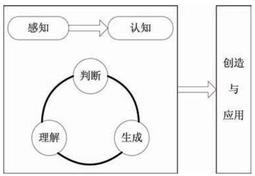

图 1 人工智能的研究层次

Fig. 1 The levels of artificial intelligence
=+=+=+=+=+=+=+=+=
### 1.2 生成式模型的积累

生成式模型不仅在人工智能领域占有重要地位, 生成方法本身也具有很大的研究价值. 生成方法和判别方法是机器学习中监督学习方法的两个分支. 生成式模型是生成方法学习得到的模型. 生成方法涉及对数据的分布假设和分布参数学习, 并能够根据学习而来的模型采样出新的样本. 本文认为生成式模型从研究出发点的角度可以分为两类: 人类理解数据的角度和机器理解数据的角度.

从人类理解数据的角度出发, 典型的做法是先对数据的显式变量或者隐含变量进行分布假设, 然后利用真实数据对分布的参数或包含分布的模型进行拟合或训练, 最后利用学习到的分布或模型生成新的样本. 这类生成式模型涉及的主要方法有最大似然估计法、近似法 \( {}^{\left\lbrack  {10} - {11}\right\rbrack  } \) 、马尔科夫链方法 \( {}^{\left\lbrack  {12} - {14}\right\rbrack  } \) 等. 从这个角度学习到的模型具有人类能够理解的分布, 但是对机器学习来说具有不同的限制. 例如, 以真实样本进行最大似然估计, 参数更新直接来自于数据样本, 导致学习到的生成式模型受到限制. 而采用近似法学习到的生成式模型由于目标函数难解一般只能在学习过程中逼近目标函数的下界, 并不是直接对目标函数的逼近. 马尔科夫链方法既可以用于生成式模型的训练又可以用于新样本的生成, 但是马尔科夫链的计算复杂度较高.

从机器理解数据的角度出发, 建立的生成式模型一般不直接估计或拟合分布, 而是从未明确假设的分布中获取采样的数据 \( {}^{\left\lbrack  {15}\right\rbrack  } \) ,通过这些数据对模型进行修正. 这样得到的生成式模型对人类来说缺乏可解释性, 但是生成的样本却是人类可以理解的. 以此推测, 机器以人类无法显式理解的方式理解了数据并且生成了人类能够理解的新数据. 在 GAN 提出之前, 这种从机器理解数据的角度建立的生成式模型一般需要使用马尔科夫链进行模型训练, 效率较低, 一定程度上限制了其系统应用.

GAN 提出之前, 生成式模型已经有一定研究积累, 模型训练过程和生成数据过程中的局限无疑是生成式模型的障碍. 要真正实现人工智能的四个层次, 就需要设计新的生成式模型来突破已有的障碍.
=+=+=+=+=+=+=+=+=
### 1.3 神经网络的深化

过去 10 年来,随着深度学习 \( {}^{\left\lbrack  {16} - {17}\right\rbrack  } \) 技术在各个领域取得巨大成功, 神经网络研究再度崛起. 神经网络作为深度学习的模型结构, 得益于计算能力的提升和数据量的增大,一定程度上解决了自身参数多、 训练难的问题, 被广泛应用于解决各类问题中. 例如, 深度学习技术在图像分类问题上取得了突破性的效果 \( {}^{\left\lbrack  {18} - {19}\right\rbrack  } \) ,显著提高了语音识别的准确率 \( {}^{\left\lbrack  {20}\right\rbrack  } \) ,又被成功应用于自然语言理解领域 \( {}^{\left\lbrack  {21}\right\rbrack  } \) . 神经网络取得的成功和模型自身的特点是密不可分的. 在训练方面, 神经网络能够采用通用的反向传播算法, 训练过程容易实现; 在结构方面, 神经网络的结构设计自由灵活, 局限性小; 在建模能力方面, 神经网络理论上能够逼近任意函数, 应用范围广. 另外, 计算能力的提升使得神经网络能够更快地训练更多的参数, 进一步推动了神经网络的流行.
=+=+=+=+=+=+=+=+=
### 1.4 对抗思想的成功

从机器学习到人工智能, 对抗思想被成功引入若干领域并发挥作用. 博弈、竞争中均包含着对抗的思想. 博弈机器学习 \( {}^{\lbrack {22}\rbrack } \) 将博弈论的思想与机器学习结合, 对人的动态策略以博弈论的方法进行建模, 优化广告竞价机制, 并在实验中证明了该方法的有效性. 围棋程序 Alpha \( {\mathrm{{Go}}}^{\left\lbrack  {23}\right\rbrack  } \) 战胜人类选手引起大众对人工智能的兴趣,而 AlphaGo 的中级版本在训练策略网络的过程中就采取了两个网络左右互博的方式, 获得棋局状态、策略和对应回报, 并以包含博弈回报的期望函数作为最大化目标. 在神经网络的研究中, 曾有研究者利用两个神经网络互相竞争的方式对网络进行训练 \( {}^{\left\lbrack  {24}\right\rbrack  } \) ,鼓励网络的隐层节点之间在统计上独立, 将此作为训练过程中的正则因素. 还有研究者 \( {}^{\lbrack {25} - {26}\rbrack } \) 采用对抗思想来训练领域适应的神经网络:特征生成器将源领域数据和目标领域数据变换为高层抽象特征, 尽可能使特征的产生领域难以判别; 领域判别器基于变换后的特征, 尽可能准确地判别特征的领域. 对抗样本 \( {}^{\left\lbrack  {27} - {28}\right\rbrack  } \) 也包含着对抗的思想, 指的是那些和真实样本差别甚微却被误分类的样本或者差异很大却被以很高置信度分为某一真实类的样本, 反映了神经网络的一种诡异行为特性. 对抗样本和对抗网络虽然都包含着对抗的思想, 但是目的完全不同. 对抗思想应用于机器学习或人工智能取得的诸多成果, 也激发了更多的研究者对 \( \mathrm{{GAN}} \) 的不断挖掘.

## 2 GAN 的理论与实现模型
=+=+=+=+=+=+=+=+=
### 2.1 GAN 的基本原理

GAN 的核心思想来源于博弈论的纳什均衡. 它设定参与游戏双方分别为一个生成器 (Generator) 和一个判别器 (Discriminator), 生成器的目的是尽量去学习真实的数据分布, 而判别器的目的是尽量正确判别输入数据是来自真实数据还是来自生成器; 为了取得游戏胜利, 这两个游戏参与者需要不断优化, 各自提高自己的生成能力和判别能力, 这个学习优化过程就是寻找二者之间的一个纳什均衡. GAN 的计算流程与结构如图 2 所示. 任意可微分的函数都可以用来表示 GAN 的生成器和判别器, 由此, 我们用可微分函数 \( D \) 和 \( G \) 来分别表示判别器和生成器,它们的输入分别为真实数据 \( x \) 和随机变量 \( z \) . \( G\left( z\right) \) 则为由 \( G \) 生成的尽量服从真实数据分布 \( {p}_{\text{data }} \) 的样本. 如果判别器的输入来自真实数据, 标注为 1 . 如果输入样本为 \( G\left( z\right) \) ,标注为 0 . 这里 \( D \) 的目标是实现对数据来源的二分类判别: 真 (来源于真实数据 \( x \) 的分布)或者伪 (来源于生成器的伪数据 \( G\left( z\right) \) ), 而 \( G \) 的目标是使自己生成的伪数据 \( G\left( z\right) \) 在 \( D \) 上的表现 \( D\left( {G\left( z\right) }\right) \) 和真实数据 \( x \) 在 \( D \) 上的表现 \( D\left( x\right) \) 一致,这两个相互对抗并迭代优化的过程使得 \( D \) 和 \( G \) 的性能不断提升,当最终 \( D \) 的判别能力提升到一定程度, 并且无法正确判别数据来源时, 可以认为这个生成器 \( G \) 已经学到了真实数据的分布.

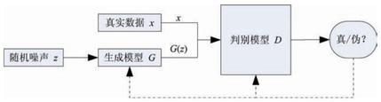

图 2 GAN 的计算流程与结构

Fig. 2 Computation procedure and structure of GAN
=+=+=+=+=+=+=+=+=
### 2.2 GAN 的学习方法

本节中我们讨论 GAN 的学习训练机制.

首先,在给定生成器 \( G \) 的情况下,我们考虑最优化判别器 \( D \) . 和一般基于 Sigmoid 的二分类模型训练一样,训练判别器 \( D \) 也是最小化交叉熵的过程, 其损失函数为:

\[
{Ob}{j}^{D}\left( {{\theta }_{D},{\theta }_{G}}\right)  =  - \frac{1}{2}{\mathrm{E}}_{x \sim  {p}_{\text{data }}\left( x\right) }\left\lbrack  {\log D\left( x\right) }\right\rbrack   -  \tag{1}
\]

\[
\frac{1}{2}{\mathrm{E}}_{z \sim  {p}_{z}\left( z\right) }\left\lbrack  {\log \left( {1 - D\left( {g\left( z\right) }\right) }\right) }\right\rbrack
\]

其中, \( x \) 采样于真实数据分布 \( {p}_{\text{data }}\left( x\right) , z \) 采样于先验分布 \( {p}_{z}\left( z\right) \) (例如高斯噪声分布), \( \mathrm{E}\left( \cdot \right) \) 表示计算期望值. 这里实际训练时和常规二值分类模型不同, 判别器的训练数据集来源于真实数据集分布 \( {p}_{\text{data }}\left( x\right) \) (标注为 1)和生成器的数据分布 \( {p}_{g}\left( x\right) \) (标注为 0) 两部分. 给定生成器 \( G \) ,我们需要最小化式 (1) 来得到最优解, 在连续空间上, 式 (1) 可以写为如下形式:

\[
{Ob}{j}^{D}\left( {{\theta }_{D},{\theta }_{G}}\right)  =  - \frac{1}{2}{\int }_{x}{p}_{\text{data }}\left( x\right) \log \left( {D\left( x\right) }\right) \mathrm{d}x -
\]

\[
\frac{1}{2}{\int }_{z}{p}_{z}\left( z\right) \log \left( {1 - D\left( {g\left( z\right) }\right) }\right) \mathrm{d}z =
\]

\[
- \frac{1}{2}{\int }_{x}\left\lbrack  {{p}_{\text{data }}\left( x\right) \log \left( {D\left( x\right) }\right)  + }\right.
\]

\[
\left. {{p}_{g}\left( x\right) \log \left( {1 - D\left( x\right) }\right) }\right\rbrack  \mathrm{d}x
\]

(2)

对任意的非零实数 \( m \) 和 \( n \) ,且实数值 \( y \in  \left\lbrack  {0,1}\right\rbrack \) , 表达式

\[
- m\log \left( y\right)  - n\log \left( {1 - y}\right)  \tag{3}
\]

在 \( \frac{m}{m + n} \) 处得到最小值. 因此,给定生成器 \( G \) 的情况下,目标函数 (2) 在

\[
{D}_{G}^{ * }\left( x\right)  = \frac{{p}_{\text{data }}\left( x\right) }{{p}_{\text{data }}\left( x\right)  + {p}_{g}\left( x\right) } \tag{4}
\]

处得到最小值, 此即为判别器的最优解. 由式 (4) 可知, GAN 估计的是两个概率分布密度的比值, 这也是和其他基于下界优化或者马尔科夫链方法的关键不同之处.

另一方面, \( D\left( x\right) \) 代表的是 \( x \) 来源于真实数据而非生成数据的概率. 当输入数据采样自真实数据 \( x \) 时, \( D \) 的目标是使得输出概率值 \( D\left( x\right) \) 趋近于 1, 而当输入来自生成数据 \( G\left( z\right) \) 时, \( D \) 的目标是正确判断数据来源,使得 \( D\left( {G\left( z\right) }\right) \) 趋近于 0,同时 \( G \) 的目标是使得其趋近于 1 . 这实际上就是一个关于 \( G \) 和 \( D \) 的零和游戏,那么生成器 \( G \) 的损失函数为 \( {Ob}{j}^{G}\left( {\theta }_{G}\right)  =  - {Ob}{j}^{D}\left( {{\theta }_{D},{\theta }_{G}}\right) \) . 所以 GAN 的优化问题是一个极小 - 极大化问题, GAN 的目标函数可以描述如下:

\[
\mathop{\min }\limits_{G}\mathop{\max }\limits_{D}\left\{  {f\left( {D, G}\right)  = {\mathrm{E}}_{x \sim  {p}_{\text{data }}\left( x\right) }\left\lbrack  {\log D\left( x\right) }\right\rbrack   + }\right.
\]

\[
{\mathrm{E}}_{z \sim  {p}_{z}\left( z\right) }\left\lbrack  {\log \left( {1 - D\left( {G\left( z\right) }\right) }\right) }\right\rbrack
\]

(5)

总之, 对于 GAN 的学习过程, 我们需要训练模型 \( D \) 来最大化判别数据来源于真实数据或者伪数据分布 \( G\left( z\right) \) 的准确率,同时,我们需要训练模型 \( G \) 来最小化 \( \log \left( {1 - D\left( {G\left( z\right) }\right) }\right) \) . 这里可以采用交替优化的方法: 先固定生成器 \( G \) ,优化判别器 \( D \) ,使得 \( D \) 的判别准确率最大化；然后固定判别器 \( D \) ,优化生成器 \( G \) ,使得 \( D \) 的判别准确率最小化. 当且仅当 \( {p}_{\text{data }} = {p}_{g} \) 时达到全局最优解. 训练 GAN 时,同一轮参数更新中,一般对 \( D \) 的参数更新 \( k \) 次再对 \( G \) 的参数更新 1 次.
=+=+=+=+=+=+=+=+=
### 2.3 GAN 的衍生模型

自 Goodfellow 等 \( {}^{\left\lbrack  1\right\rbrack  } \) 于 2014 年提出 GAN 以来, 各种基于 GAN 的衍生模型被提出, 这些模型的创新点包括模型结构改进、理论扩展及应用等. 部分衍生模型的计算流程与结构如图 3 所示.

GAN 在基于梯度下降训练时存在梯度消失的问题, 因为当真实样本和生成样本之间具有极小重叠甚至没有重叠时, 其目标函数的 Jensen-Shannon 散度是一个常数, 导致优化目标不连续. 为了解决训练梯度消失问题, Arjovsky 等 \( {}^{\left\lbrack  {29}\right\rbrack  } \) 提出了 Wasser-stein GAN (W-GAN). W-GAN 用 Earth-Mover 代替 Jensen-Shannon 散度来度量真实样本和生成样本分布之间的距离,用一个批评函数 \( f \) 来对应 GAN 的判别器,而且批评函数 \( f \) 需要建立在 Lipschitz 连续性假设上. 另外, GAN 的判别器 \( D \) 具有无限的建模能力, 无论真实样本和生成的样本有多复杂, 判别器 \( D \) 都能把它们区分开,这容易导致过拟合问题. 为了限制模型的建模能力, \( {\mathrm{{Qi}}}^{\left\lbrack  {30}\right\rbrack  } \) 提出了 Loss-sensitive GAN (LS-GAN), 将最小化目标函数得到的损失函数限定在满足 Lipschitz 连续性函数类上, 作者还给出了梯度消失时的定量分析结果. 需要指出, W-GAN 和 LS-GAN 并没有改变 GAN 模型的结构, 只是在优化方法上进行了改进.

GAN 的训练只需要数据源的标注信息(真或伪),并根据判别器输出来优化. Odena \( {}^{\left\lbrack  {31}\right\rbrack  } \) 提出了 Semi-GAN,将真实数据的标注信息加入判别器 \( D \) 的训练. 更进一步, Conditional GAN (CGAN) \( {}^{\left\lbrack  {32}\right\rbrack  } \) 提出加入额外的信息 \( y \) 到 \( G\text{、}D \) 和真实数据来建模, 这里的 \( y \) 可以是标签或其他辅助信息. 传统 GAN 都是学习一个生成式模型来把隐变量分布映射到复杂真实数据分布上, Donahue 等 [33] 提出一种 Bidirectional GANs (BiGANs) 来实现将复杂数据映射到隐变量空间,从而实现特征学习. 除了 GAN 的基本框架, BiGANs 额外加入了一个解码器 \( Q \) 用于将真实数据 \( x \) 映射到隐变量空间,其优化问题转换为 \( \mathop{\min }\limits_{{G, Q}}\mathop{\max }\limits_{D}f\left( {D, Q, G}\right) \)

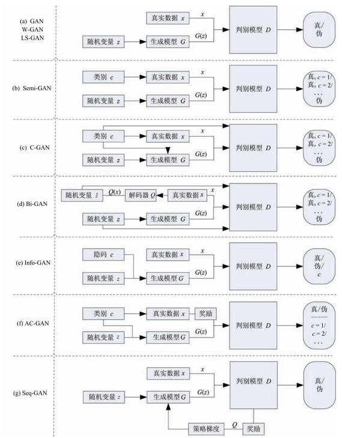

图 3 GAN 衍生模型的计算流程与结构 \( \left( {\left( \mathrm{a}\right) {\mathrm{{GAN}}}^{\left\lbrack  1\right\rbrack  },\mathrm{W} - {\mathrm{{GAN}}}^{\left\lbrack  {29}\right\rbrack  },\mathrm{{LS}} - {\mathrm{{GAN}}}^{\left\lbrack  {30}\right\rbrack  };\left( \mathrm{b}\right) {\mathrm{{Semi} - {GAN}}}^{\left\lbrack  {31}\right\rbrack  };\left( \mathrm{c}\right) {\mathrm{C - {GAN}}}^{\left\lbrack  {32}\right\rbrack  }}\right) \) ; (d) Bi-GAN \( {}^{\left\lbrack  {33}\right\rbrack  } \) ; (e) Info-GAN \( {}^{\left\lbrack  {34}\right\rbrack  } \) ; (f) AC-GAN \( {}^{\left\lbrack  {35}\right\rbrack  } \) ; (g) Seq-GAN \( {}^{\left\lbrack  6\right\rbrack  } \) )

Fig. 3 Computation procedures and structures of GAN-derived models

InfoGAN \( {}^{\left\lbrack  {34}\right\rbrack  } \) 是 GAN 的另一个重要扩展. GAN 能够学得有效的语义特征,但是输入噪声变量 \( z \) 的特定变量维数和特定语义之间的关系不明确, 而 In-foGAN 能够获取输入的隐层变量和具体语义之间的互信息. 具体实现就是把生成器 \( G \) 的输入分为两部分 \( z \) 和 \( c \) ,这里 \( z \) 和 GAN 的输入一致,而 \( c \) 被称为隐码, 这个隐码用于表征结构化隐层随机变量和具体特定语义之间的隐含关系. GAN 设定了 \( {p}_{G}\left( x\right)  = {p}_{G}\left( {x \mid  c}\right) \) ,而实际上 \( c \) 与 \( G \) 的输出具有较强的相关性. 用 \( G\left( {z, c}\right) \) 来表示生成器的输出,作者 \( {}^{\left\lbrack  {34}\right\rbrack  } \) 提出利用互信息 \( I\left( {c;G\left( {z, c}\right) }\right) \) 来表征两个数据的相关程度, 用目标函数

\[
\mathop{\min }\limits_{G}\mathop{\max }\limits_{D}\left\{  {{f}_{I}\left( {D, G}\right)  = f\left( {D, G}\right)  - {\lambda I}\left( {c;G\left( {z, c}\right) }\right) }\right\}
\]

(6)

来建模求解,这里由于后验概率 \( p\left( {c \mid  x}\right) \) 不能直接获取, 需要引入变分分布来近似后验的下界来求得最优解.

Odena 等 \( {}^{\left\lbrack  {35}\right\rbrack  } \) 提出的 Auxiliary Classifier GAN (AC-GAN) 可以实现多分类问题, 它的判别器输出相应的标签概率. 在实际训练中, 目标函数则包含真实数据来源的似然和正确分类标签的似然, 不再单独由判别器二分类损失来反传调节参数, 可以进一步调节损失函数使得分类正确率更高, AC-GAN 的关键是可以利用输入生成器的标注信息来生成对应的图像标签, 同时还可以在判别器扩展调节损失函数, 从而进一步提高对抗网络的生成和判别能力.

考虑到 GAN 的输出为连续实数分布而无法产生离散空间的分布, Yu 等 \( {}^{\left\lbrack  6\right\rbrack  } \) 提出了一种能够生成离散序列的生成式模型 Seq-GAN. 他们用 RNN 实现生成器 \( G \) ,用 \( \mathrm{{CNN}} \) 实现判别器 \( D \) ,用 \( D \) 的输出判别概率通过增强学习来更新 \( G \) . 增强学习中的奖励通过 \( D \) 来计算,对于后面可能的行为采用了蒙特卡洛搜索实现,计算 \( D \) 的输出平均作为奖励值反馈.

## 3 GAN 的应用领域

作为一个具有 “无限” 生成能力的模型, GAN 的直接应用就是建模, 生成与真实数据分布一致的数据样本, 例如可以生成图像、视频等. GAN 可以用于解决标注数据不足时的学习问题, 例如无监督学习、半监督学习等. GAN 还可以用于语音和语言处理, 例如生成对话、由文本生成图像等. 本节从图像和视觉、语音和语言、其他领域三个方面来阐述 \( \mathrm{{GAN}} \) 的应用.
=+=+=+=+=+=+=+=+=
### 3.1 图像和视觉领域

GAN 能够生成与真实数据分布一致的图像. 一个典型应用来自 Twitter 公司, Ledig 等 \( {}^{\left\lbrack  {36}\right\rbrack  } \) 提出利用 GAN 来将一个低清模糊图像变换为具有丰富细节的高清图像. 作者用 VGG 网络 \( {}^{\left\lbrack  {37}\right\rbrack  } \) 作为判别器, 用参数化的残差网络 \( {}^{\lbrack {19}\rbrack } \) 表示生成器,实验结果如图 4 所示, 可以看到 GAN 生成了细节丰富的图像.

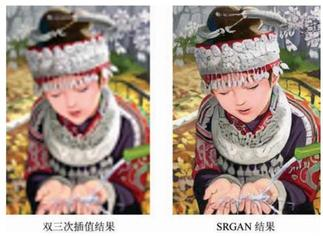

图 4 基于 GAN 的生成图像示例 \( {}^{\left\lbrack  {36}\right\rbrack  } \)

Fig. 4 Illustration of GAN-generated image \( {}^{\left\lbrack  {36}\right\rbrack  } \)

GAN 也开始用于生成自动驾驶场景. Santana 等 \( {}^{\left\lbrack  {38}\right\rbrack  } \) 提出利用 GAN 来生成与实际交通场景分布一致的图像, 再训练一个基于 RNN 的转移模型实现预测的目的, 实验结果如图 5 所示. GAN 可以用于自动驾驶中的半监督学习或无监督学习任务, 还可以利用实际场景不断更新的视频帧来实时优化 GAN 的生成器.

Gou 等 \( {}^{\left\lbrack  {39} - {40}\right\rbrack  } \) 提出利用仿真图像和真实图像作为训练样本来实现人眼检测, 但是这种仿真图像与真实图像存在一定的分布差距. Shrivastava 等 \( {}^{\left\lbrack  {41}\right\rbrack  } \) 提出一种基于 GAN 的方法 (称为 SimGAN), 利用无标签真实图像来丰富细化仿真图像, 使得合成图像更加真实. 作者引入一个自正则化项来实现最小化合成误差并最大程度保留仿真图像的类别, 同时利用加入的局部对抗损失函数来对每个局部图像块进行判别, 使得局部信息更加丰富.
=+=+=+=+=+=+=+=+=
### 3.2 语音和语言领域

目前已经有一些关于 GAN 的语音和语言处理文章. Li 等 \( {}^{\left\lbrack  5\right\rbrack  } \) 提出用 GAN 来表征对话之间的隐式关联性,从而生成对话文本. Zhang 等 \( {}^{\left\lbrack  {42}\right\rbrack  } \) 提出基于 GAN 的文本生成, 他们用 CNN 作为判别器, 判别器基于拟合 LSTM 的输出, 用矩匹配来解决优化问题; 在训练时, 和传统更新多次判别器参数再更新一次生成器不同,需要多次更新生成器再更新 CNN 判别器. \( {\operatorname{SeqGAN}}^{\left\lbrack  6\right\rbrack  } \) 基于策略梯度来训练生成器 \( G \) , 策略梯度的反馈奖励信号来自于生成器经过蒙特卡洛搜索得到, 实验表明 SeqGAN 在语音、诗词和音乐生成方面可以超过传统方法. Reed 等 \( {}^{\lbrack {43}\rbrack } \) 提出用 GAN 基于文本描述来生成图像, 文本编码被作为生成器的条件输入, 同时为了利用文本编码信息, 也将其作为判别器特定层的额外信息输入来改进判别器, 判别是否满足文本描述的准确率, 实验结果表明生成图像和文本描述具有较高相关性.

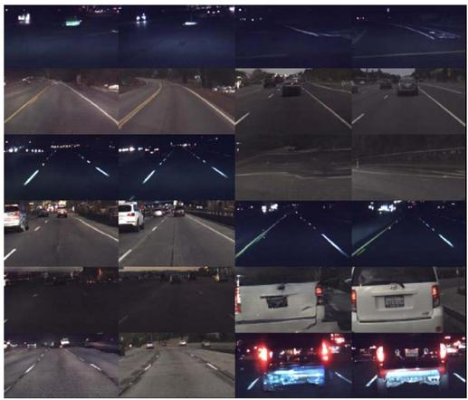

图 5 基于 GAN 的生成图像示例(奇数列为生成图像,偶数列为目标图像) \( {}^{\left\lbrack  {38}\right\rbrack  } \)

Fig. 5 Another illustration of GAN-generated images (Odd columns show the generated images, and even columns show the target images) \( {}^{\left\lbrack  {38}\right\rbrack  } \)
=+=+=+=+=+=+=+=+=
### 3.3 其他领域

除了将 GAN 应用于图像和视觉、语音和语言等领域, GAN 还可以与强化学习相结合, 例如前述的 SeqGAN \( {}^{\left\lbrack  6\right\rbrack  } \) . 还有研究者将 GAN 和模仿学习融合 \( {}^{\left\lbrack  {44} - {45}\right\rbrack  } \) 、将 GAN 和 Actor-critic 方法结合 \( {}^{\left\lbrack  {46}\right\rbrack  } \) 等. \( \mathrm{{Hu}} \) 等 \( {}^{\left\lbrack  7\right\rbrack  } \) 提出 \( \mathrm{{MalGAN}} \) 帮助检测恶意代码,用 \( \mathrm{{GAN}} \) 生成具有对抗性的病毒代码样本, 实验结果表明基于 GAN 的方法可以比传统基于黑盒检测模型的方法性能更好. Childambaram 等 \( {}^{\left\lbrack  8\right\rbrack  } \) 基于风格转换提出了一个扩展 GAN 的生成器, 用判别器来正则化生成器而不是用一个损失函数, 用国际象棋实验示例证明了所提方法的有效性.

## 4 GAN 的思考与展望
=+=+=+=+=+=+=+=+=
### 4.1 GAN 的意义和优点

GAN 对于生成式模型的发展具有重要的意义. GAN 作为一种生成式方法, 有效解决了可建立自然性解释的数据的生成难题. 尤其对于生成高维数据, 所采用的神经网络结构不限制生成维度, 大大拓宽了生成数据样本的范围. 所采用的神经网络结构能够整合各类损失函数, 增加了设计的自由度. GAN 的训练过程创新性地将两个神经网络的对抗作为训练准则并且可以使用反向传播进行训练, 训练过程不需要效率较低的马尔科夫链方法, 也不需要做各种近似推理, 没有复杂的变分下界, 大大改善了生成式模型的训练难度和训练效率. GAN 的生成过程不需要繁琐的采样序列, 可以直接进行新样本的采样和推断, 提高了新样本的生成效率. 对抗训练方法摒弃了直接对真实数据的复制或平均, 增加了生成样本的多样性. GAN 在生成样本的实践中, 生成的样本易于人类理解. 例如, 能够生成十分锐利清晰的图像, 为创造性地生成对人类有意义的数据提供了可能的解决方法.

GAN 除了对生成式模型的贡献, 对于半监督学习也有启发. GAN 学习过程中不需要数据标签. 虽然 GAN 提出的目的不是半监督学习, 但是 GAN 的训练过程可以用来实施半监督学习中无标签数据对模型的预训练过程. 具体来说, 先利用无标签数据训练 GAN, 基于训练好的 GAN 对数据的理解, 再利用小部分有标签数据训练判别器, 用于传统的分类和回归任务.
=+=+=+=+=+=+=+=+=
### 4.2 GAN 的缺陷和发展趋势

GAN 虽然解决了生成式模型的一些问题, 并且对其他方法的发展具有一定的启发意义, 但是 GAN 并不完美, 它在解决已有问题的同时也引入了一些新的问题. GAN 最突出的优点同时也是它最大的问题根源. GAN 采用对抗学习的准则, 理论上还不能判断模型的收敛性和均衡点的存在性. 训练过程需要保证两个对抗网络的平衡和同步, 否则难以得到很好的训练效果. 而实际过程中两个对抗网络的同步不易把控, 训练过程可能不稳定. 另外, 作为以神经网络为基础的生成式模型, GAN 存在神经网络类模型的一般性缺陷, 即可解释性差. 另外, GAN 生成的样本虽然具有多样性, 但是存在崩溃模式 (Collapse mode) 现象 \( {}^{\left\lbrack  4\right\rbrack  } \) ,可能生成多样的,但对于人类来说差异不大的样本.

虽然 GAN 存在这些问题, 但不可否认的是, GAN 的研究进展表明它具有广阔的发展前景. 例如, Wasserstein \( {\mathrm{{GAN}}}^{\left\lbrack  {29}\right\rbrack  } \) 彻底解决了训练不稳定问题, 同时基本解决了崩溃模式现象. 如何彻底解决崩溃模式并继续优化训练过程是 GAN 的一个研究方向. 另外, 关于 GAN 收敛性和均衡点存在性的理论推断也是未来的一个重要研究课题. 以上研究方向是为了更好地解决 GAN 存在的缺陷. 从发展应用 GAN 的角度, 如何根据简单随机的输入, 生成多样的、能够与人类交互的数据, 是近期的一个应用发展方向. 从 GAN 与其他方法交叉融合的角度, 如何将 GAN 与特征学习、模仿学习、强化学习等技术更好地融合, 开发新的人工智能应用或者促进这些方法的发展, 是很有意义的发展方向. 从长远来看, 如何利用 GAN 推动人工智能的发展与应用, 提升人工智能理解世界的能力, 甚至激发人工智能的创造力是值得研究者思考的问题.
=+=+=+=+=+=+=+=+=
### 4.3 GAN 与平行智能的关系

王飞跃研究员 \( {}^{\lbrack {47} - {48}\rbrack } \) 于 2004 年提出了复杂系统建模与调控的 ACP (Artificial societies, computational experiments, and parallel execution) 理论和平行系统方法. 平行系统强调虚实互动, 构建人工系统来描述实际系统, 利用计算实验来学习和评估各种计算模型, 通过平行执行来提升实际系统的性能,使得人工系统和实际系统共同推进 \( {}^{\left\lbrack  {49} - {50}\right\rbrack  } \) . ACP 理论和平行系统方法目前已经发展为更广义的平行智能理论 \( {}^{\left\lbrack  {51}\right\rbrack  } \) . GAN 训练中真实的数据样本和生成的数据样本通过对抗网络互动, 并且训练好的生成器能够生成比真实样本更多的虚拟样本. GAN 可以深化平行系统的虚实互动、交互一体的理念. GAN 作为一种有效的生成式模型, 可以融入到平行智能研究体系. 本节从以下几个方面讨论 GAN 与平行智能的关系.

#### 4.3.1 GAN 与平行视觉

平行视觉 \( {}^{\lbrack {52}\rbrack } \) 是 ACP 理论在视觉计算领域的推广, 其基本框架与体系结构如图 6 所示. 平行视觉结合计算机图形学、虚拟现实、机器学习、知识自动化等技术, 利用人工场景、计算实验、平行执行等理论和方法, 建立复杂环境下视觉感知与理解的理论和方法体系. 平行视觉利用人工场景来模拟和表示复杂挑战的实际场景, 使采集和标注大规模多样性数据集成为可能, 通过计算实验进行视觉算法的设计与评估, 最后借助平行执行来在线优化视觉系统. 其中产生虚拟的人工场景便可以采用 GAN 实现, 如图 5 所示. GAN 能够生成大规模多样性的图像数据集, 与真实数据集结合起来训练视觉模型, 有助于提高视觉模型的泛化能力.

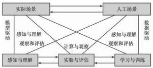

图 6 平行视觉的基本框架与体系结构 \( {}^{\lbrack {52}\rbrack } \)

Fig. 6 Basic framework and architecture for parallel vision \( {}^{\left\lbrack  {52}\right\rbrack  } \)

#### 4.3.2 GAN 与平行控制

平行控制 \( {}^{\lbrack {53} - {55}\rbrack } \) 是一种反馈控制,是 ACP 理论在复杂系统控制领域的具体应用, 其结构如图 7 所示. 平行控制核心是利用人工系统进行建模和表示, 通过计算实验进行分析和评估, 最后以平行执行实现对复杂系统的控制. 除了人工系统的生成和计算实验的分析, 平行控制中的人工系统和实际系统平行执行的过程也利用 GAN 进行模拟,一方面可以进行人工系统的预测学习和实际系统的反馈学习, 另一方面可以进行控制单元的模拟学习和强化学习.

#### 4.3.3 GAN 与平行学习

平行学习 \( {}^{\left\lbrack  {56}\right\rbrack  } \) 是一种新的机器学习理论框架,是 ACP 理论在学习领域的体现, 其理论框架如图 8 所示. 平行学习理论框架强调: 使用预测学习解决如何随时间发展对数据进行探索; 使用集成学习解决如何在空间分布上对数据进行探索; 使用指示学习解决如何探索数据生成的方向. 平行学习作为机器学习的一个新型理论框架, 与平行视觉和平行控制关系密切. GAN 在大数据生成、基于计算实验的预测学习等方面都可以和平行学习结合发展.

## 5 结论

本文综述了生成式对抗网络 GAN 的研究进展. GAN 提出后, 立刻受到了人工智能研究者的重视. GAN 的基本思想源自博弈论的二人零和博弈, 由一个生成器和一个判别器构成, 通过对抗学习的方式来迭代训练, 逼近纳什均衡. GAN 作为一种生成式模型, 不直接估计数据样本的分布, 而是通过模型学习来估测其潜在分布并生成同分布的新样本. 这种从潜在分布生成 “无限” 新样本的能力, 在图像和视觉计算、语音和语言处理、信息安全等领域具有重大的应用价值.

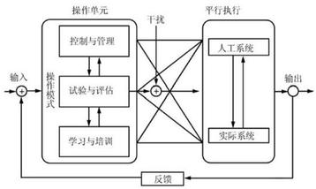

图 7 平行控制系统的结构 \( {}^{\lbrack {55}\rbrack } \)

Fig. 7 Structure of parallel control systems \( {}^{\left\lbrack  {55}\right\rbrack  } \)

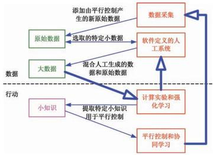

图 8 平行学习的理论框架图 \( {}^{\left\lbrack  {56}\right\rbrack  } \)

Fig. 8 Theoretical framework of parallel learning \( {}^{\left\lbrack  {56}\right\rbrack  } \)

本文还展望了 GAN 的发展趋势, 重点讨论了 GAN 与平行智能的关系, 认为 GAN 可以深化平行系统的虚实互动、交互一体的理念,为 ACP 理论提供具体和丰富的算法支持. 在平行视觉、平行控制、 平行学习等若干平行系统中, GAN 可以通过生成与真实数据同分布的数据样本, 来支持平行系统的理论和应用研究. 因此, GAN 作为一种有效的生成式模型, 可以融入到平行智能的研究体系. References

1 Goodfellow I, Pouget-Abadie J, Mirza M, Xu B, Warde-Farley D, Ozair S, Courville A, Bengio Y. Generative adversarial nets. In: Proceedings of the 2014 Conference on Advances in Neural Information Processing Systems 27. Montreal, Canada: Curran Associates, Inc., 2014. 2672-2680

2 Goodfellow I, Bengio Y, Courville A. Deep Learning. Cambridge, UK: MIT Press, 2016.

3 Ratliff L J, Burden S A, Sastry S S. Characterization and computation of local Nash equilibria in continuous games. In: Proceedings of the 51st Annual Allerton Conference on Communication, Control, and Computing (Allerton). Monticello, IL, USA: IEEE, 2013. 917-924

4 Goodfellow I. NIPS 2016 tutorial: generative adversarial networks. arXiv preprint arXiv: 1701.00160, 2016.

5 Li J W, Monroe W, Shi T L, Jean S, Ritter A, Jurafsky D. Adversarial learning for neural dialogue generation. arXiv preprint arXiv: 1701.06547, 2017.

6 Yu L T, Zhang W N, Wang J, Yu Y. SeqGAN: sequence generative adversarial nets with policy gradient. arXiv preprint arXiv: 1609.05473, 2016.

7 Hu WW, Tan Y. Generating adversarial malware examples for black-box attacks based on GAN. arXiv preprint arXiv: 1702.05983, 2017.

8 Chidambaram M, Qi Y J. Style transfer generative adversarial networks: learning to play chess differently. arXiv preprint arXiv: 1702.06762, 2017.

9 Bengio Y. Learning deep architectures for AI. Foundations and Trends in Machine Learning, 2009, 2(1): 1-127

10 Kingma D P, Welling M. Auto-encoding variational Bayes. arXiv preprint arXiv: 1312.6114, 2013.

11 Rezende D J, Mohamed S, Wierstra D. Stochastic back-propagation and approximate inference in deep generative models. arXiv preprint arXiv: 1401.4082, 2014.

12 Hinton G E, Sejnowski T J, Ackley D H. Boltzmann Machines: Constraint Satisfaction Networks that Learn. Technical Report No. CMU-CS-84-119, Carnegie-Mellon University, Pittsburgh, PA, USA, 1984.

13 Ackley D H, Hinton G E, Sejnowski T J. A learning algorithm for Boltzmann machines. Cognitive Science, 1985, \( \mathbf{9}\left( 1\right)  : {147} - {169} \)

14 Hinton G E, Osindero S, Teh Y W. A fast learning algorithm for deep belief nets. Neural Computation, 2006, 18(7): \( {1527} - {1554} \)

15 Bengio Y, Thibodeau-Laufer É, Alain G, Yosinski J. Deep generative stochastic networks trainable by backprop. arXiv preprint arXiv: 1306.1091, 2013.

16 Hinton G E, Salakhutdinov R R. Reducing the dimensionality of data with neural networks. Science, 2006, 313(5786): 504-507

17 LeCun Y, Bengio Y, Hinton G. Deep learning. Nature, 2015, 521(7553): 436-444

18 Krizhevsky A, Sutskever I, Hinton G E. Imagenet classification with deep convolutional neural networks. In: Proceedings of the 25th International Conference on Neural Information Processing Systems. Lake Tahoe, Nevada, USA: ACM, 2012. 1097-1105

19 He K M, Zhang X Y, Ren S Q, Sun J. Deep residual learning for image recognition. In: Proceedings of the 2016 IEEE Conference on Computer Vision and Pattern Recognition (CVPR). Las Vegas, NV, USA: IEEE, 2016. 770-778

20 Hinton G, Deng L, Yu D, Dahl G E, Mohamed A R, Jaitly N, Senior A, Vanhoucke V, Nguyen P, Sainath T N, Kingsbury B. Deep neural networks for acoustic modeling in speech recognition: the shared views of four research groups. IEEE Signal Processing Magazine, 2012, 29(6): 82-97

21 Sutskever I, Vinyals O, Le Q V. Sequence to sequence learning with neural networks. In: Proceedings of the 2014 Conference on Advances in Neural Information Processing Systems 27. Montreal, Canada: Curran Associates, Inc., 2014. 3104-3112.

22 He D, Chen W, Wang L W, Liu T Y. A game-theoretic machine learning approach for revenue maximization in sponsored search. arXiv preprint arXiv: 1406.0728, 2014.

23 Silver D, Huang A, Maddison C J, Guez A, Sifre L, van Den Driessche G, Schrittwieser J, Antonoglou I, Panneershelvam V, Lanctot M, Dieleman S, Grewe D, Nham J, Kalchbren-ner N, Sutskever I, Lillicrap T, Leach M, Kavukcuoglu K, Graepel T, Hassabis D. Mastering the game of go with deep neural networks and tree search. Nature, 2016, 529(7587): \( {484} - {489} \)

24 Schmidhuber J. Learning factorial codes by predictability minimization. Neural Computation, 1992, 4(6): 863-879

25 Ganin Y, Ustinova E, Ajakan H, Germain P, Larochelle \( \mathrm{H} \) , Laviolette F, Marchand M, Lempitsky V. Domain-adversarial training of neural networks. Journal of Machine Learning Research, 2016, 17(59): 1-35

26 Chen W Z, Wang H, Li Y Y, Su H, Wang Z H, Tu C H, Lischinski D, Cohen-Or D, Chen B. Synthesizing training images for boosting human 3D pose estimation. In: Proceedings of the 2016 Fourth International Conference on 3D Vision (3DV). Stanford, CA, USA: IEEE, 2016. 479-488

27 Szegedy C, Zaremba W, Sutskever I, Bruna J, Erhan D, Goodfellow I, Fergus R. Intriguing properties of neural networks. arXiv preprint arXiv: 1312.6199, 2013.

28 McDaniel P, Papernot N, Celik Z B. Machine learning in adversarial settings. IEEE Security & Privacy, 2016, 14(3): 68-72

29 Arjovsky M, Chintala S, Bottou L. Wasserstein GAN. arXiv preprint arXiv: 1701.07875, 2017.

\( {30}\mathrm{{Qi}}\mathrm{G} \) J. Loss-sensitive generative adversarial networks on Lipschitz densities. arXiv preprint arXiv: 1701.06264, 2017.

31 Odena A. Semi-supervised learning with generative adversarial networks. arXiv preprint arXiv: 1606.01583, 2016.

32 Mirza M, Osindero S. Conditional generative adversarial nets. arXiv preprint arXiv: 1411.1784, 2014.

33 Donahue J, Krähenbühl P, Darrell T. Adversarial feature learning. arXiv preprint arXiv: 1605.09782, 2016.

34 Chen X, Duan Y, Houthooft R, Schulman J, Sutskever I, Abbeel P. InfoGAN: interpretable representation learning by information maximizing generative adversarial nets. In: Proceedings of the 2016 Neural Information Processing Systems. Barcelona, Spain: Department of Information Technology IMEC, 2016. 2172-2180

35 Odena A, Olah C, Shlens J. Conditional image synthesis with auxiliary classifier GANs. arXiv preprint arXiv: 1610.09585, 2016.

36 Ledig C, Theis L, Huszár F, Caballero J, Cunningham A, Acosta A, Aitken A, Tejani A, Totz J, Wang Z H, Shi W Z. Photo-realistic single image super-resolution using a generative adversarial network. arXiv preprint arXiv: 1609.04802, 2016.

37 Simonyan K, Zisserman A. Very deep convolutional networks for large-scale image recognition. arXiv preprint arXiv: 1409.1556, 2014.

38 Santana E, Hotz G. Learning a driving simulator. arXiv preprint arXiv: 1608.01230, 2016.

39 Gou C, Wu Y, Wang K, Wang F Y, Ji Q. Learning-by-synthesis for accurate eye detection. In: Proceedings of the 2016 IEEE International Conference on Pattern Recognition (ICPR). Cancun, Mexico: IEEE, 2016.

40 Gou C, Wu Y, Wang K, Wang K F, Wang F Y, Ji Q. A joint cascaded framework for simultaneous eye detection and eye state estimation. Pattern Recognition, 2017, 67: 23-31

41 Shrivastava A, Pfister T, Tuzel O, Susskind J, Wang W D, Webb R. Learning from simulated and unsupervised images through adversarial training. arXiv preprint arXiv: 1612.07828, 2016.

42 Zhang Y Z, Gan Z, Carin L. Generating text via adversarial training. In: Proceedings of the 2016 Conference on Advances in Neural Information Processing Systems 29. Curran Associates, Inc., 2016.

43 Reed S, Akata Z, Yan X C, Logeswaran L, Lee H, Schiele B. Generative adversarial text to image synthesis. In: Proceedings of the \( {33}\mathrm{{rd}} \) International Conference on Machine Learning. New York, NY, USA: ICML, 2016.

44 Ho J, Ermon S. Generative adversarial imitation learning. In: Proceedings of the 2016 Conference on Advances in Neural Information Processing Systems 29. Curran Associates, Inc., 2016. 4565-4573

45 Finn C, Christiano P, Abbeel P, Levine S. A connection between generative adversarial networks, inverse reinforcement learning, and energy-based models. arXiv preprint arXiv: 1611.03852, 2016.

46 Pfau D, Vinyals O. Connecting generative adversarial networks and actor-critic methods. arXiv preprint arXiv: 1610.01945, 2016.

47 Wang Fei-Yue. Parallel system methods for management and control of complex systems. Control and decision, 2004, \( \mathbf{{19}}\left( 5\right)  : {485} - {489},{514} \)

(王飞跃. 平行系统方法与复杂系统的管理和控制. 控制与决策, 2004, \( \mathbf{{19}}\left( 5\right)  : {485} - {489},{514}) \)

48 Wang Fei-Yue. Computational experiments for behavior analysis and decision evaluation of complex systems. Journal of System Simulation, 2004, 16(5): 893-897

(王飞跃. 计算实验方法与复杂系统行为分析和决策评估. 系统仿真学报, 2004, 16(5): 893-897)

49 Wang F Y, Zhang J, Wei Q L, Zheng X H, Li L. PDP: parallel dynamic programming. IEEE/CAA Journal of Au-tomatica Sinica, 2017, 4(1): 1-5

50 Bai Tian-Xiang, Wang Shuai, Shen Zhen, Cao Dong-Pu, Zheng Nan-Ning, Wang Fei-Yue. Parallel robotics and parallel unmanned systems: framework, structure, process, platform and applications. Acta Automatica Sinica, 2017, 43(2): 161-175

(白天翔, 王帅, 沈震, 曹东璞, 郑南宁, 王飞跃. 平行机器人与平行无人系统:框架、结构、过程、平台及其应用. 自动化学报, 2017, \( \mathbf{{43}}\left( 2\right)  : {161} - {175}) \)

51 Wang F Y, Wang X, Li L X, Li L. Steps toward parallel intelligence. IEEE/CAA Journal of Automatica Sinica, 2016, \( \mathbf{3}\left( 4\right)  : {345} - {348} \)

52 Wang Kun-Feng, Gou Chao, Wang Fei-Yue. Parallel vision: an ACP-based approach to intelligent vision computing. Acta Automatica Sinica, 2016, 42(10): 1490-1500

(王坤峰,苟超,王飞跃. 平行视觉: 基于 ACP 的智能视觉计算方法. 自动化学报, 2016, 42(10): 1490-1500)

53 Wang Fei-Yue. On the modeling, analysis, control and management of complex systems. Complex Systems and Complexity Science, 2006, 3(2): 26-34

(王飞跃. 关于复杂系统的建模、分析、控制和管理. 复杂系统与复杂性科学, 2006, 3(2): 26-34)

54 Wang Fei-Yue, Liu De-Rong, Xiong Gang, Cheng Chang-Jian, Zhao Dong-Bin. Parallel control theory of complex systems and applications. Complex Systems and Complexity Science, 2012, \( \mathbf{9}\left( 3\right)  : 1 - {12} \)

(王飞跃,刘德荣,熊刚,程长建,赵冬斌. 复杂系统的平行控制理论及应用. 复杂系统与复杂性科学, \( {2012},\mathbf{9}\left( 3\right)  : 1 - {12}) \)

55 Wang Fei-Yue. Parallel control: a method for data-driven and computational control. Acta Automatica Sinica, 2013, 39(4): 293-302

(王飞跃. 平行控制:数据驱动的计算控制方法. 自动化学报,2013, \( \mathbf{{39}}\left( 4\right)  : {293} - {302}) \)

56 Li Li, Lin Yi-Lun, Cao Dong-Pu, Zheng Nan-Ning, Wang Fei-Yue. Parallel learning - a new framework for machine learning. Acta Automatica Sinica, 2017, 43(1): 1-8

(李力, 林懿伦, 曹东璞, 郑南宁, 王飞跃. 平行学习 — 机器学习的一个新型理论框架. 自动化学报, 2017, \( \mathbf{{43}}\left( 1\right)  : 1 - 8) \)

王坤峰 中国科学院自动化研究所复杂系统管理与控制国家重点实验室副研究员. 主要研究方向为智能交通系统, 智能视觉计算, 机器学习.

E-mail: kunfeng.wang@ia.ac.cn

(WANG Kun-Feng Associate professor at The State Key Laboratory of Management and Control for Complex Systems, Institute of Automation, Chinese Academy of Sciences. His research interest covers intelligent transportation systems, intelligent vision computing, and machine learning.)

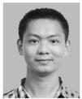

苟 超 中国科学院自动化研究所复杂系统管理与控制国家重点实验室博士研究生. 主要研究方向为智能交通系统,图像处理, 模式识别.

E-mail: gouchao2012@ia.ac.cn

(GOU Chao Ph. D. candidate at The State Key Laboratory of Management and Control for Complex Systems, Institute of Automation, Chinese Academy of Sciences. His research interest covers intelligent transportation systems, image processing, and pattern recognition.)

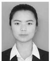

段艳杰 中国科学院自动化研究所复杂系统管理与控制国家重点实验室博士研究生. 主要研究方向为智能交通系统,机器学习及应用.

E-mail: duanyanjie2012@ia.ac.cn

(DUAN Yan-Jie Ph. D. candidate at The State Key Laboratory of Management and Control for Complex Systems, Institute of Automation, Chinese Academy of Sciences. Her research interest covers intelligent transportation systems, machine learning and its application.)

林懿伦 中国科学院自动化研究所复杂系统管理与控制国家重点实验室博士研究生. 主要研究方向为社会计算, 智能交通系统, 深度学习和强化学习.

E-mail: linyilun2014@ia.ac.cn

(LIN Yi-Lun Ph. D. candidate at The State Key Laboratory of Management and Control for Complex Systems, Institute of Automation, Chinese Academy of Sciences. His research interest covers social computing, intelligent transportation systems, deep learning and reinforcement learning.)

郑心湖 明尼苏达大学计算机科学与工程学院研究生. 主要研究方向为社会计算, 机器学习, 数据分析.

E-mail: zheng473@umn.edu

(ZHENG Xin-Hu Postgraduate in the Department of Computer Science and Engineering, University of Minnesota, USA. His research interest covers social computing, machine learning, and data analytics.)

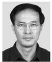

王飞跃 中国科学院自动化研究所复杂系统管理与控制国家重点实验室研究员. 国防科学技术大学军事计算实验与平行系统技术研究中心主任. 主要研究方向为智能系统和复杂系统的建模、分析与控制. 本文通信作者.

E-mail: feiyue.wang@ia.ac.cn

(WANG Fei-Yue Professor at The State Key Laboratory of Management and Control for Complex Systems, Institute of Automation, Chinese Academy of Sciences. Director of the Research Center for Computational Experiments and Parallel Systems Technology, National University of Defense Technology. His research interest covers modeling, analysis, and control of intelligent systems and complex systems. Corresponding author of this paper.)
