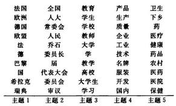
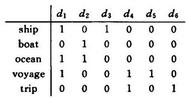
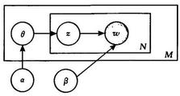
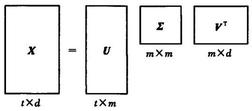
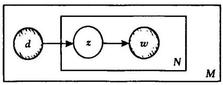
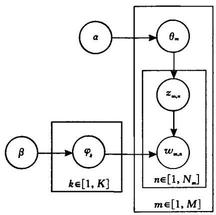
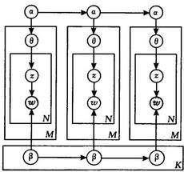
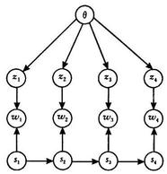
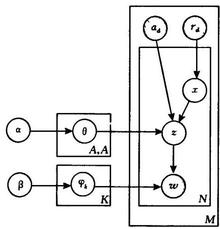

=+=+=+=+=+=+=+=+=
# 自然语言处理中主题模型的发展

徐 戈 王厚峰

(北京大学计算语言学研究所,北京大学计算语言学教育部重点实验室 北京 100871)

摘 要 主题模型在自然语言处理领域受到了越来越多的关注. 在该领域中, 主题可以看成是词项的概率分布. 主题模型通过词项在文档级的共现信息抽取出语义相关的主题集合, 并能够将词项空间中的文档变换到主题空间, 得到文档在低维空间中的表达. 作者从主题模型的起源隐性语义索引出发, 对概率隐性语义索引以及 LDA 等在主题模型发展中的重要阶段性工作进行了介绍和分析, 着重描述这些工作之间的关联性. LDA 作为一个概率生成模型, 很容易被扩展成其它形式的概率模型. 作者对由 LDA 派生出的各种模型作了粗略分类, 并选择了各类的代表性模型简单介绍. 主题模型中最重要的两组参数分别是各主题下的词项概率分布和各文档的主题概率分布, 作者对期望最大化算法在主题模型参数估计中的使用进行了分析, 这有助于更深刻理解主题模型发展中各项工作的联系.

关键词 自然语言处理；主题模型；隐性语义索引；LDA；期望最大化算法；Gibbs 采样

中图法分类号 TP391 DOI 号: 10.3724/SP. J. 1016. 2011. 01423

# The Development of Topic Models in Natural Language Processing

XU Ge WANG Hou-Feng

(Key Laboratory of Computational Linguistics of Ministry of Education (Peking University), Institute of Computational Linguistics, Peking University, Beijing 100871)

Abstract Topic models are receiving extensive attention in natural language processing. In this field, a topic is regarded as probabilistic distribution of terms. Topic models extract semantic topics using co-occurrence of terms in document level, and are used to transform documents locating in term space to the ones in topic space, obtaining the low dimensional representation of documents. This paper starts from Latent Semantic Indexing (LSI), the origin of topic models, and describes pLSI and LDA, the fundamental works in the development of topic models, with focus on the relationship among these works. As a generative model, LDA can be easily extended to other models. This paper makes a simple categorization on topic models derived from LDA, and representative models of each category are introduced. Furthermore, EM algorithms in parameter estimation of topic models are analyzed, which help to understand the relationship of works during the development of topic models.

Keywords natural language processing; topic model; latent semantic indexing; latent dirichlet allocation; expectation maximization algorithm; Gibbs sampling 万方数据

---

收稿日期:2009-05-26；最终修改稿收到日期:2011-05-25. 本课题得到国家自然科学基金(91024009,60973053,90920011)资助. 徐 戈, 男, 1978 年生, 博士研究生, 主要研究方向为自然语言处理、情感分析. E-mail: xuge@pku.edu.cn. 王厚峰, 男, 1965 年生, 教授, 博士生导师,主要研究领域为自然语言处理、情感分析、指代消解、信息抽取等.

---

## 1 引 言

在自然语言处理中,主题 (topic) \( {}^{\text{①}} \) 可以看成是词项的概率分布. 我们使用主题模型对文档的生成过程进行模拟, 再通过参数估计得到各个主题. 当以词袋 (bag of words) 形式表示文档时, 其维度可能是数万. 若指定主题模型的主题个数为 \( K \) ,通过主题模型的训练,最终形成了 \( K \) 个主题,则可以将词项空间中的文档变换到主题空间, 得到文档新的表达. 由于通常主题的个数 \( K \) 远小于词项的个数,常使用主题模型进行降维. 在以文本为处理对象的领域中, 降维后的新坐标 (即在 \( K \) 个主题上的分量) 往往具有语义上的特征. 图 1 是在人民日报语料上通过 LDA(Latent Dirichlet Allocation) 模型训练得到的一部分主题. 每个主题中的词项按照在该主题中的概率降序排列. 其中主题 1 表示 “国家”相关的概念, 主题 2 表示了“中国人民代表大会”相关的概念等等.

图 1 人民日报语料在 LDA 模型上的训练结果 (部分)

主题模型的起源是隐性语义索引 (Latent Semantic Indexing, LSI) \( {}^{\left\lbrack  1\right\rbrack  } \) . 隐性语义索引并不是概率模型, 因此也算不上一个主题模型, 但是其基本思想为主题模型的发展奠定了基础. 在 LSI 的基础上, Hofmann \( {}^{\left\lbrack  2\right\rbrack  } \) 提出了概率隐性语义索引 (probabilistic Latent Semantic Indexing, pLSI), 该模型被看成是一个真正意义上的主题模型. 而 Blei 等人 \( {}^{\left\lbrack  3\right\rbrack  } \) 提出的 LDA(Latent Dirichlet Allocation) 又在 pLSI 的基础上进行了扩展得到一个更为完全的概率生成模型. 近几年来, 与特定的任务相结合, 出现了越来越多的基于 LDA 的概率模型.

本文第 2 节对主题模型的主要内容进行归纳; 第 3 节简单介绍 EM 算法; 第 4 节到第 8 节按照主题模型的发展过程依次介绍 LSI, pLSI, LDA 以及 LDA 的扩展模型；最后第 9 节总结全文并展望下一步的工作.

## 2 主题模型的主要内容

一个主题模型通常包括 5 项内容 (见 2.1 节 \( \sim \) 2.5 节). 一般, 主题模型的输入和基本假设这两部分对大部分主题模型都是相同的, 因此针对具体的主题模型分析时一般不再涉及. 主题模型的表示、参数估计和新样本推断 3 个部分在不同的主题模型中有所不同, 我们将在具体的主题模型中分别介绍.
=+=+=+=+=+=+=+=+=
### 2.1 主题模型的输入

主题模型的主要输入是文档集合,由于交换性的假设 (见 2.2 节), 等价于词项文档 (term-document) 矩阵, 图 2 是词项文档矩阵的一个实例.

图 2 词项文档矩阵实例

从该词项文档矩阵可以看出, 语料包括 6 篇文档,整个语料中共有 5 个词项 \( {}^{\text{②}} \) ,文档 \( {d}_{1} \) 中 ship 和 ocean, voyage 三个词项各出现一次. 注意同一个词项在一篇文档中可以出现多次.

另外还有一个重要输入就是主题个数 \( K \) . 通常, \( K \) 的大小需要在模型训练前指定,而且存在一定的经验性. 确定最优 \( K \) 的简单方法是用不同的 \( K \) 重复实验,当评价指标如困惑度 (perplexity)、语料似然值、分类正确率等最优时认为此时的 \( K \) 是模型的最佳选择 \( {}^{\left\lbrack  3 - 6\right\rbrack  } \) . 也有作者用非参数贝叶斯的方法来选择模型的合适主题数目 \( {}^{\left\lbrack  7 - 8\right\rbrack  } \) ,该方法假设主题个数为无穷多, 实际主题个数可以随着语料的规模而变化,训练结束时的主题个数即 \( K \) 的最佳选择.
=+=+=+=+=+=+=+=+=
### 2.2 主题模型中的基本假设

主题模型中的一个重要假设是词袋 (bag of words) 假设, 即一篇文档内的单词可以交换次序而不影响模型的训练结果. 可交换 (exchangeability) 可以简单理解为与顺序无关, 和条件独立同分布等价. 事实上, 通过观察 2.4 节中的似然函数, 我们可以看出文档也是可交换的, 即语料中文档的次序也不影响模型的训练结果 \( {}^{\left\lbrack  3\right\rbrack  } \) .

---

① 在一些文献中,主题也被称为 Semantic, Factor, Aspect 或者 Component 等. 通常由于主题是隐含变量, 因此又称隐形主题(Latent Topic)或者隐形语义 (Latent Semantic) 等。

② 区别词项和单词:语料中的词项数指不同单词数目,在表示文档时,一个词项代表一个维度.

---

需要指出的是, 在 LDA 的一些派生模型中, 一些可交换性会被打破,以便构造相应的模型,读者可以参考本文 7.2 小节中的有关实例.
=+=+=+=+=+=+=+=+=
### 2.3 主题模型的表示

主题模型的表示有两种,分别是使用图模型和生成过程.

以 LDA 模型为例 \( {}^{\left\lbrack  3\right\rbrack  } \) ,图 3 是使用图模型的方法对 LDA 模型的表示.

图 3 LDA 的图模型表示

方框表示其中的内容进行重复,右下角是重复的次数；灰色节点表示观测值,空心节点表示隐含随机变量或者参数,箭头代表依赖关系. \( \alpha \) 是 \( \theta \) 的超参数, \( \beta \) 是 \( K \times  V \) 的参数集合,每行代表某个主题中的词项概率分布, \( K \) 是主题个数, \( V \) 是词项个数; \( \theta \) 表示某文档的主题概率分布,共 \( M \) 个, \( M \) 为文档个数. \( w \) 为单词, \( z \) 为 \( w \) 的主题标号.

我们也可以通过生成过程来对主题模型进行描述, 即 LDA 模型是按照如图 4 所示的方式生成一篇文档,重复 \( M \) 次则生成整个语料.

对一篇文档选择主题概率分布: \( \theta  \sim  p\left( {\theta  \mid  \alpha }\right) ; \) 对文档中每一个单词重复以下过程: 选择一个主题 \( z \sim  p\left( {z \mid  \theta }\right) \) ; 生成一个单词 \( w \sim  p\left( {w \mid  z,\beta }\right) \) ;

图 4 LDA 的文档生成过程
=+=+=+=+=+=+=+=+=
### 2.4 参数估计过程

在主题模型中, 最重要的两组参数分别是各主题下的词项概率分布和各文档的主题概率分布 \( {}^{\text{①}} \) . 参数估计可以看成是生成过程的逆过程: 即在已知文档集 (即生成的结果) 的情况下, 通过参数估计, 得到参数值. 这些估计值也就是我们整个训练过程的输出结果. 针对参数估计我们需要选择最优化的目标函数, 在主题模型中通常是整个语料的概率值. 以 LDA 模型为例 \( {}^{\left\lbrack  3\right\rbrack  } \) ,根据其图模型很容易得到语料概率值 \( p\left( {D \mid  \alpha ,\beta }\right) \) 为

\[
\mathop{\prod }\limits_{{d = 1}}^{M}\int p\left( {{\theta }_{d} \mid  \alpha }\right) \left( {\mathop{\prod }\limits_{{n = 1}}^{{N}_{d}}\mathop{\sum }\limits_{{z}_{dn}}p\left( {{z}_{dn} \mid  {\theta }_{d}}\right) p\left( {{w}_{dn} \mid  {z}_{dn},\beta }\right) }\right) \mathrm{d}{\theta }_{d},
\]

其中, \( D \) 代表整个语料,也就是所有文档的集合； \( {N}_{d} \) 表示第 \( d \) 篇文档长度; \( {\theta }_{d} \) 表示第 \( d \) 篇文档的主题概率分布； \( {w}_{dn} \) 表示第 \( d \) 篇文档的第 \( n \) 个单词； \( {z}_{dn} \) 表示 \( {w}_{dn} \) 主题. 该函数以 \( \alpha \) 和 \( \beta \) 作为参数,通过对目标函数进行最大化来估计 \( \alpha \) 和 \( \beta \) 的值.
=+=+=+=+=+=+=+=+=
### 2.5 新样本的推断

主题模型训练完成后,我们便可以使用训练好的主题模型对新的样本进行推断, 通过主题模型将以词项空间表达的文档变换到新的主题空间, 得到一个以主题为坐标的低维表达, 该表达也就是文档的主题概率分布. 新样本的推断不仅可以针对新的文档,还可以针对查询,以便应用于信息检索之中.

## 3 期望最大化算法和参数估计

期望最大化算法(Expectation Maximization, EM) 由 Dempster 等人 \( {}^{\left\lbrack  9\right\rbrack  } \) 于 1977 年提出,是一种对具有隐变量(缺失数据)的概率模型寻找极大似然估计的一般性方法. 该算法通过迭代不断修改模型参数直到达到局部最优点, 即每次都用现有的模型推断隐变量的后验概率分布, 然后对参数重新估计得到一个新的模型, 如此反复直到满足终止条件. 由于 EM 算法不能保证全局最优解, 因此有的时候需要变换参数的初始值, 或者选择较多的迭代次数, 才能得到较为理想的参数估计值.

在自然语言处理中, 常见的诸如隐马尔可夫模型(HMM)、高斯混合模型(GMM)、 \( k \) -均值算法 ( \( k \) -means)、主成分分析 (PCA) 等都可以用 EM 算法的思想来解释. 一般情况下, 主题模型中的参数估计问题很难得到精确解, 可以使用 EM 算法来得到近似解. EM 算法简介如下 \( {}^{\left\lbrack  {10}\right\rbrack  } \) :

已知一个概率模型, 包括:

1. 隐变量集 \( Z \) ;

2. 观测值集 \( X \) ;

3. 参数集 \( \theta \)

目标: 得到 \( p\left( {X \mid  \theta }\right) \) 最大化时的 \( \theta \)

EM 算法过程:

初始化 \( \theta \)

\( \mathrm{E} \) 步骤: 以当前 \( {\theta }^{\text{old }} \) 估计 \( p\left( {Z \mid  X,{\theta }^{\text{old }}}\right) \)

\( \mathbf{M} \) 步骤: 利用前一步的结果,对 \( \theta \) 最大化如下式子:

\[
\mathop{\sum }\limits_{Z}p\left( {Z \mid  X,{\theta }^{\text{old }}}\right) \ln p\left( {Z, X \mid  \theta }\right)
\]

重复 \( \mathrm{E},\mathrm{M} \) 步骤直到满足结束条件.

在主题模型中, 主题通常表示为隐变量, 单词为观测值, 而参数集通常就是各主题下的词项概率分布和各文档的主题概率分布. 不同的主题模型中的观测值、隐变量和参数集都不尽相同,辨识这些元素有助于正确和快速理解主题模型. 在以下几个主要的主题模型的分析中,我们将以 EM 算法的框架来理解参数估计过程.

---

① 各个模型在表示这两组参数的时候所用符号可能会不同, 甚至对同一个模型在不同文献中的表示方法也有差别,需要读者仔细分辨.

---

## 4 隐性语义索引

隐性语义索引中的奇异值分解(Singular Value Decomposition, SVD) 与主成分分析 (Principal Component Analysis, PCA) 有着紧密的联系, 在介绍隐性语义索引之前, 有必要先对主成分分析作简单的介绍.
=+=+=+=+=+=+=+=+=
### 4.1 主成分分析

主成分分析将高维的向量变换到低维空间, 而且低维空间中各个维度不相关, 基本过程是取协方差矩阵 \( \mathbf{S}\left( {\text{ 见式 }\left( 1\right) }\right) \) 的前 \( m \) 个最大的特征值对应的特征向量来构造一个 \( m \) 维的新空间. 此处 \( m \) 可以理解为主题模型中的主题个数 \( K \) ,也需要人为指定. 对原始样本作近似时, 可以证明该方法产生的误差最小 \( {}^{\left\lbrack  {10}\right\rbrack  } \) .

\[
S = \frac{1}{N}\mathop{\sum }\limits_{{i = 1}}^{N}\left\lbrack  {\left( {{x}_{i} - \mu }\right) {\left( {x}_{i} - \mu \right) }^{\mathrm{T}}}\right.  \tag{1}
\]

其中, \( N \) 为样本个数; \( {\mathbf{x}}_{i} \) 为第 \( i \) 个样本; \( \mathbf{\mu } \) 是样本均值. 矩阵 \( \mathbf{S} \) 揭示坐标间的相关性,而变换后的样本在新坐标空间中的协方差矩阵是一个以降序特征值为主对角线元素的对角阵, 因此在新的空间中各个坐标统计不相关.

主成分分析的思想在 LSI 中有充分的体现, 即构造原坐标间的相似度矩阵, 通过特征向量对样本进行变换, 在新的坐标空间中各个坐标间统计不相关, 且新空间维度一般远小于原空间的维度.
=+=+=+=+=+=+=+=+=
### 4.2 隐性语义索引

隐性语义索引通过奇异值分解构造一个新的隐性语义 (Latent Semantic) 空间 \( {}^{\left\lbrack  1\right\rbrack  } \) . 该空间通常比原空间维度低, 文档或者单词可以变换到这个新的空间,找到更简单的表达. SVD 示意图如图 5 所示 \( {}^{\left\lbrack  1\right\rbrack  } \) . 其中, \( \mathbf{X} \) 是词项文档矩阵; \( t \) 是词项空间的维度; \( d \) 是文档个数； \( \mathbf{U},\mathbf{V} \) 都是正交单位矩阵； \( \mathbf{\sum } \) 是对角阵且主对角线上的元素值降序排列; \( m \) 是 \( \mathbf{X} \) 的秩; \( \mathbf{U} \) 是 \( {\mathbf{{XX}}}^{\mathrm{T}} \) 的特征向量集; \( \mathbf{V} \) 是 \( {\mathbf{X}}^{\mathrm{T}}\mathbf{X} \) 的特征向量集, \( {\mathbf{{XX}}}^{\mathrm{T}} \) 和 \( {\mathbf{X}}^{\mathrm{T}}\mathbf{X} \) 的特征值相同. \( \mathbf{X}{\mathbf{X}}^{\mathrm{T}} \) 的元素(i, j)代表了词项 \( i \) 和词项 \( j \) 的共现次数 (以文档为窗口范围). 这个矩阵反映了任意两个词项之间的相似度. \( \mathbf{U} \) 代表了词项空间到主题空间的转换.

图 5 SVD 示意图

在 LSI 的介绍中一般没有提及参数估计的问题, 但通过主成分分析我们仍然可以把 LSI 与 EM 算法联系起来. LSI 可以看成是对两个相似度矩阵分别做了主成分分析, 而主成分分析可以通过 EM 算法进行解释. 我们可以把特征向量看成是待估计的参数, 样本在新空间的坐标 (隐性语义) 看成是隐变量, 套用 EM 算法的框架来迭代求解. 这种方法尤其适合相似度矩阵维度很高无法直接处理,或者存在数据缺失的情况 \( {}^{\left\lbrack  {11}\right\rbrack  } \) . 在文献 \( \left\lbrack  {10}\right\rbrack \) 中用了一个形象的实例解释主成分分析中 \( \mathrm{{EM}} \) 算法的过程.

无论是训练集中的文档,还是一篇新的文档,都可以通过 SVD 分解后得到的矩阵把文档变换到隐性语义空间, 公式如下

\[
{\mathbf{y}}^{\mathrm{T}} = {\mathbf{x}}^{\mathrm{T}}\mathbf{U}{\mathbf{\sum }}^{-1} \tag{2}
\]

其中, \( x \) 为词项空间的文档; \( y \) 为 \( x \) 在主题空间的表示, 均为列向量. 在信息检索中, 可以把一个查询请求看成是一篇文档,从而将其变换到主题空间,并在该空间寻找与之匹配的文档.

类似地,对于 \( {\mathbf{X}}^{\mathrm{T}}\mathbf{X} \) 可以理解为文档间的相似度矩阵,得到它的特征向量集 \( \mathbf{V} \) 后,可以把一个单词变换到新的主题空间.

LSI 的详细例子可以参考文献[1].

## 5 概率隐性语义索引

概率隐性语义索引 (probabilistic Latent Semantic Indexing, pLSI) \( {}^{\text{①}} \) 是 Hofmann \( {}^{\left\lbrack  2\right\rbrack  } \) 在 1999 年提出的一个主题模型. 同 LSI 相似, pLSI 寻找一个从词项空间到隐性语义 (主题) 空间的变换, 但 pLSI 是一个概率生成模型, 而且选择了不同的最优化目标函数.
=+=+=+=+=+=+=+=+=
### 5.1 模型表示

图 6 中, \( d \) 代表文档标号, \( z \) 是主题, \( w \) 是单词, 其中只有 \( z \) 是隐含变量, \( M \) 代表文档数目, \( N \) 表示文档的长度.

---

① 在该文中,作者将该模型称之为 Aspect Model,在不引起混淆的情况下,我们也将其称为 pLSI 模型.

---

图 6 pLSI 的图模型表示

观察该模型的生成过程描述 (见图 7), 容易得到模型的两组主要参数: \( p\left( {w \mid  z}\right) \) 和 \( p\left( {z \mid  d}\right) \) ,即各主题下的词项概率分布和各文档的主题概率分布. 由于没有指定概率分布的类型, 这两组参数其实就是两张二维的参数表, 需要通过参数估计确定二维表中每个参数的值.

选择一个文档编号 \( d \sim  p\left( d\right) \) ; 对文档 \( d \) 中的每个单词重复以下过程: 选择一个隐含主题 \( z \sim  p\left( {z \mid  d}\right) \) : 生成一个单词 \( w \sim  p\left( {w \mid  z}\right) \) ;

图 7 pLSI 的文档生成过程
=+=+=+=+=+=+=+=+=
### 5.2 参数估计

根据模型的表示, 我们可以按照 EM 的框架找出模型中的各个对应成分, 分别是: pLSI 模型中的 \( w, d \) 为观测值, \( z \) 是隐变量, \( p\left( {w \mid  z}\right) \) 和 \( p\left( {z \mid  d}\right) \) 为待估计的参数. 不难看出 \( p\left( {w \mid  z}\right) \) 相当于某主题下的词项概率分布; \( p\left( {z \mid  d}\right) \) 相当于某文档的主题概率分布. 整个语料的概率对数值定义如下:

\[
L = \mathop{\sum }\limits_{{d \in  D}}\mathop{\sum }\limits_{{w \in  W}}n\left( {d, w}\right) \log p\left( {d, w}\right)  \tag{3}
\]

其中, \( n\left( {d, w}\right) \) 是 \( d \) 文档中 \( w \) 出现的次数; \( p\left( {d, w}\right) \) 是(d, w)对的概率.

参数估计的 EM 过程如下:

E 步骤. 在当前的参数估计下,隐变量 \( z \) 的后验概率表示为

\[
p\left( {z \mid  d, w}\right)  = \frac{p\left( z\right) p\left( {d \mid  z}\right) p\left( {w \mid  z}\right) }{\mathop{\sum }\limits_{{z}^{\prime }}p\left( {z}^{\prime }\right) p\left( {d \mid  {z}^{\prime }}\right) p\left( {w \mid  {z}^{\prime }}\right) } \tag{4}
\]

\( \mathbf{M} \) 步骤. 根据上一步的结果对完整数据的期望值进行最大化, 得到更新参数的公式

\[
p\left( {w \mid  z}\right)  = \frac{\mathop{\sum }\limits_{d}n\left( {d, w}\right) p\left( {z \mid  d, w}\right) }{\mathop{\sum }\limits_{{d,{w}^{\prime }}}n\left( {d,{w}^{\prime }}\right) p\left( {z \mid  d,{w}^{\prime }}\right) } \tag{5}
\]

\[
p\left( {d \mid  z}\right)  = \frac{\mathop{\sum }\limits_{w}n\left( {d, w}\right) p\left( {z \mid  d, w}\right) }{\mathop{\sum }\limits_{{{d}^{\prime }, w}}n\left( {{d}^{\prime }, w}\right) p\left( {z \mid  {d}^{\prime }, w}\right) } \tag{6}
\]

\[
p\left( z\right)  = \frac{1}{R}\mathop{\sum }\limits_{{d, w}}n\left( {d, w}\right) p\left( {z \mid  d, w}\right)  \tag{7}
\]

其中, \( R \equiv  \mathop{\sum }\limits_{{d, w}}n\left( {d, w}\right) \) . 得到 \( p\left( {d \mid  z}\right) \) 和 \( p\left( z\right) \) 后,很容易算出 \( p\left( {z \mid  d}\right) \) ,从而得到了 \( p\left( {w \mid  z}\right) \) 和 \( p\left( {z \mid  d}\right) \) 两组参数.

为了防止过拟合,在 \( \mathrm{E} \) 步骤中,可以引入控制参数 \( b \) ,且 \( b < 1 \) . 详细内容可以参考文献 [2].
=+=+=+=+=+=+=+=+=
### 5.3 新样本的推断

在 pLSI 中, 对于新样本的推断仍然采用 EM 算法完成. 不过由于我们只需要得到新样本 \( {d}^{\text{new }} \) 在主题空间的表达 \( p\left( {z \mid  {d}^{\text{new }}}\right) \) ,而不需要修改 \( p\left( {w \mid  z}\right) \) , 因此只在 EM 算法中 \( M \) 步骤更新 \( p\left( {z \mid  {d}^{\text{new }}}\right) \) 而保持 \( p\left( {w \mid  z}\right) \) 不变. 这和 LSI 的处理不同,因为 LSI 在对新样本向低维的隐性语义空间变换的时候只需要作矩阵运算.
=+=+=+=+=+=+=+=+=
### 5.4 pLSI 和 LSI 的关系

两者的差异是很明显的. LSI 不是概率生成模型, 因此无法用文档的生成过程来解释 LSI, 从而也无法将不同类型的语义结构和语法角色引入到 LSI 中. pLSI 作为生成模型, 具有概率基础, 也容易进行模型扩展. 此外, LSI 和 pLSI 最优化的目标函数不同: LSI 以最优低秩逼近为优化的目标函数, 而 pL-SI 以观测值的似然值为优化目标函数. 另外, LSI 的 SVD 分解得到的是全局最优解, 而 pLSI 得到的是局部最优解. 即便如此, pLSI 模型仍然取得了比 LSI 更好的效果 \( {}^{\left\lbrack  2,{12} - {13}\right\rbrack  } \) .

尽管两者存在差别, 但是, 如果我们仅考虑从词项空间向主题空间转换, 那么两者又是十分相似的. 我们可以找出以下的对应关系 \( {}^{\left\lbrack  2\right\rbrack  } \) ,比如: LSI 的 \( \mathbf{U} \) 矩阵对应 pLSI 中的 \( p{\left( {w}_{j} \mid  {z}_{k}\right) }_{j, k};\mathbf{V} \) 对应 \( p{\left( {d}_{i} \mid  {z}_{k}\right) }_{i, k} \) ; 而 \( \mathbf{\sum } \) 对应 \( \operatorname{diag}{\left( p\left( {z}_{k}\right) \right) }_{k} \) . 当然, \( \mathbf{U},\mathbf{V} \) 矩阵中的元素取值可以为负, 这也是 LSI 缺乏概率基础的一个表现. 而在 pLSI 中对应的元素是非负的概率值.

正如 pLSI 的命名,它在概率化的 LSI,而基本思想却是源自 LSI.

值得一提的是, 在 pLSI 提出的同年 (1999), Lee 等人 \( {}^{\left\lbrack  {14} - {15}\right\rbrack  } \) 提出了非负矩阵分解 (Non-Negative Matrix Factorization, NMF), 在某些条件下被证明和 pLSI 等价 \( {}^{\left\lbrack  {16} - {17}\right\rbrack  } \) .

## 6 LDA 模型

Blei 等人 \( {}^{\left\lbrack  3\right\rbrack  } \) 在 2003 年提出了 LDA (Latent Dirichlet Allocation). 他们在 pLSI 的基础上, 用一个服从 Dirichlet 分布的 \( K \) 维隐含随机变量表示文档的主题概率分布, 模拟文档的产生过程 (见图 3). Griffiths 等人 \( {}^{\left\lbrack  4\right\rbrack  } \) 又对 \( \beta \) 参数施加 Dirichlet 先验分布, 使得 LDA 模型成为一个完整的生成模型 (见图 8). LDA 主题模型及其扩展正被越来越多地应用于图像处理、自然语言处理等领域. 近些年出现的主题模型或多或少与 LDA 模型存在联系, 因此, 理解 LDA 模型对于把握主题模型的发展是十分有意义的.

图 8 LDA 的图模型表示
=+=+=+=+=+=+=+=+=
### 6.1 模型表示

图 8 中, \( {\varphi }_{k} \) 表示主题 \( k \) 中的词项概率分布; \( {\theta }_{m} \) 表示第 \( m \) 篇文档的主题概率分布. \( {\theta }_{m},{\varphi }_{k} \) 又作为多项式分布的参数分别用于生成主题和单词. \( K \) 代表主题数目, \( M \) 代表文档数目, \( {N}_{m} \) 表示第 \( m \) 篇文档的长度, \( {w}_{m, n} \) 和 \( {z}_{m, n} \) 分别表示第 \( m \) 篇文档中第 \( n \) 个单词及其主题. \( \alpha \) 和 \( \beta \) 是 Dirichlet 分布的参数,通常是固定值且对称分布 (symmetric) \( {}^{\text{①}} \) ,因此用标量表示.

\( {\theta }_{m} \) , \( {\varphi }_{k} \) 均服从 Dirichlet 分布,该分布函数如下式所示

\[
\operatorname{Dir}\left( {\mu  \mid  \alpha }\right)  = \frac{\Gamma \left( {\alpha }_{0}\right) }{\Gamma \left( {\alpha }_{1}\right) \cdots \Gamma \left( {\alpha }_{k}\right) }\mathop{\prod }\limits_{{k = 1}}^{K}{\mu }_{k}^{{a}_{k} - 1} \tag{8}
\]

其中, \( 0 \leq  {\mu }_{k} \leq  1,\mathop{\sum }\limits_{k}{\mu }_{k} = 1;{\alpha }_{0} = \mathop{\sum }\limits_{{k = 1}}^{K}{\alpha }_{k},\Gamma \) 是伽马函数.

\( \mathrm{{LDA}} \) 的生成过程如图 9 所示.

---

对主题采样 \( {\varphi }_{k} \sim  \operatorname{Dir}\left( \beta \right) k \in  \left\lbrack  {1, K}\right\rbrack \)

	对语料中的第 \( m \) 个文档 \( m \in  \left\lbrack  {1, M}\right\rbrack \)

	采样主题概率分布 \( {\theta }_{m} \sim  \operatorname{Dir}\left( \alpha \right) \)

	采样文档长度 \( {N}_{m} \sim  \operatorname{Poiss}\left( \xi \right) \)

	对文档 \( m \) 中的第 \( n \) 个单词 \( n \in  \left\lbrack  {1,{N}_{m}}\right\rbrack \) :

		选择隐含主题 \( {z}_{m, n} \sim  \operatorname{Mult}\left( {\theta }_{m}\right) \)

		生成一个单词 \( {w}_{m, n} \sim  \operatorname{Mult}\left( {\varphi }_{{x}_{m, n}}\right) \)

---

图 9 LDA 的文档生成过程

对于多项式分布函数而言, Dirichlet 是其共轭先验分布, 可以简化模型中的计算. 其中 Dirichlet 的先验 \( \alpha \) 和 \( \beta \) 的经验值取值一般为 \( \alpha  = {50}/K,\beta  = \) 0.01 , 起到平滑数据的作用. 在一些情况下, 也可以使用语料对 \( \alpha \) 和 \( \beta \) 进行经验贝叶斯估计. 根据 Dirichlet 分布函数的性质可知, 先验变大表示概率密度越集中于 \( K - 1 \) 维 Simplex 的中间区域,可以得到更为均匀的概率分布 \( {}^{\left\lbrack  5\right\rbrack  } \) .

本节中选用的模型表示参照文献[18], 与 Blei 提出的 LDA 模型表示略有差别, 但实际需要估计的参数相同,并无本质差异.
=+=+=+=+=+=+=+=+=
### 6.2 参数估计

LDA 的参数估计方法有变分贝叶斯推断 (Variational Bayesian Inference, \( \mathrm{{VB}}{)}^{\left\lbrack  3\right\rbrack  } \) 、期望传播 (Expectation-Propagation, EP) \( {}^{\left\lbrack  {19}\right\rbrack  } \) 和 Collapsed Gibbs Sampling \( {}^{\left\lbrack  4\right\rbrack  } \) 等. 此外, Teh 等人 \( {}^{\left\lbrack  {20}\right\rbrack  } \) 提出了 Collapsed Variational Bayesian (CVB) 方法, 结合了 Collapsed Gibbs Sampling 和 Variational Inference 两种方法. 每种参数估计方法都各有利弊,选择一个合适的近似算法要在效率、复杂性、准确性和概念简洁性之间综合考虑 \( {}^{\left\lbrack  {20} - {21}\right\rbrack  } \) . 无论哪种方法,我们所要处理的任务是相同的, 即根据给定的最优化目标函数, 得到对参数的估计值. 由于 Gibbs 方法描述简单且更容易实现,成为主题模型中最常采用的参数估计方法.

本文选择 Collapsed Gibbs Sampling 方法进行介绍[18]. 所谓 “Collapsed” 的含义是指通过积分避开了实际待估计的参数 \( {\theta }_{m} \) 和 \( {\varphi }_{k} \) ,转而对每个单词 \( w \) 的主题 \( z \) 进行采样,一旦每个 \( w \) 的 \( z \) 确定下来, \( {\theta }_{m} \) 和 \( {\varphi }_{k} \) 的值可以在统计频次后计算出来.

因此, 问题转为计算单词序列下主题序列的条件概率, 然后进行主题序列的采样, 公式如下

\[
p\left( {z \mid  w}\right)  = \frac{p\left( {w, z}\right) }{\mathop{\sum }\limits_{z}p\left( {w, z}\right) } \tag{9}
\]

其中, \( w \) 表示所有文档首尾相接而成的单词向量; \( z \) 是其对应主题向量. 由于 \( z \) 的序列通常较长,可能取值随向量长度指数增长, 一般无法直接计算. 这时我们可以考虑使用 Gibbs 采样把问题进行分解, 每次对一个隐变量 (主题) 进行采样.

Gibbs 采样是马尔可夫链蒙特卡洛方法 (Markov-chain Monte Carlo, MCMC) 的特例, 每次对联合分布的一个分量进行采样, 而保持其它分量的值不 \( {\text{变}}^{\left\lbrack  {10}\right\rbrack  } \) . 对于联合分布维度较高的情况使用 Gibbs 采样可以产生比较简单的算法.

---

① 注意此处的 \( \beta \) 与图 3 中的 \( \beta \) 含义不同,图 3 中的 \( \beta \) 对应图 8 的 \( \left\{  {\varphi }_{k}\right\}  , k = 1\cdots K \) .

---

经过推导, 最终的采样公式如下

\[
p\left( {{z}_{i} = k \mid  {z}_{\neg i}, w}\right)  \propto
\]

\[
\frac{{n}_{k, \rightarrow  i}^{\left( t\right) } + {\beta }_{t}}{\left\lbrack  {\mathop{\sum }\limits_{{v = 1}}^{V}{n}_{k}^{\left( v\right) } + {\beta }_{v}}\right\rbrack   - 1} \cdot  \frac{{n}_{m, \rightarrow  i}^{\left( k\right) } + {\alpha }_{k}}{\left\lbrack  {\mathop{\sum }\limits_{{z = 1}}^{K}{n}_{m}^{\left( z\right) } + {\alpha }_{z}}\right\rbrack   - 1}
\]

(10)

其中,假设 \( {w}_{i} = t;{z}_{i} \) 表示第 \( i \) 个单词对应的主题变量; \( \neg i \) 表示剔除其中的第 \( i \) 项; \( {n}_{k}^{\left( v\right) } \) 表示 \( k \) 主题中出现词项 \( v \) 的次数; \( {\beta }_{v} \) 是词项 \( v \) 的 Dirichlet 先验; \( {n}_{m}^{\left( x\right) } \) 表示文档 \( m \) 中出现主题 \( z \) 的次数； \( {\alpha }_{z} \) 是主题 \( z \) 的 Dirichlet 先验.

一旦获得每个单词 \( w \) 的主题 \( z \) 的标号,我们需要的参数计算公式表示如下式(11):

\[
{\varphi }_{k, t} = \frac{{n}_{k}^{\left( t\right) } + {\beta }_{t}}{\mathop{\sum }\limits_{{v = 1}}^{V}{n}_{k}^{\left( v\right) } + {\beta }_{v}},
\]

\[
{\theta }_{m, k} = \frac{{n}_{m}^{\left( k\right) } + {\alpha }_{k}}{\mathop{\sum }\limits_{{x = 1}}^{K}{n}_{m}^{\left( x\right) } + {\alpha }_{x}} \tag{11}
\]

其中, \( {\varphi }_{k, t} \) 表示主题 \( k \) 中词项 \( t \) 的概率; \( {\theta }_{m, k} \) 表示文档 \( m \) 中主题 \( k \) 的概率. 因此,只要知道了每个单词的主题标号, 那么我们就可以通过简单计数的方式对参数进行估计.
=+=+=+=+=+=+=+=+=
### 6.3 新样本的推断

已知训练好的模型 \( M \) ,任给新文档 \( \widetilde{w} \) ,其中每个单词的隐含主题采样公式如下

\[
p\left( {{\widetilde{z}}_{i} = k \mid  {\widetilde{w}}_{i} = t,{\widetilde{z}}_{-i},{\widetilde{w}}_{-i};M}\right)  =
\]

\[
\frac{{n}_{k}^{\left( t\right) } + {\widetilde{n}}_{k,\neg i}^{\left( t\right) } + {\beta }_{t}}{\mathop{\sum }\limits_{{v = 1}}^{V}{n}_{k}^{\left( v\right) } + {\widetilde{n}}_{k,\neg i}^{\left( v\right) } + {\beta }_{v}} \cdot  \frac{{n}_{\widetilde{m},\neg i}^{\left( k\right) } + {\alpha }_{k}}{\left\lbrack  {\mathop{\sum }\limits_{{z = 1}}^{K}{n}_{\widetilde{m}}^{\left( z\right) } + {\alpha }_{z}}\right\rbrack   - 1}
\]

(12)

其中, \( \widetilde{z} \) 代表新文档 \( \widetilde{w} \) 对应的主题向量,其余符号含义请参考式 (9) \( \sim  \left( {11}\right) \) 的解释.

通过前面提到的 Gibbs 采样方法, 最终我们可以得到每个单词的主题标号, 然后套用公式

\[
{\theta }_{\bar{m}, k} = \frac{{n}_{\bar{m}}^{\left( k\right) } + {\alpha }_{k}}{\mathop{\sum }\limits_{{x = 1}}^{K}{n}_{\bar{m}}^{\left( x\right) } + {\alpha }_{x}} \tag{13}
\]

计算出该文档在各个主题分量上的值后,一篇词项空间的文档就获得了在主题空间中的表示.
=+=+=+=+=+=+=+=+=
### 6.4 LDA 参数估计与 EM 算法联系

LDA 的参数估计方法有多种, 我们也可以套用 EM 算法的框架来进行理解.

在 Collapsed 的 Gibbs 采样中,由于将参数 \( {\theta }_{m} \) 和 \( {\varphi }_{k} \) 通过积分消去,所以上述 EM 算法中每次迭代的 \( \mathrm{M} \) 步骤被省去,只需要对主题序列进行采样,等采样结束再根据式 (11) 计算参数, 作为最终的参数估计结果. 我们可以这样理解: 在 \( \mathrm{E} \) 步骤中得到一个后验分布 \( p\left( {z \mid  w}\right) \) 的采样,用来近似计算似然期望值,并供 \( \mathrm{M} \) 步骤最大化使用. 需要指出的是,用 \( \mathrm{{EM}} \) 框架理解 Collapsed 的 Gibbs 方法时, \( \mathrm{M} \) 步骤的参数估计结果在 \( \mathrm{E} \) 步骤中没有用到,所以不需要重复多余的 \( \mathrm{M} \) 步骤,只需在最后进行一次 \( \mathrm{M} \) 步骤,得到所需要的参数 \( {\theta }_{m} \) 和 \( {\varphi }_{k} \) 即可. 这种在 \( \mathrm{E} \) 步骤中用后验分布的采样代替后验分布并用于近似数据似然值的处理称为随机 (stochastic) EM, 是蒙特卡洛 EM 的一个特例 \( {}^{\left\lbrack  {10}\right\rbrack  } \) .

使用变分贝叶斯推断 \( {}^{\left\lbrack  3\right\rbrack  } \) 或者期望传播 \( {}^{\left\lbrack  {19}\right\rbrack  } \) 方法来对 LDA 的参数进行估计时也采用了 EM 算法的框架, 详细内容请参考文献 \( \left\lbrack  {3,{19}}\right\rbrack \) .
=+=+=+=+=+=+=+=+=
### 6.5 LDA 和 pLSI 的关系

LDA 模型可以看成是对 pLSI 进行了贝叶斯化, 使得参数具备了概率分布, 变成了随机变量. 事实上,在图 3 中去掉 \( \alpha \) ,或者在图 8 中去掉 \( \alpha \text{、}\beta \) ,得到的就是 pLSI 模型. 也就是说, pLSI 是对参数作最大似然估计, 而 LDA 是在参数有先验分布的情况下对参数作最大后验估计. 针对图 3 表示的主题模型, Girolami \( {}^{\left\lbrack  {22}\right\rbrack  } \) 称 pLSI 是 LDA 模型在 \( \alpha \) 先验为 1 的情况下的最大后验或者最大似然估计. 因为对于 Dirichlet 分布, \( \alpha \) 为 1 时先验失效,所以此时最大后验估计和最大似然估计等价. 这样, pLSI 可以纳入 \( \mathrm{{LDA}} \) 的框架.

之所以把 LDA 看成是比 pLSI 更为彻底的生成模型,就是因为在 LDA 中把 \( p\left( {z \mid  d}\right) \) 和 \( p\left( {w \mid  z}\right) \) 看成了随机向量 (见图 8 中 \( \theta \) 和 \( \varphi \) ),指定了先验概率分布; 而在 pLSI 中仅把它们当做参数来估计. 这样来看,主题模型从 pLSI 发展到 LDA 是非常自然的.
=+=+=+=+=+=+=+=+=
### 6.6 LDA 模型的直接应用

首先, LDA 模型可以作为一种降维的工具. 由于 LDA 模型训练完成后, 能够得到一个文档在主题空间的表示,一些在词项空间中的文档处理可以通过 LDA 模型转而在主题空间中完成, 比如文档分类 \( {}^{\left\lbrack  3\right\rbrack  } \) 、聚类等.

此外, 利用主题模型中的参数估计值, 可以完成协同过滤(collaborative filtering)、单词或文档相似度计算 \( {}^{\left\lbrack  5\right\rbrack  } \) 、文本分段 \( {}^{\left\lbrack  8\right\rbrack  } \) 等任务.

一般而言, 直接使用 LDA 模型只是作为具体任务的一个环节, 究竟如何使用 LDA 模型还要结合实际情况, 本文不再详述.

## 7 LDA 模型的扩展

目前, 主题模型相关的工作大多是对 LDA 模型进行修改,或者是将 LDA 模型作为整个概率模型的一个部件. 虽然也存在一些和 LDA 模型无直接关系的主题模型, 但作为词项概率分布的主题贯穿所有的主题模型, 而这和 LDA 中的主题并无实质差异. 因此, 本节以 LDA 模型为线索, 通过介绍其扩展来反映主题模型在近年的发展.

由于针对 LDA 扩展的研究工作非常多,本文中难以全面涉及. 我们对这些扩展作了粗略分类, 简单介绍每类中一些具有代表性的工作.
=+=+=+=+=+=+=+=+=
### 7.1 对参数的扩展

我们知道, 在主题模型中最重要的两组参数就是各主题下的词项概率分布和各文档的主题概率分布, 通过对它们进行扩展, 使得模型更接近数据的真实情况.

在 LDA 模型中, 假设每个文档的主题概率分布 \( \theta \) 服从 Dirichlet 分布,并没有对不同主题之间相关性进行刻画. 然而, 在真实的语料中, 不同主题之间存在相关性的现象很普遍. 在 2004 年, Blei 等 \( {人}^{\left\lbrack  {23}\right\rbrack  } \) 提出了主题间为树结构的层级 LDA (Hierarchical LDA). 在该模型中, 树中的每个节点代表一个主题. 其生成过程如下: 首先针对文档选择一条从根到叶节点的路径; 然后按照各层的比重, 选择路径中一个节点作为主题, 以该主题的词项概率分布生成单词, 重复直到生成整篇文档. 该模型还有一个特点是可以从语料中估计出主题的个数, 并与使用 LDA 模型在不同主题数下重复实验得到的最佳主题个数一致 \( {}^{\left\lbrack  7\right\rbrack  } \) . Blei 等人 \( {}^{\left\lbrack  {24} - {25}\right\rbrack  } \) 于 2006 年又在 LDA 的基础上提出了相关主题模型 (Correlated Topic Model, CTM). 与 LDA 不同的是, CTM 从对数正态分布中对主题概率分布 \( \theta \) 进行采样,先验参数包括一个协方差矩阵, 描述每对主题之间的相关性. Li 等人 \( {}^{\left\lbrack  {26}\right\rbrack  } \) 针对 CTM 只考虑两个主题间关系的不足, 提出了 PAM 模型 (Pachinko Allocation Model), 该模型的特点是把主题之间的关系表示成一个有向无环图, 其中叶子节点是单词, 而非叶节点 (主题) 可以看成是由所包含的子节点 (主题或单词) 构成. PAM 和层级 LDA 模型的一个区别是: 前者的主题可能是词项的概率分布, 也可能是其它 (子) 主题的概率分布, 而层级 LDA 中的每个主题都是词项概率分布. 之后, Mimno 等人 \( {}^{\left\lbrack  {27}\right\rbrack  } \) 又在 PAM 的工作上提出了层级 PAM 模型 (hierarchical PAM), 该模型可以看成是把层级 LDA 和 PAM 结合起来, 使得 PAM 模型中的非叶节点也具有词项的概率分布.

Wang 等人 \( {}^{\left\lbrack  {28}\right\rbrack  } \) 向 LDA 模型中添加了一个作为观测值的时间随机变量后得到了主题随时间变化的主题模型(Topic Over Time, TOT),该模型认为主题概率分布受到时间信息的影响, 而时间变量服从 beta 分布,归一化到 \( \left\lbrack  {0,1}\right\rbrack \) 之间. Blei 等人 \( {}^{\left\lbrack  {29}\right\rbrack  } \) 在 2006 年提出了动态主题模型 (Dynamic Topic Models, DTM), 他们认为主题会随着时间变化, 且满足一阶马尔可夫假设, 图模型如图 10 所示. 可以看到, 主题概率分布 \( \theta \) 的超参数 \( \alpha \) 以及主题中词项的概率分布参数 \( \beta \) 随时间变化,且依赖于前一个时间片的状态.

图 10 动态主题模型
=+=+=+=+=+=+=+=+=
### 7.2 引入上下文信息

通常主题模型假设单词序列中的单词是可交换的, 即单词的顺序和模型的训练结果无关. 然而, 有时需要引入一些上下文信息, 考虑当前节点和其它节点的关系, 这就破坏了 LDA 的可交换性假设. Griffiths 等人 \( {}^{\left\lbrack  {30}\right\rbrack  } \) 认为可以通过 HMM 来捕捉句法结构信息, 而通过 LDA 来揭示语义关系, 并将两者结合在一起提出了 HMM-LDA 模型, 见图 11. 该模型把主题分成两类:一类是功能主题,比如代词主题、 介词主题等;一类是概念词汇,主要是名词和动词等有具体语义的主题. 实验的结果证明该模型是有效的, 能够把两类主题分开, 并可以计算出主题之间的转移概率. Wallach \( {}^{\left\lbrack  {31}\right\rbrack  } \) 认为,在生成过程中,一个单词除了依赖于其对应的主题外, 还与前一个单词有关, 提出超越词袋 (Beyond Bag-of-Words) 的主题模型. 这个模型可以看成是 LDA 模型和单词二元组模型的结合. Wang 等人 \( {}^{\left\lbrack  {32} - {33}\right\rbrack  } \) 将搭配引入到主题模型中提出了 TNG 模型 (Topical \( n \) -gram Model),作者认为两个相邻单词之间是否搭配不仅与前一个单词有关而且受前一个单词的主题影响, 比如 white house 在 white 的主题是政治时应该搭配, 而如果 white 主题是颜色,那么应该分成两个单词. 该模型的最明显的特征是:主题不再只是词项的概率分布, 还可以是词组 (词项的搭配) 的概率分布. Gruber 等 \( {人}^{\left\lbrack  {34}\right\rbrack  } \) 提出了隐性主题马尔可夫模型 (Hidden Topic Markov Model, HTMM), 与许多对每个单词指定一个主题的模型不同, 该模型以句子为单位分配主题. 即同一句话内所有的单词共享同一个主题, 当句子切换时, 按照 Bernoulli 分布对句子重新选择主题. Boyd-Graber 等人 \( {}^{\left\lbrack  {35}\right\rbrack  } \) 提出了句法主题模型 (Syntactic Topic Model, STM), 该模型的特色是在选择主题时不仅要考虑整个文档的主题概率分布, 而且还要考虑句法树中父节点的主题类型. 为了使用该模型, 要先对语料进行依存句法分析得到语法树. 模型训练完成后所获得的主题同时呈现语义和句法上的相关性, 并且主题之间的转移概率也被估计出来.

图 11 HMM-LDA 模型
=+=+=+=+=+=+=+=+=
### 7.3 面向特定任务

本小节对基于 LDA 模型的面向特定任务的研究工作进行介绍,涉及分类、作者主题模型、词义消歧、引用链接分析、人名消歧、情感分析等问题.

Blei 等人 \( {}^{\left\lbrack  {36}\right\rbrack  } \) 针对文本分类问题提出了有监督 LDA 模型 (supervised Latent Dirichlet Allocation, sLDA),该模型将训练语料中的文档类别标记作为观测值加入 LDA 模型, 且类别标号服从一个与文档主题概率分布有关的正态线性分布. 对于新文档, 可以通过该模型判定新文档的类别标号. 李文波等 \( {人}^{\left\lbrack  {37}\right\rbrack  } \) 在 2008 年提出 Labeled-LDA 模型,该模型将参数按照类别细化,并应用于文本分类任务.

Steyvers 等人 \( {}^{\left\lbrack  {38}\right\rbrack  } \) 提出作者主题模型 (Author-Topic, AT), 认为每个作者有一个主题概率分布. 文档的生成过程是:随机选择一个作者,根据这个作者的主题概率分布, 生成一个词, 重复该过程直到生成整个文档. 注意一篇文档可以由多个作者共同完成. McCallum 等人 \( {}^{\left\lbrack  {39}\right\rbrack  } \) 又在 AT 模型的基础上,提出了作者接受者主题模型 (Author-Recipient-Topic, ART), 如图 12 所示. 该模型针对具有方向性的文档 (比如电子邮件), 将发送者和接受者对 (pair) 看成是一篇文档的主题概率分布的决定因素. 通过积分或求和可以分别得到同一个人在接受者和发送者两个角色时的主题概率分布. 进而, 我们还可以使用这些主题概率分布进行聚类, 判定哪些人具有相同的社会角色. 比如说:如果一些人作为接受者时总是收到诸如要求复印、旅行预约、安排会议室等信息, 那么我们认为他们具有“行政助理”这样的社会角色, 即便这些人所处的社会关系完全不同.

图 12 作者接受者主题模型

Boyd-Graber 等人 \( {}^{\left\lbrack  {40}\right\rbrack  } \) 提出了一个基于 Wordnet 的 LDA 模型 (Latent Dirichlet Allocation with WORDNET, LDAWN). 通常, 我们用一个词项概率分布来表示一个主题, 但是在 LDAWN 模型中, 作者针对每一个主题, 定义了一个同义词集 (synset) 的转移概率矩阵. 在生成过程中, 首先选择一个主题概率分布, 然后根据该主题概率分布选择一个主题, 到此都与 LDA 的做法相同. 接下来, LDAWN 选择了一条以 entity 为根节点, 不断游历 (walk) 直到碰到一个由单词构成的叶节点, 输出该单词. 我们可以这样认为, 即便是相同的一个单词, 由于其语义 (主题) 的不同, 在生成该单词时可能在 Wordnet 中选择一条不同路径.

Nallapati 等人 \( {}^{\left\lbrack  {41}\right\rbrack  } \) 在 2008 年提出了 Link-PL-SA- LDA 模型, 对于任给的测试集中的文档可以预测其引用其它文档的概率. 该模型分两部分, 一部分针对所有被引用文档构造一个 pLSI 模型; 另一部分则针对所有引用文档的一个 Link-LDA 模型,对于一篇文档而言, 该模型不仅生成其中的所有单词, 而且生成所有的 Link, 而 Link 所指向 (引用) 的文档就是那些在 pLSI 模型训练时使用的文档.

由于重名以及同一个人的姓名有多种写法, 存在人名的消歧问题. Bhattacharya 等人 \( {}^{\left\lbrack  {42}\right\rbrack  } \) 提出了一个基于 LDA 的无监督的实体消解模型来处理人名的消歧问题. 该模型使用书目 (bibliography) 信息作为输入进行训练, 完成训练后, 可以推测一条书目中实体引用(作者姓名)对应的真实实体(作者实体). 该模型把一条书目的所有作者姓名看成是文档中的单词, 构建了称为组 (group, 相当于 LDA 模型中的主题)的隐含变量,每个组代表一个作者实体的概率分布, 而作者引用的生成是作者实体的属性 (attribute, 可以理解为作者的全名) 经过噪声变形得到的 (如中间名缩写, 甚至省略等). 该方法还能从数据中推断出真实实体的数目. Song 等人 \( {}^{\left\lbrack  {43}\right\rbrack  } \) 提出了一个和 AT 模型类似的 LDA 扩展模型, 用于无监督的人名消解, 该方法把文档的每个作者姓名看成是文档生成的单词, 添加了一个作者姓名变量作为观测值. 这样不仅可以得到某个主题下词项的概率分布, 还可以得到该主题下作者姓名的概率分布. 实际作者的个数可以通过聚类后的聚类个数进行判定. 需要注意的是, Song 的方法考虑到了文档的内容, 而 Bhattacharya 的方法只是关注作者姓名的共现.

Mei 等人 \( {}^{\left\lbrack  {44}\right\rbrack  } \) 提出了一个主题情感混合模型 (Topic-Sentiment Mixture, TSM), 该模型把单词分成两大类, 一类是与主题无关的普通单词 (如 the, a, of),另一类和主题有关的单词又分为中性 (可细分为 \( k \) 类)、正面和负面三大类. 单词的生成过程是依照概率分布在四个大类之间选择类, 进而在类内选择单词. EM 算法被用来估计每个类中的词项概率分布. 此外, 还对情感随时间的动态变换进行了分析,判断出某些单词随时间变化出现情感极性的波动和爆发(burst). Titov 等人 \( {}^{\left\lbrack  {45}\right\rbrack  } \) 提出了一个文本和特征 (aspect) 评价的混合模型, 认为一篇文档可以由滑动窗口 (sliding window) 的集合构成, 而每个滑动窗口又由连续的若干句子组成. 在一个滑动窗口中存在局部主题的概率分布, 而整篇文档对应一个全局主题的概率分布. 单词可以从局部主题的概率分布中生成, 也可以从全局主题的概率分布中产生. 在有关旅游评价的语料中, 全局主题对应于实体, 如 London hotels, seaside resorts, 而局部主题对应于特征, 比如 location, service, room 等. 作者还将每个特征的评分作为观测值加入到模型, 并假定对特征讨论的文本是对该特征评分的预测信息, 这样将所需要的特征和主题关联起来, 避免了 LDA 模型这种无监督学习中出现的主题含义无法显式确定的问题.

Doyle 等人 \( {}^{\left\lbrack  {46}\right\rbrack  } \) 提出 DCMLDA 模型来检测文档中单词的爆发 (burstiness) 现象 (即某单词突然大量出现). 和标准 LDA 模型相比, DCMLDA 模型中每个文档都有特定的 \( K \) 个主题, \( K \) 为全局主题个数. 训练结束后,对于一个文档,可以检查 \( K \) 个主题中哪些单词出现了 burstiness 现象.

在 del.icio.us 网站中, 每个页面对应若干个标记 (tag). 但是, 在应用这些标记的时候, 所采用的标准并不一定完全一致. 为了将文档中的单词和标记进行关联, Ramage 等人 \( {}^{\left\lbrack  {47}\right\rbrack  } \) 提出了一个多标记文本分类器, 称为 Labeled LDA 模型. 作者考虑文档集合中所有可能的标记,让每个标记 (tag) 对应一个主题. 在训练时, 一个文档的主题的个数就是文档中标记的个数. 训练结束后, 我们就能对每个单词知道其对应的主题, 从而知道其标记. 基于此, 作者还进行了文本片段 (snippet) 抽取和多标记文本分类等任务.

Gerrish 与 Blei \( {}^{\left\lbrack  {48}\right\rbrack  } \) 提出了 DIM 模型 (Document Influence Model) 来识别文档集合中最有影响力的文档. 该方法基于 Blei 等人在 2006 年提出的 DTM 模型, 把文档集合按照时间进行切片, 并对每个文档附加一个影响力的隐变量. 计算文档的影响力并不是一个新的任务, DIM 模型的最大特色是没有使用文档间的引用关系. 该模型假设: 一篇文档的影响力越大, 则后续时间片中的主题越受到这个文档的影响. 实验结果表明, DIM 模型得到的文档影响力和引用率有着很强的相关性.

针对具体任务的主题模型十分丰富, 即便是相同或者类似的任务, 都会存在多个主题模型. 其区别可能是结构不同, 隐变量不同, 甚至是边的方向不同. 在此不一一列举. 本节汇总见表 1 .

## 8 主题模型发展的一些趋势

总体上来说, 主题模型的大部分工作集中在面向特定的任务之中. 对参数的扩展和引入上下文的信息的工作相对而言较少, 主要原因是后两种类型的工作是针对主题模型的整体修改, 可以入手的研究点不多. 除此之外, 尤其是在近几年, 我们也注意到了一些新的趋势.

首先,出现了许多关注主题模型性能的工作. 这说明主题模型已经不局限于理论研究阶段, 它的实用性得到认可, 因此呼唤更加高效的训练算法. Nallapati 等人 \( {}^{\left\lbrack  {49}\right\rbrack  } \) 提出了并行的变分 \( \mathrm{{EM}} \) (Variational EM) 算法来对训练过程进行加速, 以便应用于多处理器和分布式环境. Asuncion 等人 \( {}^{\left\lbrack  {50}\right\rbrack  } \) 给 LDA 模型和 HDP 模型提出了分布式算法, 在保证全局正确性的前提下, 各个处理单元能够独立进行 Gibbs 采样. Hoffman 等人 \( {}^{\left\lbrack  {51}\right\rbrack  } \) 提出了 LDA 模型的在线(online)变分贝叶斯方法(variational Bayesian). 其它关注主题模型性能的工作还有文献[52-55]等.

表 1 主题模型扩展中所介绍的主题模型汇总

<table><tr><td>时间, 作者</td><td>模型名称</td><td>简单描述</td></tr><tr><td>2004 年, Blei 等人[23]</td><td>Hierarchical LDA</td><td>主题问为树结构.</td></tr><tr><td>2006 年, Blei 等人[24]</td><td>CTM(Correlated Topic Model)</td><td>描述每对主题之间的相关性.</td></tr><tr><td>2006 年, Li 等人 \( {}^{\left\lbrack  {26}\right\rbrack  } \)</td><td>PAM(Pachinko Allocation Model)</td><td>主题之间的关系表示成一个有向无环图.</td></tr><tr><td>2007 年, Mimno 等人[27]</td><td>hierarchical PAM</td><td>可以看成是把 Hierarchical LDA 和 PAM 结合起来.</td></tr><tr><td>2006 年, Wang 等人[28]</td><td>TOT(Topic Over Time)</td><td>主题随时间变化.</td></tr><tr><td>2006 年, Blei 等人[29]</td><td>DTM(Dynamic topic models)</td><td>主题会随着时间变化,且满足一阶马尔可夫假设.</td></tr><tr><td>2004 年, Griffiths 等人[30]</td><td>HMM-LDA</td><td>通过 \( \mathrm{{HMM}} \) 来捕捉句法结构信息,而通过 \( \mathrm{{LDA}} \) 来揭示 语义关系.</td></tr><tr><td>2005 年, Wang 等人[32]</td><td>TNG(Topical n-gram Model)</td><td>一个单词除了依赖于其对应的主题外, 还与前一个单词 有关.</td></tr><tr><td>2007 年, Gruber 等人[34]</td><td>HTMM(Hidden Topic Markov Model)</td><td>以句子为单位分配主题.</td></tr><tr><td>2009 年, Boyd-Graber 等人[35]</td><td>STM(Syntactic Topic Model)</td><td>选择主题时考虑句法树中父节点的主题类型.</td></tr><tr><td>2008 年, Blei 等人[36]</td><td>sLDA(supervised Latent Dirichlet Allocation)</td><td>文档有类标号.</td></tr><tr><td>2004 年, Steyvers 等人[38]</td><td>AT(Author-Topic)</td><td>每个作者有一个主题概率分布.</td></tr><tr><td>2004 年, McCallum 等人[39]</td><td>ART (Author-Recipient-Topic)</td><td>基于 AT 模型,针对具有方向性的文档 (比如电子邮件).</td></tr><tr><td>2007 年, Boyd-Graber 等人[40]</td><td>LDAWN(Latent Dirichlet Allocation with WORDNET)</td><td>一个基于 Wordnet 的 LDA 模型.</td></tr><tr><td>2008 年, Nallapati 等人[41]</td><td>Link-PLSA- LDA</td><td>对于任给的测试集中的文档可以预测其引用其它文档 的概率.</td></tr><tr><td>2006 年, Bhattacharya 等人[42]</td><td>LDA-ER</td><td>无监督的实体消解模型,处理人名的消歧问题.</td></tr><tr><td>2007 年, Song 等人[43]</td><td>LDA 扩展模型</td><td>用于无监督的人名消解. 考虑到了文档的内容, 而 LDA- ER 模型只是关注作者姓名的共现.</td></tr><tr><td>2007 年, Mei 第人[44]</td><td>TSM(Topic-Sentiment Mixture)</td><td>主题分为背景主题和内容主题,而内容主题又分为中 性, 正面和负面三大类.</td></tr><tr><td>2008 年, Titov 等人[45]</td><td>MAS(Multi-Aspect Sentiment model)</td><td>主题可分为局部主题和全局主题. 全局主题对应于实 体,而局部主题对应于特征.</td></tr><tr><td>2009 年, Doyle 等人[46]</td><td>DCMLDA</td><td>每个文档都有特定的 \( K \) 个主题, \( K \) 为全局主题个数.</td></tr><tr><td>2009 年, Ramage 等人[47]</td><td>Labeled LDA</td><td>每篇文档有若干个标记 (tag). 基于 LDA 的多标记分类 模型.</td></tr><tr><td>2010 年, Gerrish 等人[48]</td><td>DIM(Document Influence Model)</td><td>识别文档集合中最有影响力的文档. 特色是没有使用文 档间的引用关系.</td></tr></table>

另外一个较为明显的趋势是主题模型和跨语言的结合. 其中一个原因是机器翻译本身是自然语言处理的热点, 积累了大量的跨语言的语料, 可供主题模型使用. Ni 等人 \( {}^{\left\lbrack  {56}\right\rbrack  } \) 针对 Wikipedia 提出了一个 ML-LDA 模型来从跨语言的语料中抽取主题. 每一个主题都对应多种语言. 这样, 不同语言的新文档都能够用统一的主题来表示, 适合跨语言的网络应用. Mimno 等人 \( {}^{\left\lbrack  {57}\right\rbrack  } \) 提出的 PLTM 与此非常相似. 以上两个工作所使用的语料是文档级对齐的, 因此在语料上还有所限制. Jagarlamudi 等人 \( {}^{\left\lbrack  {58}\right\rbrack  } \) 提出了 JointLDA 模型, 用来同时对西班牙语和英语语料进行采样. 该模型使用了一个双语词典. 模型训练结束后, 每个主题可以是不同语言的混合主题. 作者将该模型应用到跨语言的信息检索中取得了较好的效果. 该模型的最大特点是不需要对齐的文档. 类似的工作还有 Boyd-Graber 等人 \( {}^{\left\lbrack  {59}\right\rbrack  } \) 提出的 MuTo 模型.

除此之外, 还有一些工作并没有归入上面的分类. 比如: Zhu 等人 \( {}^{\left\lbrack  {60}\right\rbrack  } \) 提出了 CTRF 模型,该模型能够融合单词的外部特征和单词间主题的依赖关系, 是一种通用的机器学习方法, 而非针对某个具体的任务. 这种趋势值得我们关注. 文献[61-62]假设文档之间是有关的, 破坏了原始 LDA 模型中关于文档独立的假设. 新的假设是相似的文档具有相似的主题分布.

各种有新意的工作还有很多, 不一一列举. 本节列出的这些工作, 在某种意义上说明主题模型在深度和广度上仍在进行着渗透,体现了主题模型的生命力.

## 9 总结和展望

从主题模型的发展脉络来看, 各个工作之间都有着紧密的联系和延续性. 在 LSI 中, 出现了隐性语义, 而这实际就是现在主题模型中的主题. LSI 通过对相似度矩阵计算特征向量构造了一个线性变换, 将词项空间的文档变换到了隐性语义空间 (主题空间). 从词项空间到了隐性语义 (主题) 空间变换这一点来看, LSI, pLSI 一直到 LDA 是一致的. 它们的区别在于最优化的时候使用的目标函数不同,或者主题模型表示上有所差别. LDA 主题模型作为概率生成模型, 被直接或扩展使用在自然语言处理的众多任务中. 对于主题模型而言, 最重要的两组参数是各主题下的词项概率分布和各文档的主题概率分布. 由于通常无法求得精确解, EM 算法经常被应用在主题模型的参数估计中, 而理解 EM 算法在主题模型各个阶段的具体使用, 也有助于了解主题模型的发展中各项工作之间的关联.

当然, 关于人类语言的生成本质, 学术界还存在争议. 作为概率生成模型, 主题模型也有其局限性. 在今后的主题模型发展中, 人们需要对语言和问题的本质进行更为深入的分析和观察, 以便构造出符合实际问题的主题模型.

## 参 考 文 献

[1] Deerwester SC, Dumais ST, Landauer T K, et al. Indexing by latent semantic analysis. Journal of the American Society for Information Science, 1990

[2] Hofmann T. Probabilistic latent semantic indexing//Proceedings of the 22nd Annual International SIGIR Conference. New York: ACM Press, 1999: 50-57

[3] Blei D, Ng A, Jordan M. Latent Dirichlet allocation. Journal of Machine Learning Research, 2003, 3: 993-1022

[4] Griffiths T L, Steyvers M. Finding scientific topics//Proceedings of the National Academy of Sciences, 2004, 101: 5228-5235

[5] Steyvers M, Griffiths T. Probabilistic topic models. Latent Semantic Analysis: A Road to Meaning. Laurence Erlbaum, 2006

[6] Cao Juan, Zhang Yong-Dong, Li Jin-Tao, Tang Sheng. A method of adaptively selecting best LDA model based on density. Chinese Journal of Computers, 2008, 31(10): 1780- 1787 (in Chinese)

(曹娟, 张勇东, 李锦涛, 唐胜. 一种基于密度的自适应最优

LDA 模型选择方法. 计算机学报, 2008, 31(10): 1780- 1787)

[7] Teh Y W, Jordan M I, Beal M J, Blei D M. Hierarchical dirichlet processes. Technical Report 653. UC Berkeley Statistics, 2004

[8] Shi Jing, Hu Ming, Shi Xin, Dai Guo-Zhong. Text segmentation based on model LDA. Chinese Journal of Computers, 2008, 31(10): 1865-1873(in Chinese)

(石晶,胡明,石鑫,戴国忠. 基于 LDA 模型的文本分割. 计算机学报, 2008, 31(10): 1865-1873)

[9] Dempster A P, Laird N M, Rubin D B. Maximum likelihood from incomplete data via the EM algorithm. Journal of the Royal Statistical Society, 1977, B39(1): 1-38

[10] Bishop C M. Pattern Recognition and Machine Learning. New York, USA: Springer, 2006

[11] Roweis S. EM algorithms for PCA and SPCA//Advances in Neural Information Processing Systems. Cambridge, MA, USA: The MIT Press, 1998, 10

[12] Hofmann T. Probabilistic latent semantic analysis//Proceedings of the Fifteenth Conference on Uncertainty in Artificial Intelligence. Stockholm, Sweden, 1999: 289-296

[13] Hofmann T. Unsupervised learning by probabilistic latent semantic analysis. Machine Learning Journal, 2001, 42(1): 177-196

[14] Lee D D, Seung H S. Learning the parts of objects by nonnegative matrix factorization. Nature, 1999, 401: 788-791

[15] Lee D D, Seung H S. Algorithms for Non-negative matrix factorization. Neural Information Processing Systems 13, Cambridge, MA: MIT Press, 2001

[16] Buntine W. Variational extensions to EM and Multinomial PCA. ECML, LNAI, Berlin: Springer-Verlag, 2002: 23-34

[17] Gaussier E, Goutte C. Relation between PLSA and NMF and implications//Proceedings of the 28th Annual International ACM SIGIR Conference on Research and Development in Information Retrieval. ACM Press, 2005: 601-602

[18] Heinrich G. Parameter estimation for text analysis. http:// www. arbylon. net/publications/text-est. pdf

[19] Minka T, Lafferty J. Expectation propagation for the generative aspect model//Proceedings of UAI2002. Edmonton, Alberta, Canada, 2002: 352-359

[20] Teh Y, Newman D, Welling M. A collapsed variational Bayesian inference algorithm for latent Dirichlet allocation// Advances in Neural Information Processing Systems. Vancouver, Canada, 2006

[21] Blei D, Lafferty J. Topic Models. Srivastava A, Sahami M Eds. Text Mining: Theory and Applications. Taylor and Francis, 2009(in Press)

[22] Girolami M A K. On an equivalence between pLSI and LDA//Proceedings of the 26th Annual International ACM SIGIR Conference on Research and Development in Informa-ion Retrieval. Toronto, Canada, 2003

[23] Blei D M, Griffiths T L, Jordan M I, Tenenbaum J B. Hierarchical topic models and the nested Chinese restaurant process//Advances in Neural Information Processing Systems 16. Cambridge, MA: MIT Press, 2004

[24] Blei D M, Lafferty J D. Correlated topic models//Advances in Neural Information Processing Systems 18. Cambridge, MA: MIT Press, 2006

[25] Blei D, Lafferty J. A correlated topic model of Science. Annals of Applied Statistics, 2007, 1(1): 17-35

[26] Li W, McCallum A. Pachinko allocation: DAG-structured mixture models of topic correlations//Proceedings of the ICML. Pittsburgh, Pennsylvania, USA, 2006: 577-584

[27] Mimno D, Li W, McCallum A. Mixtures of hierarchical topics with pachinko allocation//Proceedings of the ICML. Corvallis, Oregon, USA, 2007: 633-640

[28] Wang X, McCallum A. Topics over time: A Non-Markov Continuous-Time model of topical trends//Proceedings of the Conference on Knowledge Discovery and Data Mining (KDD). Philadelphia, USA, 2006: 424-433

[29] Blei D, Lafferty J. Dynamic topic models//Proceedings of the 23rd International Conference on Machine Learning. Pittsburgh, Pennsylvania, USA, 2006: 113-120

[30] Griffiths T L, Steyvers M, Blei D M, Tenenbaum J B. Integrating Topics and Syntax//Advances in Neural Information Processing Systems 17. Vancouver, Canada, 2004

[31] Wallach H. Topic modeling: Beyond bag-of-words//Proceedings of the \( {23}\mathrm{{rd}} \) International Conference on Machine Learning. Pittsburgh, Pennsylvania, 2006

[32] Wang X, McCallum A. A note on topical \( N \) -grams. University of Massachusetts Technical Report UM-CS-2005-071, 2005

[33] Wang X, McCallum A, Wei X. Topical N-grams; Phrase and topic discovery, with an application to information retrieval//Proceedings of the 7th IEEE International Conference on Data Mining (ICDM). Omaha, Nebraska, USA, 2007: 697-702

[34] Gruber A, Rosen-Zvi M, Weiss Y. Hidden topic Markov model//Proceedings of the Artificial Intelligence and Statistics (AISTATS). San Juan, Puerto Rico, 2007

[35] Boyd-Graber J, Blei D. Syntactic topic models//Advances in Neural Information Processing Systems. Vancouver, Canada, 2009

[36] Blei D, McAuliffe J. Supervised topic models//Advances in Neural Information Processing Systems (NIPS). Vancouver, Canada, 2008

[37] Li Wen-Bo, Sun Le, Zhang Da-Kun. Text classification based on labeled-LDA model. Chinese Journal of Computers, 2008, 31(4): 620-627(in Chinese)

(李文波, 孙乐, 张大鲲. 基于 labeled-LDA 模型的文本分类新算法. 计算机学报, 2008, 31(4): 620-627)

[38] Steyvers M, Smyth P, Rosen-Zvi M, Griffiths T. Probabilistic author-topic models for information discovery//Proceedings of the 10th ACM SIGKDD International Conference on Knowledge Discovery and Data Mining. Seattle, Washington, 2004

[39] McCallum A, Corrada-Emmanuel A, Wang X. The author-recipient-topic model for topic and role discovery in social networks: Experiments with enron and academic Email. Technical Report UM-CS-2004-096, 2004

[40] Boyd-Graber J, Blei D, Zhu X. A topic model for word sense disambiguation//Proceedings of the 2007 Joint Conference on Empirical Methods in Natural Language Processing and Computational Natural Language Learning (EMNLP-CoNLL). Prague, Czech Republic, 2007: 1024-1033

[41] Nallapati R, Cohen W. Link-PLSA-LDA: A new unsupervised model for topics and influence in blogs//Proceedings of the International Conference for Weblogs and Social Media. Seattle, Washington, USA, 2008

[42] Bhattacharya I, Getoor L. A latent dirichlet model for unsupervised entity resolution//Proceedings of the SIAM Conference on Data Mining. Maryland, USA, 2006: 577-584

[43] Song Y, Huang J, Councill I G, et al. Efficient topic-based unsupervised name disambiguation//Proceedings of the ACM/IEEE Joint Conference on Digital Libraries (JCDL 2007). Vancouver, Canada, 2007: 342-351

[44] Mei Q, Ling X, Wondra M, Su H, Zhai C X. Topic sentiment mixture: Modeling facets and opinions in weblogs// Proceedings of the 16th International Conference on World Wide Web. Banff, Alberta, Canada, 2007: 171-180

[45] Titov I, McDonald R. A joint model of text and aspect ratings for sentiment summarization//Proceedings of ACL-08: HLT. Ohio, USA, 2008: 308-316

[46] Doyle G, Elkan C. Accounting for burstiness in topic models//Proceedings of the ICML. Montreal, Canada, 2009: 281-288

[47] Ramage D, Hall D, Nallapati R, Manning C D. Labeled LDA; A supervised topic model for credit attribution in multi-labeled corpora//Proceedings of the EMNLP. Singapore, 2009: 248-256

[48] Gerrish S, Blei D M. A language-based approach to measuring scholarly impact//Proceedings of the ICML. Haifa, Israel, 2010

[49] Nallapati R, Cohen W, Lafferty J. Parallelized variational EM for latent dirichlet allocation: An experimental evaluation of speed and scalability//Proceedings of the ICDM Workshop on High Performance Data Mining. Omaha, USA, 2007: 349-354

[50] Asuncion A, Smyth P, Welling M. Asynchronous distributed learning of topic models//Proceedings of the NIPS. Vancouver, Canada, 2008: 81-88

[51] Hoffman M, Blei D M, Bach F. Online learning for latent dirichlet allocation//Proceedings of the NIPS. Vancouver, Canada, 2010

[52] Yao L, Mimno D, McCallum A. Efficient methods for topic model inference on streaming document collections//Proceedings of the KDD. Paris, France, 2009: 937-946

[53] Yan F, Xu N, Qi Y. Parallel inference for latent dirichlet allocation on graphics processing units//Proceedings of the NIPS. Vancouver, Canada, 2009

[54] Mimno D, Wallach H, McCallum A. Gibbs sampling for logistic normal topic models with graph-based priors//Proceedings of the NIPS Workshop on Analyzing Graphs. Whistler, Canada, 2008

[55] Smola A, Narayanamurthy S. An architecture for parallel topic models//Proceedings of the VLDB. Singapore, 2010

[56] Ni X, Sun J-T, Hu J, Chen Z. Mining multilingual topics from wikipedia//Proceedings of the WWW, Madrid, Spain, 2009

[57] Mimno D, Wallach H, Naradowsky J et al. Polylingual topic models//Proceedings of the EMNLP. Singapore, 2009: 880- 889

[58] Jagarlamudi J, Daume H III. Extracting multilingual topics from unaligned comparable corpora//Proceedings of the ECIR. Milton Keynes, UK, 2010: 444-456

[59] Boyd-Graber J, Blei D M. Multilingual topic models for unaligned text//Proceedings of the UAI. Montreal, Canada, 2009

[60] Zhu J, Xing E P. Conditional topic random fields//Proceedings of the ICML. Haifa, Israel, 2010

[61] Chang J, Blei D. Relational topic models for document networks//Proceedings of the AIStats. Florida, USA, 2009

[62] Daume H III. Markov random topic fields//Proceedings of the ACL. Singapore, 2009: 293-296

XU Ge, born in 1978, Ph. D. candidate. His current research interests include word sense disambiguation, sentiment analysis, machine learning.

WANG Hou-Feng, born in 1965, Ph. D., professor. His current research interests include natural language processing, sentiment analysis, anaphora resolution, and information extraction

## Background

In natural language processing, a topic is regarded as probabilistic distribution of terms. Because topics have different probabilistic distributions of terms, they obtain different semantics, such as economy, sports, politics etc. Topic models are probabilistic models which extract topics from corpus, using co-occurrence of terms in document level.

Topic models originated from Latent Semantic Indexing (LSI). The important works that followed are probabilistic Latent Semantic Indexing (pLSI) and Latent Dirichlet Allocation (LDA). These works have strong relationship, with each work deriving from the former one. LDA presented by Blei et al. in 2003 is a landmark in the development of topic models. As a generative model, LDA can be used directly or extended to form other probabilistic models.

Basically, LDA is used as a tool of dimensionality reduction. The number of topics in LDA model is normally far less than the dimensionality of term space. Thus, we can transform the original document locating in term space into the one in topic space, and then perform text classification, text clustering, information retrieval etc. in topic space. Furthermore, using the estimated parameters of topic models, tasks such as collaborative filtering, similarity computation of words or documents, polysemous analysis, and text segmentation can be performed.

Besides using LDA directly, we can extend LDA for particular purposes. For example, by extending parameters of models, we can obtain a model which fits the true distribution of corpus more; or add contextual information to construct a probabilistic model with syntactic features. There also exist plenty of task-oriented research works such as text classification, author-topic model, word sense disambiguation, link analysis, name disambiguation, and sentiment analysis.

Recently, the research works on LDA grow rapidly, and form a hot spot in natural language processing. This paper focuses on LDA, and gives an introduction on its origin and current situation. We hope that LDA will receive more attention, and applied in related fields more extensively.

This paper is supported by the National Natural Science Foundation of China under grant Nos. 91024009, 60973053, 90920011.
