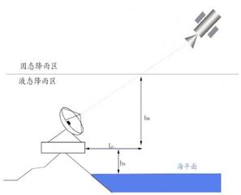
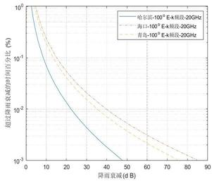
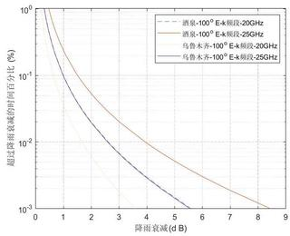

=+=+=+=+=+=+=+=+=
# 降雨衰减对 \( \mathrm{K} \) 频段卫星通信系统的影响分析

李双丽 \( {}^{1} \) ,咸永帅 \( {}^{2} \) ,王玉冉 \( {}^{3} \)

1. 北京大地宏图勘测科技有限公司,北京 100020 2. 正孚信安 (北京) 技术有限公司,北京 102600

3. 新疆科技学院, 新疆库尔勒 841000

摘 要:降雨衰减是引起K频段高频电磁波星地链路传输损耗的重要因素,基于国际电信联盟(ITU)推荐的经典模型 ITU-R P.618-11, 对 K 频段星地链路的降雨衰减进行预测分析。利用软件编程, 针对中国境内的 6 个典型地区, 计算了静止卫星轨道位置在 \( {100}^{ \circ  }\mathrm{E} \) 和 \( {120}^{ \circ  }\mathrm{E} \) 、频率为 \( {20}\mathrm{{GHz}} \) 和 \( {25}\mathrm{{GHz}} \) 时的降雨衰减值。分析了我国东部地区和西部内陆地区的降雨衰减差异,归纳总结了卫星通信系统的抗雨衰对策,研究结果为卫星通信地面站在相关地区的数据传输、测量控制等工作提供了理论依据。

关键词:K频段；星地链路；降雨衰减；ITU-R模型；卫星通信

中图分类号:TN927 文献标志码:A 文章编号:1672-0164(2026)02-0032-04

## 1 引言

近年来, 低轨卫星产业发展迅猛, 低轨卫星所提供的服务在军事、经济、民生、救灾等领域不断拓展。高带宽、大容量、 强覆盖力、组网灵活的低轨道巨型星座正成为各国角力的焦点, 美国等西方国家正加速部署以 Starlink、OneWeb 为代表的低轨宽带通信卫星星座,挤占有限的轨道资源和频谱资源,我国也高度重视低轨卫星产业的建设发展,近年来密集发射多批次低轨卫星,技术研发人员聚焦低轨道星座特性,开始研究应用于低轨星座的 \( \mathrm{K} \) 频段相控阵技术 \( {}^{\left\lbrack  1 - 2\right\rbrack  } \) ,此外 \( \mathrm{K} \) 频段电磁波也被用于星地链路数据传输, 便于地面系统对低轨卫星进行精确测量控制 \( {}^{\left\lbrack  3\right\rbrack  } \) 。因此,有必要研究降雨衰减对 \( \mathrm{K} \) 频段电磁波的传输影响,并根据传输损耗对 \( \mathrm{k} \) 频段卫星通信系统建设及运营进行针对性策略研究。

近几年,研究人员在 \( \mathrm{K} \) 频段卫星通信工程实践方面做了大量工作,深入研究。时立锋[2]等研究了一种剖面低、质量小、 扩展性好的 64 阵元 \( \mathrm{K} \) 频段圆极化可切换接收相控阵天线,工作频段为 \( {18.5}\mathrm{{GHz}} \sim  {20.0}\mathrm{{GHz}} \) ,实现了控制层、天线层、电源层、 功合网络层和芯片层等多层 PCB 一体化集成, 具备快速波束扫描以及左右旋圆极化切换功能。辛宁 \( {}^{\left\lbrack  3\right\rbrack  } \) 等提出了一种磁控制与喷气控制相结合的 \( \mathrm{K} \) 频段测距(KBR)系统星间高精度指向控制算法, 实现了 KBR 系统指向的长期、高精度控制, 保证了KBR系统的测距精度。钟鸣海 \( {}^{\left\lbrack  4\right\rbrack  } \) 等设计了一种基于 SIP (System in Package) 技术的 \( \mathrm{K} \) 频段四通道天线接口单元,该接口单元实现了体积质量的轻量化, 适用于机载弹载星载等平台。赵晓东 \( {}^{\lbrack 5\rbrack } \) 采用双极型互补金属氧化物设计了一种可应用于卫星通信系统的高增益低功耗 \( \mathrm{K} \) 频段低噪声放大器,该型号低噪声放大器改善了噪声系数,适用于 \( \mathrm{k} \) 频段电磁波星地链路传输。徐仲麟 \( {}^{\lbrack 6\rbrack } \) 等基于多层低温共烧陶瓷 (Law Temperature Co-fired Ceramics, LTCC)工艺研制了一种面向低轨卫星通信的 \( \mathrm{K} \) 波段四通道集成接收前端模块。该集成前端模块工作频段为 \( {17.7}\mathrm{{GHz}} \sim  {20.2}\mathrm{{GHz}} \) ,具有集成度高、增益高、抑制度高、 噪声低等优点。孙书良 \( {}^{\left\lbrack  7\right\rbrack  } \) 采用二次变频处理的方式设计了一种小型化的 \( \mathrm{K} \) 频段下变频器,增加了设备的通用性。郝学坤 \( {}^{\left\lbrack  8\right\rbrack  } \) 等研究了 \( \mathrm{{Ka}} \) 频段、 \( \mathrm{V} \) 频段衰落期和衰落率,并对 \( \mathrm{{Ku}} \) 频段实际测量数据进行了分析。目前对于 \( \mathrm{K} \) 频段卫星通信系统星地传输链路的传输特性研究较少, K 频段电磁波属于高频电磁波, 极易受到大气层中水分的影响而产生信号衰减, 本项研究基于国际电信联盟提出的模型对 \( \mathrm{K} \) 频段降雨衰减进行了计算, 为 \( \mathrm{k} \) 频段卫星通信系统的建设以及应用提供理论基础。

## 2 传输模型

本文采用国际电信联盟(ITU)推荐的 ITU-R P.618-11 模型进行 \( \mathrm{k} \) 频段星地链路降雨衰减预测分析 \( {}^{\left\lbrack  8\right\rbrack  } \) 。该模型具有权威性与普适性,作为 ITU 无线电通信组(ITU-R)认定的标准模型, 其计算结果具有国际认可度; 通过参数化方法平衡了计算复杂度和预测精度；模型输入参数易于获取,适合工程实践应用。

ITU-R模型计算雨衰所需参数以及步骤如下:

地球站平均海拔 \( - \mathrm{{hs}}\left( \mathrm{{km}}\right) \) ；年平均 \( {0.01}\% \) 时间降雨率 \( - {\mathrm{R}}_{0.01} \) \( \left( {\mathrm{{mm}}/\mathrm{h}}\right) \) ；地球站纬度 \( - \varphi \) (度)；地球站天线仰角 \( - \theta \) (度)；所要计算的衰减超过的百分概率 \( - \mathrm{p}\% \) ；极化角 \( - \mathrm{d} \) (度)；频率- \( \mathrm{f}\left( \mathrm{{GHz}}\right) \) ；有效地球半径 \( - \mathrm{{Re}} = {8500}\left( \mathrm{{km}}\right) \) 。

注:年平均 0.01% 时间是指一年中仅有 0.01% 时间 (约 52.6 分钟)降雨会超过设计阈值导致电路中断。该数值基于长期降雨数据统计得到。

---

收稿日期:2025 年 4 月 17 日；修回日期:2025 年 10 月 23 日

通信作者:王玉冉 (1988一),女,讲师,硕士；研究方向:电磁波传输特性,图像处理。

---

首先计算降雨高度以及相关数据, 如图 1 所示, 为等效雨高示意图,降雨高度 \( {\mathrm{h}}_{\mathrm{R}} \) 可由式 (1) 计算:

\[
{\mathrm{h}}_{\mathrm{R}}\left( \mathrm{{km}}\right)  = \left\{  \begin{matrix} {3.0} + {0.028\varphi } & 0 \leq  \varphi  < {36} \\  {4.0} - {0.075}\left( {\varphi  - {36}}\right) & \varphi  \geq  {36} \end{matrix}\right.  \tag{1}
\]

式中, \( \varphi \) 为地球站纬度。

图 1 等效雨高示意图

当 \( \theta  \geq  {5}^{ \circ  } \) 时,降雨高度以下的倾斜路径公式为:

\[
{\mathrm{L}}_{\mathrm{s}} = \frac{{\mathrm{h}}_{\mathrm{R}} - {\mathrm{h}}_{\mathrm{S}}}{\sin \theta } \tag{2}
\]

式中, \( {\mathrm{h}}_{\mathrm{R}} \) 为降雨高度, \( \mathrm{{km}};{\mathrm{h}}_{\mathrm{s}} \) 为地球站平均海拔, \( \mathrm{{km}} \) ；

当 \( \theta  < {5}^{ \circ  } \) 时,降雨高度倾斜路径由下式计算:

\[
{L}_{s} = \frac{2\left( {{h}_{R} - {h}_{s}}\right) }{{\left\lbrack  {\sin }^{2}\theta  + \frac{2\left( {{h}_{R} - {h}_{s}}\right) }{Re}\right\rbrack  }^{\frac{1}{2}} + \sin \theta } \tag{3}
\]

式中, \( {\mathrm{R}}_{\mathrm{e}} \) 为有效地球半径, \( \mathrm{{km}} \) ；

确定倾斜路径的水平投影 \( {\mathrm{L}}_{\mathrm{G}} \) :

\( {\mathrm{L}}_{\mathrm{G}} = {\mathrm{L}}_{\mathrm{S}}\cos \theta \)(4)

计算 \( {0.01}\% \) 时间路径缩短因子 \( {\mathrm{r}}_{0.01} \) :

\[
{\mathrm{r}}_{0.01} = \frac{1}{1 + {\mathrm{L}}_{\mathrm{G}}/{\mathrm{L}}_{0}} \tag{5}
\]

其中, \( {\mathrm{L}}_{0} = {35}\exp \left( {-{0.015}{\mathrm{R}}_{0.01}}\right) \) 。

每千米雨衰值即衰减率 \( \left( {\mathrm{{dB}}/\mathrm{{km}}}\right) \) 可以由式 (6)计算:

\[
\gamma  = \mathrm{K}{\left( {\mathrm{R}}_{0.01}\right) }^{\alpha } \tag{6}
\]

式中,参数 \( \mathrm{K}\text{、}\alpha \) 用来估计雨衰的统计特性,其值由下式计算:

\[
\mathrm{k} = \left\lbrack  {{\mathrm{k}}_{\mathrm{H}} + {\mathrm{k}}_{\mathrm{V}} + \left( {{\mathrm{k}}_{\mathrm{H}} - {\mathrm{k}}_{\mathrm{V}}}\right) {\cos }^{2}\theta \cos {2\delta }}\right\rbrack  /2 \tag{7}
\]

\[
\alpha  = \left\lbrack  {{\mathrm{k}}_{\mathrm{H}}{\alpha }_{\mathrm{H}} + {\mathrm{k}}_{\mathrm{V}}{\alpha }_{\mathrm{V}} + \left( {{\mathrm{k}}_{\mathrm{H}}{\alpha }_{\mathrm{H}} - {\mathrm{k}}_{\mathrm{V}}{\alpha }_{\mathrm{V}}}\right) {\cos }^{2}\theta \cos {2\delta }}\right\rbrack  /2\mathrm{k} \tag{8}
\]

式中, \( \delta \) 为相对水平的极化角: \( \delta  = {45}^{ \circ  } \) 为圆极化波; \( \delta  = {90}^{ \circ  } \) 为线极化波。 \( {\mathrm{k}}_{\mathrm{H}} \) 、 \( {\alpha }_{\mathrm{H}} \) 和 \( {\mathrm{k}}_{\mathrm{V}} \) 、 \( {\alpha }_{\mathrm{V}} \) 分别对应于电波的水平极化和垂直极化分量。 \( \delta \) 为接收点电波的极化角。由于降雨主要对 \( {10}\mathrm{{GHz}} \) 以上电磁波产生强烈散射和吸收作用,因此本文针对 \( \mathrm{k} \) 频段 \( {20}\mathrm{{GHz}} \) 和 \( {25}\mathrm{{GHz}} \) 两个频点进行计算,两个频点的降雨衰减参数如表 1 所示 \( {}^{\lbrack 7\rbrack } \) :

表 1 k 频段降雨衰减参数值

<table><tr><td>频率(GHz)</td><td>\( {\mathrm{k}}_{\mathrm{H}} \)</td><td>\( {\mathrm{k}}_{\mathrm{V}} \)</td><td>\( {\alpha }_{\mathrm{H}} \)</td><td>\( {\alpha }_{\mathrm{V}} \)</td></tr><tr><td>20</td><td>0.0751</td><td>0.0691</td><td>1.099</td><td>1.065</td></tr><tr><td>25</td><td>0.124</td><td>0.113</td><td>1.061</td><td>1.030</td></tr></table>

超过年平均 \( {0.01}\% \) 时间的衰减值 \( {\mathrm{A}}_{0.01} \) 为:

\( {\mathrm{A}}_{0.01} = \gamma {\mathrm{L}}_{\mathrm{s}}{\mathrm{r}}_{0.01} \)(9)

由 \( {\mathrm{A}}_{0.01} \) 可以求出其他时间概率的衰减值:

\( {\mathrm{A}}_{\mathrm{p}}/{\mathrm{A}}_{0.01} = {0.12}{\mathrm{p}}^{-\left( {{0.546} + {0.043}\lg \mathrm{p}}\right) } \)(10)

## 3 数值计算

卫星通信系统的星地链路降雨衰减数值计算依赖地区降雨率的累积分布,本文选取海口、大连、青岛、乌鲁木齐、酒泉等我国境内典型的 6 个站点进行计算分析。站点的位置跨度较大,经度从 \( {87.1}^{ \circ  }\mathrm{E} \) 至 \( {121}^{ \circ  }\mathrm{E} \) ,纬度从 \( {20.03}^{ \circ  }\mathrm{N} \) 至 \( {45.68}^{ \circ  }\mathrm{N} \) ,海拔跨度从 \( {14.1}\mathrm{m} \) 到 \( {1477.2}\mathrm{m} \) ,涵盖了我国东南沿海至西北内陆的典型地域, 6 个典型站点的地理信息(经纬度、海拔)以及降雨率数据如表 2 所示。

表 2 全国 6 个典型站点的地理位置和降雨率

<table><tr><td>站名</td><td>纬度(度)</td><td>经度 (度)</td><td>海拔(m)</td><td>降雨率(mm/h)</td></tr><tr><td>酒泉</td><td>39.77</td><td>98.52</td><td>1477.2</td><td>10</td></tr><tr><td>乌鲁木齐</td><td>43.57</td><td>87.1</td><td>653.5</td><td>5</td></tr><tr><td>大连</td><td>38.9</td><td>121.63</td><td>93.5</td><td>75</td></tr><tr><td>哈尔滨</td><td>45.68</td><td>126.62</td><td>171.7</td><td>49</td></tr><tr><td>海口</td><td>20.03</td><td>110.35</td><td>14.1</td><td>124</td></tr><tr><td>青岛</td><td>36.15</td><td>120.42</td><td>16.8</td><td>83</td></tr></table>

表 2 采用文献[9]的方法计算了 6 个典型地区的降雨率, 可以看出我国东西地区的降雨率差异巨大, 降雨率最小的乌鲁木齐地区仅有 \( 5\mathrm{\;{mm}}/\mathrm{h} \) ,其次是酒泉地区 \( {10}\mathrm{\;{mm}}/\mathrm{h} \) ,降雨率最大的海口地区高达 \( {124}\mathrm{\;{mm}}/\mathrm{h} \) ,其次是青岛地区 \( {83}\mathrm{\;{mm}}/\mathrm{h} \) 。 \( \mathrm{k} \) 频段电磁波作为卫星通信系统星地链路数据的传输载体, 通常要求具有高概率可靠度 (通常为 99.99% ),因此降雨衰减引起星地数据链路传输系统的中断概率不超过 \( {0.01}\% \) 。参数 \( {\mathrm{R}}_{0.01} \) 是表征降雨衰减特性的最重要的指标。表 2 列出了我国 6 个站点的经纬度、海拔以及中断概率 \( {0.01}\% \) 的分钟降雨率 \( {\mathrm{R}}_{0.01}{}^{\left\lbrack  9 - {11}\right\rbrack  } \) 。

表3 k波段降雨衰减计算值

<table><tr><td rowspan="2">站点</td><td colspan="3">\( {100}^{ \circ  }\mathrm{E} \)</td><td colspan="3">\( {120}^{ \circ  }\mathrm{E} \)</td></tr><tr><td>天线仰角 (度)</td><td>\( {20}\mathrm{{GHz}} \)</td><td>\( {25}\mathrm{{GHz}} \)</td><td>天线仰角 (度)</td><td>20GHz</td><td>\( {25}\mathrm{{GHz}} \)</td></tr><tr><td>酒泉</td><td>43.9679</td><td>\( {2.6129}\mathrm{\;{dB}} \)</td><td>\( {3.9484}\mathrm{\;{dB}} \)</td><td>38.9152</td><td>\( {2.8481}\mathrm{\;{dB}} \)</td><td>\( {4.3038}\mathrm{\;{dB}} \)</td></tr><tr><td>乌鲁木齐</td><td>38.1065</td><td>\( {1.6719}\mathrm{\;{dB}} \)</td><td>\( {2.5912}\mathrm{\;{dB}} \)</td><td>29.9512</td><td>\( {1.9957}\mathrm{\;{dB}} \)</td><td>\( {3.0930}\mathrm{\;{dB}} \)</td></tr><tr><td>大连</td><td>39.6643</td><td>\( {32.0976}\mathrm{\;{dB}} \)</td><td>\( {45.0649}\mathrm{\;{dB}} \)</td><td>44.9350</td><td>\( {30.4544}\mathrm{\;{dB}} \)</td><td>\( {42.7579}\mathrm{\;{dB}} \)</td></tr><tr><td>哈尔滨</td><td>31.2349</td><td>\( {22.3497}\mathrm{\;{dB}} \)</td><td>\( {31.8701}\mathrm{\;{dB}} \)</td><td>37.0239</td><td>\( {20.1698}\mathrm{\;{dB}} \)</td><td>\( {28.7616}\mathrm{\;{dB}} \)</td></tr><tr><td>海口</td><td>63.7183</td><td>\( {39.8713}\mathrm{\;{dB}} \)</td><td>\( {54.9616}\mathrm{\;{dB}} \)</td><td>64.0666</td><td>39.9009 dB</td><td>\( {55.0023}\mathrm{\;{dB}} \)</td></tr><tr><td>青岛</td><td>42.8179</td><td>\( {35.3606}\mathrm{\;{dB}} \)</td><td>\( {49.4629}\mathrm{\;{dB}} \)</td><td>48.0551</td><td>\( {34.0104}\mathrm{\;{dB}} \)</td><td>47.5742 dB</td></tr></table>

依据 ITU-R 模型利用降雨数据对我国 6 个典型站点的降雨衰减数值进行计算。选取卫星为定点在静止卫星轨道位置 \( {100}^{ \circ  }\mathrm{E} \) 和 \( {120}^{ \circ  }\mathrm{E} \) 的地球同步卫星,选择计算仿真的频率为 \( {20}\mathrm{{GHz}} \) 和 \( {25}\mathrm{{GHz}} \) 。假设两颗卫星的电磁波极化方式均采用圆极化,计算结果见表 3。

根据 ITU-R 计算模型可以确定倾斜路径越长, 降雨引起的衰减量越大,以酒泉地区为例,当位于该地的卫星通信地面站天线对准经度 100 °E 同步卫星时,天线仰角为 43.9679°,当地面站天线对准经度 \( {120}^{ \circ  }\mathrm{E} \) 同步卫星时,天线仰角为 \( {38.9152}^{ \circ  } \) ,使用频段为 \( {20}\mathrm{{GHz}} \) 时,对两颗星的降雨衰减分别为 \( {2.61}\mathrm{\;{dB}} \) 和 \( {2.84}\mathrm{\;{dB}} \) ,说明地面站天线的仰角越高,雨衰越小。

计算结果显示,当使用静止卫星轨道位置在 \( {100}^{ \circ  }\mathrm{E} \) 的卫星进行星地链路数据传输时, 99.99% 可用度情况下, k 频段 \( {20}\mathrm{{GHz}} \) 频率降雨衰减率最小的是乌鲁木齐,衰减仅仅 \( {1.67}\mathrm{\;{dB}} \) , 衰减最大是海口 39.87dB,计算结果表明降雨强度决定了雨衰大小,系统建设需要合理决策以保证星地链路数据传输具有较高的可靠性。

图2 湿润地区卫星位置为 \( {100}^{ \circ  }\mathrm{E} \) 时的雨衰曲线

以哈尔滨为代表的东北地区、以海口为代表的南方地区、 以青岛为代表的东部地区在 \( {20}\mathrm{{GHz}} \) 频率不同时间概率下 (0.001% 到 1%) 的雨衰数值做比较, 从图 2 可以看出, 当三地区使用定位于东经 100 度的同步卫星进行星地链路数据传输时, 海口南方地区的降雨衰减值比青岛地区和哈尔滨地区的降雨衰减值大, 在时间概率为 0.001% 时, 海口比哈尔滨相差十余分贝, ITU-R 计算模型中时间概率对应不同程度的降雨率, 计算结果表明雨衰随着降雨率的增大而增大, 三个站点在 \( {20}\mathrm{{GHz}} \) 的计算数值表明南方多雨地区降雨衰减比较大,东北地区的降雨衰减最小。由图 2 计算结果同时可以得出, 在时间概率为 0.001% 时,我国国土东部沿海地区的 \( \mathrm{k} \) 频段电磁波降雨衰减的数值较大, 三个地区降雨引起的卫星通信系统衰减量高达 \( {40}\mathrm{\;{dB}} \) 以上,无法满足卫星通信系统传输数据的使用要求, 必须制定合理可靠的抗雨衰措施, 保证高频卫星通信系统的正常工作。 万方数据

图3 \( \mathrm{{干旱地区卫星位置为}{100}^{ \circ  }E} \) 时的雨衰曲线

以酒泉和乌鲁木齐为代表的我国西北内陆地区在 \( {20}\mathrm{{GHz}} \) 频率不同时间概率下 (0.001% 到 1%) 的雨衰数值做比较, 从图 3 可以看出, 当两地区使用定位于东经 100 度的同步卫星进行星地数据传输时, 同一频段下酒泉地区的降雨衰减值比乌鲁木齐地区的降雨衰减值大,在时间概率为 0.001% 时,两地区域雨衰差距比东部地区小很多, 说明高频卫星通信系统部署于我国西北内陆地区能够保障全年有一个较高的可用度, 在西北少雨地区部署高频段的卫星通信系统地面站比较节省建站成本。

## 4 抗雨衰策略
=+=+=+=+=+=+=+=+=
### 4.1 技术对策

由以上数值仿真可以看出, K 频段 99.99% 可用度情况下降雨衰减量普遍较大,需要采取一定抗雨衰措施才能保证卫星通信系统传输数据的可靠性。此处列举三条技术手段,一是卫星通信系统采取功率冗余设计, 根据不同地区的雨衰数值适当增加发射机的功率储备来对抗衰减,采取功率自适应控制技术根据降雨情况自动调整发射功率来对抗降雨影响; 二是采用编码与调制技术, 可以引入错误控制机制, 例如使用前向纠错(FEC)编码技术纠正传输误码,提高整个系统的抗干扰能力,该技术具有强大的纠错能力,可提供 \( 3 \sim  {10}\mathrm{\;{dB}} \) 的编码增益; 三是采用分集技术利用多个独立传输路径来提高系统可靠性, 降低雨衰导致的电路中断情况。采用 MIMO 与波束成形技术, 利用空间多径效应, 降低单一路径的衰减影响, 或者在降雨区域调整波束指向,避开强降雨区域,该设计考虑在空间、时间或频率上采用冗余传输, 部分信号受到影响时可以通过其他路径进行传输。
=+=+=+=+=+=+=+=+=
### 4.2 系统设计对策

在卫星通信系统设计上, 可考虑三点对策。一是针对多雨地区, 结合计算数据合理设计卫星通信系统, 预留足够的功率余量降低降雨衰减的影响。该举措包括建设大口径天线以提高信号增益, 装配更高灵敏度的低噪声放大器以提高接收能力,配置更大功率的高功率放大器以提高发生能力等,这将大大提高地面站性能, 也意味着系统建设需要高昂的建站成本。在多雨区域可进行特殊设计, 在热带地区采用更高功率、 更低频率电路进行通信或建设更密集地面站以提高抗雨衰能力。二是选择合适的站点规划地面站的地址, 利用雨衰与距离成正比的关系,控制电磁波在雨区传播距离,从而达到降低雨衰的目的, 或者直接将站址选择建在我国降雨较少的区域, 比如我国西北地区,避免信号穿越降雨区域。三是建立备份系统, 建立地面备份链路或者提供卫星切换能力,从而对抗衰减。
=+=+=+=+=+=+=+=+=
### 4.3 运营对策

卫星通信系统地面运控中心可实时监测降雨情况和信号传输质量,地面中心可密切关注东南沿海以及南方多雨地区天气动态, 在电路衰减较大时采用提高发射功率、提高发射电平、调整调制解调模式以及选择合适编码纠错方式来对抗雨衰影响, 功能完备的运控中心可动态调整传输参数降低雨衰影响, 或者在降雨衰减对系统影响较大时, 实施适当的业务应急预案,关闭一些不重要的电路,优先保证关键业务的传输。

## 5 结论

ITU-R模型计算了我国 6 个典型站点在 99.99% 可用度下的降雨衰减,对各个地区在两个同步卫星轨道位置 \( \left( {{100}^{ \circ  }\mathrm{E}}\right. \) 和 \( {120}^{ \circ  }\mathrm{E} \) )的雨衰减值进行了系统分析。仿真计算得到的降雨衰减数值表明我国西北地区干旱少雨,降雨衰减量比较小,在西北地区建设地面站将极大节省建设成本, 我国南方地区降雨衰减数值较大,需制定合理举措才能保证星地链路数据可靠传输, 沿海与内陆的地面站系统设计应统筹考虑, 将整个卫星通信系统的成本控制在预算范围内。对同一地区使用两颗不同卫星的情况进行了对比, 确定了天线仰角和使用频率对降雨衰减的影响, 最后对抗降雨衰减的具体措施进行了归纳总结, 在技术对策、系统设计对策和运营对策三个方面进行了探讨,给出了对抗雨衰问题的可行方案,为 \( \mathrm{k} \) 频段卫星通信系统的建设以及运用奠定了理论基础。

## 参 考 文 献

[1] Inigo del Portillo, Bruce G Cameron, Edward F. A technical com - parison of three low earth orbit satellite constellation systems to provide global broadband[J].Acta Astronautica,2019,159: 123-135.

[2] 时立锋,金世超,刘敦歌,等.k频段双极化卫星通信接收相控阵天线[J].导航与控制, 2023, 22(3):41-46.

[3] 辛宁,邱乐德,周钠,等. K频段测距系统星间高精度指向控制算法[J]. 航天器工程, 2016, 25(2):32-38.

[4] 钟鸣海 .K 频段小型化四通道天线接口单元设计与实现[J]. 压电与声光, 2024, 46(5):690-694.

[5] 赵晓冬.一种低功耗 \( \mathrm{K} \) 频段低噪声放大器[J]. 电讯技术,2021, 61(5):634-639.

[6] 徐仲麟,吴林晟,佘胜团,等. 面向低轨卫星通信的 K 波段 LTCC 多通道集成接收前端模块[J]. 电子学报, 2022, 50(6) :1389-1398.

[7] 孙书良. 一种小型化的 \( \mathrm{K} \) 波段下变频器设计[J]. 无线电工程, \( {2020},{50}\left( 7\right)  : {572} - {575} \)

[8] 郝学坤, 张小来, 李文铎. 卫星通信链路中的雨衰动态特性分析[J]. 无线电工程,2006(10):54-55+61.

[9] 仇盛柏. 我国分钟降雨率分布[J]. 通信学报, 1996,17 (3): 78-83.

[10]仇盛柏, 陈京华. 我国典型地区不同积分时间降雨率的换算公式[J]. 电波科学学报, 1997,12(1):112-117.

[11]车晴,毛志.Ku波段卫星广播中雨衰现象的研究[J]. 电波科学学报,1999,(2): 196-201.

# Analysis of rain attenuation effects on K-band satellite communication systems

LI Shuangli \( {}^{1} \) , XIAN Yongshuai \( {}^{2} \) , WANG Yuran \( {}^{3} \)

1.Beijing Dadi Hongtu Surveying Technology Co., Ltd., Beijing 100020, China 2.Zhengfu Xinan (Beijing) Technology Co., Ltd., Beijing 102600, China

3.Xinjiang University of Science and Technology, Korla 841000, China

Abstract: Rain attenuation significantly contributes to the transmission loss of high-frequency electromagnetic waves in K-band satellite-to-ground links. Based on the ITU-R P.618-11 model, this paper predicts and analyzes rain attenuation in K-band satellite communication links. Using programming, numerical calculations of rain attenuation were conducted for six typical regions in China, considering geostationary satellite orbital positions at \( {100}^{ \circ  }\mathrm{E} \) and \( {120}^{ \circ  }\mathrm{E} \) , and frequencies of \( {20}\mathrm{{GHz}} \) and \( {25}\mathrm{{GHz}} \) . The differences in rainfall attenuation between the eastern region and the western inland region of China were analyzed. Give a summary of rain attenuation countermeasures in satellite communication systems. The results provide a theoretical basis for satellite communication ground stations in these regions to optimize data transmission and measurement control.

Keywords: K-band, Satellite-to-ground link, Rain attenuation, ITU-R model, Satellite communication

---

作者简介

李双丽 (1992一),女,工程师,学士；研究方向:勘探测绘。

---
